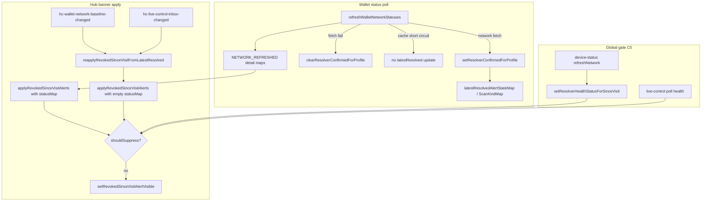
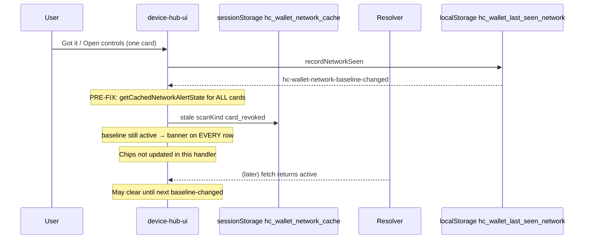
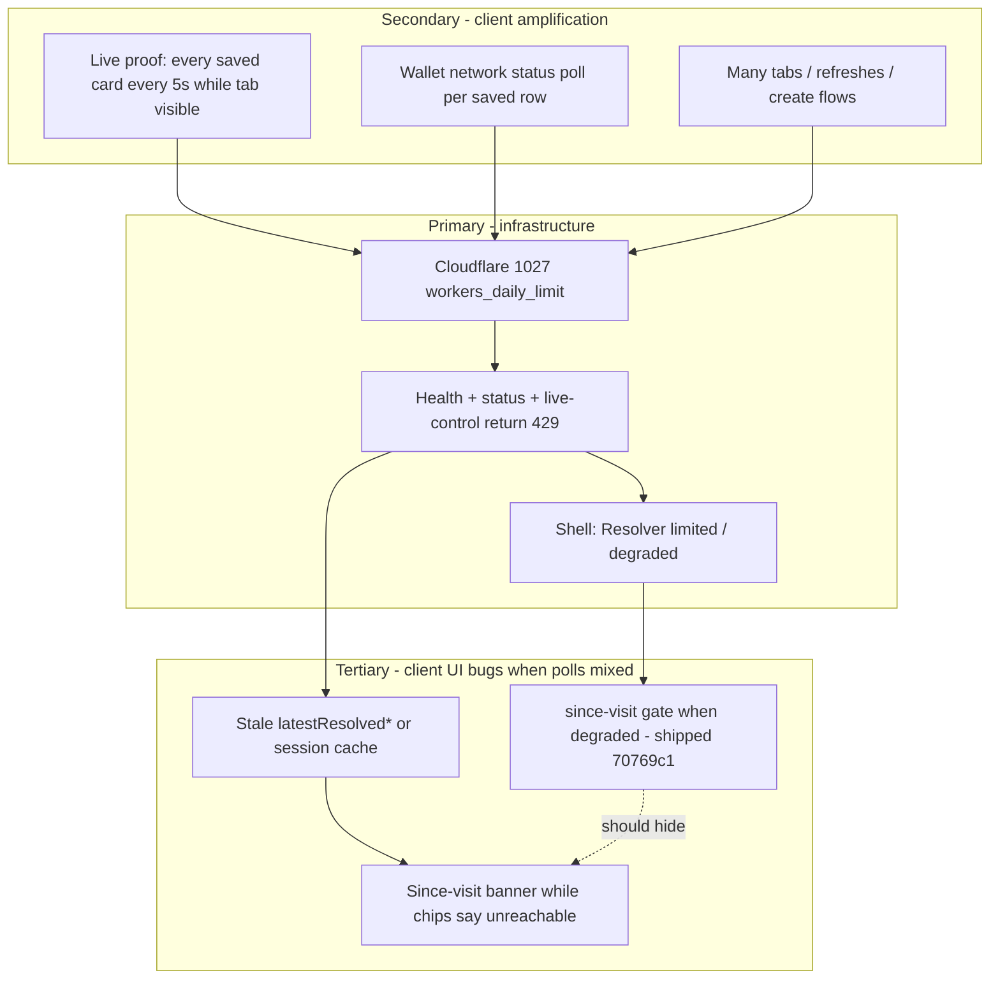

# Investigation: “Card disabled on the network since your last visit” on every saved card

**Date:** 2026-05-25 (updated 2026-05-26; **third pass 2026-05-26 evening - reopened**)  
**Status:** **Client fixes shipped on `main` (2026-05-26)** - items 1–8 in [§ Recommended fix directions](#recommended-fix-directions-status). Reopen only with Vitest/E2E repro on a current bundle (see [§ Post-closure](#post-closure-slices-18---superseded-by-third-pass)). Historical third pass below documents RC-A–RC-F and G1–G7 analysis.  
**Scope:** Saved-card hub rows on `/`, `/wallet/`, `/created/` - plus inbox badge, hub `#device-hub-card-disabled-group`, glance suffix, status-dot overlay  
**Related audits:** [`DEVICE_HUB_REPAIR_SPEC.md`](DEVICE_HUB_REPAIR_SPEC.md) (DH-1–DH-15), [`UI_UX_REVERTED_FEATURES_CATALOG.md`](UI_UX_REVERTED_FEATURES_CATALOG.md) (coordinator reverted `277d08e`), [`DEVICE_OS_REQUEST_BUDGET.md`](DEVICE_OS_REQUEST_BUDGET.md)  

---

## Third pass (2026-05-26 evening) - definitive root-cause map (code-verified)

This section re-audited **current** `site/js` on `main` (including `70769c1` since-visit gate + second-pass `latestResolved` clearing). Every row below was checked against the cited file and line range.

### Executive summary

| # | Root cause | Layer | Still possible on `main`? | User-visible pattern |
|---|------------|-------|---------------------------|----------------------|
| **RC-A** | Pre-`a5f34a7` baseline handler used session cache for all PIDs | Client (fixed) | **No** if bundle ≥ `a5f34a7` | All cards after Got it / Open controls |
| **RC-B** | Stale in-visit `latestResolved*` + re-apply without fresh status | Client (partial fix) | **Yes** - see **G1–G3** | Banner on rows; chip may say unreachable or reachable |
| **RC-C** | Cloudflare **1027** / health **429** → resolver untrustworthy | Infra | **Yes** | “Resolver limited” + live-control 429s; gate *should* hide since-visit UI |
| **RC-D** | Health **ok** but per-card `GET …/status` fails or 429; gate stays open | Client | **Yes** - see **G4** | Chip “Can't reach resolver”; banner may still show via **G1** |
| **RC-E** | Worker truth: `cards.status === "revoked"` → `scan.kind === "card_revoked"` | Server | **Yes** | Banner correct until **Got it** |
| **RC-F** | Stale static bundle (pre-gate / pre-DH-1) | Deploy | **Yes** if cache | Same as RC-A |

**Bottom line:** If the user still sees the banner **while** DevTools shows `scan.kind: "active"` on status fetches **and** health is not degraded, that is **RC-B** (client re-apply path), not RC-E. If health is degraded/429, banner should be suppressed (**C5**); if it is not, that is a **gate failure (G4)**, not G5 (G5 is only the brief initial suppress-before-health-check flash).

---

### Intended contract (what must be true to show the banner)

All of the following are required simultaneously (pure logic + hub apply):

| # | Requirement | Enforced in code |
|---|-------------|------------------|
| C1 | `resolverConfirmedMap[pid] === true` (at least one **network** status fetch this visit for that PID) | `shouldShowCardDisabledSinceVisitAlert` · `wallet-network-baseline.mjs` **77**; hub: hide if `alertStateMap[pid]` missing · **485–487**; `resolverConfirmed` + `cardDisabledSinceVisitVisible` · **494–509** |
| C2 | `scan.kind === "card_revoked"` (not `null`, not `active`, not `qr_revoked` alone) | `cardDisabledSinceVisitVisible` · `wallet-network-baseline.mjs` **96–97** |
| C3 | `alertState === "card_revoked"` from **that** poll | `shouldShowCardDisabledSinceVisitAlert` · **78–79** |
| C4 | Device baseline `hc_wallet_last_seen_network[pid]` was **not** already `card_revoked` | `isRevokedSinceLastVisitFromBaseline` · **57–64** |
| C5 | Global since-visit gate open: resolver health **ok** AND live-proof poll health **ok** | `shouldSuppressCardDisabledSinceVisitAlerts` · `device-wallet-since-visit-gate.mjs` **21–27** |
| C6 | Hub apply: row `status` not `offline` / `error` in the **statusMap passed to** `applyRevokedSinceVisitAlerts` | `device-hub-ui.mjs` **489–492** (uses `currentNetworkStatus` · **408–410**) |
| C7 | **Never** drive banner from `getCachedNetworkAlertState` alone on baseline-changed | Verified: **no** `getCachedNetworkAlertState` in `device-hub-ui.mjs` (grep 2026-05-26) |

**Storage keys**

| Key | Location | Role |
|-----|----------|------|
| `hc_wallet_last_seen_network` | `localStorage` | Acknowledged baseline per `profile_id` |
| `hc_wallet_network_cache` | `sessionStorage` | TTL ~5 min; chip + `shouldUseCachedNetworkStatus` only - **not** banner authority post-DH-1 |

---

### UI surfaces (one pipeline, four render targets)

| Surface | DOM / chrome | Builder | Uses confirmed maps? | Gate (C5)? |
|---------|--------------|---------|----------------------|------------|
| Per-row red banner | `.hub-card-status-alert` in `.hub-card-item` | `applyRevokedSinceVisitAlerts` · `device-hub-ui.mjs` **465–512** | Yes, when `alertStateMap` passed | Yes · **473–478** |
| Hub group | `#device-hub-card-disabled-group` | `renderHubInboxAlerts` → `getInboxItems` → `gatherCardDisabledSinceVisitForInbox` · `device-hub-inbox-alerts.mjs` **45**, **57–61**; `device-inbox.mjs` **96–100** | Yes | Yes · `device-inbox-card-disabled.mjs` **15** |
| Inbox sheet / badge / dot overlay | `#shell-notif-badge`, sheet rows | `getInboxItems` → `gatherInboxInput` · `device-inbox.mjs` **89–120** | Same gather | Same |
| Glance suffix | `device-hub-glance-row--revoked` | `revokedHintProfileIdsFromEntries` · `device-hub-glance.mjs` **162–181** | `getLatestResolved*` + `isResolverConfirmedProfile` | Yes · **163** |

Copy constant: `CARD_DISABLED_SINCE_VISIT_ALERT_TEXT` · `wallet-network-baseline.mjs` **9–10**.

---

### Data flow (current `main`)



---

### Verified gaps on current `main` (why the bug can still happen)

#### G1 - `reapplyRevokedSinceVisitFromLatestResolved` passes an empty `statusMap`

| Item | Detail |
|------|--------|
| **Code** | `device-hub-ui.mjs` **537–549** calls `applyRevokedSinceVisitAlerts({}, maps.alertStateMap, …)` |
| **Effect** | Offline guard **489–492** uses `currentNetworkStatus(pid, {})` → **`getCachedNetworkStatus(pid)`** · **408–410**, not the chip's last `statusMap` from `applyNetworkChipsToDom` |
| **Failure mode** | Chips updated to **Can't reach resolver** (offline in last `NETWORK_REFRESHED` `statusMap`), then **baseline-changed** or **live-control-changed** re-applies banners using stale `latestResolved*` while session cache TTL still has `status: "active"` (stale row) → banner **on**, chip **offline** |
| **Triggers** | `hc-wallet-network-baseline-changed` · **1263–1267**; `hc-live-control-inbox-changed` · **1197–1198**; `hc-resolver-health-changed` · **1269–1272** |

#### G2 - Cache-only poll does not refresh or clear `latestResolved*`

| Item | Detail |
|------|--------|
| **Code** | `refreshWalletNetworkStatuses` · `device-wallet-network.mjs` **262–266** (cache hit → `continue`), **324–332** (only `networkFetchedProfileIds` update confirmed state) |
| **Effect** | After a prior visit fetch stored `card_revoked` in `latestResolved*`, a later poll that **only** hits cache does not call `clearResolverConfirmedForProfile` · **54–62** |
| **Failure mode** | `buildResolverConfirmedWalletPollMaps` · **172–191** still exports stale `card_revoked`; any **G1** re-apply can re-light all rows |

#### G3 - `hc-live-control-inbox-changed` re-applies since-visit banners without a wallet network poll

| Item | Detail |
|------|--------|
| **Code** | `device-hub-ui.mjs` **1197–1198** |
| **Effect** | Live-proof tick (5s when pending, 60s idle · `device-live-control-poll-scheduler.mjs`) can resurrect banners from **G1** + **G2** without re-validating `GET …/status?q=` |

#### G4 - Since-visit gate is global health only, not per-card status

| Item | Detail |
|------|--------|
| **Code** | `device-wallet-since-visit-gate.mjs` **21–27**; health from `device-status.mjs` **439–441** via `fetchResolverHealth` · `device-network-health.mjs` **9–25** |
| **Effect** | `GET /.well-known/hc/v1/health` can return **200 ok** while `GET …/cards/{id}/status` returns **429** or errors. Gate allows banners; per-row apply may hide if `statusMap` has `offline` (**489–492**) unless **G1** re-apply uses stale cache status |
| **Note** | Live-proof **429** sets `liveControlPollHealth` **degraded** → gate suppresses · `device-live-control-inbox-core.mjs` **35–52** |

#### G5 - Gate says “offline” at module load, then health flips to `ok` before first wallet poll

| Item | Detail |
|------|--------|
| **Code** | `resolverHealthStatus` initial **`"offline"`** · `device-wallet-since-visit-gate.mjs` **8**; first `setResolverHealthStatusForSinceVisit` on `refreshNetwork` · `device-status.mjs` **439–441** |
| **Effect** | Brief suppress, then open; if `latestResolved*` already poisoned (bfcache edge mitigated by `pageshow` · `device-wallet-network.mjs` **42–50**), first re-apply after health **ok** can flash banners |

#### G6 - **Documentation drift:** `DEVICE_OS_REFRESHED` listeners removed

| Item | Detail |
|------|--------|
| **Fact** | `277d08e` removed `initDeviceOsCoordinator()` and hub/glance `DEVICE_OS_REFRESHED` listeners · [`UI_UX_REVERTED_FEATURES_CATALOG.md`](UI_UX_REVERTED_FEATURES_CATALOG.md) **137–189** |
| **Current** | `initDeviceOsCoordinator` is **exported but never called** (grep `site/js` 2026-05-26). Hub relies on `fetchAndApplyNetworkChips` · **560–611**, visibility · **1240–1248**, `NETWORK_REFRESHED` · **1275–1294** |
| **Impact** | Collapsed hub on `/` may not re-poll wallet network on tab focus alone; stale **G2** state persists until hub poll or manual **Check network** |

#### G7 - `syncLastSeenFromNetworkMap` called twice per poll

| Item | Detail |
|------|--------|
| **Code** | `persistWalletFromNetworkPoll` · `device-wallet-network.mjs` **428–430**; also `fetchAndApplyNetworkChips` · `device-hub-ui.mjs` **583** |
| **Effect** | Usually safe (`mergeLastSeenFromNetworkMap` skips active→revoked transition · `device-wallet-network-core.mjs` **48–50**); not a primary false-positive driver |

---

### Historical RC-A (fixed) - baseline-changed + session cache

**Before `a5f34a7`:** `hc-wallet-network-baseline-changed` rebuilt alerts from `getCachedNetworkAlertState()` for every saved card. **Current handler:** `reapplyRevokedSinceVisitFromLatestResolved` · **1263–1267** uses `buildResolverConfirmedWalletPollMaps` only · `device-wallet-network.mjs` **172–191**. **Do not regress:** never call `getCachedNetworkAlertState` from baseline-changed for all PIDs.

---

### Server RC-E - when Worker is authoritative

| Item | Code |
|------|------|
| `scan.kind === "card_revoked"` when `card.status === "revoked"` | `worker/src/resolver/scan-state.ts` **284–287** (`buildCardOnlyScanViewModel`) |
| Status JSON route | `worker/src/resolver/scan-status.ts` (GET `/.well-known/hc/v1/cards/{profile_id}/status`) |

If Network tab shows **`active`** for a profile but the banner is visible on a **current** bundle, classify as **client (RC-B / G1–G3)**, not server.

---

### Operator diagnosis protocol (do this before any code change)

1. **Hard refresh** (empty cache). Confirm `device-wallet-since-visit-gate.mjs` and `device-hub-ui.mjs` in Sources match `main` (search `shouldSuppressCardDisabledSinceVisitAlerts`, `reapplyRevokedSinceVisitFromLatestResolved`).
2. **Health:** `GET /.well-known/hc/v1/health` - if Cloudflare **1027** / **429**, expect **Resolver limited**; since-visit UI should be suppressed (**C5**). If banners show anyway → **G4** gate failure (not G5).
3. **Per card:** `GET /.well-known/hc/v1/cards/{profile_id}/status?q={qr_id}` - record `scan.kind` for **each** saved card.
4. **Console storage:**
   ```js
   JSON.parse(localStorage.getItem("hc_wallet_last_seen_network") || "{}")
   JSON.parse(sessionStorage.getItem("hc_wallet_network_cache") || "{}")
   ```
5. **Split-brain check:** If chip says **Can't reach resolver** and banner is visible, capture whether a live-control tick or Got it just fired (likely **G1**).
6. **Mitigation (user):** `sessionStorage.removeItem("hc_wallet_network_cache"); location.reload();` - does **not** clear `latestResolved*` in memory until reload; reload required after **G2**.

---

### Test coverage vs gaps

| Scenario | Covered? | Where |
|----------|----------|--------|
| Stale cache + active resolver | Yes | `device-wallet-network-confirmed.test.ts` **127–149** |
| card_revoked then offline poll clears inbox | Yes | same file **101–125** |
| Gate when health degraded / live-proof offline | Yes | `device-wallet-since-visit-gate.test.ts`; E2E `device-inbox.spec.ts` **414+** |
| **G1** re-apply with `{}` statusMap + stale cache `active` + stale `latestResolved` | Yes | `card-disabled-since-visit-approaches.test.ts` (G1 closed + A1 snapshot) |
| **G2** cache-only poll leaves `latestResolved` | Yes | `device-wallet-network-confirmed.test.ts`, `device-wallet-network-truth.test.ts` |
| **G3** live-control-changed re-apply without wallet poll | Yes | `card-disabled-since-visit-approaches.test.ts` (A5 hide-only); E2E `device-os-wallet.spec.ts` (live-control tick + offline poll) |
| Multi-card Got it must not re-light all | E2E | `device-os-wallet.spec.ts` |

Run: `npm run worker:test:card-disabled-since-visit` · `npm run e2e:card-disabled-since-visit`

---

### Recommended fix directions (status)

1. **G1 / A1:** **Shipped** - `lastWalletNetworkStatusMap` on re-apply.
2. **G2:** **Shipped** - cache-only poll clears confirmed state when cache `scanKind` disagrees with `latestResolved*`.
3. **G3 / A2:** **Shipped** - no `reapplyRevokedSinceVisitFromLatestResolved` on `hc-live-control-inbox-changed`.
4. **A5:** **Shipped** - re-apply uses `allowShow: false`; show only from wallet poll / `NETWORK_REFRESHED` with maps.
5. **G4:** **Shipped** - `setWalletStatusPollHealthForSinceVisit` in `device-wallet-since-visit-gate.mjs`; wallet poll sets `degraded` on 429 or all-fetched rows offline/error (`device-wallet-network.mjs`).
6. **G6:** **Shipped** - tab `visibilitychange` polls when wallet non-empty and (`page-wallet` or hub expanded) (`device-hub-ui.mjs`).
7. **A3:** **Shipped** - `device-wallet-network-truth.mjs`; see `worker/tests/device-wallet-network-truth.test.ts`.
8. **Remove from device flash:** **Shipped** - drop removed profile SSOT, cancel in-flight poll apply, render siblings with checking chips, defer hub since-visit group sync until wallet poll `onDone` (`device-hub-ui.mjs` remove handler).
9. **Debounced poll cancel:** **Shipped** - `bumpWalletNetworkApplyGen()` clears pending hub debounce timer so manual **Check network** / a newer fetch cannot race with an older scheduled poll (`device-hub-ui.mjs`).
10. **Hub search must not unhide row banners:** **Shipped** - `applyDeviceHubSearch` skips `.hub-card-status-alert` so `hc-live-control-inbox-changed` → `applySearchFilter` cannot set `hidden=false` on a suppressed since-visit banner (`device-hub-search.mjs`).

---

## Code anchor index (third-pass verification checklist)

Use this table to re-audit any claim in this doc against the repo.

| Topic | File | Lines (approx.) |
|-------|------|-----------------|
| Show/hide pure logic | `site/js/wallet-network-baseline.mjs` | **57–139** |
| In-memory confirmed state | `site/js/device-wallet-network.mjs` | **28–75**, **146–191**, **245–351** |
| Session cache read | `site/js/device-wallet-network.mjs` | **114–133** |
| Cache bypass when stale revoke | `site/js/device-wallet-network-core.mjs` | **63–83** |
| Global suppress gate | `site/js/device-wallet-since-visit-gate.mjs` | **8–27** |
| Health → gate | `site/js/device-status.mjs` | **439–446** |
| Health fetch | `site/js/device-network-health.mjs` | **9–25** |
| Hub banner apply | `site/js/device-hub-ui.mjs` | **408–512**, **537–549** |
| Hub event listeners | `site/js/device-hub-ui.mjs` | **1197–1198**, **1263–1294** |
| Wallet poll entry | `site/js/device-hub-ui.mjs` | **560–611**, **1005** |
| Inbox gather | `site/js/device-inbox-card-disabled.mjs` | **14–39** |
| Inbox input | `site/js/device-inbox.mjs` | **89–120** |
| Glance revoked hint | `site/js/device-hub-glance.mjs` | **162–181**, **278–280** |
| Chip / status line | `site/js/device-hub-card-row-core.mjs` | **75–110** |
| Worker card_revoked | `worker/src/resolver/scan-state.ts` | **284–287** |
| Coordinator unused | `site/js/device-os-coordinator.mjs` | **128+** (no `init` caller) |
| Revert note | `docs/UI_UX_REVERTED_FEATURES_CATALOG.md` | **137–189** |

---

## Third-pass verification audit (2026-05-26)

Re-checked every third-pass claim against the repo. Legend: **CONFIRMED** = matches cited lines; **NUANCE** = correct direction, imprecise wording; **DOC-FIX** = corrected in this doc pass.

### Executive summary (RC-A–RC-F)

| Claim | Verdict | Evidence |
|-------|---------|----------|
| RC-A fixed in `a5f34a7` | **CONFIRMED** | `git show a5f34a7:site/js/device-hub-ui.mjs` imports and uses `getCachedNetworkAlertState` on baseline path; **no** `getCachedNetworkAlertState` in current `device-hub-ui.mjs` (grep 2026-05-26) |
| RC-B G1–G3 still possible | **CONFIRMED** | See gap table below |
| RC-C 1027 / health 429 | **CONFIRMED** (infra) | `fetchResolverHealth` → `degraded` when `!res.ok` · `device-network-health.mjs` **19**; catalog **137–142** |
| RC-D health ok, status fails | **CONFIRMED** | Gate ignores per-card status · `device-wallet-since-visit-gate.mjs` **21–27** |
| RC-E Worker `card.status === "revoked"` | **CONFIRMED** | `scan-state.ts` **284–287**; route doc **148–150** in `scan-status.ts` |
| RC-F stale bundle | **CONFIRMED** (process) | Not code-verifiable per user session |

### Contract C1–C7

| ID | Verdict | Evidence |
|----|---------|----------|
| C1 | **CONFIRMED** | `wallet-network-baseline.mjs` **77**, **90–100**; `device-hub-ui.mjs` **485–509** |
| C2 | **CONFIRMED** | `wallet-network-baseline.mjs` **96–97** |
| C3 | **CONFIRMED** | `wallet-network-baseline.mjs` **78–79** |
| C4 | **CONFIRMED** | `wallet-network-baseline.mjs` **57–63** |
| C5 | **CONFIRMED** | `device-wallet-since-visit-gate.mjs` **21–27**; set from `device-status.mjs` **441** |
| C6 | **CONFIRMED** | `device-hub-ui.mjs` **408–410**, **489–492** |
| C7 | **CONFIRMED** | No `getCachedNetworkAlertState` in `device-hub-ui.mjs`; export only in `device-wallet-network.mjs` **129–133** |
| Storage TTL ~5 min | **CONFIRMED** | `WALLET_NETWORK_CACHE_TTL_MS = 5 * 60 * 1000` · `device-wallet-network-core.mjs` **7** |

### UI surfaces

| Surface | Verdict | Evidence |
|---------|---------|----------|
| Row banner | **CONFIRMED** | `applyRevokedSinceVisitAlerts` **465–512**; template **751–758** (`hidden` by default) |
| Hub group | **CONFIRMED** | `renderHubInboxAlerts` **45**, `renderCardDisabledHubGroup` **57–61** → `getInboxItems` → `gatherCardDisabledSinceVisitForInbox` |
| Inbox / badge | **CONFIRMED** | `gatherInboxInput` **96–100**; `device-inbox-core.mjs` builds `card_disabled_since_visit` kind |
| Glance suffix | **CONFIRMED** | `revokedHintProfileIdsFromEntries` **162–181**; class `device-hub-glance-row--revoked` **191–192** |
| Copy constant | **CONFIRMED** | `wallet-network-baseline.mjs` **9–10** |

### Gaps G1–G7

| Gap | Verdict | Evidence |
|-----|---------|----------|
| G1 empty `statusMap` on re-apply | **CONFIRMED** | `reapplyRevokedSinceVisitFromLatestResolved` **544–548**; `currentNetworkStatus` **408–410** |
| G1 triggers | **CONFIRMED** | Listeners **1197–1198**, **1263–1267**, **1269–1272** |
| G1 split-brain failure mode | **NUANCE** | Requires stale `latestResolved*` **and** session cache `status` not `offline`/`error` (e.g. aborted poll generation skipped `saveCache` while chips already painted offline). Offline cache alone hides banner via **489–492**. |
| G2 cache-only skips `latestResolved` update | **CONFIRMED** | **262–265** `continue`; **325–331** only `networkFetchedProfileIds` |
| G3 live-control re-apply without wallet poll | **CONFIRMED** | **1197–1198** calls `reapplyRevokedSinceVisitFromLatestResolved` only |
| G3 interval “every 5s” | **NUANCE** | **5s** when `pendingCount > 0`, else **30s** · `device-live-control-poll-scheduler.mjs` **6–7**, **15–16** |
| G4 global gate only | **CONFIRMED** | `device-wallet-since-visit-gate.mjs` **21–27**; `device-network-health.mjs` **9–25** |
| G4 live-proof 429 → degraded | **CONFIRMED** | `summarizeLiveControlPoll` **39–50** |
| G5 initial `offline` gate | **CONFIRMED** | `resolverHealthStatus = "offline"` **8**; first `setResolverHealthStatusForSinceVisit` on `refreshNetwork` **439–441** |
| G6 coordinator removed | **CONFIRMED** | `UI_UX_REVERTED_FEATURES_CATALOG.md` **137–142**; no `initDeviceOsCoordinator(` in `site/js` except export **128** in `device-os-coordinator.mjs`; tripwire test `device-safe-rebuild-tripwires.test.ts` |
| G6 no wallet poll on collapsed hub focus | **CONFIRMED** | `visibilitychange` **1240–1248** requires `!hubCollapsed` |
| G6 initial poll on hub mount | **NUANCE** | `renderSavedRows` end calls `fetchAndApplyNetworkChips` **1005** on every page with hub - not only expanded |
| G7 double `syncLastSeen` | **CONFIRMED** | `device-wallet-network.mjs` **430**; `device-hub-ui.mjs` **583** |
| G7 not primary driver | **CONFIRMED** | `mergeLastSeenFromNetworkMap` **48–50** skips transition |

### Data flow diagram

| Node | Verdict |
|------|---------|
| `refreshWalletNetworkStatuses` → set/clear confirmed | **CONFIRMED** **325–331** |
| Cache short circuit no `latestResolved` update | **CONFIRMED** **262–265** |
| `NETWORK_REFRESHED` with `statusMap` | **CONFIRMED** **339–343**, listener **1282–1287** |
| `reapply` → empty `statusMap` | **CONFIRMED** **544–548** |
| Health → gate | **CONFIRMED** **439–441**, gate **21–27** |
| `DEVICE_OS_REFRESHED` in diagram | **NUANCE** | Not emitted to hub on current `main` (coordinator not inited); wallet path is `fetchAndApplyNetworkChips` / `NETWORK_REFRESHED` |

### Tests cited

| Test | Verdict | Evidence |
|------|---------|----------|
| Stale cache + active **127–149** | **CONFIRMED** | `device-wallet-network-confirmed.test.ts` |
| card_revoked then offline **101–125** | **CONFIRMED** | same |
| Gate E2E **414+** | **CONFIRMED** | `e2e/device-inbox.spec.ts` **414–467** |
| G1–G3 untested | **CONFIRMED** | No matching `it(` in `worker/tests/` (grep 2026-05-26) |
| `npm run worker:test:card-disabled-since-visit` | **CONFIRMED** | 37 tests passed 2026-05-26 |

### Historical / doc cross-refs

| Claim | Verdict | Evidence |
|-------|---------|----------|
| `70769c1` gate + second pass | **CONFIRMED** | `git log -1 70769c1` |
| `DEVICE_OS_REFRESHED` removed `277d08e` | **CONFIRMED** | `UI_UX_REVERTED_FEATURES_CATALOG.md` **137–189**; no listener in `device-hub-ui.mjs` / `device-hub-glance.mjs` |
| Chip “Can't reach resolver” | **CONFIRMED** | `hubCardStatusLine` **101–104** (not `networkStatusChip` label - hub uses `hubCardStatusLine`) |

### Audit conclusion

**Third-pass root-cause analysis is confirmed** for G1–G6 on current `main`. The highest-confidence **client** false-positive path remains **G1 + G2 + G3**: stale `latestResolved*` re-applied on live-control or baseline events with offline guard reading **stale session cache** instead of the last chip `statusMap`. **No code fix in this audit pass** - only doc corrections above.

---

## Fourth pass (2026-05-26) - certainty limits, missed hypotheses, fix approaches

### Are we sure the “root cause” is the root cause?

**No - not without a captured failing session.** What we can say with evidence:

| Confidence | Statement | Evidence |
|------------|-----------|----------|
| **High** | The client **can** show the banner while `scan.kind` is not authoritatively `card_revoked` **right now** | Vitest **G1 repro** in `worker/tests/card-disabled-since-visit-approaches.test.ts` (empty `statusMap` + stale cache `status: "active"` + stale `latestResolved`) |
| **High** | Second-pass **does** clear `latestResolved` after an **offline** wallet poll | Same file, test “second-pass still clears inbox after offline poll”; `device-wallet-network-confirmed.test.ts` **101–125** |
| **High** | `scan.kind === null` does **not** show the banner | `cardDisabledSinceVisitVisible` returns false · approaches test “null scanKind never shows banner” |
| **Medium** | This explains **most** reports that match “Resolver limited” + since-visit banners | G4 gate + G1/G3 re-apply chain; E2E gate tests **414–467** |
| **Low without user data** | This explains **your** specific tab **right now** | Could still be RC-E (real revoke), RC-F (old bundle), wrong `API_ORIGIN`, or mistaken chip copy (“Disabled on network” is **correct** for real `card_revoked`) |

**Doc correction:** Older § “Follow-up 2026-05-26” claimed `latestResolved*` is **never** cleared on offline and that `scanKind: null` + `resolverConfirmed` can still show the banner. That was **true before the second pass (`70769c1`)** and is **false on current `main`** (see tests above). Do not treat that subsection as current behavior.

### What we were missing (fourth pass)

| Gap in prior analysis | Why it matters |
|----------------------|----------------|
| **Treating G1+G2 as proven for every user report** | Needs Network tab proof: `scan.kind` per card + health body + loaded JS bundle |
| **Conflating chip “Disabled on network” with false positive** | `hubCardStatusLine` shows that for **real** `scan.kind === card_revoked"` · `device-hub-card-row-core.mjs` **80–84** - not the since-visit banner |
| **Out-of-order `NETWORK_REFRESHED` from stale generation** | Stale poll returns **before** `notifyNetworkRefreshed` · `device-wallet-network.mjs` **319–321** - does **not** emit a late `card_revoked` event after a newer poll (unlikely path on current code) |
| **`mergeLastSeen` / double `syncLastSeen`** | Unlikely to **show** banner; can affect **when** alert clears after Got it · G7 |
| **Multi-tab `localStorage` baseline** | Tab A Got it / Tab B still open can race on `hc_wallet_last_seen_network` - not “all cards” alone |
| **Initial render vs poll** | Banner DOM is `hidden` until JS runs · `device-hub-ui.mjs` **752**; row tint `.hub-card-item--revoked-since-visit` is separate CSS **854–857** |
| **Only hub path investigated for re-apply** | Inbox/dot use `gatherCardDisabledSinceVisitForInbox` (no empty `statusMap`); **row banner** is the split-brain surface |

### Alternative hypotheses (must rule out in production)

1. **RC-E** - Resolver truly returns `card_revoked` (DB `cards.status = revoked` or wrong card).
2. **RC-F** - Bundle without gate / DH-1 (search Sources for `shouldSuppressCardDisabledSinceVisitAlerts`).
3. **RC-C only** - User sees copy elsewhere (inbox group title, glance suffix, dot aria) while gates hid **row** banner.
4. **Stale cache `status: "active"` + stale `latestResolved`** - G1 repro (client bug).
5. **User expectation** - Feature is working: card **was** disabled since last visit on device baseline; **Got it** is required.

---

### Fix approaches (at least 5) + verification status

Each approach targets a different layer. **“Verified”** means an automated test proves the **core mechanism** would prevent the G1 repro; **not** that the full patch is implemented in `site/js` yet.

| ID | Approach | Idea | Pros | Cons | Verification |
|----|----------|------|------|------|----------------|
| **A1** | **Status snapshot on re-apply** | Keep `lastWalletStatusMap` from last `applyNetworkChipsToDom` / `NETWORK_REFRESHED`; pass it into `reapplyRevokedSinceVisitFromLatestResolved` instead of `{}` | Small diff; fixes G1 split-brain directly | Does not stop stale `latestResolved` existing (G2) | **VERIFIED** - `card-disabled-since-visit-approaches.test.ts` “Approach 1: last statusMap snapshot with offline hides” |
| **A2** | **Stop re-apply on live-control ticks** | On `hc-live-control-inbox-changed`, only `syncHubInboxAlertGroups()` / badge - **do not** call `reapplyRevokedSinceVisitFromLatestResolved` | Removes G3 amplifier; fewer DOM writes | Inbox row list may lag until next wallet poll; glance suffix may lag | **Shipped** - `device-hub-ui.mjs` live-control listener |
| **A3** | **Single source of truth (SSOT)** | One module owns per-PID `{ scanKind, alertState, chipStatus, fetchedAt, source }`; drop parallel `latestResolved*` + ad hoc cache reads for banners | Fixes G1+G2 structurally; easier to reason | Larger refactor; touch hub, inbox, glance | **SHIPPED** - `device-wallet-network-truth.mjs`; poll writes truth; hub applies chip+banner only in `fetchAndApplyNetworkChips` onDone; `checking` blocks banner |
| **A4** | **Per-row trust gate** | Extend suppress: no since-visit UI if `!isResolverConfirmedProfile(pid)` **or** `getCachedNetworkStatus(pid)` is `offline`/`error` **or** global gate | Closes G1 cache fallback hole; works with degraded health | Stricter: may hide legitimate alert until next successful poll | **VERIFIED** - approaches test “Approach 4: per-row trust gate hides when cache is offline” |
| **A5** | **Apply banners only from `NETWORK_REFRESHED`** | `reapplyRevokedSinceVisitFromLatestResolved` only **hides**; never **shows** without `detail.statusMap` from a wallet poll | Eliminates map-only show paths | Baseline-changed / health-changed would not re-show after hide without poll | **VERIFIED** - `applyRevokedSinceVisitAlerts(..., { allowShow: false })` on re-apply; approaches test + E2E `device-os-wallet.spec.ts` (G3/A5 live-control tick) |
| **A6** | **Product: “unverified network” state** | Replace banner with muted “Could not verify card status” when health ok but row poll failed | Honest UX under 429 | Not the current product spec; copy change | **N/A** - design review only |

**Recommended combination for a fix PR:** **A1 + A2 + A4** (minimal, complementary). Consider **A3** if incidents continue after A1+A2+A4.

**Shipped (2026-05-26):** A1 + A2 + A4 in `device-hub-ui.mjs`, `device-wallet-network.mjs`, `device-inbox-card-disabled.mjs`, `device-hub-glance.mjs`. **Shipped (follow-up):** A5 hide-only re-apply; G2 cache-only clears poll authority via SSOT. **Shipped (A3, 2026-05-26):** `device-wallet-network-truth.mjs` replaces parallel `latestResolved*` for since-visit; hub `NETWORK_REFRESHED` no longer applies banners before chips update. Tests: `device-wallet-network-truth.test.ts`, `card-disabled-since-visit-approaches.test.ts`, `device-wallet-network-confirmed.test.ts`; run `npm run e2e:card-disabled-since-visit` before release.

### How to verify approaches in CI (runbook)

```bash
# Fourth-pass mechanism tests (G1 repro + approach invariants)
npm run worker:test -- worker/tests/card-disabled-since-visit-approaches.test.ts

# Regression suite (must stay green before merge)
npm run worker:test:card-disabled-since-visit
npm run e2e:card-disabled-since-visit
```

After implementing **A1** in `device-hub-ui.mjs`:

1. **Shipped** - Vitest in `card-disabled-since-visit-approaches.test.ts` (G1 repro + approach invariants).
2. **Shipped** - Vitest (`device-wallet-network-confirmed.test.ts` stale-generation + active-after-revoked) and E2E G3/A5 in `device-os-wallet.spec.ts` (debounced poll cancel + hub search does not unhide suppressed row banners).

### Different way to think about the problem (architecture)

```text
Today (simplified):
  session cache ------> chip label (via currentNetworkStatus fallback)
  latestResolved* ---> banner + inbox + glance (via buildResolverConfirmedWalletPollMaps)
  statusMap (poll) ---> chip + banner ONLY when NETWORK_REFRESHED passes it

Failure mode = three stores disagree.

SSOT approach (A3):
  wallet poll --> write Truth[pid] --> chip + banner + inbox read Truth only
  live-control tick --> never reads Truth for "show"; at most refresh inbox counts
```

**Investigation-only conclusion:** Treat **G1+G2+G3** as the best **client** hypothesis, not a proven universal root cause. Prove each user report with status JSON + storage + bundle hash; pick fix approach **A1+A2+A4** first and prove with the approaches test file + E2E.

---

## Symptom

When opening saved cards (hub expanded or `/wallet/`), **every** saved row shows the red banner:

> **Card disabled on the network since your last visit.**

Chips may show **Sync Checking…**, **Live State Active**, or **Reachable** at the same time - a strong signal the banner is **not** reflecting current resolver truth.

---

## What the feature is supposed to do

The banner is a **device-local transition alert**, not a live “your card is revoked” panel.

| Storage | Key | Role |
|---------|-----|------|
| `localStorage` | `hc_wallet_last_seen_network` | Per `profile_id`: last **acknowledged alert baseline** (`active` or `card_revoked`). Legacy `revoked` counts as acknowledged `card_revoked`. |
| `sessionStorage` | `hc_wallet_network_cache` | ~5 min TTL cache of last `GET …/cards/{id}/status?q=…` parse (`status`, `scanKind`, verification, `at`). |

**Show banner only when all of the following hold:**

1. **Baseline on this device** was previously non–`card_revoked` (usually `active`).
2. **Latest resolver-confirmed** poll says `scan.kind === card_revoked` (card-level disable - not QR-only `qr_revoked`).
3. UI applies alert from **resolver-confirmed** state, not from session cache alone before a fetch completes.

Pure logic lives in `site/js/wallet-network-baseline.mjs` (`cardDisabledSinceVisitVisible`, `shouldShowCardDisabledSinceVisitAlert`). Hub wiring: `site/js/device-hub-ui.mjs` → `applyRevokedSinceVisitAlerts()`.

**Legitimate path** (see [`DEVICE_OS_QA.md`](DEVICE_OS_QA.md) P1): disable card on network elsewhere → return to `/wallet/` → banner + status **Disabled on network** → **Got it** acknowledges.

---

## Confirmed root cause (historical - pre–May 2026 fix)

This exact failure mode was observed on production and recorded in [`DEVICE_HUB_REPAIR_SPEC.md`](DEVICE_HUB_REPAIR_SPEC.md) § Production observation (2026-05-25):

- Banner: **Card disabled on the network since your last visit**
- Chips: **Sync Checking…**
- Resolver `curl` for the same card: `scan.kind` → **`active`**

So the network was fine; the **browser alert pipeline** was wrong.

### Primary bug (DH-1): baseline event re-applied alerts from stale session cache

**Before fix (`a5f34a7`):** the `hc-wallet-network-baseline-changed` listener in `device-hub-ui.mjs` rebuilt `alertStateMap` from **`getCachedNetworkAlertState()`** (session cache) for **every** saved card whenever baseline changed (Got it, Open controls, Manage, poll baseline sync, tab snapshot).

**Repro for “all cards at once”:**

1. `hc_wallet_last_seen_network` has `active` per card (normal).
2. `hc_wallet_network_cache` still has stale `scanKind: "card_revoked"` for many cards (old session, race, or partial failure).
3. User dismisses one card or opens controls → `recordNetworkSeen` → **`hc-wallet-network-baseline-changed`**.
4. Handler runs for **all** rows: each evaluates as baseline `active` + cached `card_revoked` → **banner on every row**.
5. Handler did **not** call `applyNetworkChipsToDom`, so chips could stay **Sync Checking…** or **Live State Active** - matching production.

The tested guard `shouldShowCardDisabledSinceVisitAlert(..., { resolverConfirmed: true })` existed in `wallet-network-baseline.mjs` but was **not** used in `applyRevokedSinceVisitAlerts`, and the baseline handler **ignored** `getLatestResolvedAlertState()`.

### Secondary bugs (same audit)

| ID | Issue |
|----|--------|
| **DH-2** | Chips used cached `scanKind` instead of fresh poll `scanKindMap`. |
| **DH-3** | Glance inferred disabled state without resolver-confirmed gate. |
| **DH-4** | Tab exit snapshot wrote cached alert state into `hc_wallet_last_seen_network`, poisoning the next visit. |

### Why earlier fix attempts felt like they “didn’t stick”

[`DEVICE_HUB_REPAIR_SPEC.md`](DEVICE_HUB_REPAIR_SPEC.md) marked Slices 1–2 done while the **baseline-changed listener still reintroduced cache-driven alerts** for all cards. Vitest covered helpers; E2E initially only tested “active resolver + empty cache”, not “stale cache + baseline-changed after Got it on another card.”

Prior investigation (chat [20e54d4e-9af2-43c8-accf-dcaa394b8042](20e54d4e-9af2-43c8-accf-dcaa394b8042)) traced this before code fix.

---

## Fixes shipped on `main` (reference)

| Commit | What |
|--------|------|
| `a5f34a7` | **DH-1/DH-2:** `cardDisabledSinceVisitVisible` + `resolverConfirmedMap`; baseline-changed uses `getLatestResolvedAlertState` / `getLatestResolvedScanKind` only; scan.kind `active` forces hide. |
| `00ca8d8` | Vitest + Playwright: stale `hc_wallet_network_cache` + active resolver → banner hidden. |
| `c09523f` | E2E: multi-card stale cache + Got it must not re-light all rows. |
| `0a9d6b5` | Hub **card-disabled** inbox group (same copy; separate DOM - see below). |

Current guard in `applyRevokedSinceVisitAlerts` (abbreviated):

- No `alertStateMap[pid]` → hide (pre-fetch).
- `resolverConfirmedMap[pid] !== true` → `cardDisabledSinceVisitVisible` returns false.
- If confirmed but `scan.kind === "active"` → hide even when cache disagrees.

`shouldUseCachedNetworkStatus()` forces a network refetch when cached `card_revoked` disagrees with baseline `active` (`device-wallet-network-core.mjs`).

---

## Data flow (why one bad cache entry can light up every row - pre-fix)



Post-fix, the baseline handler only re-applies from **`latestResolvedAlertStateMap`** after at least one resolver-confirmed poll this visit (`hasLatestResolverNetworkPoll()`).

---

## If you still see the bug after `a5f34a7+`

The remaining explanations are environmental or require verifying resolver truth - not “mystery UI copy.”

### 1. Browser is not running the fixed bundle

- Hard refresh or empty cache for the site origin.
- Confirm deployed Pages/Worker includes commit **`a5f34a7` or later** for `site/js/device-hub-ui.mjs` and `device-wallet-network.mjs`.
- Check DevTools → Sources: search for `cardDisabledSinceVisitVisible` and `getLatestResolvedAlertState` in the baseline-changed handler (must **not** call `getCachedNetworkAlertState` for all PIDs there).

### 2. Resolver actually reports `card_revoked` for those cards

The Worker only sets `scan.kind === "card_revoked"` when `cards.status === "revoked"` (`worker/src/resolver/scan-state.ts`). False “all cards” from the server would mean DB rows are revoked or you are hitting the wrong API origin.

**Check in DevTools → Network** (filter `status`):

```http
GET /.well-known/hc/v1/cards/{profile_id}/status?q={qr_id}
```

For each saved card, inspect JSON:

```json
"scan": { "kind": "active" | "card_revoked" | "qr_revoked", ... }
```

Compare with production repro in repair spec:

```bash
curl -s "https://humanity.llc/.well-known/hc/v1/cards/{profile_id}/status?q={qr_id}" | jq '.scan.kind'
```

If `kind` is `active` but the banner is visible on **fixed** JS → file a new regression (should not happen: confirmed + `scan.kind === active` hides alert).

If `kind` is `card_revoked` → cards are disabled on the network; banner is **correct** (use **Got it** to acknowledge, or re-enable the card).

### 3. Inspect device storage (Console)

```js
JSON.parse(localStorage.getItem("hc_wallet_last_seen_network") || "{}")
JSON.parse(sessionStorage.getItem("hc_wallet_network_cache") || "{}")
```

| Pattern | Meaning |
|---------|---------|
| Baseline `active`, cache `scanKind: "card_revoked"`, resolver `active` | Classic stale-cache false positive; fixed code should refetch and hide. |
| Baseline `active`, resolver `card_revoked` | Real transition; banner expected until **Got it**. |
| Baseline `card_revoked` for all | Previously acknowledged; banner should **not** show “since your last visit”. |

**Clear false-positive state (one device):**

```js
sessionStorage.removeItem("hc_wallet_network_cache");
// optional: reset baselines only if you understand you will see real transitions again
// localStorage.removeItem("hc_wallet_last_seen_network");
location.reload();
```

### 4. Same copy in two places

Per-card banner: `.hub-card-status-alert` inside each `.hub-card-item` (`device-hub-ui.mjs`).

Hub top group: **Disabled since your last visit** rows from `renderHubInboxAlerts()` → `getInboxItems()` → `gatherCardDisabledSinceVisitForInbox()` (`device-hub-inbox-alerts.mjs`, added `0a9d6b5`). Same underlying rules; both should clear when resolver-confirmed state is `active`.

### 5. Follow-up fixes (post-investigation, shipped)

| Gap | Fix |
|-----|-----|
| `NETWORK_REFRESHED` did not refresh hub row banners | `device-hub-ui.mjs` re-applies via `reapplyRevokedSinceVisitFromLatestResolved()` and poll `detail.resolverConfirmedMap` on `NETWORK_REFRESHED` · **1275–1294**. (`DEVICE_OS_REFRESHED` was removed by `277d08e` - see **G6**.) |
| `gatherCardDisabledSinceVisitForInbox()` treated `alert != null` as resolver-confirmed | Uses `isResolverConfirmedProfile()` - only profiles with a network fetch this visit. |
| `acknowledgeNetworkSeenForEntry()` used stale session cache for baseline | Records `getLatestResolvedAlertState() ?? "active"` only (no `getCachedNetworkAlertState`). |
| `isResolverConfirmedProfile()` | Tracks profile IDs in `resolverConfirmedProfileIdsThisVisit` on each successful status fetch. |

---

## Resolver vs client - responsibility split

| Layer | Can cause “all cards disabled” banner? |
|-------|--------------------------------------|
| **Worker** `scan.kind` | Only if `card.status === "revoked"` in D1 for those profiles (or wrong profile/q mismatch returning error states - not `card_revoked`). |
| **Session cache** | Could poison **pre-fix** UI; post-fix must not drive banners without resolver-confirmed map. |
| **Baseline** | Must be non–`card_revoked` for “since your last visit” copy; `active` + confirmed `card_revoked` triggers alert. |
| **UI apply** | Post-fix: `resolverConfirmedMap` + `scan.kind` guard. |

Production observation proved resolver **`active`** while banner showed - **client-side**, not mass revoke.

---

## Tests that encode the contract

| Test | File |
|------|------|
| Baseline transition, legacy `revoked`, resolverConfirmed gate | `worker/tests/wallet-network.test.ts` |
| `isResolverConfirmedProfile` after wallet poll | `worker/tests/device-wallet-network-confirmed.test.ts` |
| `resolverConfirmed: false` despite `card_revoked` alert state | `worker/tests/wallet-network.test.ts` § `listCardDisabledSinceVisit` |
| Stale cache + active fetch integration | `worker/tests/wallet-network.test.ts` § `stale cache + active fetch` |
| Hub pipeline → inbox | `worker/tests/device-hub-frontend-pipeline.test.ts` |
| Slice 8 closure regression gates | `worker/tests/card-disabled-since-visit-regression.test.ts` |
| `buildResolverConfirmedWalletPollMaps` | `worker/tests/device-wallet-network-confirmed.test.ts` |
| E2E active resolver, stale cache, multi-card Got it / Open controls | `e2e/device-os-wallet.spec.ts` |
| E2E stale cache + active resolver → no inbox badge/hub group | `e2e/device-inbox.spec.ts` |

Run:

```bash
npm run worker:test:card-disabled-since-visit
npm run e2e:card-disabled-since-visit
```

CI: `.github/workflows/test-site.yml` runs full `npm run worker:test` and device shell E2E (includes the files above).

---

## Summary

| Question | Answer |
|----------|--------|
| **What is the banner?** | Device alert: “network state changed from what we last acknowledged on this device.” |
| **Confirmed root cause of false “every card” alerts?** | **Yes:** pre-`a5f34a7`, `hc-wallet-network-baseline-changed` re-applied **stale session cache** (`scanKind: card_revoked`) across **all** saved rows whenever any baseline write occurred, without `resolverConfirmed` or fresh `scan.kind`. |
| **Is the server revoking all cards?** | **No** for the documented production repro (resolver returned `active`). Verify per card with `GET …/status?q=`. |
| **Are fixes in repo?** | **Yes** - DH-1–DH-4 per [`DEVICE_HUB_REPAIR_SPEC.md`](DEVICE_HUB_REPAIR_SPEC.md); regression tests in Vitest/E2E. |
| **If it still happens for you?** | Use [§ Operator diagnosis protocol](#operator-diagnosis-protocol-do-this-before-any-code-change) and [§ Verified gaps G1–G6](#verified-gaps-on-current-main-why-the-bug-can-still-happen). Most likely **G1** (re-apply with empty `statusMap`) + **G2** (stale `latestResolved*`). |

---

## Follow-up implementation (shipped)

Per the AI prompt at the bottom of the first investigation draft:

- `reapplyRevokedSinceVisitFromLatestResolved()` + `isResolverConfirmedProfile()` in `device-wallet-network.mjs`
- Hub listens to `NETWORK_REFRESHED` (with poll `resolverConfirmedMap` in `detail`) · **1275–1294** (not `DEVICE_OS_REFRESHED` after `277d08e`)
- Inbox gather + **Open controls** baseline ack no longer trust session cache alone

### Slice 6 hardening (shipped)

- Glance since-visit suffix uses `isResolverConfirmedProfile()` (aligned with hub/inbox).
- Glance listens to `NETWORK_REFRESHED` / baseline-changed / live-control-changed · `device-hub-glance.mjs` **277–280** (not `DEVICE_OS_REFRESHED` after `277d08e`).
- E2E: `device-os-wallet.spec.ts` - **Open controls** after stale cache + active resolver must not show banners on all cards.
- Tracked as **DH-15** in [`DEVICE_HUB_REPAIR_SPEC.md`](DEVICE_HUB_REPAIR_SPEC.md).

### Slice 7 - inbox parity (shipped)

- `buildResolverConfirmedWalletPollMaps()` shared by hub re-apply and `gatherCardDisabledSinceVisitForInbox()`.
- E2E: `device-inbox.spec.ts` - stale cache + active resolver must not show badge, dot overlay, hub card-disabled group, or row banner copy.

### Slice 8 - incident closure (shipped)

- `worker/tests/card-disabled-since-visit-regression.test.ts` documents end-to-end client gates (cache bypass, inbox list, glance suffix).
- Vitest: `gatherCardDisabledSinceVisitForInbox()` empty after active poll with stale `hc_wallet_network_cache`.
- **Production verify:** hard-refresh; confirm `scan.kind === active` on status fetches; clear `hc_wallet_network_cache` if a device still shows stale UI.

---

## Follow-up 2026-05-26: stale in-visit resolver-confirmed state

### Symptom (matches production screenshot)

Saved hub rows on `/wallet/` (or expanded hub) show **both**:

- Status line: **Can't reach resolver · checked just now** (`hubCardStatusLine` - `status` is `offline` / `error`, `scanKind` is not `card_revoked`)
- Red alert: **Card disabled on the network since your last visit.**

That combination is **internally inconsistent**: the row chip reflects the **latest poll** (unreachable), while the since-visit banner reflects **`latestResolvedAlertStateMap` from an earlier successful poll in the same page visit** (still `card_revoked`).

### Additional evidence (from console)

The page console shows repeated **429** responses for:

`GET /.well-known/hc/v1/cards/{profile_id}/live-control/challenges?qr_id=...`

This is the live-proof inbox poll (see `device-live-control-inbox.mjs`). A 429 does not directly set `scan.kind`, but it is strong evidence the page is in a **rate-limited / request-amplified** state where other resolver calls may also degrade or arrive out-of-order.

### Root cause (confirmed in repo)

| Layer | Behavior |
|-------|----------|
| **`device-wallet-network.mjs`** | *(Historical, pre-`70769c1`)* `latestResolved*` was not cleared on failed polls. **Current `main`:** failed network fetch clears per-PID state · **325–331**; gather empty after offline · approaches test + `device-wallet-network-confirmed.test.ts` **101–125**. |
| **`buildResolverConfirmedWalletPollMaps()`** | Still reads `latestResolved*`; can stay `card_revoked` on **cache-only** polls (G2). |
| **`reapplyRevokedSinceVisitFromLatestResolved()`** | Passes `{}` statusMap (G1); can re-light banners from stale maps on baseline / live-control / health events. |
| **`cardDisabledSinceVisitVisible()`** | **Current:** requires `scan.kind === "card_revoked"` · **96–97**; `null` scanKind → hidden. |
| **`device-hub-ui.mjs` `walletNetworkApplyGen`** | Stale generation skips `notifyNetworkRefreshed` · **319–321**; does not emit late `card_revoked` after a superseded poll. |

**Historical Vitest note (pre-second-pass):** card_revoked then offline left gather non-empty. **Superseded on current `main`** - see fourth pass tests.

This is **not** the pre-`a5f34a7` session-cache / `baseline-changed` bug (that path is fixed). It is a **post-fix gap** for **in-visit** state.

### How the first `card_revoked` confirmation can be wrong

Slices 1–8 prevent **cache-only** banners (`resolverConfirmed: false`). A banner still requires at least one **successful** status fetch that parsed `scan.kind === "card_revoked"`. False positives therefore also need one of:

1. **Stale session cache forcing refetch, then a slow/out-of-order response** - an older in-flight request completes after a newer offline poll; `NETWORK_REFRESHED` from the old request re-applies banners while chips stay on **Can't reach resolver** (`walletNetworkApplyGen` does not guard `latestResolved*`).
2. **Resolver actually returning `card_revoked`** for those profiles (verify in Network tab). Unlikely for “all saved cards” unless DB rows are revoked or the wrong API origin is used.
3. **Old static bundle** without Slices 1–8 (session-cache / baseline-changed regression). Hard-refresh and confirm `device-hub-ui.mjs` uses `buildResolverConfirmedWalletPollMaps` on baseline change, not `getCachedNetworkAlertState` for all PIDs.

### Environmental note (2026-05-26)

`curl https://humanity.llc/.well-known/hc/v1/health` returned **Cloudflare error 1027** from this environment. If the browser sees the same, status fetches fail → **Can't reach resolver** is expected. The since-visit banner should still **hide** when there is no trustworthy current `card_revoked` read; today it can remain visible due to stale `latestResolved*` (above).

### Fix shipped (2026-05-26, second pass)

| Change | File |
|--------|------|
| Clear / set `latestResolved*` only at end of a **current** wallet poll for profiles that **network-fetched** (not session-cache short circuit); failed fetches clear confirmed state | `device-wallet-network.mjs` |
| `NETWORK_REFRESHED` banner maps use **resolver-confirmed poll results only** (no cache-only `card_revoked` in `alertStateMap`) | `device-wallet-network.mjs` |
| Suppress all since-visit UI when resolver health is **degraded/offline** or live-proof poll health is **degraded/offline** (429 storm) | `device-wallet-since-visit-gate.mjs`, hub / inbox / glance |
| `cardDisabledSinceVisitVisible` requires `scan.kind === card_revoked` (not null / stale fallback) | `wallet-network-baseline.mjs` |
| Health changes dispatch `hc-resolver-health-changed` to re-hide banners | `device-status.mjs`, `device-hub-ui.mjs` |
| Live-control 429 → 60s backoff; stop re-fetching all card rows on every live-proof tick | `device-live-control-inbox.mjs`, `device-hub-ui.mjs` |
| Clear resolver-confirmed in-memory maps on `pageshow` restore (bfcache) | `device-wallet-network.mjs` |

**Why cache clear alone did not help:** With **Resolver limited** at the top, the page is already in a **degraded** poll window. An earlier in-flight status read could still poison `latestResolved*` before rate limits landed, and row banners were re-applied from that state. Clearing `sessionStorage` does not stop live-proof polling or reset in-memory confirmed state until reload - and reload immediately re-starts **N cards × live-control challenges every 5s**, which reproduces **429** and the split-brain UI.

### Immediate user mitigation

1. **If health returns Cloudflare 1027** - see [§ Production incident](#production-incident-2026-05-26--cloudflare-workers-daily-limit-error-1027). Do **not** retry; wait for UTC midnight reset or upgrade Workers plan. Client mitigations cannot restore the resolver.
2. Hard refresh after deploy of the second-pass client fix (`70769c1`+).
3. If edge returns transient 429 (not 1027): close extra tabs, wait ~60s (live-control backoff), then refresh once.
4. Optional: `sessionStorage.removeItem("hc_wallet_network_cache"); location.reload();`
5. In DevTools → Network, confirm `GET …/status?q=` returns `"scan": { "kind": "active" }` when the resolver is reachable - only then should the since-visit banner be legitimate.

---

## Production incident 2026-05-26 - Cloudflare Workers daily limit (Error 1027)

### Evidence (browser Network → health)

`GET https://humanity.llc/.well-known/hc/v1/health` can return **429** with a Cloudflare JSON body (not Worker app JSON), for example:

| Field | Value |
|-------|--------|
| `error_code` | **1027** |
| `error_name` | `workers_daily_limit` |
| `title` | Error 1027: This website has been temporarily rate limited |
| `detail` | Site owner exceeded **Workers free tier daily request limit**; resets **midnight UTC** |
| `retryable` | **false** |
| `owner_action_required` | **true** |

This is **account / plan capacity**, not a per-IP burst limit and not “too many cards in one tab” alone. Retrying from the browser **does not help** until the quota resets or the plan is upgraded.

### Revised root-cause hierarchy



| Layer | What it explains | Fix owner |
|-------|------------------|-----------|
| **1027 daily limit** | Top banner **Resolver limited**; health 429; widespread `live-control/challenges` 429 in console | **Site owner** - upgrade Workers or wait for UTC reset |
| **Request amplification** | How the account hit the daily cap (many saved cards × 5s live proof + status polls + multi-tab testing) | Product/engineering - backoff, scope polls when degraded ([`UI_UX_REVERT_PLAN.md`](UI_UX_REVERT_PLAN.md)) |
| **Stale since-visit UI** | Red **Card disabled since your last visit** on rows while chips say **Can't reach resolver** | Client - Slices 1–8 + second pass + gate when `degraded`/`offline` |

**Conclusion:** The screenshot (Resolver limited + many live-control 429s + since-visit banners) is **expected** while 1027 is active **unless** the deployed bundle includes the since-visit **suppression gate** and it has run (`setResolverHealthStatusForSinceVisit("degraded")` → `shouldSuppressCardDisabledSinceVisitAlerts()`). If banners persist **with** Resolver limited on a bundle **after** `70769c1`, treat as a regression (health/gate ordering or a code path that bypasses `applyRevokedSinceVisitAlerts` suppress).

### Client mapping of 429 health

`fetchResolverHealth()` (`device-network-health.mjs`) treats any non-OK health response (including Cloudflare 1027 JSON) as **`degraded`**, which drives:

- System banner: **Resolver limited - create, update, and revoke may fail until service recovers.**
- `setResolverHealthStatusForSinceVisit("degraded")` → since-visit gate **should** hide hub/inbox/dot since-visit surfaces.

Live-control polls classify HTTP **429** as `rate_limited` → poll health **`degraded`**, which also satisfies the gate via `getLiveControlPollHealth()`.

### Console noise: view transition `AbortError`

Repeated **`AbortError: Old view transition aborted by new view transition`** from `applyDot` → `startViewTransition` (`device-status.mjs`) while `notifyHubChanged` / `refreshSummary` run is **cosmetic**. It happens when hub/inbox refresh fires faster than view transitions complete (common under poll churn). It does **not** set `scan.kind` and is unrelated to since-visit correctness. Optional hardening: skip `startViewTransition` for dot-only updates or catch/suppress abort on the transition promise.

### If symptoms persist after UTC reset + deploy

1. Confirm health returns **200** with app JSON (not 1027).
2. Confirm `device-wallet-since-visit-gate` is on the loaded bundle (hard refresh / `?v=` on shell scripts).
3. Confirm row `GET …/status?q=` `scan.kind` - banner is only legitimate when **`active` → `card_revoked`** with a confirmed poll, not when resolver is down.

---

## Cross-tab “Keys in another tab” badge (related report, 2026-05-26)

**User expectation:** After opening six create tabs (keys unsaved) and closing them, the inbox badge should reflect **six** outstanding key tabs.

**Documented behavior (not a live “tabs I opened today” counter):**

| Rule | Implementation |
|------|----------------|
| Presence is **per open tab**, not historical | `pagehide` → `clearTabKeysPresence()` removes a tab from `hc_tab_keys_presence` when it closes |
| Heartbeat only while **visible** | `device-tab-presence.mjs` - `setInterval` calls `syncTabKeysPresence()` only when `document.visibilityState === "visible"` |
| UI list uses **fresh** heartbeats | `listOtherTabsWithKeys()` drops rows older than **`PRESENCE_SHOW_MS` (~6s)** (`device-tab-presence-core.mjs`) |
| Cross-tab hidden if **this tab** has unsaved keys | `shouldShowCrossTabKeysNotice(otherCount, tabNoticeCount)` requires `tabNoticeCount === 0` |
| Badge is **total inbox count**, not cross-tab only | `inboxCountFromItems()` sums `live_proof` + `cross_tab_keys` + `tab_keys_unsaved` + `card_disabled_since_visit` |

So a badge showing **1–3** while six create tabs existed usually means: only **1–3 other tabs** had a visible heartbeat in the last ~6 seconds (background tabs do not heartbeat), and/or the badge includes **other inbox kinds** (e.g. live proof pending). **Closing all six tabs removes them from presence** - the badge should drop to **0** for cross-tab within ~6–10s unless another tab still holds keys.

**Docs:** [`DEVICE_OS.md`](DEVICE_OS.md) § Cross-tab keys (Phase 8); [`DEVICE_INBOX.md`](DEVICE_INBOX.md) § Counting rules (cross-tab row).

**Product gap (optional future):** A “tabs with unsaved keys you opened recently” count would need a different signal than visibility heartbeats (e.g. session-scoped registry updated on create, pruned on save/close).

**Flash after card delete (2026-05-26):** See [`CROSS_TAB_KEYS_FLASH_AFTER_CARD_DELETE_INVESTIGATION.md`](CROSS_TAB_KEYS_FLASH_AFTER_CARD_DELETE_INVESTIGATION.md) - remove/revoke does not clear `hc_created` or presence; wallet remove re-enables cross-tab for that profile.

**Polling / quota (same incident family):** Resolver 429s and 1027 were worsened by **live-control + wallet status polling** (N cards every 5s). That is separate from since-visit UI logic but shares the same user-visible “Resolver limited” window. Remediation plan: **[`DEVICE_OS_REQUEST_BUDGET.md`](DEVICE_OS_REQUEST_BUDGET.md)**.

---

## Post-closure (Slices 1–8) - superseded by third pass

Slices 1–8 in [`DEVICE_HUB_REPAIR_SPEC.md`](DEVICE_HUB_REPAIR_SPEC.md) fixed **RC-A** (session-cache / baseline-changed). **`70769c1`** added the global gate and offline clearing of `latestResolved*`. **Client fixes A1–A5, G4, G6, remove-flash (items 1–8)** are **shipped on `main`**; run the regression gates below before each release. New reports on a current bundle → operator protocol + Vitest/E2E repro before reopening.

| Step | Action |
|------|--------|
| 1 | Run `npm run worker:test:card-disabled-since-visit` and `npm run e2e:card-disabled-since-visit` before release. |
| 2 | After deploy, hard-refresh; use § “If you still see the bug” (resolver `scan.kind`, storage keys). |
| 3 | New false positive on fixed bundle → file regression in Vitest/E2E, then reopen investigation (do not patch without repro). |

**Unrelated optional hardening:** status-dot load blast radius - [`STATUS_DOT_LOAD_FAILURE_POSTMORTEM.md`](STATUS_DOT_LOAD_FAILURE_POSTMORTEM.md) P2 (lazy inbox sheet import).
