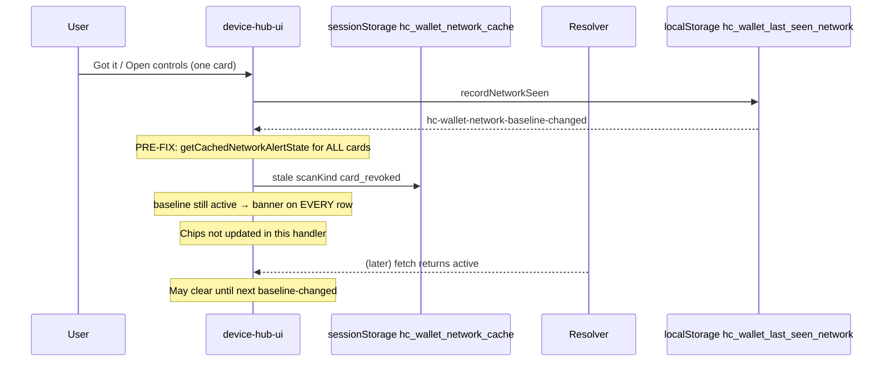

# Investigation: “Card disabled on the network since your last visit” on every saved card

**Date:** 2026-05-25 (updated 2026-05-26)  
**Status:** **Reopened (client gap)** — Slices 1–8 fixed the session-cache / baseline-changed false positive; a **second gap** remains (stale in-visit resolver-confirmed state). See [§ Follow-up 2026-05-26](#follow-up-2026-05-26-stale-in-visit-resolver-confirmed-state).  
**Scope:** Saved-card hub rows on `/`, `/wallet/`, `/created/` — not Worker resolver logic unless `scan.kind` truly disagrees  
**Related audits:** [`DEVICE_HUB_REPAIR_SPEC.md`](DEVICE_HUB_REPAIR_SPEC.md) (DH-1–DH-15, Slices 1–8), [`DEVICE_OS.md`](DEVICE_OS.md) § Card disabled since last visit, [`DEVICE_HUB_AND_LOCAL_SEARCH.md`](DEVICE_HUB_AND_LOCAL_SEARCH.md), [`DEVICE_OS_QA.md`](DEVICE_OS_QA.md) § P1 / P5b  

---

## Symptom

When opening saved cards (hub expanded or `/wallet/`), **every** saved row shows the red banner:

> **Card disabled on the network since your last visit.**

Chips may show **Sync Checking…**, **Live State Active**, or **Reachable** at the same time — a strong signal the banner is **not** reflecting current resolver truth.

---

## What the feature is supposed to do

The banner is a **device-local transition alert**, not a live “your card is revoked” panel.

| Storage | Key | Role |
|---------|-----|------|
| `localStorage` | `hc_wallet_last_seen_network` | Per `profile_id`: last **acknowledged alert baseline** (`active` or `card_revoked`). Legacy `revoked` counts as acknowledged `card_revoked`. |
| `sessionStorage` | `hc_wallet_network_cache` | ~5 min TTL cache of last `GET …/cards/{id}/status?q=…` parse (`status`, `scanKind`, verification, `at`). |

**Show banner only when all of the following hold:**

1. **Baseline on this device** was previously non–`card_revoked` (usually `active`).
2. **Latest resolver-confirmed** poll says `scan.kind === card_revoked` (card-level disable — not QR-only `qr_revoked`).
3. UI applies alert from **resolver-confirmed** state, not from session cache alone before a fetch completes.

Pure logic lives in `site/js/wallet-network-baseline.mjs` (`cardDisabledSinceVisitVisible`, `shouldShowCardDisabledSinceVisitAlert`). Hub wiring: `site/js/device-hub-ui.mjs` → `applyRevokedSinceVisitAlerts()`.

**Legitimate path** (see [`DEVICE_OS_QA.md`](DEVICE_OS_QA.md) P1): disable card on network elsewhere → return to `/wallet/` → banner + status **Disabled on network** → **Got it** acknowledges.

---

## Confirmed root cause (historical — pre–May 2026 fix)

This exact failure mode was observed on production and recorded in [`DEVICE_HUB_REPAIR_SPEC.md`](DEVICE_HUB_REPAIR_SPEC.md) § Production observation (2026-05-25):

- Banner: **Card disabled on the network since your last visit**
- Chips: **Sync Checking…**
- Resolver `curl` for the same card: `scan.kind` → **`active`**

So the network was fine; the **browser alert pipeline** was wrong.

### Primary bug (DH-1): baseline event re-applied alerts from stale session cache

**Before fix (`a5f34a7`):** the `hc-wallet-network-baseline-changed` listener in `device-hub-ui.mjs` rebuilt `alertStateMap` from **`getCachedNetworkAlertState()`** (session cache) for **every** saved card whenever baseline changed (Got it, Open controls, Manage, poll baseline sync, tab snapshot).

**Repro for “all cards at once”:**

1. `hc_wallet_last_seen_network` has `active` per card (normal).
2. `hc_wallet_network_cache` still has stale `scanKind: "card_revoked"` for many cards (old session, race, or partial failure).
3. User dismisses one card or opens controls → `recordNetworkSeen` → **`hc-wallet-network-baseline-changed`**.
4. Handler runs for **all** rows: each evaluates as baseline `active` + cached `card_revoked` → **banner on every row**.
5. Handler did **not** call `applyNetworkChipsToDom`, so chips could stay **Sync Checking…** or **Live State Active** — matching production.

The tested guard `shouldShowCardDisabledSinceVisitAlert(..., { resolverConfirmed: true })` existed in `wallet-network-baseline.mjs` but was **not** used in `applyRevokedSinceVisitAlerts`, and the baseline handler **ignored** `getLatestResolvedAlertState()`.

### Secondary bugs (same audit)

| ID | Issue |
|----|--------|
| **DH-2** | Chips used cached `scanKind` instead of fresh poll `scanKindMap`. |
| **DH-3** | Glance inferred disabled state without resolver-confirmed gate. |
| **DH-4** | Tab exit snapshot wrote cached alert state into `hc_wallet_last_seen_network`, poisoning the next visit. |

### Why earlier fix attempts felt like they “didn’t stick”

[`DEVICE_HUB_REPAIR_SPEC.md`](DEVICE_HUB_REPAIR_SPEC.md) marked Slices 1–2 done while the **baseline-changed listener still reintroduced cache-driven alerts** for all cards. Vitest covered helpers; E2E initially only tested “active resolver + empty cache”, not “stale cache + baseline-changed after Got it on another card.”

Prior investigation (chat [20e54d4e-9af2-43c8-accf-dcaa394b8042](20e54d4e-9af2-43c8-accf-dcaa394b8042)) traced this before code fix.

---

## Fixes shipped on `main` (reference)

| Commit | What |
|--------|------|
| `a5f34a7` | **DH-1/DH-2:** `cardDisabledSinceVisitVisible` + `resolverConfirmedMap`; baseline-changed uses `getLatestResolvedAlertState` / `getLatestResolvedScanKind` only; scan.kind `active` forces hide. |
| `00ca8d8` | Vitest + Playwright: stale `hc_wallet_network_cache` + active resolver → banner hidden. |
| `c09523f` | E2E: multi-card stale cache + Got it must not re-light all rows. |
| `0a9d6b5` | Hub **card-disabled** inbox group (same copy; separate DOM — see below). |

Current guard in `applyRevokedSinceVisitAlerts` (abbreviated):

- No `alertStateMap[pid]` → hide (pre-fetch).
- `resolverConfirmedMap[pid] !== true` → `cardDisabledSinceVisitVisible` returns false.
- If confirmed but `scan.kind === "active"` → hide even when cache disagrees.

`shouldUseCachedNetworkStatus()` forces a network refetch when cached `card_revoked` disagrees with baseline `active` (`device-wallet-network-core.mjs`).

---

## Data flow (why one bad cache entry can light up every row — pre-fix)



Post-fix, the baseline handler only re-applies from **`latestResolvedAlertStateMap`** after at least one resolver-confirmed poll this visit (`hasLatestResolverNetworkPoll()`).

---

## If you still see the bug after `a5f34a7+`

The remaining explanations are environmental or require verifying resolver truth — not “mystery UI copy.”

### 1. Browser is not running the fixed bundle

- Hard refresh or empty cache for the site origin.
- Confirm deployed Pages/Worker includes commit **`a5f34a7` or later** for `site/js/device-hub-ui.mjs` and `device-wallet-network.mjs`.
- Check DevTools → Sources: search for `cardDisabledSinceVisitVisible` and `getLatestResolvedAlertState` in the baseline-changed handler (must **not** call `getCachedNetworkAlertState` for all PIDs there).

### 2. Resolver actually reports `card_revoked` for those cards

The Worker only sets `scan.kind === "card_revoked"` when `cards.status === "revoked"` (`worker/src/resolver/scan-state.ts`). False “all cards” from the server would mean DB rows are revoked or you are hitting the wrong API origin.

**Check in DevTools → Network** (filter `status`):

```http
GET /.well-known/hc/v1/cards/{profile_id}/status?q={qr_id}
```

For each saved card, inspect JSON:

```json
"scan": { "kind": "active" | "card_revoked" | "qr_revoked", ... }
```

Compare with production repro in repair spec:

```bash
curl -s "https://humanity.llc/.well-known/hc/v1/cards/{profile_id}/status?q={qr_id}" | jq '.scan.kind'
```

If `kind` is `active` but the banner is visible on **fixed** JS → file a new regression (should not happen: confirmed + `scan.kind === active` hides alert).

If `kind` is `card_revoked` → cards are disabled on the network; banner is **correct** (use **Got it** to acknowledge, or re-enable the card).

### 3. Inspect device storage (Console)

```js
JSON.parse(localStorage.getItem("hc_wallet_last_seen_network") || "{}")
JSON.parse(sessionStorage.getItem("hc_wallet_network_cache") || "{}")
```

| Pattern | Meaning |
|---------|---------|
| Baseline `active`, cache `scanKind: "card_revoked"`, resolver `active` | Classic stale-cache false positive; fixed code should refetch and hide. |
| Baseline `active`, resolver `card_revoked` | Real transition; banner expected until **Got it**. |
| Baseline `card_revoked` for all | Previously acknowledged; banner should **not** show “since your last visit”. |

**Clear false-positive state (one device):**

```js
sessionStorage.removeItem("hc_wallet_network_cache");
// optional: reset baselines only if you understand you will see real transitions again
// localStorage.removeItem("hc_wallet_last_seen_network");
location.reload();
```

### 4. Same copy in two places

Per-card banner: `.hub-card-status-alert` inside each `.hub-card-item` (`device-hub-ui.mjs`).

Hub top group: **Disabled since your last visit** rows from `renderHubInboxAlerts()` → `getInboxItems()` → `gatherCardDisabledSinceVisitForInbox()` (`device-hub-inbox-alerts.mjs`, added `0a9d6b5`). Same underlying rules; both should clear when resolver-confirmed state is `active`.

### 5. Follow-up fixes (post-investigation, shipped)

| Gap | Fix |
|-----|-----|
| `NETWORK_REFRESHED` / `DEVICE_OS_REFRESHED` did not refresh hub row banners | `device-hub-ui.mjs` re-applies via `reapplyRevokedSinceVisitFromLatestResolved()` and poll `detail.resolverConfirmedMap` on `NETWORK_REFRESHED`. |
| `gatherCardDisabledSinceVisitForInbox()` treated `alert != null` as resolver-confirmed | Uses `isResolverConfirmedProfile()` — only profiles with a network fetch this visit. |
| `acknowledgeNetworkSeenForEntry()` used stale session cache for baseline | Records `getLatestResolvedAlertState() ?? "active"` only (no `getCachedNetworkAlertState`). |
| `isResolverConfirmedProfile()` | Tracks profile IDs in `resolverConfirmedProfileIdsThisVisit` on each successful status fetch. |

---

## Resolver vs client — responsibility split

| Layer | Can cause “all cards disabled” banner? |
|-------|--------------------------------------|
| **Worker** `scan.kind` | Only if `card.status === "revoked"` in D1 for those profiles (or wrong profile/q mismatch returning error states — not `card_revoked`). |
| **Session cache** | Could poison **pre-fix** UI; post-fix must not drive banners without resolver-confirmed map. |
| **Baseline** | Must be non–`card_revoked` for “since your last visit” copy; `active` + confirmed `card_revoked` triggers alert. |
| **UI apply** | Post-fix: `resolverConfirmedMap` + `scan.kind` guard. |

Production observation proved resolver **`active`** while banner showed — **client-side**, not mass revoke.

---

## Tests that encode the contract

| Test | File |
|------|------|
| Baseline transition, legacy `revoked`, resolverConfirmed gate | `worker/tests/wallet-network.test.ts` |
| `isResolverConfirmedProfile` after wallet poll | `worker/tests/device-wallet-network-confirmed.test.ts` |
| `resolverConfirmed: false` despite `card_revoked` alert state | `worker/tests/wallet-network.test.ts` § `listCardDisabledSinceVisit` |
| Stale cache + active fetch integration | `worker/tests/wallet-network.test.ts` § `stale cache + active fetch` |
| Hub pipeline → inbox | `worker/tests/device-hub-frontend-pipeline.test.ts` |
| Slice 8 closure regression gates | `worker/tests/card-disabled-since-visit-regression.test.ts` |
| `buildResolverConfirmedWalletPollMaps` | `worker/tests/device-wallet-network-confirmed.test.ts` |
| E2E active resolver, stale cache, multi-card Got it / Open controls | `e2e/device-os-wallet.spec.ts` |
| E2E stale cache + active resolver → no inbox badge/hub group | `e2e/device-inbox.spec.ts` |

Run:

```bash
npm run worker:test:card-disabled-since-visit
npm run e2e:card-disabled-since-visit
```

CI: `.github/workflows/test-site.yml` runs full `npm run worker:test` and device shell E2E (includes the files above).

---

## Summary

| Question | Answer |
|----------|--------|
| **What is the banner?** | Device alert: “network state changed from what we last acknowledged on this device.” |
| **Confirmed root cause of false “every card” alerts?** | **Yes:** pre-`a5f34a7`, `hc-wallet-network-baseline-changed` re-applied **stale session cache** (`scanKind: card_revoked`) across **all** saved rows whenever any baseline write occurred, without `resolverConfirmed` or fresh `scan.kind`. |
| **Is the server revoking all cards?** | **No** for the documented production repro (resolver returned `active`). Verify per card with `GET …/status?q=`. |
| **Are fixes in repo?** | **Yes** — DH-1–DH-4 per [`DEVICE_HUB_REPAIR_SPEC.md`](DEVICE_HUB_REPAIR_SPEC.md); regression tests in Vitest/E2E. |
| **If it still happens for you?** | See [§ Follow-up 2026-05-26](#follow-up-2026-05-26-stale-in-visit-resolver-confirmed-state): likely stale `latestResolved*` + unreachable resolver; clear cache and hard-reload; verify `scan.kind` on status fetches. |

---

## Follow-up implementation (shipped)

Per the AI prompt at the bottom of the first investigation draft:

- `reapplyRevokedSinceVisitFromLatestResolved()` + `isResolverConfirmedProfile()` in `device-wallet-network.mjs`
- Hub listens to `NETWORK_REFRESHED` (with poll `resolverConfirmedMap` in `detail`) and `DEVICE_OS_REFRESHED`
- Inbox gather + **Open controls** baseline ack no longer trust session cache alone

### Slice 6 hardening (shipped)

- Glance since-visit suffix uses `isResolverConfirmedProfile()` (aligned with hub/inbox).
- Glance listens to `DEVICE_OS_REFRESHED` after coordinator wallet poll.
- E2E: `device-os-wallet.spec.ts` — **Open controls** after stale cache + active resolver must not show banners on all cards.
- Tracked as **DH-15** in [`DEVICE_HUB_REPAIR_SPEC.md`](DEVICE_HUB_REPAIR_SPEC.md).

### Slice 7 — inbox parity (shipped)

- `buildResolverConfirmedWalletPollMaps()` shared by hub re-apply and `gatherCardDisabledSinceVisitForInbox()`.
- E2E: `device-inbox.spec.ts` — stale cache + active resolver must not show badge, dot overlay, hub card-disabled group, or row banner copy.

### Slice 8 — incident closure (shipped)

- `worker/tests/card-disabled-since-visit-regression.test.ts` documents end-to-end client gates (cache bypass, inbox list, glance suffix).
- Vitest: `gatherCardDisabledSinceVisitForInbox()` empty after active poll with stale `hc_wallet_network_cache`.
- **Production verify:** hard-refresh; confirm `scan.kind === active` on status fetches; clear `hc_wallet_network_cache` if a device still shows stale UI.

---

## Follow-up 2026-05-26: stale in-visit resolver-confirmed state

### Symptom (matches production screenshot)

Saved hub rows on `/wallet/` (or expanded hub) show **both**:

- Status line: **Can't reach resolver · checked just now** (`hubCardStatusLine` — `status` is `offline` / `error`, `scanKind` is not `card_revoked`)
- Red alert: **Card disabled on the network since your last visit.**

That combination is **internally inconsistent**: the row chip reflects the **latest poll** (unreachable), while the since-visit banner reflects **`latestResolvedAlertStateMap` from an earlier successful poll in the same page visit** (still `card_revoked`).

### Additional evidence (from console)

The page console shows repeated **429** responses for:

`GET /.well-known/hc/v1/cards/{profile_id}/live-control/challenges?qr_id=...`

This is the live-proof inbox poll (see `device-live-control-inbox.mjs`). A 429 does not directly set `scan.kind`, but it is strong evidence the page is in a **rate-limited / request-amplified** state where other resolver calls may also degrade or arrive out-of-order.

### Root cause (confirmed in repo)

| Layer | Behavior |
|-------|----------|
| **`device-wallet-network.mjs`** | `latestResolvedAlertStateMap`, `latestResolvedScanKindMap`, and `resolverConfirmedProfileIdsThisVisit` are **merged on successful HTTP parses only** and are **never cleared or downgraded** when a later poll fails (`offline` / `error`) or returns `active`. |
| **`buildResolverConfirmedWalletPollMaps()`** | Re-reads stale `card_revoked` from `latestResolved*` even after the session cache was overwritten with `{ status: "offline", scanKind: null }`. |
| **`reapplyRevokedSinceVisitFromLatestResolved()`** | Called on `hc-wallet-network-baseline-changed` and on `NETWORK_REFRESHED` fallback — re-lights banners from stale maps. |
| **`cardDisabledSinceVisitVisible()`** | When `scanKind` is `null` (offline poll) but `resolverConfirmed` is still true, the `scan.kind === "active"` guard does not run; banner can stay visible. |
| **`device-hub-ui.mjs` `walletNetworkApplyGen`** | Supersedes **DOM** updates from stale polls but does **not** gate writes to `latestResolved*` or `NETWORK_REFRESHED` banner application — a slower, superseded fetch can still fire `NETWORK_REFRESHED` with `card_revoked` after a newer poll set chips to **Can't reach resolver**. |

**Reproduced in Vitest (manual, 2026-05-26):** with `hc_wallet_last_seen_network[profile] = "active"`, `refreshWalletNetworkStatuses` first returning `scan.kind: "card_revoked"`, then a second call failing offline → `gatherCardDisabledSinceVisitForInbox()` still returns one row while the session cache shows `offline`.

This is **not** the pre-`a5f34a7` session-cache / `baseline-changed` bug (that path is fixed). It is a **post-fix gap** for **in-visit** state.

### How the first `card_revoked` confirmation can be wrong

Slices 1–8 prevent **cache-only** banners (`resolverConfirmed: false`). A banner still requires at least one **successful** status fetch that parsed `scan.kind === "card_revoked"`. False positives therefore also need one of:

1. **Stale session cache forcing refetch, then a slow/out-of-order response** — an older in-flight request completes after a newer offline poll; `NETWORK_REFRESHED` from the old request re-applies banners while chips stay on **Can't reach resolver** (`walletNetworkApplyGen` does not guard `latestResolved*`).
2. **Resolver actually returning `card_revoked`** for those profiles (verify in Network tab). Unlikely for “all saved cards” unless DB rows are revoked or the wrong API origin is used.
3. **Old static bundle** without Slices 1–8 (session-cache / baseline-changed regression). Hard-refresh and confirm `device-hub-ui.mjs` uses `buildResolverConfirmedWalletPollMaps` on baseline change, not `getCachedNetworkAlertState` for all PIDs.

### Environmental note (2026-05-26)

`curl https://humanity.llc/.well-known/hc/v1/health` returned **Cloudflare error 1027** from this environment. If the browser sees the same, status fetches fail → **Can't reach resolver** is expected. The since-visit banner should still **hide** when there is no trustworthy current `card_revoked` read; today it can remain visible due to stale `latestResolved*` (above).

### Fix shipped (2026-05-26, second pass)

| Change | File |
|--------|------|
| Clear / set `latestResolved*` only at end of a **current** wallet poll for profiles that **network-fetched** (not session-cache short circuit); failed fetches clear confirmed state | `device-wallet-network.mjs` |
| `NETWORK_REFRESHED` banner maps use **resolver-confirmed poll results only** (no cache-only `card_revoked` in `alertStateMap`) | `device-wallet-network.mjs` |
| Suppress all since-visit UI when resolver health is **degraded/offline** or live-proof poll health is **degraded/offline** (429 storm) | `device-wallet-since-visit-gate.mjs`, hub / inbox / glance |
| `cardDisabledSinceVisitVisible` requires `scan.kind === card_revoked` (not null / stale fallback) | `wallet-network-baseline.mjs` |
| Health changes dispatch `hc-resolver-health-changed` to re-hide banners | `device-status.mjs`, `device-hub-ui.mjs` |
| Live-control 429 → 60s backoff; stop re-fetching all card rows on every live-proof tick | `device-live-control-inbox.mjs`, `device-hub-ui.mjs` |
| Clear resolver-confirmed in-memory maps on `pageshow` restore (bfcache) | `device-wallet-network.mjs` |

**Why cache clear alone did not help:** With **Resolver limited** at the top, the page is already in a **degraded** poll window. An earlier in-flight status read could still poison `latestResolved*` before rate limits landed, and row banners were re-applied from that state. Clearing `sessionStorage` does not stop live-proof polling or reset in-memory confirmed state until reload — and reload immediately re-starts **N cards × live-control challenges every 5s**, which reproduces **429** and the split-brain UI.

### Immediate user mitigation

1. Hard refresh after deploy of the fix above.
2. If still rate-limited: close extra tabs, wait ~60s (live-control backoff), then refresh once.
3. Optional: `sessionStorage.removeItem("hc_wallet_network_cache"); location.reload();`
4. In DevTools → Network, confirm `GET …/status?q=` returns `"scan": { "kind": "active" }` when the resolver is reachable — only then should the since-visit banner be legitimate.

---

## Post-closure (Slices 1–8 only)

Slices 1–8 in [`DEVICE_HUB_REPAIR_SPEC.md`](DEVICE_HUB_REPAIR_SPEC.md) remain shipped for the **session-cache / baseline-changed** false positive. The **in-visit stale `latestResolved*` gap** above is tracked as follow-up (not Slice 9 in the repair spec yet).

| Step | Action |
|------|--------|
| 1 | Run `npm run worker:test:card-disabled-since-visit` and `npm run e2e:card-disabled-since-visit` before release. |
| 2 | After deploy, hard-refresh; use § “If you still see the bug” (resolver `scan.kind`, storage keys). |
| 3 | New false positive on fixed bundle → file regression in Vitest/E2E, then reopen investigation (do not patch without repro). |

**Unrelated optional hardening:** status-dot load blast radius — [`STATUS_DOT_LOAD_FAILURE_POSTMORTEM.md`](STATUS_DOT_LOAD_FAILURE_POSTMORTEM.md) P2 (lazy inbox sheet import).
