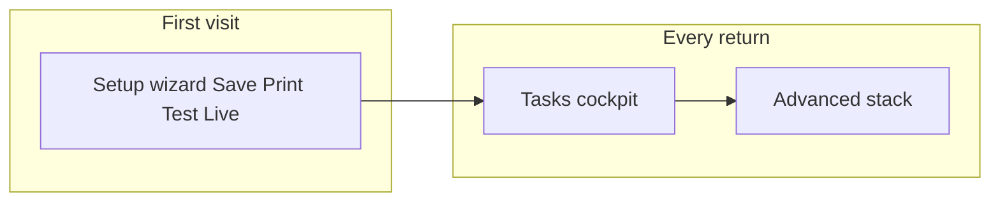

# Card controls - Tasks tab redesign (brainstorm)

**Status:** **Complete** (T0-T5 shipped May 2026).  
**Audience:** Product, design, frontend  
**Scope:** `/created/` **control mode**, **Live** tab (renamed from Tasks) and **Manage** tab (renamed from Advanced). Canonical UX: [`CREATED_TASK_DASHBOARD.md`](CREATED_TASK_DASHBOARD.md).  
**Related:** [`CARD_WORKSPACE_UX.md`](CARD_WORKSPACE_UX.md) · [`CREATED_TASK_DASHBOARD.md`](CREATED_TASK_DASHBOARD.md) · [`VISUAL_IDENTITY_PRINCIPLES.md`](VISUAL_IDENTITY_PRINCIPLES.md) · [`HUB_CARD_ROW_UX.md`](HUB_CARD_ROW_UX.md) · setup wizard in [`CARD_WORKSPACE_UX.md`](CARD_WORKSPACE_UX.md)

---

## Decision record

| Choice | Rationale |
|--------|-----------|
| **Keep Advanced tab** | Operators like the icon + title + subtitle + chevron disclosures. Serious, calm, progressive depth. |
| **Rework Tasks tab** | Feels like a flat checklist left over from pre-wizard control mode. Duplicates setup wizard without the narrative. |
| **Do not merge tabs** | Tasks = "operate the live object today." Advanced = "change resolver state / keys / policy." |

### Locked product decisions (operator review, May 2026)

| # | Question | Decision | Notes |
|---|----------|----------|-------|
| 1 | Inline public copy edit on Live tab? | **Yes** | All **scanner-facing** fields for this card type (see [Inline edit](#inline-edit-what-scanners-see)); one **Publish update** on Live. |
| 2 | Revoke on Live tab? | **No** | Revoke QR and destructive lifecycle only on **Manage**. |
| 3 | Rename tabs? | **Yes** | **Live · Manage** (locked). |
| 4 | Desktop two-column hero? | **No (v1)** | Phone-only layout; no `min-width` split for this pass. |

---

## North star

**Tasks is the operator cockpit for one live object** - not a settings page, not a second wizard, not a dump of every link from the docs.

When a steward opens **Open controls**, they should feel within **10 seconds**:

1. *This object is live on the network right now.* (proof, not hope)
2. *Here is the one thing that matters next.* (single primary CTA)
3. *Everything else is one tap away but not shouting.* (deploy, verify, maintain)

**Tone:** Enticing, competent, human - same bar as [`VISUAL_IDENTITY_PRINCIPLES.md`](VISUAL_IDENTITY_PRINCIPLES.md). Not bureaucratic, not crypto-coded, not "admin panel."

---

## Who is on this page?

| Operator | Arrives via | Mindset |
|----------|-------------|---------|
| **Fresh steward** | Setup wizard finished, or `fresh=1` once | Proud, slightly anxious - "did it work?" |
| **Returning steward** | Hub **Open controls**, `/wallet/` row | Task-focused - update line, print another copy, answer live proof |
| **Multi-card operator** | Hub switcher on `/created/` | Needs card identity locked - which object am I driving? |

**Not the audience:** Strangers (scan page), coalition organizers bulk-revoking (organizer-revoke), developers reading architecture (footer links stay in Advanced).

---

## Jobs to be done (priority order)

Ranked by frequency and revenue-to-trust impact for reference operators:

| P | Job | Success signal |
|---|-----|----------------|
| P0 | **Confirm the object is live** | Resolver status + scan preview without leaving the page |
| P0 | **Deploy the QR** | Download / print path obvious; test scan on second device |
| P0 | **Respond to live proof** | Pending challenge is impossible to miss (inbox for push; Live tab echoes via panel + scroll — [`CREATED_TASK_DASHBOARD.md`](CREATED_TASK_DASHBOARD.md) § Live proof panel — scroll-into-view) |
| P1 | **Update what scanners read** | Clear path to Advanced *or* shallow inline edit for status line only |
| P1 | **Maintain custody** | Keys saved on device; no "Required" badge theater after wizard |
| P2 | **Share proof of seriousness** | Open scan, copy link, vouch state visible |
| P3 | **Recover or rotate** | Advanced tab (do not compete on Tasks) |

**Deprioritize on Live tab:** Revoke, rotate QR, backup export, long glossary, architecture links - **Manage** tab only (already there).

---

## What is wrong today (Tasks tab)

Current stack ([`CREATED_TASK_DASHBOARD.md`](CREATED_TASK_DASHBOARD.md)):

```text
Hero → small QR → Save + Open scan → "More tasks" flat list → keys strip → glossary details → full QR below fold
```

| Problem | Why it hurts |
|---------|----------------|
| **Wizard hangover** | Step numbers + "Required" on Save after setup already walked Save → Print → Test → Live | **Mitigated (D11b):** when auto-save succeeded, setup opens on Print and hides the Save progress step |
| **Flat "More tasks"** | Download / Print / Test / Update / Revoke look equally important; Revoke beside Print feels wrong |
| **Duplicate stories** | Open scan appears twice; QR exists in preview, task list, and giant section |
| **Weak hero** | "Live QR ready" without network truth or emotional payoff |
| **Advanced pattern only on Tasks margin** | Glossary uses `created-advanced-block`; main actions do not use the beloved disclosure row |
| **Scroll archeology** | Primary work (QR, status) split across three vertical zones |

---

## Design principles (Tasks-specific)

1. **One hero object** - Card identity + live network pulse + QR in one visual cluster (think pass-card, not form).
2. **One next action** - Exactly one primary button; secondary row max 2 items.
3. **Progress, not guilt** - Replace green "done" tint checklist with optional "Deploy checklist" collapsed by default for power users.
4. **Match Advanced vocabulary** - Reuse `settings-disclosure` / icon / title / subtitle / chevron for secondary tasks.
5. **Interrupt only for interrupts** - Live proof, unsaved keys, resolver offline = top banners (already partially shipped).
6. **Mobile first** - Thumb zone primary CTA; no hover-only affordances.
7. **Honest limits** - One line on what the QR does *not* prove (link to scan limits, not essay).

---

## Proposed information architecture

### Layer model (top to bottom)

```text
┌─────────────────────────────────────────────────────────┐
│ A. STATUS STRIP (always visible)                        │
│    @handle · object label · "Live on network" chip      │
│    Resolver: Reachable · QR expires … · Vouch: …        │
├─────────────────────────────────────────────────────────┤
│ B. HERO CARD (emotional anchor)                         │
│    QR (large, tappable) · Copy link · Open scan         │
│    Manifesto / status line (read-only teaser)           │
├─────────────────────────────────────────────────────────┤
│ C. NEXT BEST ACTION (single primary)                    │
│    Contextual: Prove live | Test scan | Update line | … │
├─────────────────────────────────────────────────────────┤
│ D. DEPLOY & VERIFY (Advanced-style disclosures)         │
│    ▸ Print & share QR                                   │
│    ▸ Test from another device                           │
│    ▸ Download QR image                                  │
├─────────────────────────────────────────────────────────┤
│ E. CUSTODY (only if needed)                             │
│    ▸ Keys on this device (saved ✓ or save CTA)          │
├─────────────────────────────────────────────────────────┤
│ F. FOOTER LINKS (quiet)                                 │
│    My cards · Case study loop · Help                    │
└─────────────────────────────────────────────────────────┘
```

**Remove from Tasks (stay Advanced):** Revoke QR, rotate, extend, backup, recovery key generation, organizer reveal, long glossary.

**Remove or collapse:** Duplicate full QR section at bottom - fold into Hero card with "Expand QR" disclosure if operators need poster size.

---

## Tab naming (locked)

```text
[ Live ]    [ Manage ]
```

| Tab | Role |
|-----|------|
| **Live** | What the object is on the network **right now** - status, QR, deploy, test scan, prove live, **publish public copy** |
| **Manage** | How the object **works** - QR rotate/extend, revoke, backup, recovery keys, organizer reveal |

- **aria-label:** `Owner tools` → `Live object controls`
- **Code IDs (v1):** keep `created-tab-now` / `created-tab-advanced` and `data-created-tab` values for `#revoke` deep links and tests; change **visible** tab labels and `aria-labelledby` text only until a breaking rename PR.

**Copy sweep:** tab buttons, Manage tab lead (*Save control key on the **Live** tab*), hub/help strings, e2e specs, [`CARD_WORKSPACE_UX.md`](CARD_WORKSPACE_UX.md).

---

## Inline edit: what scanners see

Today, **Manage → Update public line** (`created-manifesto-update.mjs`) switches fields by `pilot_template`:

| Template | Fields today | Put on **Live** tab? |
|----------|--------------|----------------------|
| **general** | Single **Public line** (textarea, 280 chars) | **Yes** - this is the hero quote under `@handle` |
| **status_plate** | **Object name** + **Status line** | **Yes - both** - scanners read both; not "advanced attributes" |
| **lost_item_relay** | **What is lost?** + **Return message** | **Yes - both** - same reason |

**Recommendation:** On **Live**, one section **"What scanners see"** (not buried in Manage):

- Show the same template-specific fields as today.
- One primary **Publish update** (reuse `signCardUpdate` / `postCardUpdate` from `created-manifesto-update.mjs`).
- After publish, refresh hero teaser + `created-manifesto` line from session.

**Do not inline on Live (stay Manage-only):**

| Field / action | Why Manage |
|----------------|------------|
| QR rotate / extend | Changes credential, not copy |
| Revoke QR / card | Destructive lifecycle |
| Backup export / import | Key custody |
| Recovery / organizer keys | Break-glass |
| Handle change (if ever added) | Identity, rare |

**Manage tab after redesign:** Drop the **Update public line** disclosure (duplicate) OR keep a collapsed **"Full editor"** fallback only if inline validation fails - prefer **single editor on Live** to avoid two publish buttons.

**UX pattern on Live:**

```text
┌ What scanners see ─────────────────┐
│ [ fields per template ]            │
│ [ Publish update ]                 │
│ Same QR · updates on next scan     │
└────────────────────────────────────┘
```

Place this block **inside or directly under** the hero card so edit + preview feel connected. Use `settings-disclosure` styling only if the block would push primary CTA below the fold - otherwise always expanded.

**Validation:** Reuse existing rules from `buildManifesto()` in `created-manifesto-update.mjs` (required pairs, 280 combined for plate, relay prefix handling).

---

## Visual direction

### Borrow from Advanced (keep)

- `settings-disclosure` rows: colored icon, title, subtitle, chevron
- Calm panels on expand; one primary button per panel
- No wall of equal-weight list buttons

### Borrow from setup wizard (adapt)

- Horizontal **progress memory** optional: Save · Print · Test · Live as **completed chips** (read-only), not interactive steps
- Reinforces "you already did the hard part" without re-running wizard

### Borrow from hub card rows

- Single **status line** under title (`Reachable · checked 2m ago`) per [`HUB_CARD_ROW_UX.md`](HUB_CARD_ROW_UX.md)
- **Open scan** as secondary outline button beside primary

### New: "Live object card"

A bordered surface (shell fill, subtle radius) containing:

- QR centered in a single-column stack (phone-first; no desktop split in v1)
- Below QR: handle, manifesto teaser, chips
- Tap QR → lightbox or scroll to expand (not a third QR)

**Reference mood:** Landing "One use" flow + scan pass card - physical object made software.

---

## Contextual primary CTA (brainstorm)

| State | Primary button | Subtitle |
|-------|----------------|----------|
| Live proof pending | **Prove control now** | Someone is waiting at your QR |
| Keys not on device (edge) | **Save control key** | Required to update or revoke later |
| QR not tested (optional nudge) | **Test scan** | Preview what finders see |
| Resolver offline | **Check network** (hub) | Updates may fail until back |
| Default (healthy) | **Open scan page** | See your live object as strangers do |

Only one primary visible; others move to disclosures or Advanced.

---

## Copy framework

| Element | Direction | Example |
|---------|-----------|---------|
| Hero title | Outcome, not process | **Your object is live** (not "Live QR ready") |
| Hero meta | Network truth | `Reachable · QR expires Jun 12, 2027` |
| Manifesto teaser | Quote the public line | `"Back soon - knock twice"` |
| Deploy disclosures | Verb-first | **Print & share**, **Test from another phone** |
| Manage pointer | QR lifecycle only | "Rotate or revoke in **Manage**" |
| Inline edit | **What scanners see** on **Live** | Template-aware fields + **Publish update** |

Avoid: step numbers after setup, "Required" badge when wallet saved, "More tasks" as a heading.

---

## Relationship to setup wizard



| Wizard step | Tasks tab echo (read-only, not repeated) |
|-------------|------------------------------------------|
| Save | Custody disclosure shows **Saved on this device** |
| Print | **Print & share** disclosure |
| Test scan | **Test from another device** disclosure |
| Live | Hero status strip shows network live |

**Rule:** Wizard teaches once; Tasks **assumes competence** and surfaces state.

---

## What we will not do on Tasks

- Duplicate Advanced revoke/rotate forms
- Long education blocks (move to Advanced footer / docs links)
- SessionStorage "task done" gamification (optional later; not v1 of redesign)
- Stranger-test or vouch signing flows (scan page)
- Card-disabled-since-visit banners (device inbox / hub - link only)

---

## Phased implementation (suggested)

| Phase | Deliverable | Risk |
|-------|-------------|------|
| **T0** | This doc + wireframe sketches in issue | Low |
| **T1** | HTML/CSS: Hero card + status strip; tab labels **Live · Manage**; phone-only | **Shipped** |
| **T1b** | **What scanners see** inline publish on Live (`created-manifesto-update.mjs`; Manage duplicate removed) | **Shipped** |
| **T2** | Replace flat task list with 3-4 `settings-disclosure` deploy rows | **Shipped** |
| **T3** | Contextual primary CTA on live object card (`created-live-primary-cta*.mjs`) | **Shipped** |
| **T4** | Optional completed wizard chips; copy pass | **Shipped** |
| **T5** | E2E: control mode Live smoke; update `device-os-wallet` | **Shipped** |

**Files likely touched:** `site/created/index.html`, `site/styles.css`, `site/js/created-dashboard.mjs`, `site/js/created.mjs` (hero meta), maybe `created-hero.mjs` if extracted.

**Do not bump** shell import graph unless adding new modules.

---

## Open questions (decide before build)

| Status | Topic |
|--------|--------|
| **Locked** | **Live · Manage**; no revoke on Live; phone-only v1; all scanner-facing fields on Live |
| **Locked** | Hero QR on Live card: **160px** (phone-first v1; full-size in disclosure) |
| **Locked** | Lost-item relay on Live: **textarea** for return message (same as create/Manage today; finders need room) |

---

## Success metrics

| Metric | Target |
|--------|--------|
| Time to first **Open scan** or **Test scan** | Decrease vs today (analytics if available) |
| Support confusion ("where is print?") | Fewer questions after wizard |
| Accidental revoke taps | Zero from Tasks (if revoke removed) |
| Live proof response time | Unchanged or better (banner + primary CTA) |
| Qualitative | Operators describe page as "clear" / "my object" in M5 runbook interviews |

---

## Manual QA

See [`CREATED_TASK_DASHBOARD.md`](CREATED_TASK_DASHBOARD.md) and `e2e/created-control.spec.ts`. Automated: `npm run e2e:created-control`.

---

## Wireframe (ASCII)

```text
┌──────────────────────────────────────┐
│  @steward_handle                     │
│  YOUR OBJECT IS LIVE                 │
│  ● Reachable · expires Jun 2027      │
├──────────────────────────────────────┤
│  ┌────────┐  "Back soon - knock"     │
│  │  QR    │  Registered · 0 vouches  │
│  └────────┘                          │
│  [ Open scan page          ] primary │
│  [ Copy scan link          ] ghost   │
├──────────────────────────────────────┤
│  ▸ Print & share QR                  │
│  ▸ Test from another device          │
│  ▸ Download QR image                 │
├──────────────────────────────────────┤
│  ▸ Keys on this device · Saved ✓     │
├──────────────────────────────────────┤
│  My cards · How the loop works       │
└──────────────────────────────────────┘

        [ Live ]  [ Manage ]
```

---

## Next steps (post-ship)

1. Operator feedback from M5 runbook interviews (qualitative success metrics).
2. Optional: larger hero QR on Live card if operators want pass-card scale without opening full-size disclosure.
3. Optional: remove `hc_created_task_done` session tint entirely (spec deferred gamification).
