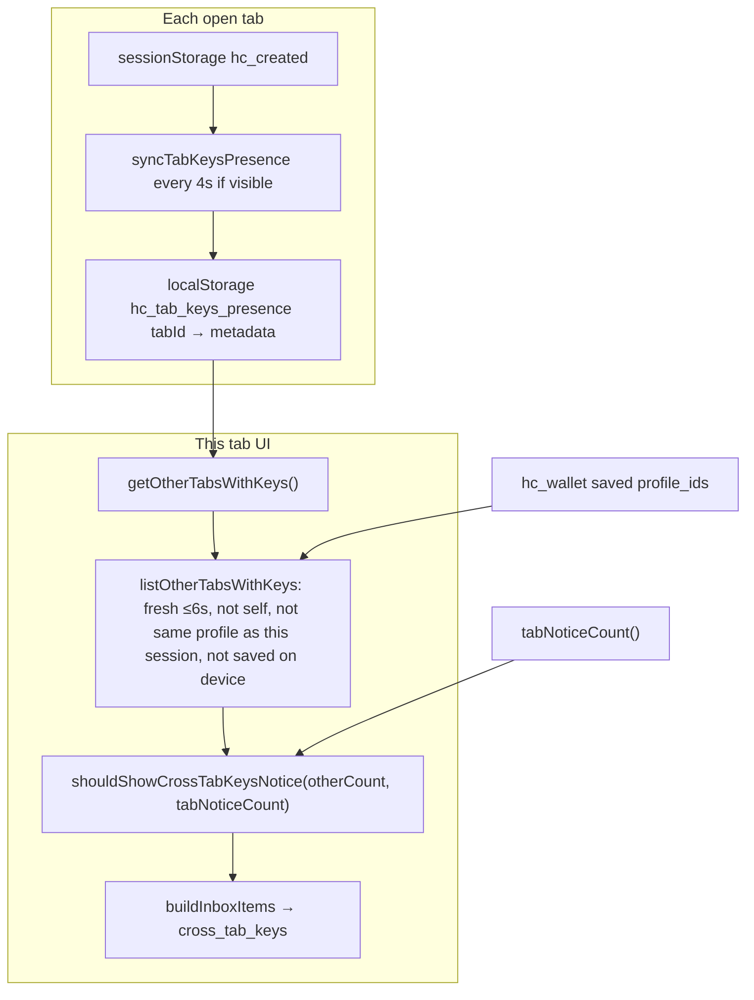

# Cross-tab “Keys in another tab” flash after card delete - investigation

**Reported:** 2026-05-26 - Laptop instance shows “Keys in another tab” for ~1–2s then it disappears, for a card deleted the previous day.

**Status:** **Path B (step 1)**, **path F (step 2)**, and **path G (step 3)** shipped - see § Implementation. Ongoing UX bugs (flash, wrong card label, stuck badge) → [`CROSS_TAB_KEYS_NOTIFICATION_SYSTEM.md`](CROSS_TAB_KEYS_NOTIFICATION_SYSTEM.md) + restart plan [`CROSS_TAB_KEYS_REBUILD_PLAN.md`](CROSS_TAB_KEYS_REBUILD_PLAN.md).

Related: [`DEVICE_INBOX.md`](DEVICE_INBOX.md) counting rule 5, [`DEVICE_OS.md`](DEVICE_OS.md) § Cross-tab keys, [`CARD_DISABLED_SINCE_VISIT_FALSE_POSITIVE_INVESTIGATION.md`](CARD_DISABLED_SINCE_VISIT_FALSE_POSITIVE_INVESTIGATION.md) § Cross-tab badge.

---

## What the user is seeing

The string **“Keys in another tab”** is not an OS push notification. Background alerts (`device-browser-notifications-core.mjs`) only allow `live_proof`; cross-tab never triggers `Notification`.

It appears on one or more **in-app surfaces** tied to the unified inbox model (`cross_tab_keys`):

| Surface | Location | When visible |
|---------|----------|----------------|
| Inbox badge | `#shell-notif-badge` | `notificationCount() > 0` includes cross-tab count |
| Status dot overlay | Blue notch `pass-dot-overlay-cross_tab_keys` | `getInboxDotOverlay()` → `cross_tab_keys` |
| Hub slot | `#device-hub-crosstab-notice` | `renderHubCrossTabNotice()` |
| Landing/wallet banner | `#device-cross-tab-banner` | Legacy pages without shell badge |
| Wallet strip | `#wallet-tab-hint` | `wallet-page.mjs` / `card-wallet.mjs` |
| Glance popover | Inbox row from `buildGlanceRowPlan()` | Title: “Keys in another tab” |
| Inbox sheet | Row `kind: cross_tab_keys` | `device-inbox-sheet.mjs` |

All of these refresh on `hc-tab-presence-changed`, `hc-device-hub-changed`, `storage` (wallet / `hc_created` / `hc_tab_keys_presence`), and `refreshSummary()` in `device-status.mjs`.

A **1–2 second flash** means `getInboxItems()` briefly included `cross_tab_keys`, then `getOtherTabsWithKeys()` returned empty again (or `shouldShowCrossTabKeysNotice` became false).

---

## How cross-tab detection works (source of truth)



**Important behaviors:**

1. **Presence ≠ “card exists on network”** - Only “another tab currently has `hc_created` signing keys and heartbeated while **visible** within ~6s” (`PRESENCE_SHOW_MS` in `device-tab-presence-core.mjs`).
2. **Deleting from wallet does not clear keys in other tabs** - Hub remove copy: *“Keys stay in any other tab until you close it.”* (`device-hub-ui.mjs`). Revoke on network also **does not** remove `hc_created` or stop heartbeats (`created-revoke.mjs` only sets `revoke_state`).
3. **Removing from wallet re-enables cross-tab for that profile** - `listOtherTabsWithKeys` **skips** other tabs whose `profile_id` is in `hc_wallet`. After remove, that profile is no longer saved → other tabs holding those keys **start counting** toward cross-tab (previously suppressed).
4. **Same profile in this tab hides the other tab** - Other tabs with the **same** `profile_id` as this tab’s session are excluded (`device-tab-presence-core.mjs`), so the notice is for **different** profile keys elsewhere.
5. **Unsaved keys in this tab hide cross-tab** - `shouldShowCrossTabKeysNotice` requires `tabNoticeCount === 0`. Any unsaved `hc_created` in **this** tab shows `tab_keys_unsaved` instead.

---

## Root cause (most likely)

**The deleted card’s signing keys are still alive in at least one other browser tab (or a briefly focused/restored tab), and that tab heartbeats into `hc_tab_keys_presence` for a short window.** Deleting/revoking the card does not close those tabs or clear session storage.

Why it **flashes** instead of staying on:

| Mechanism | Why notice is brief |
|-----------|---------------------|
| **Visibility-gated heartbeat** | Only tabs with `document.visibilityState === "visible"` heartbeat every 4s. A background tab stops refreshing `updatedAt`; UI drops it after **~6s** (`PRESENCE_SHOW_MS`). |
| **Tab focus churn** | User switches tabs, Cmd+`, Mission Control, or Safari tab preview focuses another Humanity tab for a moment → one heartbeat → sibling tab shows notice → focus leaves → row goes stale within ~6s (user may perceive 1–2s if they look right as overlay/badge animates). |
| **bfcache / back-forward** | `pageshow` with `persisted` calls `syncTabKeysPresence()` (`device-tab-presence.mjs`) - can re-insert a row for one cycle after navigation. |
| **Mutual exclusion with tab keys** | If this tab briefly has unsaved `hc_created` (`tabNoticeCount === 1`), cross-tab is **hidden**; when session clears, cross-tab can **appear** for one stale-other-tab window - feels like a flash of “another tab”. |
| **Dot view transitions** | `applyDot()` uses `document.startViewTransition` when overlay changes (`device-status.mjs`), which can make the blue notch feel like a short “notification” even when inbox state is stable for a few seconds. |

**Not the root cause:**

- **OS notifications** - cross-tab is inbox-only (see `inboxKindAllowsOsNotification`).
- **“Card deleted on server” alone** - no server signal drives cross-tab; only local tab session + presence map.
- **Stale `hc_default_vouch_profile_id` after wallet remove** - `card-wallet.mjs` remove does not call `clearDefaultVouchIfProfile` (hub remove does). Stale default can confuse vouch UX but does not by itself write presence; auto-activate only runs on scan and requires wallet entry (`vouch-issue.mjs`).

---

## Why “deleted yesterday” does not stop the alert

| User action | Clears `hc_created` in all tabs? | Clears `hc_tab_keys_presence`? | Suppresses cross-tab for that profile? |
|-------------|----------------------------------|--------------------------------|----------------------------------------|
| Remove from device (`hc_wallet`) | No | No | **No** (suppression removed - cross-tab can **increase**) |
| Revoke card/QR on network | No | No | No |
| Close tab / navigate away | That tab only (`pagehide` → `clearTabKeysPresence`) | That `tabId` row removed | Yes, when no other tab heartbeats |
| Clear site data | Yes | Yes | Yes |

So “I deleted the card” on device or network is **orthogonal** to cross-tab until **every tab that held keys is closed** (or site data cleared).

---

## How to confirm on the laptop (no code)

1. **Find orphan tabs** - Look for open Humanity tabs: `/created/`, `/create/`, scan pages, old PWA windows. Close all except the one you use; wait ~10s. Flash should stop if this was the cause.
2. **Inspect storage (DevTools → Application)**  
   - `localStorage.hc_tab_keys_presence` - JSON of `tabId → { profile_id, updatedAt, … }`. Note `profile_id` of the deleted card and whether `updatedAt` jumps when the flash happens.  
   - `sessionStorage.hc_created` **per tab** - keys may still exist on a tab you forgot.  
   - `localStorage.hc_wallet` - confirm profile is gone.  
   - `localStorage.hc_default_vouch_profile_id` - optional stale pointer.
3. **Enable inbox diagnostics** - `localStorage.hc_inbox_diagnostics = "1"`, reproduce, read `sessionStorage.hc_inbox_diag_log` after flash (`device-inbox-diagnostics.mjs`).
4. **Dot diagnostics** - `localStorage.hc_dot_diagnostics = "1"` - watch console for overlay flapping `…:cross_tab_keys` vs `…:none` (`device-dot-diagnostics.mjs`).

---

## Fix paths and tradeoffs

### A. User operational fix (zero code)

**Action:** Close every Humanity tab that might still hold the card’s workspace; optionally clear site data for the origin once.

| Pros | Cons |
|------|------|
| Immediate; matches documented custody model | Easy to miss suspended/discarded tabs |
| No product risk | Does not prevent recurrence |

---

### B. On wallet remove / hub remove - broadcast “profile retired on device”

**Action:** On remove, write a short-lived or durable `localStorage` denylist of `profile_id`s; `listOtherTabsWithKeys` ignores presence rows for retired profiles. Optionally `BroadcastChannel` ask other tabs to `clearTabSessionKeys()` + `clearTabKeysPresence()`.

| Pros | Cons |
|------|------|
| Aligns UX with “I removed this card” | Other tabs may still hold keys user wanted to keep until close (hub copy warns about this) |
| Stops false “another tab” for removed profiles | Requires clear policy: remove vs revoke vs “forget keys everywhere” |

---

### C. On wallet remove - clear presence rows for that `profile_id` globally

**Action:** Scan `hc_tab_keys_presence` and delete entries matching removed `profile_id` (does not clear `hc_created` in other tabs).

| Pros | Cons |
|------|------|
| Stops cross-tab UI until another tab heartbeats again | Misleading if keys still exist (user thinks device is clean) |
| Small, localized change | Heartbeat from orphan tab brings notice back - same root cause |

---

### D. On wallet remove / revoke - proactively clear other tabs’ sessions

**Action:** `BroadcastChannel` message `{ type: "clear-profile", profile_id }`; listeners call `clearTabSessionKeys()` when session matches.

| Pros | Cons |
|------|------|
| Actually removes keys from other tabs | Destructive if user intentionally kept keys in second tab to save later |
| Strongest “delete means gone” semantics | Must match confirm copy and hub “keys stay in other tab” promise |

---

### E. Tighten presence semantics (product change)

**Options:** Shorter `PRESENCE_SHOW_MS`; require `storage` + `BroadcastChannel` “tab alive” ping; don’t show cross-tab for `profile_id` not in wallet **and** not in `hc_created` on this tab (treat as orphan).

| Pros | Cons |
|------|------|
| Reduces flicker from stale rows | May hide legitimate “unsaved keys in create tab” scenarios |
| Better for single-tab users | Six background create tabs still under-count (documented product gap) |

---

### F. UX: distinguish “orphan keys for removed card” vs “another tab needs save”

**Action:** If `profile_id` ∉ `hc_wallet` and presence row exists, show **“Keys still open in another tab for a card you removed from this device”** with CTA **Close other tabs** / **Clear keys on this device** instead of generic cross-tab copy.

| Pros | Cons |
|------|------|
| Matches mental model after delete | More copy and branches; still need orphan-tab cleanup for security |
| Reduces confusion vs false “active card” | Does not alone stop 1–2s flash |

---

### G. Hardening only (flash without behavior change)

**Action:** Debounce `renderNotifBadge` / cross-tab banner on `hc-tab-presence-changed` (e.g. 300–500ms); skip `startViewTransition` when only overlay toggles cross-tab; require two consecutive heartbeats before showing.

| Pros | Cons |
|------|------|
| Smoother chrome | Masks real brief cross-tab states; delays legitimate notice by debounce window |
| Low risk | Does not fix orphan keys |

---

## Recommendation summary

| Priority | Path | Rationale |
|----------|------|-----------|
| **Verify first** | A + DevTools | Confirms orphan tab / presence without shipping code |
| **Best product fix** | B or F (+ optional D with explicit confirm) | “Remove from device” should not surface generic cross-tab for that profile, or should say “orphan keys” |
| **Avoid as sole fix** | C or G alone | Hides or smooths symptom; keys may remain in another tab |
| **Align copy** | Hub already warns on remove; extend to wallet remove in `card-wallet.mjs` | Same gap: wallet remove has no confirm about other tabs |

**Chosen:** Path **B** - best balance of user clarity, zero server cost, and security honesty (keys may remain in other tabs; we stop false “active card elsewhere” inbox noise). Path **F** (orphan-specific copy) and **D** (broadcast clear keys) remain optional follow-ups.

---

## Implementation (path B - step 1)

| Piece | Module |
|-------|--------|
| Denylist storage `hc_wallet_removed_profile_ids` | `device-wallet-removed-profiles-core.mjs`, `device-wallet-removed-profiles.mjs` |
| Filter in `listOtherTabsWithKeys` | `device-tab-presence-core.mjs` |
| Load denylist in `getOtherTabsWithKeys` | `device-tab-presence.mjs` |
| On hub/wallet **Remove from device** | `markProfileRemovedFromDevice` + `purgePresenceForProfile` |
| Re-save clears denylist for that profile | `saveWallet` → `reconcileRemovedProfilesAfterWalletSave` |
| Wallet remove confirm (aligned with hub) | `card-wallet.mjs` |

**Not in step 1:** Path D (full revoke flow), path G (debounce).

**Tests:** `worker/tests/device-cross-tab.test.ts` (denylist + presence purge core).

---

## Implementation (path F - step 2)

| Piece | Module |
|-------|--------|
| Inbox kind `orphan_keys_removed` | `device-inbox-core.mjs`, `device-inbox.mjs` |
| List only denylisted presence rows | `listOtherTabsWithKeys({ orphanRemovedOnly: true })` |
| Hub / glance / sheet / wallet hint copy | `device-cross-tab-banner.mjs`, `device-hub-glance.mjs`, `device-inbox-sheet.mjs`, `wallet-page.mjs`, `card-wallet.mjs` |
| **Clear keys on this device** (confirm + `BroadcastChannel` `hc-tab-keys-custody`) | `device-orphan-keys-nav.mjs`, `device-tab-presence.mjs` |
| Open that tab CTA | `actOnOrphanRemovedTabKeys()` → `requestFocusTab` |

Generic `cross_tab_keys` remains for unsaved create tabs; removed profiles surface as `orphan_keys_removed` (blue badge/dot chroma unchanged).

**Not in step 2:** Path G (debounce), path D as mandatory on every remove (clear is opt-in via hub CTA).

**Tests:** `worker/tests/device-inbox.test.ts`, `worker/tests/device-orphan-keys-nav.test.ts`, `device-cross-tab.test.ts` (orphan-only list).

---

## Implementation (path G - step 3)

| Piece | Module |
|-------|--------|
| Two consecutive presence reads before showing cross-tab/orphan inbox | `device-presence-inbox-stability-core.mjs` → `gatherInboxInput()` |
| Fast hide when presence drops (streak resets on zero) | same |
| Coalesce duplicate `gatherInboxInput()` per chrome refresh (~50ms) | `device-inbox.mjs` |
| Debounce `hc-tab-presence-changed` → `refreshSummary` (300ms) | `device-status.mjs` |
| Skip dot `startViewTransition` for cross-tab overlay-only flaps | `shouldSkipCrossTabOverlayViewTransition` in `device-status.mjs` |
| Wallet / banner / sheet use stabilized `gatherInboxInput()` | `device-cross-tab-banner.mjs`, `device-inbox-sheet.mjs`, `wallet-page.mjs`, `card-wallet.mjs` |

**Not in step 3:** Mandatory broadcast clear on every remove (path D); E2E two-tab remove (listed below).

**Tests:** `worker/tests/device-presence-inbox-stability.test.ts`.

---

## Code references

Presence heartbeat and storage:

```58:86:site/js/device-tab-presence.mjs
export function syncTabKeysPresence() {
  const tabId = getTabId();
  let map = readPrunedPresence();
  const session = getTabSession();
  // ... writes map[tabId] when session has keys ...
}
```

Cross-tab gating and saved-profile suppression:

```88:110:site/js/device-tab-presence-core.mjs
export function listOtherTabsWithKeys(input) {
  // ...
  if (saved.has(normalized.profile_id)) continue;
  others.push({ tabId: id, ...normalized });
}
```

```6:8:site/js/device-cross-tab-visibility.mjs
export function shouldShowCrossTabKeysNotice(otherTabCount, tabNoticeCount) {
  return tabNoticeCount === 0 && otherTabCount > 0;
}
```

Hub remove confirm (keys remain in other tabs):

```946:947:site/js/device-hub-ui.mjs
      if (!window.confirm("Remove this card from this device? Keys stay in any other tab until you close it.")) {
        return;
```

Wallet remove (no other-tab warning, no presence cleanup):

```176:179:site/js/card-wallet.mjs
  listEl.querySelectorAll(".wallet-remove").forEach((btn) => {
    btn.addEventListener("click", () => {
      const id = btn.getAttribute("data-id");
      saveWallet(loadWallet().filter((e) => e.id !== id));
```

---

## Tests to add if implementing a fix

- Vitest: after simulated wallet remove, presence row for that `profile_id` does not produce `cross_tab_keys` (paths B/C/F).
- Vitest: removing saved profile **increases** cross-tab count when presence row exists (documents current behavior / regression guard).
- E2E: two tabs, remove card in tab A, assert tab B does not flash badge when profile only in tab B session and tab B closed (operational): existing `device-cross-tab` tests in `worker/tests/device-cross-tab.test.ts`.

---

## Related docs

- [`KEYS_CARDS_AND_VERIFICATION.md`](KEYS_CARDS_AND_VERIFICATION.md) - `hc_created` vs `hc_wallet`
- [`VOUCH_READY_KEYS_DESIGN.md`](VOUCH_READY_KEYS_DESIGN.md) - cross-tab on scan surfaces (`includeSavedProfiles: true`)
