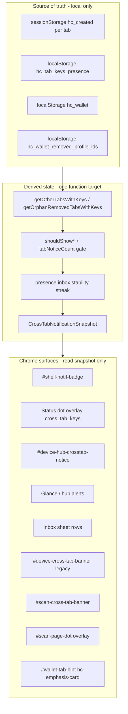

# Cross-tab keys notification system

**Status:** Spec (canonical) - Phases 1–6 shipped ([`CROSS_TAB_KEYS_REBUILD_PLAN.md`](CROSS_TAB_KEYS_REBUILD_PLAN.md))  
**Audience:** Product, frontend  
**Related:** [`DEVICE_INBOX.md`](DEVICE_INBOX.md) · [`DEVICE_OS.md`](DEVICE_OS.md) § Cross-tab keys · [`KEYS_CARDS_AND_VERIFICATION.md`](KEYS_CARDS_AND_VERIFICATION.md) · [`CROSS_TAB_KEYS_FLASH_AFTER_CARD_DELETE_INVESTIGATION.md`](CROSS_TAB_KEYS_FLASH_AFTER_CARD_DELETE_INVESTIGATION.md) · [`LAGGY_SCROLL_CROSS_TAB_PRESENCE_INVESTIGATION.md`](LAGGY_SCROLL_CROSS_TAB_PRESENCE_INVESTIGATION.md)

---

## What this is (and is not)

| User says | What they usually mean | Actual mechanism |
|-----------|------------------------|------------------|
| “Notification” / “alert popped up” | Inbox badge, blue dot notch, hub card, banner, glance row, inbox sheet row | **In-app chrome** driven by inbox kinds `cross_tab_keys` or `orphan_keys_removed` |
| “Random notification” | Brief flash of badge/dot/banner with wrong or changing card label | **Presence churn** + **split refresh paths** (see [Failure modes](#failure-modes)) |
| “Notification won’t go away” | Badge/dot after save or closing the other tab | **Stale presence**, **streak not reset on custody change**, or **another tab still heartbeating** |
| OS push / browser alert | System `Notification` | **Never** for cross-tab - `inboxKindAllowsOsNotification()` allows `live_proof` only ([`DEVICE_INBOX.md`](DEVICE_INBOX.md)) |

**Product sentence:** *Cross-tab keys tell you that **another open, visible browser tab** on this device is holding signing keys you may care about - not that a card exists on the network, and not via OS push.*

---

## Three layers (do not conflate)



On scan pages, `#scan-page-dot` should show the `cross_tab_keys` overlay when the banner is shown (planned — [`SCAN_PAGE_DEVICE_DOT.md`](SCAN_PAGE_DEVICE_DOT.md)); banner remains the primary sentence + actions.

| Layer | Question | Must not |
|-------|----------|----------|
| **Presence** | Which tabs heartbeated keys recently? | Store private keys in `localStorage` |
| **Inbox kinds** | Should we show cross-tab vs orphan vs tab-unsaved? | Double-count the same profile |
| **Chrome** | How do we render badge, dot, hub, sheet? | Re-derive presence independently per surface |

Full inbox taxonomy: [`DEVICE_INBOX.md`](DEVICE_INBOX.md). This doc owns **cross-tab / orphan** only.

---

## Presence protocol

**Storage:** `localStorage.hc_tab_keys_presence` - map `tabId → { profile_id, qr_id?, handle?, label?, updatedAt }` (public metadata only).

**Writer:** `device-tab-presence.mjs` (`startTabKeysPresence()` from `device-status.mjs`).

| Constant | Value | Meaning |
|----------|-------|---------|
| `PRESENCE_HEARTBEAT_MS` | 5000 | Visible tab writes while keys in `hc_created` (metadata unchanged: skip until keep-alive) |
| `PRESENCE_SHOW_MS` | 7000 | UI lists row only if `now - updatedAt <= showMs` |
| `PRESENCE_STALE_MS` | 10000 | Pruned from map on read |

**Rules:**

1. Heartbeat only when `document.visibilityState === "visible"`.
2. `pagehide` → `clearTabKeysPresence()` for this `tabId`.
3. `storage` on `PRESENCE_KEY` → `hc-tab-presence-changed` on **every** tab (including writer).
4. Same `profile_id` as **this tab’s** `hc_created` → excluded from “other tabs” list.
5. Profile in `hc_wallet` on this device → excluded from generic `cross_tab_keys` (unless `includeSavedProfiles: true` for scan vouch).
6. Profile in `hc_wallet_removed_profile_ids` → excluded from generic cross-tab; may appear as `orphan_keys_removed`.

**Custody channels (BroadcastChannel):**

| Channel | Message | Effect |
|---------|---------|--------|
| `hc-tab-focus` | `{ type: "focus", tabId }` | Target tab `window.focus()` |
| `hc-tab-keys-custody` | `{ type: "clear-profile-keys", profile_id }` | Matching tab clears `hc_created` + presence |

---

## Inbox kinds (cross-tab family)

| `kind` | When | Badge | Dot overlay | OS alert |
|--------|------|-------|-------------|----------|
| `cross_tab_keys` | Other tabs hold keys for profiles **not** saved on this device and **not** on remove denylist | Sum of other-tab count | `cross_tab_keys` (below `proof_waiting`) | No |
| `orphan_keys_removed` | Other tabs heartbeat keys for profiles on **remove denylist** | Same blue chroma | Same notch family | No |
| `tab_keys_unsaved` | This tab has unsaved `hc_created` | Yes | Device axis `unsaved` (mutually excludes cross-tab UI) | No |

**Mutual exclusion:** `shouldShowCrossTabKeysNotice(n, tabNoticeCount)` and orphan variant require `tabNoticeCount === 0` (`device-cross-tab-visibility.mjs`).

**Count semantics:** Badge number is **total actionable inbox count** (live proof + cross-tab + unsaved + card-disabled), not “tabs with keys.” Cross-tab contribution = **number of qualifying other tabs** after filters ([`DEVICE_INBOX.md`](DEVICE_INBOX.md) rule 5).

**Aggregate vs per-tab UI:**

- `buildInboxItems()` - one inbox item; subtitle uses **first** entry by `updatedAt`; `count` = number of tabs.
- `buildInboxSheetRows()` - **one row per** entry in stabilized `crossTabEntries` / `orphanRemovedEntries`.

---

## Derivation pipeline (current code)

```
getCrossTabNotificationState()  [device-cross-tab-state.mjs]
  ├─ getOtherTabsWithKeys() / getOrphanRemovedTabsWithKeys()
  └─ computeCrossTabNotificationState()  [device-cross-tab-state-core.mjs]
        fingerprint-stable streak (2 reads, same tabId:profile_id set)

gatherInboxInput()  [device-inbox.mjs]
  ├─ getCrossTabNotificationState()
  └─ one snapshot per chrome refresh tick (+ 50ms coalesce outside ticks)

getCrossTabScanSnapshot()  [device-cross-tab-state.mjs]
  └─ fingerprint streak for scan (includes saved profiles for vouch)

refreshDeviceChrome()  [device-chrome-refresh.mjs]
  └─ shell + scan-tab-keys.mjs

getInboxItems() → buildInboxItems(gatherInboxInput())
```

**Phase 1 stabilization** (`device-cross-tab-state-core.mjs`):

- Show cross-tab/orphan only after **two consecutive** reads with the **same presence fingerprint** (sorted `tabId:profile_id` set).
- Hide immediately when gate fails, `raw.length === 0`, or fingerprint changes.
- `invalidateCrossTabNotificationState()` on `hc_wallet` / `hc_created` storage, hub change, denylist change, and `resetPresenceInboxGatherCache()`.

**Legacy:** `device-presence-inbox-stability-core.mjs` - `shouldSkipCrossTabOverlayViewTransition` only (dot view transitions).

---

## Chrome surfaces (inventory)

| Surface | Module | Input today | Notes |
|---------|--------|-------------|-------|
| Inbox badge + chroma | `device-status.mjs` | `getInboxItems()` (one gather per chrome tick) | Via `device-chrome-refresh.mjs` (hide immediate, show debounced 300ms) |
| Dot overlay | `device-status.mjs` | `getInboxDotOverlay()` | May skip view transition for cross-tab-only flap |
| Hub `#device-hub-crosstab-notice` | `device-cross-tab-banner.mjs` | `gatherInboxInput()` / `getInboxItems()` | Same coordinator tick as badge |
| Glance rows | `device-hub-glance.mjs` | `getInboxItems()` | Coordinator tick |
| Hub alert groups | `device-hub-inbox-alerts.mjs` | `getInboxItems()` | Coordinator tick |
| Inbox sheet | `device-inbox-sheet.mjs` | `gatherInboxInput()` + `buildInboxSheetRows` | Coordinator tick when open |
| Landing/wallet banner | `device-cross-tab-banner.mjs` | `gatherInboxInput()` when no shell badge | Legacy |
| Scan banner | `device-cross-tab-banner.mjs` | **`getCrossTabScanSnapshot()`** | Fingerprint streak; `scan-tab-keys.mjs` uses coordinator |
| Wallet tab hint | `wallet-page-chrome.mjs` | `gatherInboxInput()` | Coordinator tick on `/wallet/` |

**Navigation CTAs:** `device-notice-nav.mjs` (`actOnOtherTabKeys`), `device-orphan-keys-nav.mjs` (orphan focus / clear).

---

## Event fan-out (shipped architecture)

On each qualifying `storage` / `hc-tab-presence-changed` event, **one coordinator** runs:

| Listener | Handler | Debounced? |
|----------|---------|------------|
| `device-chrome-refresh.mjs` | `refreshDeviceChrome()` → badge, dot, banner, glance, hub alerts, sheet, wallet hint | Hide **immediate**; show **300ms** debounce |
| `device-tab-presence.mjs` | `storage` on `hc_tab_keys_presence` re-dispatches `hc-tab-presence-changed` | N/A (writer + readers) |

Shell pages load the coordinator from `device-status.mjs`. Scan pages load it from `scan-tab-keys.mjs`. Surfaces must not register their own `hc-tab-presence-changed` handlers (Phase 2).

Historical fan-out (pre-rebuild): [`LAGGY_SCROLL_CROSS_TAB_PRESENCE_INVESTIGATION.md`](LAGGY_SCROLL_CROSS_TAB_PRESENCE_INVESTIGATION.md).

---

## Invariants (target contract)

These should hold after rebuild (Phases 1–6).

1. **Single snapshot** - All shell surfaces read one `gatherInboxInput()` per `refreshDeviceChrome()` tick; scan uses `getCrossTabScanSnapshot()` with the same fingerprint streak rules.
2. **Show stability** - Cross-tab/orphan chrome appears only after **two** reads with the same `tabId:profile_id` fingerprint.
3. **Fast hide** - When qualifying presence drops to zero, coordinator runs **immediate** refresh (no debounce on hide).
4. **Custody reset** - On `hc_wallet`, `hc_created`, hub change, denylist, dismiss, or `invalidateCrossTabInboxState()`, reset streak + gather cache.
5. **No OS alert** - `cross_tab_keys` / `orphan_keys_removed` never call `Notification` API.
6. **Saved profile** - After save to `hc_wallet`, generic cross-tab must not reference that `profile_id` (filter in `listOtherTabsWithKeys`).
7. **Removed profile** - Denylisted profiles use `orphan_keys_removed` copy, not generic cross-tab ([`CROSS_TAB_KEYS_FLASH_AFTER_CARD_DELETE_INVESTIGATION.md`](CROSS_TAB_KEYS_FLASH_AFTER_CARD_DELETE_INVESTIGATION.md)).
8. **Tab unsaved wins** - When `tabNoticeCount > 0`, no cross-tab/orphan chrome.

---

## Failure modes (reported bugs → cause)

| Symptom | Likely cause | Doc / code |
|---------|--------------|------------|
| Badge/dot flashes 1–2s | Orphan tab heartbeats once while visible; streak not yet 2 OR debounced badge vs immediate hub | Flash investigation § Root cause |
| “Random” badge with no keys you care about | Background tab focused briefly; presence row fresh ≤6s | `PRESENCE_SHOW_MS` |
| Wrong / changing card name in notice | Multiple other tabs; primary = max `updatedAt`; streak does not lock identity | `listOtherTabsWithKeys` sort |
| Notice after “deleted” card | Keys still in another tab; remove from wallet **increases** cross-tab until denylist/orphan path | Flash investigation |
| Notice after save on this device | Other tab still holds **different** profile keys (expected) OR stale streak/cache (bug) | Invariant 4 |
| Notice after closing other tab | `pagehide` not run (crash, force-quit) until row ages out ~6–10s | Presence protocol |
| Scan page ≠ inbox | Scan snapshot stale vs shell | Rare if scan page not on coordinator (fixed: `scan-tab-keys.mjs`) |
| Scroll jank with many tabs | N tabs × M listeners × `refreshSummary` / view transitions | Lag investigation |
| Hub shows cross-tab, badge hidden | `tabNoticeCount` flipped between reads; or mid-streak first read | Stabilization |

---

## User-facing copy (canonical)

| Context | Title / lead |
|---------|----------------|
| Inbox / hub (generic) | **Keys in another tab** |
| Inbox / hub (orphan) | **Keys still open in another tab** · for a card you removed from this device |
| Legacy banner | **Signing keys in another tab** |
| Hub remove confirm | Keys stay in any other tab until you close it |

CTAs: **Open that tab** · **Open controls here** (when wallet has keys) · **Clear keys on this device** (orphan only).

---

## Diagnostics

| Enable | Log / signal |
|--------|----------------|
| `localStorage.hc_inbox_diagnostics = "1"` | `sessionStorage.hc_inbox_diag_log` - badge opens, actions |
| `localStorage.hc_dot_diagnostics = "1"` | Console overlay flapping |
| DevTools → Application | `hc_tab_keys_presence`, per-tab `hc_created`, `hc_wallet`, `hc_wallet_removed_profile_ids` |

**Repro checklist:** Close all Humanity tabs except one → wait 10s → badge should clear for cross-tab unless one visible tab still heartbeats keys.

---

## Files (ownership)

| Path | Role |
|------|------|
| `site/js/device-tab-presence-core.mjs` | Pure filter/prune/list |
| `site/js/device-tab-presence.mjs` | Heartbeat, channels, browser API |
| `site/js/device-cross-tab-state-core.mjs` | Fingerprint + `computeCrossTabNotificationState()` |
| `site/js/device-cross-tab-state.mjs` | Browser snapshot + custody invalidation |
| `site/js/device-presence-inbox-stability-core.mjs` | Dot view-transition skip only |
| `site/js/device-inbox.mjs` | `gatherInboxInput`, chrome refresh tick cache |
| `site/js/device-chrome-refresh.mjs` | Single coordinator for presence/custody chrome |
| `site/js/scan-tab-keys.mjs` | Scan page presence + coordinator bootstrap |
| `site/js/device-inbox-core.mjs` | `buildInboxItems`, `buildInboxSheetRows` |
| `site/js/device-cross-tab-visibility.mjs` | `tabNoticeCount` gate |
| `site/js/device-cross-tab-banner.mjs` | Hub slot, legacy banner, scan |
| `site/js/device-notice-nav.mjs` | `actOnOtherTabKeys` |
| `site/js/device-orphan-keys-nav.mjs` | Orphan clear / focus |
| `site/js/device-wallet-removed-profiles.mjs` | Denylist |
| `worker/tests/device-cross-tab.test.ts` | Presence + denylist |
| `worker/tests/device-cross-tab-scan-snapshot.test.ts` | Scan fingerprint streak |
| `worker/tests/device-presence-inbox-stability.test.ts` | Streak |
| `worker/tests/device-inbox.test.ts` | Inbox rows |
| `e2e/device-cross-tab-keys.spec.ts` | Two-tab badge, save filter, orphan copy |

---

## Tests (regression)

```bash
npm run worker:test -- worker/tests/device-cross-tab-state.test.ts worker/tests/device-cross-tab-scan-snapshot.test.ts worker/tests/device-cross-tab.test.ts worker/tests/device-presence-inbox-stability.test.ts worker/tests/device-inbox.test.ts
npm run e2e -- e2e/device-cross-tab-keys.spec.ts e2e/device-inbox.spec.ts e2e/device-status-dot.spec.ts
```

Manual: [`DEVICE_OS_QA.md`](DEVICE_OS_QA.md) - cross-tab / multi-tab rows when present.
