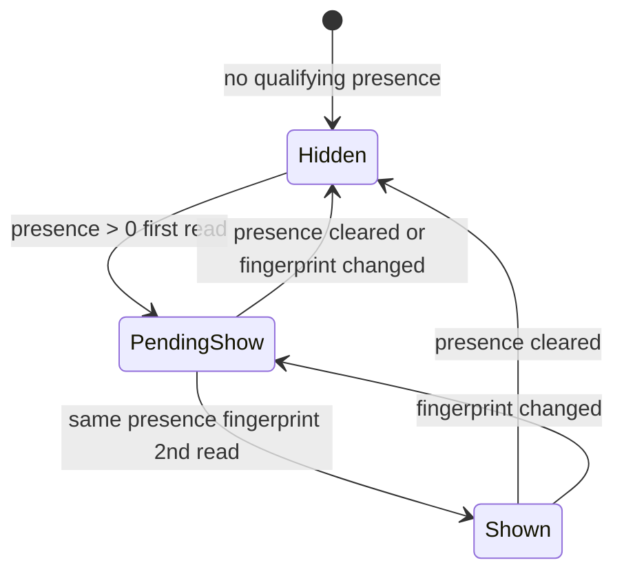

# Cross-tab keys - rebuild plan (restart)

**Status:** Phase 1 shipped · Phase 2+ pending  
**Audience:** Engineering  
**Canonical spec:** [`CROSS_TAB_KEYS_NOTIFICATION_SYSTEM.md`](CROSS_TAB_KEYS_NOTIFICATION_SYSTEM.md)  
**Context:** Paths B, F, G shipped ([`CROSS_TAB_KEYS_FLASH_AFTER_CARD_DELETE_INVESTIGATION.md`](CROSS_TAB_KEYS_FLASH_AFTER_CARD_DELETE_INVESTIGATION.md)) but reports continue: random flashes, glitchy card labels, notices persisting after save or tab close, scroll jank with many tabs.

**Goal:** Replace the current patch stack with a **small, testable state machine** and **one chrome refresh path** - not more per-surface band-aids.

**Non-goals (this rebuild):**

- Server-side presence or push
- OS notifications for cross-tab
- Re-enabling document scroll-edge chrome or global `initDeviceOsCoordinator()` ([`UI_UX_SAFE_REBUILD_IMPLEMENTATION.md`](UI_UX_SAFE_REBUILD_IMPLEMENTATION.md))

---

## Problem statement (from investigation)

| # | Bug report | Root cause in current architecture |
|---|------------|-----------------------------------|
| 1 | Random badge/dot/banner appears | Visibility-gated heartbeat + brief focus on orphan tabs; **split debounced vs immediate listeners** |
| 2 | Glitchy / different card in notice | Primary entry = latest `updatedAt`; **streak checks count only, not profile set** |
| 3 | Notice stays after save | Often correct (other profile still in another tab); sometimes **streak/cache not reset on `hc_wallet` / `hc_created`** |
| 4 | Notice stays after closing other tab | Row lingers up to ~6s; badge debounced 300ms behind hub; user perceives “stuck” |
| 5 | Scan ≠ inbox | `renderScanCrossTabNotice` uses **raw** `getOtherTabsWithKeys`, not stabilized snapshot |
| 6 | Lag with many tabs | 6+ tabs × 5+ listeners × duplicate `gatherInboxInput` / `startViewTransition` |

Path G (streak, gather cache, debounced `refreshSummary`, skip cross-tab view transition) **reduced** flash and jank but did not fix architectural splits.

---

## Design principles

1. **One snapshot per tick** - `computeCrossTabNotificationState()` returns everything chrome needs; surfaces are dumb renderers.
2. **Identity-stable show** - Show only when the **set of qualifying `(tabId, profile_id)`** is unchanged for two reads (or one read + 300ms quiet window - pick one in implementation).
3. **Fast hide** - Any read with zero qualifying presence → hide all surfaces on the **same** synchronous refresh (no debounce on hide).
4. **Debounced show only** - Coalesce presence **show** edges; never debounce **hide**.
5. **Custody invalidation** - Reset machine on wallet, session, denylist, and explicit clear/focus actions.
6. **Keep security honesty** - Removing from device does not delete keys in other tabs unless user confirms broadcast clear; denylist + orphan copy stays.

---

## Target architecture



**Fingerprint:** sorted `tabId:profile_id` pairs after `listOtherTabsWithKeys` / orphan filter (stable stringify).

**Module layout (proposed):**

| Module | Responsibility |
|--------|----------------|
| `device-cross-tab-state-core.mjs` | Pure: fingerprint, streak, `computeCrossTabNotificationState(input)` |
| `device-cross-tab-state.mjs` | Browser: read presence/wallet/session, hold streak, export `getCrossTabNotificationState()` |
| `device-chrome-refresh.mjs` | Single subscriber to `hc-tab-presence-changed` (+ custody events); calls one `refreshDeviceChrome()` |
| Thin renderers | `device-cross-tab-banner.mjs`, `device-status.mjs`, `device-inbox-sheet.mjs` read snapshot only |

**Delete / shrink:** duplicate `hc-tab-presence-changed` listeners on banner, glance, hub-ui, inbox-sheet, wallet-page (fold into coordinator).

---

## Phased delivery

### Phase 0 - Documentation & tests lock (this PR)

- [x] [`CROSS_TAB_KEYS_NOTIFICATION_SYSTEM.md`](CROSS_TAB_KEYS_NOTIFICATION_SYSTEM.md) - canonical spec
- [x] This rebuild plan
- [x] Vitest: fingerprint + “hide immediate / show delayed” in `worker/tests/device-cross-tab-state.test.ts`

### Phase 1 - Pure state core + snapshot API ✅

**Deliverable:** `computeCrossTabNotificationState()` with:

```ts
// conceptual
{
  showGeneric: boolean,
  showOrphan: boolean,
  genericEntries: PresenceEntry[],
  orphanEntries: PresenceEntry[],
  fingerprint: string,
  badgeContribution: number, // sum for inbox builder
}
```

**Rules:**

- Identity-stable show (fingerprint match across reads).
- `tabNoticeCount > 0` → force hidden generic + orphan.
- Reuse existing `listOtherTabsWithKeys` / denylist / orphan filters - do not duplicate filter logic.

**Tests:** `worker/tests/device-cross-tab-state.test.ts` - table-driven cases from failure modes table.

**Shipped modules:** `device-cross-tab-state-core.mjs`, `device-cross-tab-state.mjs`; `gatherInboxInput()` wired; custody invalidation on `hc_wallet` / `hc_created` / hub / denylist; shell manifest + `DEVICE_SHELL_ASSET_VERSION` **36**.

### Phase 2 - Single chrome refresh coordinator ✅

**Deliverable:**

- `device-chrome-refresh.mjs` (or extend `device-status.mjs` minimally):
  - Subscribe: `hc-tab-presence-changed`, `hc-device-hub-changed`, `storage` (`hc_wallet`, `hc_created`, `hc_tab_keys_presence`, denylist key).
  - **Hide path:** if snapshot says hidden → `refreshDeviceChrome({ immediate: true })`.
  - **Show path:** debounce 300ms rising edge only.
- `refreshDeviceChrome()` calls, in order: update inbox snapshot → `renderNotifBadge` → `applyDot` → `renderCrossTabKeysBanner` → `refreshHubGlance` → `syncHubInboxAlertGroups` → inbox sheet if open.
- Remove duplicate listeners listed in spec § Event fan-out.

**Acceptance:** One presence heartbeat → one coalesced refresh; no `renderCrossTabKeysBanner` registered twice.

**Shipped:** `device-chrome-refresh.mjs` coordinator, removed duplicate `hc-tab-presence-changed` listeners from hub/banner/glance/sheet/wallet, and wired `device-status.mjs` to delegate cross-tab chrome refresh.

### Phase 3 - Wire all surfaces to snapshot

| Surface | Change |
|---------|--------|
| `device-inbox.mjs` | `gatherInboxInput` uses `getCrossTabNotificationState()` - remove module-level streak from inbox |
| `device-cross-tab-banner.mjs` | Scan + hub + legacy banner read snapshot; delete raw `getOtherTabsWithKeys` in scan |
| `device-inbox-sheet.mjs` | Rows from snapshot entries only |
| `wallet-page.mjs` / `card-wallet.mjs` | Hint from snapshot |

**Acceptance:** Two-tab Vitest + manual: scan banner label matches inbox sheet primary row.

### Phase 4 - Custody invalidation & clear semantics ✅

**On:**

- `saveWallet` / remove entry / `markProfileRemovedFromDevice`
- `activateWalletEntry` / `clearTabSessionKeys` / `hc_created` storage in this tab
- `actOnOtherTabKeys` dismiss (same profile + keys already here)
- `clearOrphanKeysOnDevice`

**Do:** `invalidateCrossTabNotificationState()` (reset streak + fingerprint + gather cache).

**Optional (product decision):** after **Save on this device**, `BroadcastChannel` ask other tabs to clear presence for that `profile_id` only (non-destructive to keys - presence-only). Document in spec if shipped.

**Acceptance:** Save keys in tab A → tab B badge clears for that profile within one refresh tick (not 6s stale row).

**Shipped:** `invalidateCrossTabInboxState()` and custody invalidation event wiring (`hc-device-hub-changed`, `hc-wallet-removed-profiles-changed`, `hc-cross-tab-custody-invalidated`), plus `actOnOtherTabKeys()` dismiss invalidation.

### Phase 5 - Performance hardening

- Ensure `gatherInboxInput` / inbox items computed **once** per `refreshDeviceChrome`.
- Keep `shouldSkipCrossTabOverlayViewTransition` when only cross-tab overlay flaps.
- Consider slowing heartbeat to 5s or writing presence only when fingerprint changes (reduces `storage` storms) - measure against [`DEVICE_OS_REQUEST_BUDGET.md`](DEVICE_OS_REQUEST_BUDGET.md).

**Acceptance:** Repro from [`LAGGY_SCROLL_CROSS_TAB_PRESENCE_INVESTIGATION.md`](LAGGY_SCROLL_CROSS_TAB_PRESENCE_INVESTIGATION.md) - 6 tabs, landing scroll acceptable.

### Phase 6 - E2E & QA

- Playwright: two tabs, keys in tab B, tab A badge stable label, close tab B → badge clears ≤10s.
- Playwright: save wallet in tab A, other tab same profile → no generic cross-tab for that profile.
- Playwright: remove from device + orphan copy path.
- Manual **P0-3**, **P0-W** if touch status graph.

---

## Migration / rollback

- Ship phases 1–3 behind no flag (behavior should strictly improve); keep Path B denylist and Path F orphan copy.
- If regressions: revert coordinator first (phase 2), keep pure core tests.
- Bump `DEVICE_SHELL_ASSET_VERSION` when changing status import graph ([`AGENTS.md`](../AGENTS.md)).

---

## Success metrics

| Metric | Target |
|--------|--------|
| Flash reports | No badge/dot show &lt;500ms for single heartbeat |
| Label stability | Same profile label for duration of shown state |
| After save (only profile) | Cross-tab hidden on all surfaces within 1 refresh |
| Listener count per presence event | 1 coordinator (+ storage), not 5+ |
| Vitest | New core + existing cross-tab/inbox green |
| E2E | New two-tab spec green |

---

## Open product questions (decide before Phase 4)

1. **After save to wallet:** should we only hide UI, or also ping other tabs to drop presence row (keys remain)?
2. **Remove from device:** keep hub promise “keys stay in other tab” vs optional “Clear keys everywhere” confirm on remove?
3. **Multi-tab create workflow:** is “6 create tabs, badge 1–3” acceptable, or do we need a dedicated “N tabs with unsaved keys” inbox kind?

---

## Related work (do not duplicate)

| Item | Where |
|------|--------|
| Orphan denylist (path B) | Shipped - keep |
| Orphan copy (path F) | Shipped - keep |
| Path G streak | Replace with fingerprint streak in Phase 1 |
| Live proof OS alerts | [`DEVICE_INBOX.md`](DEVICE_INBOX.md) - separate channel |
| Card disabled since visit | [`device-inbox-card-disabled.mjs`](../site/js/device-inbox-card-disabled.mjs) - separate kind |
