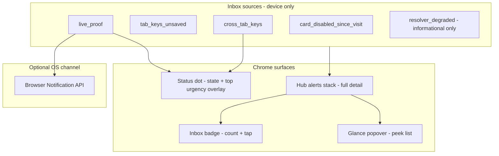

# Device inbox & background alerts

**Status:** Unified inbox shipped (phases 1–14) · browser alerts v2 A–D shipped (contextual opt-in, sign deep link, OS policy matrix, live-proof service worker)  
**Audience:** Product, frontend  
**Related:** [`DEVICE_OS.md`](DEVICE_OS.md) · [`STATUS_INDICATOR_STEWARD_GREEN.md`](STATUS_INDICATOR_STEWARD_GREEN.md) · [`DEVICE_HUB_AND_LOCAL_SEARCH.md`](DEVICE_HUB_AND_LOCAL_SEARCH.md) · [`CROSS_TAB_KEYS_NOTIFICATION_SYSTEM.md`](CROSS_TAB_KEYS_NOTIFICATION_SYSTEM.md) (cross-tab / orphan chrome spec)

---

## North star

Three layers, one story:

| Layer | User question | Chrome surface |
|-------|---------------|----------------|
| **Status dot** | Is this device + network OK? Is something *urgently* visible at a glance? | `#brand-status-dot` + optional overlay notch |
| **Device inbox** | What should I do, in what order? | `#shell-notif-badge`, hub `#device-hub-alerts-top`, glance rows |
| **Background alerts** | Tell me when I’m not looking at the tab | Browser `Notification` API (opt-in, device-only) |

**Product sentence:** *Status dot = truth about device and network. Inbox badge = ordered actions on this device. Background alerts = high-urgency inbox items when the tab isn’t visible.*

Do **not** collapse dot and badge into one control-they answer different questions.

**Request budget (how inbox should feel):** Inbox items like `live_proof` may require Worker polls, but the product is **not** a 24/7 monitoring dashboard. Automatic live-proof discovery runs only when the steward **opts in** (**Watch for live proof**) and hub/inbox scope is active; otherwise use manual **Check for live proof** or open `/created/`. Strangers waiting on a scan page poll **their** session; stewards get OS alerts only when background alerts are on. Full policy: [`DEVICE_OS_REQUEST_BUDGET.md`](DEVICE_OS_REQUEST_BUDGET.md) (north star: *stranger pays urgency, steward pays intent*).

---

## Mental model (own the category)

Treat actionable device state as a single **Device inbox** with three presentation tiers-not three unrelated features.

**User-facing language (use consistently in copy and ARIA):**

| Concept | Say | Avoid |
|---------|-----|-------|
| Dot | “Device status” / “Status” | “Notifications” on the dot button |
| Badge | “Needs attention” / “Inbox” | Generic “Notifications” without context |
| OS channel | “Background alerts” | “Notifications” without “when you’re away” |

---

## Inbox item taxonomy

Canonical `kind` values (target: one module `device-inbox-core.mjs`, Vitest-covered like `device-dot-state-core.mjs`).

| `kind` | Urgency | Badge count? | Dot overlay? | Browser alert? | Primary CTA |
|--------|---------|--------------|--------------|----------------|-------------|
| `live_proof` | **High** (time-sensitive) | Yes (pending count) | `proof_waiting` (highest overlay) | Yes (opt-in) | Open `/created/` to sign (`live_challenge`) |
| `tab_keys_unsaved` | Medium | Yes (0 or 1) | Via device axis (`unsaved` pulsing red), not overlay | No | Save keys on device |
| `cross_tab_keys` | Medium | Yes when tab notice = 0 | `cross_tab_keys` | No | Focus other tab / save here |
| `orphan_keys_removed` | Medium | Yes when tab notice = 0 | `cross_tab_keys` (same notch) | No | Open other tab / clear keys on device |
| `card_disabled_since_visit` | Medium | **Yes** (resolver-confirmed since-visit cards) | `card_disabled_since_visit` (soft notch; below proof/cross-tab) | No | Open card from inbox sheet |
| `resolver_degraded` | Low | **No** | Via network color on dot | No | System banner only |

**Counting rules (codify in inbox core):**

1. **Badge count = actionable inbox items only** - exclude informational resolver state (`resolver_degraded`).
2. **Dot overlay = highest-priority inbox kind** - `proof_waiting` → `cross_tab_keys` → `card_disabled_since_visit` (see `dotOverlayFromCounts()` in `device-dot-state-core.mjs`).
3. **No double-counting** - e.g. cross-tab banner/glance only when `tabNoticeCount === 0` (`device-cross-tab-visibility.mjs`).
4. **Live proof** - N pending challenges may show as one inbox group with quantity N; badge may show total count or “1” per product choice; document in tests when unified.
5. **Cross-tab keys (`cross_tab_keys`)** - Badge contribution = **count of other tabs with a fresh presence heartbeat**, not “every create tab you ever opened.” Only tabs that are **open**, hold `hc_created` signing keys, and have heartbeated within ~**6s** while **visible** appear (`device-tab-presence.mjs`, `PRESENCE_SHOW_MS` in `device-tab-presence-core.mjs`). Closing a tab clears its row on `pagehide`; background tabs do not heartbeat. Profiles in `hc_wallet_removed_profile_ids` (after **Remove from device**) surface as **`orphan_keys_removed`**, not generic cross-tab. **Phase 1 (shipped):** fingerprint-stable two-read show via `device-cross-tab-state-core.mjs`; known gaps (split listeners, scan banner bypass) - [`CROSS_TAB_KEYS_NOTIFICATION_SYSTEM.md`](CROSS_TAB_KEYS_NOTIFICATION_SYSTEM.md), [`CROSS_TAB_KEYS_REBUILD_PLAN.md`](CROSS_TAB_KEYS_REBUILD_PLAN.md). The numeric badge is the **sum of all inbox item counts** (live proof + cross-tab + unsaved-this-tab + card-disabled), so **3** does not necessarily mean three key tabs - see [`DEVICE_OS.md`](DEVICE_OS.md) § Cross-tab keys and [`CROSS_TAB_KEYS_FLASH_AFTER_CARD_DELETE_INVESTIGATION.md`](CROSS_TAB_KEYS_FLASH_AFTER_CARD_DELETE_INVESTIGATION.md).

---

## Chrome surfaces (shipped)

### Status dot (`device-status.mjs`, `device-dot-state-core.mjs`)

**Shipped:**

- Network + device color + overlay notch (`proof_waiting`, `cross_tab_keys`, `card_disabled_since_visit`).
- Tap opens hub sheet (landing/created) or scrolls wallet on `/wallet/`.
- **Now / Why / Next** explainer in hub status key + glance popover.
- Quick action `open_notifications` when overlay is `proof_waiting` or `card_disabled_since_visit` (opens inbox sheet).

- Badge ring/count chroma follows `inboxBadgeChromaKind()` (amber live proof, blue cross-tab, red default).

**Constraint (unchanged):** Do **not** add a numeric count on the dot - see [`STATUS_INDICATOR_STEWARD_GREEN.md`](STATUS_INDICATOR_STEWARD_GREEN.md).

### Inbox badge (`#shell-notif-badge`)

**Shipped:**

- Visible when `notificationCount() > 0` (`device-inbox.mjs` → `inboxCountFromItems(getInboxItems())`).
- `aria-label` from `inboxBadgeAriaLabel()` (shipped phase 2).
- Tap → **`openInboxFromChrome()`** opens compact inbox sheet (`device-inbox-sheet.mjs`); one row per live proof / cross-tab / tab notice with same CTAs as hub alerts.
- On wallet, badge opens the same sheet (no hub expand + scroll).
- `aria-label` from `inboxBadgeAriaLabel()` (phase 2).
- Ring/count chroma in `site/css/device-shell.css`: `--live-proof` (#f59e0b), `--cross-tab` (#2563eb), default red - synced via `data-inbox-chroma` on `#shell-notif-badge`.

### Hub alerts stack (`#device-hub-alerts-top`)

**Shipped:**

- Groups: cross-tab notice, tab keys notice, **Live proof waiting** (`device-live-control-inbox.mjs`).
- Card-disabled-since-visit on saved rows, glance suffix, and inbox badge/sheet (`device-inbox-card-disabled.mjs`).

**Shipped (phase 8–9):** Live proof, tab-keys notice, cross-tab slot, and **card-disabled-since-visit** list (`#device-hub-card-disabled-group`) follow `getInboxItems()` via `device-hub-inbox-alerts.mjs` (row detail from live-control poll / session / presence / network modules).

### Glance popover (`device-hub-glance.mjs`)

**Shipped (landing):**

- Rows for live proof, cross-tab keys, unsaved tab keys, saved cards (+ revoked hint), “N more”.
- Live proof tap → `openInboxFromChrome('glance')`.

**Shipped (phase 10):** `buildGlanceRowPlan()` in `device-inbox-core.mjs` orders inbox actionable rows, saved-card peek (max 3), and “N more”. Glance renders from that plan; since-visit suffix on saved rows uses `revokedHintProfileIds` and is suppressed when the profile is already on the `card_disabled_since_visit` inbox item.

### Landing settings - Browser alerts

**Shipped:**

- Toggle on homepage **Shortcuts & settings** (`data-device-browser-notif-toggle` in `site/index.html`).
- Module: `site/js/device-browser-notifications.mjs`.
- Storage: `localStorage.hc_browser_notif` (`on` / off).
- Behavior: when enabled + `Notification.permission === 'granted'` + tab **hidden**, fire OS notification for new live-proof signature; **no** notification while tab visible.
- Tag: `hc-live-proof` (replaces prior notification).
- Click: focus window → `/wallet/`.

See [Background alerts roadmap](#background-alerts-roadmap) (v2 phases A–B shipped).

---

## Background alerts roadmap

### v1 (shipped)

| Behavior | Detail |
|----------|--------|
| Scope | Live proof waiting only |
| Trigger | `hc-live-control-inbox-changed`, `visibilitychange` → hidden |
| Dedup | Signature of pending `challenge_id` list |
| Permission | Requested on toggle enable in settings |
| Limitation (v1) | Required a background tab before Phase D service worker |

### v2 Phase A - Contextual opt-in (shipped)

- While tab visible and live proof pending (not already opted in): inline strip at top of `#device-hub-alerts-top` / `#wallet-alerts-top`, plus compact copy in inbox sheet footer (`device-browser-notifications.mjs`).
- Copy: *“Someone is waiting for live proof. Get an alert when this tab is in the background?”* · `[Turn on background alerts]` · `[Not now]`
- **Not now** sets `localStorage.hc_browser_notif_prompt_dismissed`.
- If permission denied: blocked copy; inbox badge remains fallback.
- Landing **Browser alerts** toggle unchanged (`data-device-browser-notif-toggle`).

### v2 Phase B - Smarter payload (shipped)

- OS notification **title** = card label; **body** = “Live proof waiting · tap to sign”.
- Click → `buildLiveControlProofHref()` for first pending challenge (sign on `/created/`, not `/wallet/`).
- First OS notification per session may use `requireInteraction` (`sessionStorage.hc_browser_notif_os_interact`).

### v2 Phase C - Policy matrix (shipped)

`inboxKindAllowsOsNotification()` in `device-browser-notifications-core.mjs`; `maybeNotifyLiveProof()` in `device-browser-notifications.mjs` gates OS alerts on `live_proof` only.

| Event | OS alert | Rationale |
|-------|----------|-----------|
| Live proof pending | Yes (opt-in) | Stranger waiting; time-sensitive |
| Tab keys unsaved | No | User usually in create flow |
| Cross-tab keys | No | Multi-tab confusion |
| Card disabled since visit | No (defer digest) | Batch/digest, not instant |
| Resolver offline/degraded | No | `#device-system-banner` |

### v2 Phase D - Service Worker (shipped)

- **`/sw-live-proof.mjs`** - polls pending live-proof challenges when **no visible Humanity tab** and background alerts are on.
- Page sync: `device-browser-notifications-sw.mjs` mirrors wallet poll targets + resolver origin via `postMessage`; triggers poll on tab hide / `pagehide` and **Background Sync** / **Periodic Background Sync** when the browser grants them.
- OS notification via `registration.showNotification()` (same copy + sign deep link as Phase B); click handled in the SW.
- **No server push (shipped)** - device-only polling, `live_proof` policy only (Phase C). **Hosted paid (planning):** server SSE push per [`HOSTED_TIER_PUSH_ARCHITECTURE_RFC.md`](HOSTED_TIER_PUSH_ARCHITECTURE_RFC.md); SW remains fallback.
- **Limits:** Browsers may throttle or deny periodic sync; fully force-quit browsers may not wake the SW. Hidden-tab alerts still use the page path first (`maybeNotifyLiveProof`).
- **Request budget Phase 4:** SW polls only when alerts are on + permission granted + resolver health is `ok`; **one** challenge GET per wake (round-robin); **15 min** minimum `periodicSync` interval ([`DEVICE_OS_REQUEST_BUDGET.md`](DEVICE_OS_REQUEST_BUDGET.md)).

**Request budget (ops):** Live proof was the main Worker cost driver (**legacy:** N cards × 5s × parallel `GET`). **Shipped mitigations:** hub/inbox scope, round-robin **one GET per tick**, 60s idle / 5s pending, watch **default off**, SW 15 min + alerts-only + **watch on** (Phase 8c), visible-row-first network refresh (Phase 8c). Residual risk: large wallets + watch on + long hub sessions + parallel **Check network** fan-out. See **[`DEVICE_OS_REQUEST_BUDGET.md`](DEVICE_OS_REQUEST_BUDGET.md)** for math, operating modes, and Phases 7–9.

---

## Intuitive user flows

### Live proof while user is away

1. Amber **proof_waiting** notch on dot.
2. Inbox badge shows count (e.g. `1`).
3. Tab hidden + background alerts on → OS notification with card label.
4. User returns to tab → no OS spam; hub row + badge sufficient.
5. Tap badge or inbox sheet row → sign on `/created/`.

### Keys in tab, not saved

1. Pulsing red dot (device `unsaved`).
2. Badge `1` → scroll/tab notice “Save keys”.
3. No OS alert.

### Keys in another tab

1. Blue `cross_tab_keys` overlay + badge (when this tab has no unsaved notice).
2. Glance/hub row → `actOnOtherTabKeys()` (`device-notice-nav.mjs`).

**Not OS push** - cross-tab is in-app chrome only. See [`CROSS_TAB_KEYS_NOTIFICATION_SYSTEM.md`](CROSS_TAB_KEYS_NOTIFICATION_SYSTEM.md) for surfaces, presence protocol, and failure modes.

---

## Implementation roadmap

| Phase | Deliverable | Status |
|-------|-------------|--------|
| 0 | This document + cross-links in DEVICE_OS / STATUS_INDICATOR | ✅ |
| 1 | `device-inbox-core.mjs` - `buildInboxItems()`, `inboxCountFromItems()`, `topInboxKind()` | ✅ |
| 2 | Refactor `notificationCount()`, glance, dot overlay, badge ARIA to use core | ✅ (hub alert DOM still in `device-hub-ui.mjs`; same scroll targets) |
| 3 | Inbox sheet from `#shell-notif-badge`; shared `openInboxFromChrome()` | ✅ |
| 4 | Contextual browser-alert prompt + OS click deep link | ✅ |
| 5 | Badge/dot chroma sync to `topInboxKind()` | ✅ |
| 6 | E2E: proof → badge → row; Playwright `Notification` permission | ✅ |
| 7 | Inbox diagnostics (`hc_inbox_diagnostics`, session log + confusion signals) | ✅ |
| 8 | Hub alert groups gated on `getInboxItems()` (live proof, tab keys, cross-tab slot) | ✅ |
| 9 | Hub card-disabled group (`#device-hub-card-disabled-group`) | ✅ |
| 10 | `buildGlanceRowPlan()` - glance popover order from inbox + saved-card peek | ✅ |
| 11 | Dot soft overlay for `card_disabled_since_visit` (`inboxOverlayCountsFromItems` + `dotOverlayFromCounts`) | ✅ |
| 12 | `topInboxKind()` + `inboxDotOverlayFromItems()` aligned with overlay priority; hub sheet reconcile core + Vitest | ✅ |
| 13 | Inbox sheet reconcile core + Vitest; `getInboxDotOverlay()` on status dot; E2E card-disabled dot overlay | ✅ |
| 14 | E2E inbox sheet backdrop close + `pageshow` bfcache reconcile (`DEVICE_OS_QA` P5e) | ✅ |
| 15 | Shared status-dot module manifest + Vitest `existsSync` guard (`device-status-shell-modules.mjs`) | ✅ |
| 16 | `isBrowserNotifEnabled()` in alert core (SW import); phase 14 E2E opens inbox sheet via `setInboxSheetOpen` | ✅ |

**Do not:**

- Put a numeric bell on the status dot.
- Request OS permission on first visit.
- OS-alert resolver health (use system banner).
- Add server push before inbox UX is unified.

---

## Diagnostics (shipped - phase 7)

Enable: `localStorage.setItem("hc_inbox_diagnostics", "1")` (mirror dot diagnostics pattern). Log ring: `sessionStorage.hc_inbox_diag_log`.

| Event | Use |
|-------|-----|
| `inbox_open` | Source: badge, dot explainer, glance |
| `inbox_item_action` | `kind` + outcome |
| `browser_alert_opt_in` / `denied` / `dismissed_prompt` | Funnel |
| `os_notification_click` vs `badge_click` | Within 5 min of proof arrival |

Confusion signal: repeated `inbox_open` without `inbox_item_action` → copy or ordering issue.

---

## Troubleshooting: dot vs inbox (cross-link)

The **status dot** and **inbox badge** are separate controls. Dot tap → hub sheet (`openHubFromChrome` in `device-status.mjs`). Badge tap → inbox sheet (`openInboxFromChrome` in `device-inbox-sheet.mjs`).

Since phase 3 (`device-inbox-sheet.mjs`), `device-status.mjs` imports the inbox sheet module at load time. If that import graph fails (404, syntax error, missing deploy artifact), the dot can look normal in HTML but **never bind its click handler**. Diagnosis and engineering fix directions: [`STATUS_INDICATOR_STEWARD_GREEN.md`](STATUS_INDICATOR_STEWARD_GREEN.md) - sections **Troubleshooting: dot tap appears dead** and **Fix directions (engineering)**.

---

## Files (current)

| Path | Role |
|------|------|
| `site/js/device-status.mjs` | Dot (`openHubFromChrome()`), badge count; imports inbox sheet for hub coordination |
| `site/js/device-dot-state-core.mjs` | Dot overlay priority, explainers, `open_notifications` action |
| `site/js/device-browser-notifications.mjs` | OS alerts, contextual prompt, toggle sync |
| `site/js/device-browser-notifications-sw.mjs` | SW register + state sync (Phase D) |
| `site/js/device-live-control-sw-core.mjs` | Pure SW poll + notification payload |
| `site/sw-live-proof.mjs` | Service worker script (module) |
| `site/js/device-browser-notifications-core.mjs` | Pure prompt + OS copy + `inboxKindAllowsOsNotification()` (Phase C) |
| `worker/tests/device-live-control-sw-core.test.ts` | Vitest for SW poll core |
| `worker/tests/device-browser-notifications.test.ts` | Vitest for alert core |
| `site/js/device-counts.mjs` / `device-counts-core.mjs` | `tabNoticeCount`, status segments |
| `site/js/device-live-control-inbox.mjs` | Live proof poll + hub list |
| `site/js/device-hub-glance.mjs` | Collapsed peek rows |
| `site/js/device-hub-ui.mjs` | Hub saved rows, search, coordinates inbox alert sync |
| `site/js/device-hub-inbox-alerts.mjs` | Hub live-proof + tab-keys groups from `getInboxItems()` |
| `site/js/device-tab-presence.mjs` | Cross-tab presence + `crossTabNoticeCount()` |
| `site/js/device-cross-tab-state-core.mjs` | Fingerprint-stable cross-tab snapshot |
| `site/js/device-cross-tab-state.mjs` | Browser `getCrossTabNotificationState()` |
| `site/js/device-presence-inbox-stability-core.mjs` | Dot view-transition skip |
| `site/js/device-cross-tab-banner.mjs` | Landing/wallet banner |
| `docs/CROSS_TAB_KEYS_NOTIFICATION_SYSTEM.md` | Cross-tab / orphan notification spec |
| `docs/CROSS_TAB_KEYS_REBUILD_PLAN.md` | Restart implementation plan |
| `site/css/device-shell.css` | `.shell-notif-badge*` styles |
| `docs/DEVICE_INBOX.md` | This spec |
| `site/js/device-inbox-core.mjs` | Pure inbox model + `buildGlanceRowPlan()` |
| `site/js/device-inbox-card-disabled.mjs` | Since-visit disabled cards for inbox input |
| `site/js/device-inbox.mjs` | Browser facade (`getInboxItems`, `notificationCount`) |
| `site/js/device-inbox-sheet.mjs` | Inbox bottom sheet + `openInboxFromChrome()` |
| `worker/tests/device-inbox.test.ts` | Vitest for inbox core |
| `e2e/device-inbox.spec.ts` | Playwright: badge, inbox sheet, chroma, background alerts, OS notification |
| `site/js/device-inbox-diagnostics.mjs` | Browser inbox diag log (`hc_inbox_diagnostics`) |
| `site/js/device-inbox-diagnostics-core.mjs` | Pure diag helpers (ring buffer, confusion counts) |
| `worker/tests/device-inbox-diagnostics.test.ts` | Vitest for inbox diagnostics core |
| `site/js/device-hub-sheet-core.mjs` | Pure hub sheet reconcile rules (`hubSheetReconcileAction`) |
| `worker/tests/device-hub-sheet-core.test.ts` | Vitest for hub sheet reconcile |
| `site/js/device-inbox-sheet-core.mjs` | Pure inbox sheet reconcile rules (`inboxSheetReconcileAction`) |
| `worker/tests/device-inbox-sheet-core.test.ts` | Vitest for inbox sheet reconcile |
| `site/js/device-status-shell-modules.mjs` | Shared manifest for status-dot import graph (E2E + Vitest) |
| `worker/tests/device-status-shell-modules.test.ts` | Vitest: every manifest file exists under `site/js/` |
| `device-browser-notifications-core.mjs` | `isBrowserNotifEnabled()` - shared by page UI and `device-browser-notifications-sw.mjs` (phase 16) |

---

## Acceptance criteria (inbox unification)

- One `buildInboxItems()` drives hub alerts, glance actionable rows, and badge count/label; saved-card peek order comes from `buildGlanceRowPlan()` fed by the same inbox items. ✅
- Badge tap opens inbox sheet with one primary CTA per row (not only hub expand + scroll). ✅
- Dot overlay always matches `topInboxKind()` when overlays apply. ✅
- Background alerts: contextual opt-in + deep link to sign flow for first pending proof. ✅
- Resolver degraded/offline never increments badge count. ✅
- No new resolver APIs required for phases 1–5.
