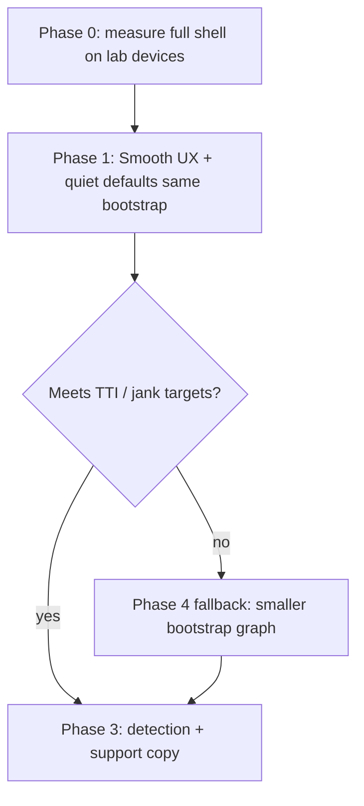
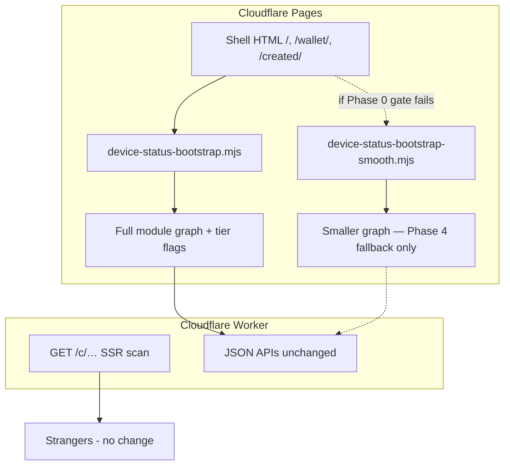

# Device smooth mode plan (low-end mobile)

**Status:** Phase 0 lab **complete (3/3)** — **Phase 1 deferred** (Nord cold boot only; boot-graph investigation next)  
**Audience:** Product, frontend, QA, support  
**Opened:** 2026-06-01  
**Gate:** [`DEVICE_SMOOTH_MODE_PHASE0_GATE.md`](DEVICE_SMOOTH_MODE_PHASE0_GATE.md)
**Related:** [`DEVICE_OS.md`](DEVICE_OS.md) · [`DEVICE_OS_REQUEST_BUDGET.md`](DEVICE_OS_REQUEST_BUDGET.md) · [`SAFARI_PERFORMANCE_AND_REFRESH_INVESTIGATION.md`](SAFARI_PERFORMANCE_AND_REFRESH_INVESTIGATION.md) · [`VISUAL_DEVICE_SHELL.md`](VISUAL_DEVICE_SHELL.md) · [`M3_SCAN_PAGE_UI.md`](M3_SCAN_PAGE_UI.md) · [`SYSTEM_INVARIANTS.md`](SYSTEM_INVARIANTS.md) · [`STEWARD_DEVICE_ROADMAP.md`](STEWARD_DEVICE_ROADMAP.md)

**Filename note:** This file keeps the `DEVICE_LITE_MOBILE_PLAN.md` path for links already in the repo. **Product and support copy must not say “lite.”** Use **Smooth mode** (preferred) or **Basic mode**.

---

## Problem

The steward **device shell** (Pages routes `/`, `/wallet/`, `/create/`, `/created/`) is built for modern mobile Safari and Chrome. On **less capable phones** — older iOS/Android WebKit, low RAM (≤2–3 GB), slow CPUs, or constrained data — users report:

- Slow first paint and navigation (full ES module graph on every shell page load)
- Scroll/tap jank when hub, inbox, or cross-tab presence is active
- Battery and thermal pressure from background polling when watch / browser alerts are on

These symptoms are documented for Safari generally in [`SAFARI_PERFORMANCE_AND_REFRESH_INVESTIGATION.md`](SAFARI_PERFORMANCE_AND_REFRESH_INVESTIGATION.md). Shell perf mitigations (S1–S12 in [`DEVICE_OS_REQUEST_BUDGET.md`](DEVICE_OS_REQUEST_BUDGET.md)) help **large wallets on capable devices** but do not change all **automatic background work** on every steward session.

**Phase 0 lab note (2026-06-01):** On **OnePlus Nord N200 5G** (4 GB RAM, Android 12, ~$100, Chrome on production), **steady-state** hub scroll and `/created/` Live were acceptable with 1–4 saved cards; **cold first hub open** was jumpy. That pattern points at **bootstrap / first paint**, not ongoing Smooth-tier quiet-defaults work — see gate doc before investing in Phase 1.

**Strangers scanning QR codes are out of scope.** The public scan surface is already Worker SSR with a bounded bundle ([`M3_SCAN_PAGE_UI.md`](M3_SCAN_PAGE_UI.md)). Smooth mode targets **steward custody and control**, not scan trust UI.

---

## Product naming

| Context | Use | Do not use |
|---------|-----|------------|
| Settings toggle, banners, support macros | **Smooth mode** (preferred) or **Basic mode** | “Lite,” “low-end mode,” “dumbed down” |
| Engineering (`localStorage`, CSS, filenames) | `hc_shell_tier = "smooth"` · `data-shell-tier="smooth"` · optional legacy `"lite"` alias during migration | User-visible “lite” strings |
| This doc / roadmap index | “Smooth mode plan” with filename alias above | Implying fewer product capabilities by default |

**Why:** “Lite” sounds like missing features or a worse product. Smooth mode means **the same stewardship job, calmer UI, quieter background defaults** — not a downgrade of keys, signing, or restore.

---

## Product sentence

> **Standard mode** = today’s full device OS (rich hub, inbox, cross-tab safety, opt-in watch, PWA, hosted push).  
> **Smooth mode** = **same keys and network truth, same core flows** (create, save, sign live proof, restore) with a **more basic UX** and **quiet background defaults** so less capable phones stay responsive. Heavy features stay **available**; they are not on by default and may warn about battery or slowness.

Smooth mode is **not** a separate app, not a native wrapper, and not a downgrade of cryptographic or resolver invariants.

---

## Strategy (locked)

Implement in this order:

1. **UX simplification** — plainer hub, opaque cards, minimal motion, simpler lists (same routes, same HTML pages).
2. **Quiet background defaults** — throttle or manual-ize expensive work (network auto-refresh, cross-tab heartbeat, watch, SW) **before** removing capabilities.
3. **Separate bootstrap graph** — **only if** steps 1–2 fail Phase 0 lab targets on target devices. Phase 0 measurement decides; do not build a second graph preemptively.



---

## Current architecture (reference)

Two layers stay separate ([`DEVICE_OS.md`](DEVICE_OS.md) § What we mean by “device OS”):

| Layer | Host | Routes | Load model |
|-------|------|--------|------------|
| **Network (public truth)** | Cloudflare Worker + D1 | `GET /c/{profile_id}?q=…`, JSON APIs | SSR HTML for scan; no device shell graph |
| **Device (browser shell)** | Cloudflare Pages (static) | `/`, `/wallet/`, `/create/`, `/created/`, `/shop/…` | Multi-page static HTML + JS bootstrap |

### Device shell bootstrap today

Every shell page loads `device-status-bootstrap.mjs` → inner graph → **`device-status.mjs`**, which statically pulls **~70 modules** listed in `DEVICE_STATUS_SHELL_JS_FILES` (`site/js/device-status-shell-modules.mjs`). That graph includes status dot, hub sheet, inbox, cross-tab presence, wallet network refresh, live-proof poll leader, browser notifications loader, PWA/hosted modules, and chrome refresh.

Cache bust: single `DEVICE_SHELL_ASSET_VERSION` on bootstrap and every peer import ([`STATUS_DOT_LOAD_FAILURE_POSTMORTEM.md`](STATUS_DOT_LOAD_FAILURE_POSTMORTEM.md)).

### What already reduces cost (not smooth mode)

| Mitigation | Doc / code | Smooth mode builds on |
|------------|------------|------------------------|
| Lazy inbox / notifications loaders | S5 | Keep lazy; add tier-aware deferral |
| Wallet summary hot paths, DOM caps | S8–S12 | Same caps in smooth UX |
| Collapsed hub skips network fetch | N1 | Default collapsed + manual refresh in smooth |
| Scan page separate bundle | `worker:bundle-scan` | Unchanged |
| `prefers-reduced-motion` / reduced transparency | `UI_COLOR_SCHEME_STANDARD.md` | **Always apply** in smooth tier |

---

## Locked decisions (planning)

| Topic | Decision |
|-------|----------|
| User-facing name | **Smooth mode** (alt: **Basic mode**) — never “lite” in product copy |
| Feature parity | **Same capabilities reachable** — watch, alerts, inbox detail, PWA, hosted session; smooth changes **defaults and UX**, not the product map |
| Implementation priority | **UX simplification + quiet background defaults first**; cut features or split bootstrap **only after Phase 0 fails** |
| Stranger scan UX | **Unchanged** — Worker scan page remains canonical |
| Keys & verification | **Same** — `hc_wallet`, `hc_created`, signing on `/created/` |
| Smooth vs standard data | **Same localStorage keys** — switch modes without re-import |
| Smooth default | **Opt-in or suggest with explicit confirm** — never silently strand a power user |
| Shop / merch | **Unchanged** — static pages; no shell graph |

---

## Standard vs smooth (capability matrix)

**Intent:** Smooth mode keeps **most or all functionality**; differences are **UX and defaults**, not a separate product.

| Capability | Standard mode | Smooth mode (target) |
|------------|---------------|----------------------|
| Create root card | Yes | Yes |
| Save to wallet | Yes | Yes |
| `/created/` signing + live proof | Yes | Yes |
| Restore / import | Yes | Yes — same paths, plainer hub section |
| Hub: saved cards | Full sheet + motion | **Flat list**, no spring animation |
| Hub: pins, search, activity | Full | Yes — **simpler layout**; same data |
| Inbox badge + detail | Sheet + diagnostics | **Short list first**; full detail on tap |
| Cross-tab keys warnings | Continuous presence | **On visibility / user action**; optional lighter heartbeat |
| Watch for live proof | Opt-in | **Off by default**; user can enable with battery note |
| Browser alerts + SW | Opt-in | **Off by default**; user can enable with battery note |
| PWA install prompt | Shown when eligible | **Deferred** until user opens “Add to Home Screen” |
| Wallet network refresh | Auto debounced | **Manual “Check network” default**; optional auto in settings |
| Hosted session / push | Full | Session link yes; **SSE off by default**; user can enable |
| Visual polish | Glass, motion | **Opaque cards, minimal motion** |

**Non-negotiable in smooth mode:** status dot opens hub, live proof signing works, restore/import reachable ([`OWNERSHIP_RESTORE_UX_PLAN.md`](OWNERSHIP_RESTORE_UX_PLAN.md) § Locked decisions).

### Quiet background defaults (Phase 1 core)

When `hc_shell_tier === "smooth"`, prefer **manual or visibility-gated** work over timers:

| Subsystem | Standard | Smooth default |
|-----------|----------|----------------|
| Hub/wallet network fetch | Debounced auto | Manual **Check network**; optional auto toggle |
| Cross-tab presence | ~10s heartbeat | Coalesce; skip when tab hidden; longer interval |
| Live-proof poll leader | Hub + watch paths | **`/created/` tab visible**; watch opt-in re-enables leader |
| Browser notifications SW | When alerts on | Register only after explicit opt-in |
| Chrome refresh | Debounced on storage | Same debounce, **skip when hidden** where safe |

Features remain in settings with plain copy: *“Uses more battery on older phones.”*

---

## Architecture paths

### Path 1 — Same bootstrap, tier flags (Phase 1 — **default plan**)

Single `device-status-bootstrap.mjs`; early read of `hc_shell_tier` sets `document.documentElement.dataset.shellTier = "smooth"` and gates behavior in shared modules (`device-chrome-refresh.mjs`, `device-tab-presence.mjs`, hub renderers).

| Artifact | Role |
|----------|------|
| `device-shell-tier.mjs` | Read/write `hc_shell_tier`, settings UI, product copy |
| `device-shell-tier-core.mjs` | Pure helpers: `isSmoothTier()`, quiet-default policy |
| CSS `[data-shell-tier="smooth"]` | Opaque cards, no sheet spring, flat hub |
| Tier-aware branches in existing modules | Throttle presence, defer SW, manual network default |

**Pros:** One graph to maintain; true “same functionality, basic UX.”  
**Cons:** Does not reduce initial JS parse size; may be insufficient on weakest lab devices.

### Path 2 — Separate bootstrap graph (Phase 4 — **fallback only**)

Add parallel entry **only if Phase 0 lab gate fails** after Path 1 ships:

| Artifact | Role |
|----------|------|
| `device-status-bootstrap-smooth.mjs` | Thin static import |
| `device-status-smooth.mjs` | Smaller static graph (~15–25 modules) |
| `DEVICE_STATUS_SHELL_SMOOTH_JS_FILES` | CI list + Vitest |

**Gate (Phase 0):** If smooth UX + quiet defaults on **same bootstrap** do not meet § Success metrics on lab low-end devices, implement Path 2. **Do not start Path 2 before measurement.**

### Path 3 — Duplicate HTML tree (`/lite/…`)

**Rejected** — highest drift risk; not planned unless Path 1 and 2 both fail (unlikely).



---

## Detection and routing

### Signals (combine; no single signal is sufficient)

| Signal | Use |
|--------|-----|
| User choice | Settings **Smooth mode** → `localStorage.hc_shell_tier = "smooth"` |
| `navigator.deviceMemory` ≤ 2 | Suggest smooth banner (where available) |
| `Connection.saveData` or slow effectiveType | Suggest smooth |
| Manual query | `?smooth=1` for support (alias `?lite=1` internal only) |
| Performance entry | First shell boot > N ms → one-time offer (**not** auto-switch) |

### Routing rules

1. On shell boot, read `hc_shell_tier` (`standard` | `smooth`; treat legacy `"full"` / `"lite"` as aliases during migration).
2. Set `data-shell-tier`; apply Path 1 behavior. Load Path 2 bootstrap **only** when flag + Phase 4 shipped.
3. Settings: **Use smooth mode** ↔ **Use standard mode** — no scary “lite” label.
4. **Never** auto-switch mid-session without user confirm.
5. Support macros: “Try Smooth mode in Settings” — not “enable lite.”

Do **not** use User-Agent sniffing as the primary gate.

---

## CSS and visual tier

Smooth tier uses existing `device-shell.css` with `[data-shell-tier="smooth"]`:

- Opaque emphasis cards ([`UI_COLOR_SCHEME_STANDARD.md`](UI_COLOR_SCHEME_STANDARD.md) reduced-transparency path)
- Hub as flat list or simplified panel — not animated sheet stack
- `prefers-reduced-motion` behavior **always on** for smooth tier
- Fixed chrome inset unchanged (dot tap target)

Scan bundle CSS unchanged.

---

## Implementation phases

### Phase 0 — Measure + decide (no user-facing change)

| Deliverable | Proof |
|-------------|-------|
| This doc + roadmap index | Review |
| Baseline: TTI, scroll jank, module transfer size on full shell | `npm run device-smooth:phase0` · [`DEVICE_SMOOTH_MODE_PHASE0_GATE.md`](DEVICE_SMOOTH_MODE_PHASE0_GATE.md) |
| Device lab matrix: 3 low-end + 3 mid + P0-W WebKit | [`DEVICE_OS_QA.md`](DEVICE_OS_QA.md) § **P0-SMOOTH** |
| **Gate document:** Path 1 sufficient? Y/N on lab devices | [`DEVICE_SMOOTH_MODE_PHASE0_GATE.md`](DEVICE_SMOOTH_MODE_PHASE0_GATE.md) sign-off |

### Phase 1 — Smooth UX + quiet defaults (same bootstrap) **← deferred pending lab**

**Gate (2026-06-01):** Do **not** start until [`DEVICE_SMOOTH_MODE_PHASE0_GATE.md`](DEVICE_SMOOTH_MODE_PHASE0_GATE.md) matrix complete or product reopens scope. Nord N200 row suggests Phase 1 may **not** address the observed cold-hub pain.

| In scope | Out of scope |
|----------|--------------|
| `device-shell-tier.mjs` + settings copy (**Smooth mode**) | Second bootstrap graph |
| `[data-shell-tier="smooth"]` CSS | Removing watch/alerts from settings |
| Quiet defaults table (§ above) in tier-aware modules | Forced auto-smooth |
| Flat hub presentation option | Duplicate HTML routes |

**Regression:**

```bash
npm run worker:test -- worker/tests/device-status-shell-modules.test.ts
npm run worker:test:shell-boot
npm run e2e -- e2e/device-status-dot.spec.ts e2e/device-inbox.spec.ts
```

Re-measure lab devices against § Success metrics. **If pass → skip to Phase 3.** If fail → Phase 4.

### Phase 2 — Parity validation on smooth tier

| In scope | Out of scope |
|----------|--------------|
| E2E: live proof, restore, watch opt-in, alerts opt-in on smooth | New feature cuts |
| Copy: battery warnings on heavy opt-ins | PWA redesign |

**Regression:** `npm run ownership-restore:verify` · `e2e:key-loss-sad-path` · `e2e:live-control-loop` with `hc_shell_tier=smooth`.

### Phase 3 — Detection UX + support

| In scope | Out of scope |
|----------|--------------|
| Suggest **Smooth mode** banner on weak signals | Forced auto-smooth |
| Support macros + ops snippet | User-visible “lite” |
| Optional capabilities field `shell_tiers: ["standard","smooth"]` | Worker HTML variant |

### Phase 4 — Smaller bootstrap graph (**fallback only**)

Implement **only when Phase 0 gate fails after Phase 1** on lab devices.

| In scope | Out of scope |
|----------|--------------|
| `device-status-bootstrap-smooth.mjs`, `DEVICE_STATUS_SHELL_SMOOTH_JS_FILES` | Feature removal beyond quiet defaults |
| Modules omitted: heavy coordinator paths if provably unused in smooth | Duplicate `/created/` HTML tree |

See § Smooth graph allowlist (fallback) below.

### Phase 5 — Shared core extraction (ongoing)

Refactor tier-agnostic cores so Path 1 and optional Path 2 share wallet, dot, and hub row modules.

---

## Smooth graph allowlist (Phase 4 fallback only)

Do **not** implement until Phase 0 gate fails. Internal filenames may use `smooth` or `lite` suffix; product copy stays **Smooth mode**.

**Likely included:** dot boot, status core, wallet read paths, hub list, tier module, manual resolver health, chrome refresh (lite).

**Likely omitted vs full graph:** full cross-tab coordinator loop, poll leader when smooth defaults apply, diagnostics sheet, optional push/SW until user opt-in.

`/created/` page scripts remain page-local; smooth tier adjusts **when** hub-side poll leader and SW sync run, not whether signing works.

---

## Invariants and non-goals

| Invariant | Smooth mode behavior |
|-----------|----------------------|
| Dot opens hub on `/`, `/created/` | Yes |
| Red ring = total status graph failure | Yes |
| Stranger scan never loads device shell | Unchanged |
| Free tier 400 auto-poll/day cap | Still applies when user opts into watch/auto refresh |
| Core flows parity | Create, save, sign, restore **must** work in smooth mode |

**Non-goals:**

- Marketing a “lite product” with missing stewardship features
- Removing standard mode on capable devices
- Server-side rendering of steward shell
- Native app replacement ([`STEWARD_DEVICE_ROADMAP.md`](STEWARD_DEVICE_ROADMAP.md))

---

## Success metrics

| Metric | Phase 1 target (same bootstrap) | Phase 4 add-on if gate fails |
|--------|----------------------------------|------------------------------|
| Time to interactive on lab low-end | ≤ **50%** of standard median | Further ≤ **25%** vs standard |
| Scroll jank (hub open, 10 saved cards) | Subjective pass on 3 lab devices | Same |
| Live proof sign flow | Same pass rate as standard on `e2e:live-control-loop` | Same |
| Feature opt-in | Watch/alerts reachable in settings | Same |
| Support tickets “phone too slow” | Track before/after Smooth mode offer | Same |

---

## QA checklist (draft P1-SMOOTH)

Add to [`DEVICE_OS_QA.md`](DEVICE_OS_QA.md) when Phase 1 ships:

1. Enable **Smooth mode** in settings; hard refresh — `data-shell-tier="smooth"`, no user-visible “lite.”
2. Dot opens hub; flat/simple presentation; saved card opens `/created/`.
3. Live proof sign completes.
4. **Check network** manual refresh works; auto refresh off by default.
5. Opt in to watch / browser alerts — flows work; battery copy shown.
6. Import recovery code from hub restore section.
7. Switch to **Standard mode** — full UX returns without wallet loss.
8. Scan page `/c/…` — no shell regression.

**Lab devices:** iPhone SE 2nd gen class + one Android Go-class device.

---

## Doc maintenance

When smooth mode ships:

1. Add invariant rows to [`SYSTEM_INVARIANTS.md`](SYSTEM_INVARIANTS.md) § Device shell (tier selection, quiet defaults).
2. Update [`DEVICE_OS.md`](DEVICE_OS.md) if placement differs by tier.
3. Update [`STEWARD_DEVICE_ROADMAP.md`](STEWARD_DEVICE_ROADMAP.md) — user-facing name **Smooth mode**.
4. Trim ops “close tabs / hard refresh” guidance in [`SAFARI_PERFORMANCE_AND_REFRESH_INVESTIGATION.md`](SAFARI_PERFORMANCE_AND_REFRESH_INVESTIGATION.md) where Smooth mode replaces it.

---

## Changelog

| Date | Note |
|------|------|
| 2026-06-02 | **Phase 0 lab 3/3** — iPhone SE class + Android Go pass; Nord cold hub only outlier · Phase 1 still deferred · [`DEVICE_SMOOTH_MODE_PHASE0_GATE.md`](DEVICE_SMOOTH_MODE_PHASE0_GATE.md) |
| 2026-06-01 | **Phase 0 lab row 1** — Nord N200 5G: cold hub jumpy, steady-state OK; **Phase 1 deferred** · [`DEVICE_SMOOTH_MODE_PHASE0_GATE.md`](DEVICE_SMOOTH_MODE_PHASE0_GATE.md) |
| 2026-06-01 | **Phase 0 started** — baseline script, snapshot, P0-SMOOTH QA, gate doc · `npm run device-smooth:phase0` |
| 2026-06-01 | Initial plan — architecture reference, phased delivery |
| 2026-06-01 | **Strategy lock:** product name Smooth/Basic mode; UX + quiet defaults first; separate bootstrap only if Phase 0 lab gate fails |
