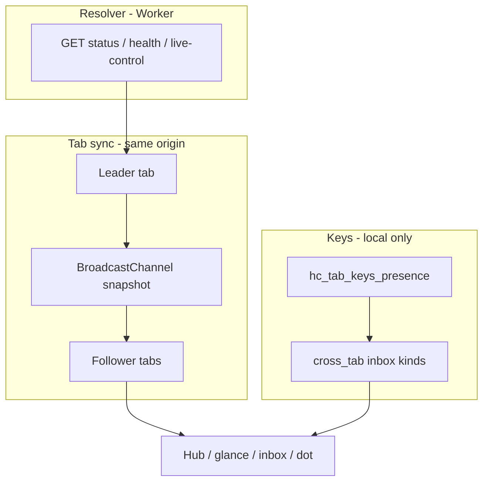

# Device tab resolver sync

**Status:** Phases 1a–1b and 2 (toggle) shipped; E2E follow-up open  
**Audience:** Product, frontend  
**Opened:** 2026-05-27  
**Related:** [`DEVICE_OS_REQUEST_BUDGET.md`](DEVICE_OS_REQUEST_BUDGET.md) · [`CROSS_TAB_KEYS_NOTIFICATION_SYSTEM.md`](CROSS_TAB_KEYS_NOTIFICATION_SYSTEM.md) · [`KEYS_CARDS_AND_VERIFICATION.md`](KEYS_CARDS_AND_VERIFICATION.md) · [`DEVICE_HUB_AND_LOCAL_SEARCH.md`](DEVICE_HUB_AND_LOCAL_SEARCH.md) · [`UI_UX_REVERTED_FEATURES_CATALOG.md`](UI_UX_REVERTED_FEATURES_CATALOG.md) · [`HOSTED_TIER_PUSH_ARCHITECTURE_RFC.md`](HOSTED_TIER_PUSH_ARCHITECTURE_RFC.md)

---

## Summary

When a steward opens **multiple tabs** on the same origin, each tab can poll the resolver independently. **Network status** (`GET …/status?q=…`) and **in-memory poll truth** (`device-wallet-network-truth.mjs`) live in **per-tab `sessionStorage`**, so hub rows, glance, and card-disabled inbox can disagree until every tab refetches.

**Resolver tab sync** shares **public poll results** across tabs on **this device** so followers update chrome without duplicate Worker bursts. It does **not** sync signing keys, wallet blobs, or anything across devices.

**Product home (phase 2):** optional row on homepage **Shortcuts & settings** plus hub **Check network** coordinating a one-shot “refresh all tabs.”

---

## What this is (and is not)

| User might say | Meaning | Mechanism |
|----------------|---------|-----------|
| “Sync tabs with the resolver” | One tab checked the network; others should match | Leader broadcasts **network snapshot**; followers merge cache + fire `NETWORK_REFRESHED` |
| “Sync tabs” (ambiguous) | Keys in another tab | **Cross-tab keys** — [`CROSS_TAB_KEYS_NOTIFICATION_SYSTEM.md`](CROSS_TAB_KEYS_NOTIFICATION_SYSTEM.md) (local only) |
| “Sync my phone and laptop” | Multi-device wallet | **Out of scope** — export/import or create/save per device ([`KEYS_CARDS_AND_VERIFICATION.md`](KEYS_CARDS_AND_VERIFICATION.md)) |
| “Always live” dashboard | Background monitoring | **Out of scope** — opt-in watch + scoped polls ([`DEVICE_OS_REQUEST_BUDGET.md`](DEVICE_OS_REQUEST_BUDGET.md)) |

**Product sentence:** *When you check the network on this device, other open tabs can show the same **checked … ago** and disabled-card alerts without each tab hitting the resolver again.*

---

## Three layers (extend cross-tab model)

[`CROSS_TAB_KEYS_NOTIFICATION_SYSTEM.md`](CROSS_TAB_KEYS_NOTIFICATION_SYSTEM.md) defines **presence → inbox → chrome** for **keys**. Add a parallel column for **resolver truth**:



| Layer | Storage / transport | Worker? |
|-------|---------------------|---------|
| Keys custody | `sessionStorage` + `localStorage` presence + `hc-tab-keys-custody` BC | No |
| Resolver polls | Leader tab only (when sync on) | Yes |
| Tab sync | `hc-resolver-sync` BC + optional `localStorage` pref | No (payload is poll *results*) |

**Never** put private keys, `hc_created` payloads, or full `hc_wallet` JSON on the sync channel.

---

## Relationship to shipped leader tab (live proof)

[`device-live-control-poll-leader.mjs`](../site/js/device-live-control-poll-leader.mjs) already elects a leader for **live-control auto poll** and broadcasts `LiveControlLeaderSnapshot` on `hc-live-control-poll-leader`.

| Concern | Live-control leader (shipped) | Resolver network sync (this spec) |
|---------|------------------------------|-----------------------------------|
| Channel | `hc-live-control-poll-leader` | `hc-resolver-sync` (new) |
| Payload | Pending challenges, health coarse | Per-`profile_id` status, `scan.kind`, `at`, resolver-confirmed flags |
| Follower behavior | Apply inbox pending state | Merge `hc_wallet_network_cache` + truth + `NETWORK_REFRESHED` |
| Leader lock key | `hc_live_control_poll_leader` | Reuse **same** lock record **or** separate `hc_resolver_sync_leader` (implementation choice; prefer **one unified leader** tab for all auto Worker work — see § Leader election) |

**Recommendation:** One **device poll leader** tab per origin (extend existing lock + heartbeat) with **typed** BC messages (`live-control-snapshot`, `network-snapshot`, `health-snapshot`). Avoid two competing locks that fight on Safari with many tabs.

---

## User-facing controls (phase 2)

### Shortcuts & settings (homepage `/` only)

| Control | `localStorage` | Default | Copy (draft) |
|---------|----------------|---------|--------------|
| **Share network checks across tabs** | `hc_resolver_sync_tabs` | `"1"` (on) | Sub: *Other open tabs use the same last check on this device* |
| (optional) **Refresh all open tabs** | — (action) | — | Sub: *One network check, then update every tab* — triggers manual sync (§ Manual refresh) |

Placement: after **Browser alerts**, before **My cards** in `#landing-device-settings` ([`DEVICE_HUB_AND_LOCAL_SEARCH.md`](DEVICE_HUB_AND_LOCAL_SEARCH.md)).

### Hub network tools

When sync is on, **Check network** on the leader tab should call `broadcastNetworkSnapshot()` after `refreshWalletNetworkStatuses` completes. Hub subcopy can note *Shared with other tabs on this device* when `document.visibilityState === "visible"` and follower count &gt; 0 (optional; do not query Worker for tab count).

**Watch for live proof** stays independent ([`device-hub-network-tools-core.mjs`](../site/js/device-hub-network-tools-core.mjs)); sync does not enable auto polling.

---

## Leader election

Reuse semantics from [`device-live-control-poll-leader-core.mjs`](../site/js/device-live-control-poll-leader-core.mjs):

- Lock in `localStorage` with `{ tabId, at }`, stale after **20s** without heartbeat.
- `pagehide` releases lock if this tab owns it.
- Visible leader renews lock on poll / manual refresh.

**Vacant or stale lock:** tab may poll and become leader.

**Follower:** does not call `refreshWalletNetworkStatuses` for auto paths while snapshot `at` is within **TTL** (see below).

---

## BroadcastChannel protocol

**Channel name:** `hc-resolver-sync`

All messages are JSON-serializable plain objects. Ignore unknown `type` values.

### `network-snapshot` (primary)

Emitted by leader after a successful scoped network refresh (manual **Check network**, hub expand refresh, visibility debounce refresh — only when this tab was the fetcher).

```ts
// conceptual — implement in device-resolver-sync-core.mjs
type NetworkSnapshotMessage = {
  type: "network-snapshot";
  tabId: string;           // leader tab id (hc_live_control_poll_tab_id or shared tab id)
  at: number;              // Date.now() when poll completed
  origin: string;          // resolver API origin used for GETs
  entries: Array<{
    profile_id: string;
    status: string;        // chip status key
    scanKind: string | null;
    verification?: { label?: string; state?: string } | null;
    cachedAt: number;      // per-row poll time for "checked … ago"
    resolverConfirmed: boolean;
    alertState?: string | null;
  }>;
};
```

**Follower handling:**

1. If `hc_resolver_sync_tabs === "0"` → ignore.
2. If `origin` ≠ this tab’s `resolverApiOrigin()` → ignore.
3. Merge each row into `sessionStorage.hc_wallet_network_cache` (preserve TTL rules in [`device-wallet-network-core.mjs`](../site/js/device-wallet-network-core.mjs)).
4. Call the same truth + baseline helpers as a local poll (`syncWalletNetworkTruthFromPoll` equivalent for snapshot rows only).
5. Dispatch `NETWORK_REFRESHED` with maps built from merged state (same contract as [`device-wallet-network.mjs`](../site/js/device-wallet-network.mjs) `notifyNetworkRefreshed`).
6. `refreshDeviceChrome({ immediate: true })` — one coalesced tick ([`device-chrome-refresh.mjs`](../site/js/device-chrome-refresh.mjs)).

**Do not** re-run full `loadWallet()` parse on followers beyond what `NETWORK_REFRESHED` listeners already do; watch shell perf at large N ([`DEVICE_OS_REQUEST_BUDGET.md`](DEVICE_OS_REQUEST_BUDGET.md) § Open issues §2).

### `health-snapshot` (optional, phase 1b)

```ts
type HealthSnapshotMessage = {
  type: "health-snapshot";
  tabId: string;
  at: number;
  status: "ok" | "degraded" | "offline";
};
```

Follower updates in-memory health used by dot / poll gates without `fetchResolverHealth` if `at` within **30s**. Manual **Retry** on dot still fetches locally.

### `live-control-snapshot`

**Do not duplicate** — keep using `hc-live-control-poll-leader` until unified channel migration (phase 3 optional).

---

## TTL and staleness

| Field | TTL | Behavior |
|-------|-----|----------|
| `network-snapshot.at` | **60s** | Follower skips auto `refreshWalletNetworkStatuses` if fresher (align visibility debounce in hub) |
| Per-row `cachedAt` | Existing `WALLET_NETWORK_CACHE_TTL_MS` (~5 min) | Row still expires independently |
| Manual **Check network** | Bypass TTL | Leader always polls; always broadcasts |
| bfcache `pageshow` persisted | Existing | Follower clears in-memory truth ([`device-wallet-network.mjs`](../site/js/device-wallet-network.mjs)); may need local poll if snapshot older than TTL |

If leader tab closes, lock goes stale; another tab polls on next user intent — no background election loop.

---

## Manual refresh (“refresh all tabs”)

1. Claim or assert leader.
2. Run **one** `refreshWalletNetworkStatuses` with same options as hub manual check (respect `walletNetworkMaxParallel` — leader only).
3. `broadcastNetworkSnapshot` + existing `NETWORK_REFRESHED` on leader.
4. Followers apply snapshot (step 2–6 above) — no extra GETs.

**Budget:** 1× N status GETs (capped parallelism), not N tabs × N.

---

## Auto sync (phase 1a — no new UI)

When `hc_resolver_sync_tabs` is unset or `"1"`:

- After leader completes any network refresh that already fires `NETWORK_REFRESHED`, broadcast snapshot.
- Followers with fresh snapshot skip their own debounced visibility refresh **fetch** (still run chrome if wallet/presence changed).

When `"0"`: behavior matches today (per-tab session cache).

---

## Request budget guardrails

| Rule | Rationale |
|------|-----------|
| Followers **never** auto-fetch status while snapshot fresh | Prevents multi-tab 1027 regression ([`UI_UX_REVERTED_FEATURES_CATALOG.md`](UI_UX_REVERTED_FEATURES_CATALOG.md) §3) |
| Do **not** re-enable `initDeviceOsCoordinator()` globally | Same |
| Live-control auto poll stays leader + round-robin | Unchanged |
| Manual check unlimited | Same as today |
| Snapshot excludes private fields | Security |

**QA extension:** [`DEVICE_OS_QA.md`](DEVICE_OS_QA.md) **P1-1** — two tabs, focus follower: expect **zero** new status GETs within 60s after leader checked.

---

## Module layout (proposed)

| Module | Responsibility |
|--------|----------------|
| `device-resolver-sync-core.mjs` | Pure: `parseNetworkSnapshotMessage`, `shouldFollowerSkipNetworkFetch`, `mergeNetworkSnapshotIntoCache` |
| `device-resolver-sync.mjs` | Browser: `initResolverTabSync`, `broadcastNetworkSnapshotIfEligible`, `shouldFollowerSkipAutoNetworkFetch` |
| `device-resolver-sync-prefs.mjs` | Toggle UI for landing settings (phase 2) |

**Integration points (shipped):**

- [`device-wallet-network.mjs`](../site/js/device-wallet-network.mjs) — `applyResolverNetworkSnapshot`, cache load/save helpers.
- [`device-hub-ui.mjs`](../site/js/device-hub-ui.mjs) — `broadcastNetworkSnapshotIfEligible` after poll `onDone`; `shouldFollowerSkipAutoNetworkFetch` before auto refresh.
- [`device-status.mjs`](../site/js/device-status.mjs) — `initResolverTabSync()` at shell bootstrap (health snapshot: phase 1b).
- Shell manifest — add modules to [`device-status-shell-modules.mjs`](../site/js/device-status-shell-modules.mjs) when shipped; bump `DEVICE_SHELL_ASSET_VERSION`.

---

## Phased delivery

### Phase 1a — Auto network snapshot (no UI)

- [x] `device-resolver-sync-core.mjs` + Vitest `worker/tests/device-resolver-sync.test.ts`
- [x] `device-resolver-sync.mjs` + wire broadcast from `refreshWalletNetworkStatuses` completion
- [x] Follower skip + apply + `NETWORK_REFRESHED`
- [x] Default on (`hc_resolver_sync_tabs` missing → on)
- [ ] **P1-1** multi-tab case in QA (manual / E2E follow-up)

### Phase 1b — Health snapshot (optional)

- [x] `health-snapshot` message + follower gate for `fetchResolverHealth` (30s TTL; dot **Retry** bypasses)

### Phase 2 — Shortcuts & settings

- [x] Toggle in `site/index.html` + `device-resolver-sync-prefs.mjs` (homepage `/` only)
- [x] Subtitle reflects on/off
- [ ] Manual “Refresh all tabs” row — **deferred**; hub **Check network** already broadcasts to open tabs

### Phase 3 — Unified poll leader (optional refactor)

- [ ] Single lock + channel for live-control + network (reduce lock contention)

### Phase 4 — Hosted push (future)

- Leader tab holds SSE ([`HOSTED_TIER_PUSH_ARCHITECTURE_RFC.md`](HOSTED_TIER_PUSH_ARCHITECTURE_RFC.md)); snapshot may include push-derived pending state — **do not** block phase 1 on push.

---

## Failure modes

| Symptom | Cause | Mitigation |
|---------|-------|------------|
| Follower shows stale “checked … ago” | Snapshot TTL expired; no leader | Follower polls on hub expand / manual check |
| Tabs disagree on card-disabled banner | Follower applied cache without `resolverConfirmed` | Snapshot must include `resolverConfirmed` + truth merge identical to poll path |
| Safari jank with 6 tabs | BC + `NETWORK_REFRESHED` × 6 | Coalesce follower apply (single `refreshDeviceChrome` per message); ignore duplicate snapshots same `at` |
| `BroadcastChannel` missing | Old WebView | Degrade to per-tab polls (today) |
| Private window | Separate origin storage profile | No sync (expected) |

---

## Tests

| Test | File |
|------|------|
| Message parse + TTL | `worker/tests/device-resolver-sync.test.ts` |
| Follower skip when fresh | same |
| Merge does not drop resolver-confirmed revoke | same + existing `wallet-network-baseline` tests |
| E2E two-tab manual check → one burst | `e2e/device-resolver-sync.spec.ts` (phase 1a) |
| Toggle off → two bursts | e2e (phase 2) |

---

## Changelog

| Date | Note |
|------|------|
| 2026-05-27 | Initial spec |
| 2026-05-27 | Phase 1a shipped — `device-resolver-sync*.mjs`, hub follower skip, shell manifest v51 |
| 2026-05-26 | Phase 1a: `device-resolver-sync*.mjs`, hub follower skip, shell manifest v51 |
| 2026-05-27 | Phase 1a shipped — `device-resolver-sync*.mjs`, shell v51 |
| 2026-05-27 | Phase 1b health snapshot + Phase 2 landing toggle |
