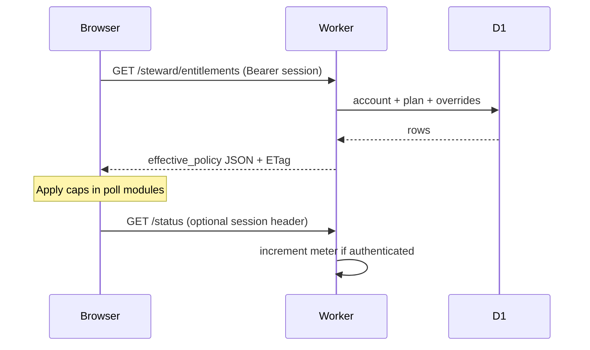

# Hosted tier — entitlements & metering (M2)

**Status:** **Planning spec** — defines fields, APIs, and enforcement points; **no implementation**  
**Milestone:** M2 of [`PAID_TIER_AND_HOSTED_OPERATOR_PLAN.md`](PAID_TIER_AND_HOSTED_OPERATOR_PLAN.md)  
**Audience:** Engineering, ops, governance (billing M4 consumes this)  
**Parent:** [`PAID_TIER_AND_HOSTED_OPERATOR_PLAN.md`](PAID_TIER_AND_HOSTED_OPERATOR_PLAN.md) · [`DEVICE_OS_REQUEST_BUDGET.md`](DEVICE_OS_REQUEST_BUDGET.md) § Phase 10 — hosted tier rows (M7)

---

## Summary

This document specifies **what the operator stores**, **what the browser requests**, and **what gets counted** when a steward has a **hosted** (paid) plan versus the **free reference** defaults shipped in Phases 1–9.

Goals:

1. **Server-authoritative limits** — clients may cache hints; enforcement and billing use operator truth.
2. **Map 1:1 to shipped free-tier constants** — so E2/E3 implementation replaces magic numbers with resolved policy.
3. **Meter without surveilling** — count infrastructure events, not scans, strangers, or locations.
4. **Federation-ready** — same schema per `operator_id`; reference operator is first consumer.

**Out of scope (M2):** Stripe webhooks, push wire protocol (see M3 [`HOSTED_TIER_PUSH_ARCHITECTURE_RFC.md`](HOSTED_TIER_PUSH_ARCHITECTURE_RFC.md)), UI copy (M5), prices and SLA ([`HOSTED_TIER_PRICING_AND_SLA.md`](HOSTED_TIER_PRICING_AND_SLA.md) M4), D1 table DDL.

---

## Non-goals

| Not in M2 | Where |
|-----------|--------|
| Payment provider integration | M4 / E5 |
| WebSocket / SSE message shapes | [`HOSTED_TIER_PUSH_ARCHITECTURE_RFC.md`](HOSTED_TIER_PUSH_ARCHITECTURE_RFC.md) (M3) |
| New trust labels or scan analytics | Forbidden in parent plan |
| Entitlements that gate **card create** or **public scan** | [`SKEPTIC_FAQ.md`](SKEPTIC_FAQ.md) |
| Per-stranger metering | Policy violation |

---

## Identity model

### Subjects

| Subject | ID format | Role |
|---------|-----------|------|
| **Operator** | `operator_id` string (e.g. `humanity.llc`) | Federation boundary; matches `resolver.operator` in API JSON |
| **Steward account** | `account_id` opaque UUID | Billing + entitlement holder |
| **Device install** | `device_id` opaque UUID | Browser profile / install; caps some counters |
| **Card** | `profile_id` base58 | Cryptographic identity; **not** the billing subject |

**Decision (resolves parent Q3 for planning):** Entitlements attach to **`account_id`**. **Usage counters** attach to **`account_id` + `device_id`** where the shipped client already uses per-device budgets (e.g. 400 auto-poll/day). **Org-level** plans add `org_id` → many `account_id` (Commons Pass future; fields reserved).

### Linking cards to accounts

Stewards prove ownership with **existing crypto**, not new PII:

| Method | When | Rule |
|--------|------|------|
| **Signed link assertion** | Account claims a `profile_id` | Owner key signs `{ account_id, profile_id, exp }`; operator stores row |
| **Implicit link** | First hosted signup after create | Optional convenience; same signature required within 24h of create |
| **No link** | Stranger / scan-only | No account; free-tier limits only on anonymous poll paths |

**Rule:** Metering for `GET …/live-control/challenges` on a `profile_id` **may** attribute to the linked `account_id` when the request presents a valid **steward session** (see § Auth). Unauthenticated polls (stranger scan page) **never** debit steward quota.

### Profile ↔ device (client, unchanged)

`hc_created`, `hc_wallet`, and `hc_watch_live_proof` remain **device-local**. Hosted tier adds **`hc_steward_session`** (planning name) — opaque bearer returned by operator after link/login — used only for entitlement fetch and optional push subscribe.

---

## Plan catalog

Plans are **versioned documents** on the operator. Accounts reference `plan_id` + `plan_version`.

| `plan_id` | Audience | Status |
|-----------|----------|--------|
| `reference_free` | Everyone on reference operator | **Active** (implicit; matches shipped client) |
| `hosted_steward_v1` | Paying stewards | **Planning** |
| `hosted_org_v1` | Orgs (future) | **Reserved** |

Federated operators MAY define additional `plan_id` values; clients MUST NOT hard-code reference-only IDs without checking `operator_id`.

---

## Entitlement registry

Canonical keys. Values are typed; missing key → use **`reference_free` default** from § Free-tier baseline.

### Boolean entitlements

| Key | Free default | Hosted `hosted_steward_v1` (planning) | Client module affected |
|-----|--------------|--------------------------------------|-------------------------|
| `steward.hosted` | `false` | `true` | Master gate for paid UX |
| `notify.push.live_proof` | `false` | `true` | M3; enables subscribe endpoint |
| `watch.default_on` | `false` | `false` | Org override only via `org.policy.*` |

### Numeric limits (client enforcement)

| Key | Type | Free default (shipped) | Hosted planning | Notes |
|-----|------|------------------------|-----------------|-------|
| `poll.live_proof.auto_daily_cap` | int | **400** | **4000** | Per `device_id`, UTC day; manual check uncapped |
| `poll.live_proof.idle_ms` | int | **60000** | **30000** | `LIVE_CONTROL_POLL_MS_IDLE` |
| `poll.live_proof.active_ms` | int | **5000** | **5000** | When pending proof |
| `poll.network.max_parallel` | int | **2** (large wallet auto) | **5** | `walletNetworkMaxParallel`; ∞ = omit key |
| `poll.network.manual_max_parallel` | int | **1** (large) | **3** | Manual **Check network** |
| `wallet.large_threshold` | int | **10** | **25** | `LARGE_WALLET_THRESHOLD` |
| `sw.periodic_min_ms` | int | **900000** (15 min) | **300000** (5 min) | SW periodic sync minimum |

Use **`null`** in API JSON for “unlimited within fair use” per [`HOSTED_TIER_PRICING_AND_SLA.md`](HOSTED_TIER_PRICING_AND_SLA.md) § Fair use; client uses **4,000/day/device** until server account soft cap (50k/day).

### Policy flags (org-only, future)

| Key | Default | Notes |
|-----|---------|-------|
| `org.policy.watch_recommended` | `false` | UI hint only; not force |
| `org.policy.watch_default_on` | `false` | Requires governance + consent flow (parent Q4) |

---

## Free-tier baseline (normative for `reference_free`)

These values **must** match shipped code until intentionally changed in a versioned plan migration:

| Constant | Value | Source module |
|----------|-------|---------------|
| Auto live-proof daily cap | 400 | `device-live-control-poll-budget-core.mjs` |
| Large wallet threshold | 10 | `device-wallet-scale-core.mjs` |
| Idle poll interval | 60s | `device-live-control-poll-scheduler.mjs` |
| Active poll interval | 5s | same |
| Network parallel (large, auto) | 2 | `walletNetworkMaxParallel` |
| Network parallel (large, manual) | 1 | same |
| SW periodic minimum | 15 min | `device-live-control-sw-core.mjs` |
| Watch default | off (`hc_watch_live_proof === "1"`) | `device-hub-network-tools-core.mjs` |

**Anonymous traffic** (no steward session): always `reference_free` limits on the client; operator rate-limits by IP (O2).

---

## Effective policy resolution

```text
effective_policy =
  merge(
    plan_defaults(plan_id),
    account_overrides(account_id),   // support grants, trials
    org_policy(org_id)               // future; only org.* keys
  )
```

**Precedence:** `account_overrides` > `org_policy` > `plan_defaults`.

**TTL:** Browser caches `effective_policy` for **≤ 300s** (`Cache-Control` on entitlement response). Critical caps (daily poll) also tracked locally with server reconciliation on fetch.



---

## HTTP API (planning — not implemented)

Base: `/.well-known/hc/v1/` (same origin as resolver). All JSON; CORS for browser.

### `GET /.well-known/hc/v1/steward/entitlements`

**Auth:** `Authorization: Bearer <steward_session_token>`  
**Optional:** `X-HC-Device-Id: <device_id>` (client-generated UUID, first visit stored in `localStorage`)

**Response 200:**

```json
{
  "version": "1.0",
  "operator": { "id": "humanity.llc" },
  "account_id": "acc_…",
  "plan_id": "hosted_steward_v1",
  "plan_version": 1,
  "effective_from": "2026-05-26T00:00:00Z",
  "effective_until": "2027-05-26T00:00:00Z",
  "status": "active",
  "entitlements": {
    "steward.hosted": true,
    "notify.push.live_proof": true,
    "poll.live_proof.auto_daily_cap": 4000,
    "poll.live_proof.idle_ms": 30000,
    "poll.network.max_parallel": 5,
    "wallet.large_threshold": 25,
    "sw.periodic_min_ms": 300000
  },
  "usage": {
    "period": "utc_day",
    "period_key": "2026-05-26",
    "counters": {
      "poll.live_proof.auto": 42,
      "resolver.status.get": 128,
      "resolver.live_control.challenges.get": 42
    },
    "limits": {
      "poll.live_proof.auto": 4000
    }
  }
}
```

**Response 401:** invalid/expired session → client uses **`reference_free`** only (fail closed for paid features, not for card use).

**Response 304:** `ETag` / `If-None-Match` (same pattern as [`conditional-json`](../../worker/src/http/conditional-json.ts)).

**Fields intentionally omitted:** email, name, payment method id (billing lives in payment provider; operator stores `billing_external_id` only in admin DB — not exposed here).

### `POST /.well-known/hc/v1/steward/session`

**Purpose:** Issue `steward_session_token` after profile link signature or refresh.  
**Body (planning):**

```json
{
  "profile_id": "…",
  "device_id": "…",
  "link_proof": {
    "message_type": "steward_account_link_v1",
    "account_id": "acc_…",
    "expires_at": "…",
    "signature": "base64…"
  }
}
```

**Response:** `{ "token": "…", "expires_in": 86400 }`  
**Detail:** [`HOSTED_TIER_TECHNICAL_STANDARDS_DELTA.md`](HOSTED_TIER_TECHNICAL_STANDARDS_DELTA.md) § Signed payload: `steward_account_link_v1`.

### `POST /.well-known/hc/v1/steward/usage/report` (optional)

**Purpose:** Client-reported batch for reconciliation (low trust); operator meters server-side as source of truth.  
**Planning:** Prefer **server-side only** for billing; this endpoint is **diagnostic** only unless M4 requires client reports.

---

## Auth: steward session

| Property | Value |
|----------|--------|
| Format | Opaque bearer token (random 32+ bytes, base64url) |
| Storage (client) | `sessionStorage` preferred (`hc_steward_session`); cleared on site data clear |
| Lifetime | **24h** sliding; refresh with re-link if owner key still in tab |
| Scope | Entitlement read, push subscribe (M3), usage attribution |
| Not a substitute for | Owner signing on `/created/` — `hc_created` still required to prove live control |

**Threat model (planning):**

- Stolen session → raised poll caps until expiry; cannot sign vouches without keys.
- Forged localStorage entitlements → ignored; server caps on authenticated routes when implemented.

---

## Metering

### Principles

1. **Count operator work**, not user behavior (no “scans,” “views,” GPS).
2. **Attribute to `account_id`** when `Authorization` present and profile linked.
3. **Always attribute IP** for abuse (O2); separate from billing.
4. **304 responses** on `status` / `challenges` count as **0.1** unit (or 0) — planning: **0** billable D1-equivalent, **1** request toward Cloudflare quota only.

### Event types

| `meter.event` | Trigger | Billable unit |
|---------------|---------|---------------|
| `resolver.status.get` | `GET …/cards/{id}/status` | 1 per request (after cache miss at edge) |
| `resolver.live_control.challenges.get` | `GET …/live-control/challenges` | 1 |
| `resolver.live_control.challenges.post` | Stranger creates challenge | 1 (stranger; not steward account) |
| `notify.push.delivered` | Push fan-out — [`HOSTED_TIER_PUSH_ARCHITECTURE_RFC.md`](HOSTED_TIER_PUSH_ARCHITECTURE_RFC.md) | 1 per device endpoint |
| `steward.entitlements.get` | Entitlement fetch | 0 (excluded from fair-use) |

### Aggregation windows

| Window | Key | Use |
|--------|-----|-----|
| `utc_day` | `YYYY-MM-DD` | Enforce `poll.live_proof.auto_daily_cap` (align with client `liveControlAutoPollUtcDayKey`) |
| `billing_period` | `period_start` ISO date | M4 invoices; monthly default |
| `rolling_1h` | epoch hour | Abuse / rate limit only |

### Fair use (hosted planning)

When `poll.live_proof.auto_daily_cap` is `null` (unlimited):

| Guardrail | Value (planning) |
|-----------|------------------|
| Soft cap per account / day | 50_000 auto attributed polls |
| Hard cap | 429 + `Retry-After`; ops review |
| Per-IP cap | Independent of account (O2) |

Normative caps: [`HOSTED_TIER_PRICING_AND_SLA.md`](HOSTED_TIER_PRICING_AND_SLA.md) § Fair use (governance sign-off pending).

### Storage (conceptual tables — no DDL)

| Table | Keys | Notes |
|-------|------|-------|
| `steward_accounts` | `account_id`, `plan_id`, `status`, `effective_until` | |
| `steward_account_profiles` | `account_id`, `profile_id`, `linked_at` | Many-to-many |
| `steward_sessions` | `token_hash`, `account_id`, `device_id`, `expires_at` | Store hash only |
| `usage_counters` | `account_id`, `device_id?`, `event`, `window`, `window_key`, `count` | Increment atomically |
| `plan_definitions` | `plan_id`, `version`, `entitlements_json` | Versioned |

**Retention:** usage detail **90 days**; aggregates for billing **13 months** — align with [`REFERENCE_OPERATOR_DATA_POLICY.md`](REFERENCE_OPERATOR_DATA_POLICY.md) governance for rights-affecting retention.

---

## Enforcement points

### Operator (Worker)

| Route | Enforcement |
|-------|-------------|
| `GET …/status` | Optional `Authorization`; increment `resolver.status.get` |
| `GET …/live-control/challenges` | If steward session + linked profile matches `profile_id`, increment `poll.live_proof.auto` server counter; return **429** when over cap (even if client buggy) |
| Entitlement routes | Session required |
| Public card create / scan HTML | **No** entitlement check |

**429 body (planning):**

```json
{
  "error": "steward_quota_exceeded",
  "message": "Daily automatic live-proof check limit reached for this account.",
  "retry_after": 3600,
  "usage": { "poll.live_proof.auto": 4000, "limit": 4000 }
}
```

### Client (device shell)

| Module | Behavior when `entitlements` fetched |
|--------|--------------------------------------|
| `device-live-control-poll-budget-core.mjs` | Use `poll.live_proof.auto_daily_cap` instead of `LIVE_CONTROL_AUTO_POLL_DAILY_CAP` when session valid |
| `device-wallet-scale-core.mjs` | Use `wallet.large_threshold`, `poll.network.*` |
| `device-live-control-poll-scheduler.mjs` | Use idle/active ms from entitlements |
| `device-live-control-sw-core.mjs` | Use `sw.periodic_min_ms`; gate on `notify.push.live_proof` |
| `device-browser-notifications-sw.mjs` | Sync SW only if entitled |

**Fallback:** If entitlement fetch fails or 401, behave as **`reference_free`** (current shipped constants).

### Double enforcement

Client caps protect **shared operator quota**; server caps protect **billing honesty** and malicious clients. Both are required.

---

## Lifecycle: subscribe, change, lapse

| Event | `status` | Client behavior |
|-------|----------|-----------------|
| New subscription | `active` | Fetch entitlements; show hosted features |
| Trial | `trialing` | Same as active with `effective_until` |
| Payment failed | `past_due` | Grace **7 days** at hosted caps, then downgrade |
| Canceled | `canceled` | Hosted until `effective_until` |
| Expired | `expired` | **`reference_free`** immediately |
| Abuse suspend | `suspended` | Free tier + support message |

**Downgrade (parent Q7):** On `expired`, push subscriptions deleted within **24h**; session tokens revoked; **no** effect on cards, keys, or public scan.

---

## Federation

| Field | Rule |
|-------|------|
| `operator.id` in entitlement JSON | Must match request host’s operator |
| Cross-operator session | **Invalid** — token from `humanity.llc` not valid on `coop.example` |
| Plan catalog | Each operator publishes `GET /.well-known/hc/v1/operator/plans` (future public doc) |

Reference implementation ships first; second operator copies schema with own `plan_id` values.

---

## Mapping to implementation epics (M8)

| Epic | M2 sections used |
|------|------------------|
| E1 Account + entitlement API | § HTTP API, § Storage |
| E2 Client tier probe | § Effective policy, § Client enforcement; M7 test plan |
| E3 Raised caps | § Entitlement registry, § Double enforcement |
| E4 Push | M3 RFC |
| E5 Billing webhooks | § Lifecycle, § `steward_accounts` |
| E6 Ops dashboards | § Metering event types |

**Build order and deliverables:** [`HOSTED_TIER_IMPLEMENTATION_EPICS.md`](HOSTED_TIER_IMPLEMENTATION_EPICS.md).

---

## Open questions (for M3 / M4 / M6)

| # | Question | Blocks |
|---|----------|--------|
| E1 | Exact `steward_account_link_v1` signed message bytes | **M6** — [`HOSTED_TIER_TECHNICAL_STANDARDS_DELTA.md`](HOSTED_TIER_TECHNICAL_STANDARDS_DELTA.md) |
| E2 | Is `device_id` client-honor system sufficient or install attestation needed? | Security review |
| E3 | Server 429 on auto poll vs trust client only | E1 scope |
| E4 | Include `usage` in every entitlement GET vs separate endpoint | Payload size |
| E5 | Hosted numeric defaults (4000 cap, 5 parallel) — ops model | M4 |
| E6 | Org `account_id` hierarchy timing | Commons Pass |

---

## Changelog

| Date | Note |
|------|------|
| 2026-05-26 | M8 — [`HOSTED_TIER_IMPLEMENTATION_EPICS.md`](HOSTED_TIER_IMPLEMENTATION_EPICS.md) |
| 2026-05-26 | M7 cross-link — request-budget rows + test plan in [`DEVICE_OS_REQUEST_BUDGET.md`](DEVICE_OS_REQUEST_BUDGET.md) § Phase 10 |
| 2026-05-26 | Link to M6 `steward_account_link_v1` — [`HOSTED_TIER_TECHNICAL_STANDARDS_DELTA.md`](HOSTED_TIER_TECHNICAL_STANDARDS_DELTA.md) |
| 2026-05-26 | M2 initial entitlement & metering spec (planning only) |
