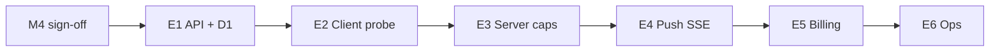

# Hosted tier — implementation epics (M8)

**Status:** **M8 code complete** (E1–E6 + E4d). **G0 signed** (Governance + Ops, 2026-05-27); **Legal pending** (G7). **Next:** production rollout § below; ops pins CF dashboard per [`HOSTED_STEWARD_CF_DASHBOARD.md`](HOSTED_STEWARD_CF_DASHBOARD.md).  
**Milestone:** M8 of [`PAID_TIER_AND_HOSTED_OPERATOR_PLAN.md`](PAID_TIER_AND_HOSTED_OPERATOR_PLAN.md)  
**Depends on:** M2–M7 complete; **M4 governance sign-off** before E1 merge to production  
**Audience:** Engineering, ops

---

## Summary

M1–M7 defined product boundaries, entitlements, push, pricing/SLA, public copy, standards, and test plan. **M8** turns that into **shippable epics** with build order, file touch lists, exit tests, and rollout rules.

**Recommended v1 scope:** E1 → E2+E3 → E4a–d (SSE push MVP + SW bridge) → E5 (billing) → E6 (ops). Defer **E4e** (Durable Object) until push metrics justify cost.

---

## Hard gates (do not skip)

| # | Gate | Doc |
|---|------|-----|
| G0 | M4 governance checklist signed | [`HOSTED_TIER_G0_READINESS.md`](HOSTED_TIER_G0_READINESS.md) · [`HOSTED_TIER_PRICING_AND_SLA.md`](HOSTED_TIER_PRICING_AND_SLA.md) § Governance checklist · [`HOSTED_TIER_M4_GOVERNANCE_BRIEF.md`](HOSTED_TIER_M4_GOVERNANCE_BRIEF.md) |
| G1 | Free-tier regression green before/after each epic PR | [`DEVICE_OS_REQUEST_BUDGET.md`](DEVICE_OS_REQUEST_BUDGET.md) § Phase 10 — hosted tier rows (M7) |
| G2 | No change to watch default (`hc_watch_live_proof` unset = off) | Request budget doc |
| G3 | Card create / public scan / stranger poll unchanged without session | M2, M5 |
| G4 | Merch/commerce does not grant `steward.hosted` | M4, M6, data policy |

**Staging:** Ship Worker APIs behind feature flag `HOSTED_STEWARD_ENABLED` (planning name) until E5 billing + ops runbook exist.

---

## Build order

| Order | Epic | Can parallel? | Notes |
|-------|------|---------------|-------|
| 1 | **E1** Account + entitlement API | — | Foundation |
| 2 | **E2** Client tier probe | After E1 stub | May merge with E3 in one PR |
| 3 | **E3** Server enforcement + raised caps | With E2 | Double enforcement on authenticated challenge GET |
| 4 | **E4** Push (P1 SSE) | After E2 | E4a–c required for v1; E4d–e optional |
| 5 | **E5** Billing webhooks | After E1; needs G0 | Stripe or approved provider |
| 6 | **E6** Ops dashboards | After E1 metering | Runbook + alerts |

---

## Epic E1 — Account + entitlement API

**Goal:** Operator can store steward accounts, verify profile links, issue sessions, return effective entitlements.

**Specs:** M2 § HTTP API, § Storage · M6 § `steward_account_link_v1`, § capabilities

### Deliverables

| # | Item |
|---|------|
| E1.1 | D1 migrations: `steward_accounts`, `steward_account_profiles`, `steward_sessions`, `usage_counters`, `plan_definitions` (M2 conceptual) |
| E1.2 | `GET /.well-known/hc/v1/operator/capabilities` |
| E1.3 | `GET /.well-known/hc/v1/operator/plans` (optional v1; can ship with E5) |
| E1.4 | `POST /.well-known/hc/v1/steward/session` — verify link proof, issue bearer token |
| E1.5 | `GET /.well-known/hc/v1/steward/entitlements` — ETag/304, `usage` counters |
| E1.6 | Meter increment on authenticated `GET …/live-control/challenges` + `GET …/status` |
| E1.7 | `429` body `steward_quota_exceeded` at cap (M2) |

### Touch (expected)

| Area | Paths |
|------|--------|
| Worker routes | `worker/src/http/steward-*.ts` (new), router registration |
| Auth | `worker/src/http/operator-auth.ts` or steward session middleware |
| Crypto | Reuse JCS verify from card/revoke paths |
| Tests | `worker/tests/steward-account-link.test.ts`, `steward-entitlements-routes.test.ts`, `steward-quota.test.ts`, `operator-capabilities.test.ts` |

### Exit tests (M7)

- Link signature valid/invalid/expired/replay
- Entitlements 200/304/401
- Public `POST …/cards` and scan unchanged
- Free tier implicit when no session

### Out of scope

- Push (E4), Stripe (E5), client UI (E2)

### Implementation status (2026-05-26)

| Deliverable | Status |
|-------------|--------|
| E1.1–E1.5 | **Staging** — migration `0012_steward_hosted.sql`, routes in `worker/src/resolver/steward-hosted.ts` |
| E1.6–E1.7 | **Staging** — `worker/src/steward/quota.ts` on authenticated `GET …/live-control/challenges` (+ challenge by id) |
| Tests | `worker/tests/steward-hosted.test.ts`, `worker/tests/steward-quota.test.ts` |
| Flag | `HOSTED_STEWARD_ENABLED` default **`0`** in `worker/wrangler.toml`; set **`1`** locally after `npm run worker:migrate:local` |

**Next after G0:** production rollout per § Production rollout (after G0) — deploy with flag off, then enable secrets and `HOSTED_STEWARD_ENABLED`.

---

## Epic E2 — Client tier probe + UI gates

**Goal:** Device shell resolves policy from server (or `reference_free` fallback) and gates hosted UX.

**Specs:** M2 § Effective policy, § Client enforcement · M7 test plan

### Deliverables

| # | Item |
|---|------|
| E2.1 | `device-steward-entitlements-core.mjs` — fetch, cache ≤300s, merge policy |
| E2.2 | `sessionStorage` `hc_steward_session` + `localStorage` `hc_device_id` (first visit UUID) |
| E2.3 | Hub expand / visibility: fetch entitlements when keys present |
| E2.4 | Wire `device-live-control-poll-budget-core`, scheduler, scale, SW modules to **resolved policy** not hard-coded 400 |
| E2.5 | Hub UI: hosted indicator line (no “premium verified” copy — M5) |
| E2.6 | `steward.hosted` master gate — hide subscribe/push UI when false |

### Touch (expected)

| Module | Change |
|--------|--------|
| `device-steward-entitlements.mjs` | Loader + hub hook |
| `device-live-control-poll-budget-core.mjs` | Policy-driven cap |
| `device-live-control-poll-scheduler.mjs` | idle/active ms |
| `device-wallet-scale-core.mjs` | threshold + parallel |
| `device-live-control-sw-core.mjs` | `sw.periodic_min_ms` |
| `device-hub-network-tools.mjs` / UI | hosted line, diagnostics |
| Shell `?v=` bump | Per AGENTS.md if new imports |

### Exit tests

- Vitest: 400 vs 4000 cap; 401 → free fallback
- E2E H1–H3, H5 (M7)
- Manual P1-8 when enabled

### Implementation status (2026-05-27)

| Deliverable | Status |
|-------------|--------|
| E2.1–E2.5 | **Staging** — `device-steward-entitlements*.mjs` resolves/caches policy; budget, scheduler, scale, SW, and hub copy consume resolved policy |
| E2.6 | **Staging** — `stewardPushSubscribeAllowed()` gates `device-steward-push.mjs` + SW |
| E2.7 | **Shipped** — `device-steward-session*.mjs` signs `steward_account_link_v1`, `POST …/steward/session`; billing return `?hc_account_id=acc_…` (see [`STEWARD_DEVICE_ROADMAP.md`](STEWARD_DEVICE_ROADMAP.md)) |
| Tests | `worker/tests/device-steward-entitlements-core.test.ts`, `device-steward-session-core.test.ts`, `device-steward-entitlements.test.ts`, `e2e/hosted-tier-budget.spec.ts` |

**Next:** production rollout ([§ Production rollout](#production-rollout-after-g0)); Stripe return URL for `hc_account_id` (E5.6).

### Out of scope

- Server 429 detail (see E3 epic)

---

## Epic E3 — Server caps + client/server alignment

**Goal:** Double enforcement — buggy or malicious clients cannot exceed account/device caps.

**Specs:** M2 § Double enforcement · M4 fair-use

### Deliverables

| # | Item |
|---|------|
| E3.1 | Server counter `poll.live_proof.auto` per M2 windows |
| E3.2 | Reject authenticated challenge GET when over cap (even if client continues) |
| E3.3 | Account-level soft/hard caps (50k / 100k per M4) for `null` unlimited key |
| E3.4 | Hub message when server returns 429 (sync with client pause state) |

### Touch

- E1 meter paths (extend)
- `device-live-control-inbox.mjs` — handle 429, backoff
- `device-hub-network-tools` — show quota line from response body

### Exit tests

- Integration: force 429, client pauses auto poll, manual check works
- Vitest server quota tests

**Note:** Often shipped in **same PR as E2** once E1 is in staging.

### Implementation status (2026-05-27)

| Deliverable | Status |
|-------------|--------|
| E3.1–E3.2 | **Staging** — `worker/src/steward/quota.ts` on authenticated challenge GET |
| E3.3 | **Staging** — account soft/hard caps in quota module |
| E3.4 | **Staging** — client 429 handling + hub quota line |
| Tests | `worker/tests/steward-quota.test.ts`, `device-steward-quota-core.test.ts` |

---

## Epic E4 — Push channel (SSE MVP)

**Goal:** Hosted stewards receive `live_proof.pending` without wallet round-robin when push healthy.

**Specs:** M3 full RFC · E4a–e below

### Sub-epics

| Sub | Deliverable | v1 required? |
|-----|-------------|--------------|
| **E4a** | `notifyLiveProofPending()` on successful challenge POST (`waitUntil`) | Yes |
| **E4b** | `GET …/steward/push` SSE + connection registry + limits | Yes |
| **E4c** | `device-steward-push.mjs` — leader tab only; parse events; trigger inbox + optional GET | Yes |
| **E4d** | Page → SW `postMessage` for OS notify when tab hidden | No (P1b) |
| **E4e** | Durable Object fan-out (P2) | No |

### Touch (expected)

| Area | Paths |
|------|--------|
| Worker | `live-control.ts` POST hook, `steward-push.ts`, connection store |
| Client | `device-steward-push.mjs`, `device-live-control-inbox.mjs`, leader integration |
| SW | `sw-live-proof.mjs` — fallback when SSE down; gate on `notify.push.live_proof` |
| Tests | `device-steward-push-core.test.ts`, `e2e/hosted-tier-push.spec.ts` (M7 planning name) |

### Exit tests

- M3 interoperability table
- E2E H4: SSE up → challenge GET count ≪ round-robin baseline
- Fallback: SSE down 60s → resumes Phase 7–9 poll behavior
- Free tier: no SSE connection attempted

### Out of scope

- Web Push VAPID (M3 Q5)
- Cross-tab / marketing events

### Implementation status (2026-05-27)

| Deliverable | Status |
|-------------|--------|
| E4a | **Staging** — `notifyLiveProofPending()` on challenge POST |
| E4b | **Staging** — `GET …/steward/push` SSE + connection registry |
| E4c | **Staging** — `device-steward-push.mjs` leader-tab client + inbox GET |
| E4d | **Staging** — page → SW `HC_SW_LIVE_PROOF_PUSH` bridge; SW skips poll when push healthy |
| E4e | Deferred (Durable Object fan-out) |
| Vitest | `device-steward-push-core.test.ts`, `steward-push-sse.test.ts`, `steward-push-notify.test.ts` |
| E2E | `e2e/hosted-tier-push.spec.ts` — M7 **H4** + E4 fallback (SSE down re-enables poll) |

**Next:** **G0** M4 governance sign-off for production enablement; configure `OPERATOR_AUDIT_TOKEN` for E6.2 CI; **E4e** DO fan-out deferred.

---

## Epic E5 — Billing webhooks

**Goal:** Subscription lifecycle updates `plan_id` / `status` on `steward_accounts`.

**Specs:** M2 § Lifecycle · M4 commercial model

**Depends on:** G0 (M4 sign-off), E1 tables

### Deliverables

| # | Item |
|---|------|
| E5.1 | Stripe (or approved) webhook endpoint — verify signature |
| E5.2 | Map events → `active`, `trialing`, `past_due`, `canceled`, `expired` |
| E5.3 | 7-day `past_due` grace at hosted caps (M4) |
| E5.4 | On `expired`: revoke sessions, clear push subs within 24h (M4) |
| E5.5 | Admin/support: manual `account_overrides` (out of band v1) |
| E5.6 | Checkout / customer portal (minimal — link only in v1) |

### Touch

- `worker/src/http/billing-webhook.ts` (new)
- Wrangler secrets: Stripe keys
- No client change except entitlements reflect new status on fetch

### Exit tests

- Fixture webhooks → entitlement JSON status
- Downgrade E2E H3
- Commerce orders do **not** call webhook grant path (H6)

### Out of scope

- Org seat packs `hosted_org_v1` (Commons Pass)
- Member-governed billing alternative (unless governance picks before build)

### Deliverables status (2026-05-27)

| # | Item | Status |
|---|------|--------|
| E5.1 | Stripe webhook + signature verify | **Staging** — `billing-webhook.ts`, `stripe-webhook-verify.ts` |
| E5.2 | Map subscription events → plan status | **Staging** — `billing-lifecycle.ts` |
| E5.3 | 7-day `past_due` grace | **Staging** — lazy expiry on entitlements fetch + webhook |
| E5.4 | Expired → revoke sessions + close SSE | **Staging** — `db.ts`, `push.ts` |
| E5.5 | Manual `account_overrides` | Out of band v1 |
| E5.6 | Checkout / customer portal | **Return URL helper shipped** — `npm run hosted:stripe-return-url`; full Stripe UI out of scope v1 |

**Migration:** `0013_steward_billing.sql` (billing customer/subscription ids)  
**Route:** `POST /.well-known/hc/v1/operator/billing/webhook` (requires `STRIPE_WEBHOOK_SECRET`)  
**Tests:** `worker/tests/billing-lifecycle.test.ts`, `billing-webhook.test.ts`, `stripe-webhook-verify.test.ts`

**Production:** Requires **G0** (M4 sign-off) before enabling webhook secret on production Worker.

---

## Epic E6 — Ops dashboards + runbook

**Goal:** Ops can see quota, fair-use, push health, and SLA inputs.

**Specs:** M4 SLA · M2 metering events

### Deliverables

| # | Item |
|---|------|
| E6.1 | Cloudflare Workers analytics dashboard (requests, 429 rate, SSE connections) |
| E6.2 | Daily alert: account over soft cap, push p95 latency (M4 targets) |
| E6.3 | Runbook: suspend `status`, 1027, fair-use 429, downgrade |
| E6.4 | Support doc: link M5 FAQ for customer-facing answers |

### Deliverables status (2026-05-27)

| # | Item | Status |
|---|------|--------|
| E6.1 | Ops metrics snapshot | **Staging** — `GET /.well-known/hc/v1/operator/steward-ops` exposes account, session, usage, and in-memory SSE counts behind `OPERATOR_AUDIT_TOKEN` |
| E6.1 | Cloudflare dashboard | **Staging** — ops setup guide [`HOSTED_STEWARD_CF_DASHBOARD.md`](HOSTED_STEWARD_CF_DASHBOARD.md); pin CF Workers metrics for `humanity-llc-resolver` |
| E6.2 | Daily alert | **Staging** — `npm run worker:check-steward-ops` + Vitest; **CI** — `.github/workflows/steward-ops-daily.yml` (daily 14:00 UTC + manual dispatch; needs `OPERATOR_AUDIT_TOKEN`) |
| E6.3 | Runbook | **Staging** — `docs/HOSTED_STEWARD_OPS_RUNBOOK.md` |
| E6.4 | Support doc link | **Staging** — runbook directs customer-facing language to `docs/SKEPTIC_FAQ.md` |

**Tests:** `npm run worker:test:steward-ops`

### Exit tests

- Runbook reviewed by ops
- Tabletop: expired subscription → free tier behavior — **Vitest** `worker/tests/billing-webhook.test.ts` (`subscription.deleted` → `reference_free`) + E2E **H3** in `e2e/hosted-tier-budget.spec.ts`

### Out of scope

- Per-tenant billing UI in product (v1 = Stripe dashboard)

---

## Production rollout (after G0)

Engineering checklist once M4 governance checklist is signed ([`HOSTED_TIER_PRICING_AND_SLA.md`](HOSTED_TIER_PRICING_AND_SLA.md) § Governance checklist):

| # | Step | Notes |
|---|------|-------|
| 1 | Apply D1 migrations | `0012_steward_hosted.sql`, `0013_steward_billing.sql` — `npm run hosted:rollout:step1` (local preflight) then `npm run hosted:rollout:step1 -- --remote` |
| 2 | Deploy Worker with flag off | `HOSTED_STEWARD_ENABLED=0` — `npm run hosted:rollout:step2` then `npm run hosted:rollout:step2 -- --deploy` · `npm run hosted:rollout:step2 -- --smoke` (health + `hosted_steward_disabled` on entitlements) |
| 3a | `OPERATOR_AUDIT_TOKEN` (required) | Worker wrangler secret + GitHub for E6.2 — `npm run hosted:rollout:step3a` · `npm run hosted:rollout:step3a -- --smoke` (auth gate before secret) · verify `OPERATOR_AUDIT_TOKEN=... API_ORIGIN=https://humanity.llc npm run hosted:rollout:step3a` · `hosted:rollout:step3` aliases step3a |
| 3b | `STRIPE_WEBHOOK_SECRET` (after G8) | Deferred — `npm run hosted:rollout:step3b` (notes only). Not required for steps 4–6. |
| 4a | Enable hosted flag in wrangler | **Shipped** — `HOSTED_STEWARD_ENABLED=1` in `worker/wrangler.toml` · `npm run hosted:rollout:step4a -- --apply` |
| 4b | Deploy + verify production | `npm run hosted:rollout:step4 -- --deploy` · `npm run hosted:rollout:step4 -- --smoke` (health + hosted routes on; local `API_ORIGIN=http://127.0.0.1:8787` after 4a) · verify `npm run hosted:rollout:step4 -- --verify` · `OPERATOR_AUDIT_TOKEN=... npm run hosted:rollout:step4 -- --verify` |
| 5a | Pin CF dashboard (E6.1) | Manual — `npm run hosted:rollout:step5a` · [`HOSTED_STEWARD_CF_DASHBOARD.md`](HOSTED_STEWARD_CF_DASHBOARD.md) |
| 5b | E6.2 CI + verify | GitHub `OPERATOR_AUDIT_TOKEN` + runbook — `npm run hosted:rollout:step5` · verify `npm run hosted:rollout:step5 -- --verify` |
| 6 | Regression | `npm run hosted:rollout:step6` · full verify `npm run hosted:rollout:step6 -- --verify` · Vitest only `npm run hosted:rollout:step6 -- --vitest` · E2E only `npm run hosted:rollout:step6 -- --e2e` |

---

## PR checklist (every epic)

1. Run M7 **free-tier regression** commands.
2. Update `DEVICE_OS_REQUEST_BUDGET.md` phase table if behavior changes.
3. Bump shell asset version if module graph changes ([`AGENTS.md`](../AGENTS.md)).
4. No new trust labels or scan analytics.
5. Cross-link PR to this epic id (E1–E6).

---

## Definition of done — hosted steward v1

| Criterion | Met by |
|-----------|--------|
| Paying steward gets 4000/day/device auto cap (with fair-use) | E2+E3+E5 |
| Free users unchanged | G1–G3, all epics |
| Optional SSE live-proof notify | E4a–c |
| Public copy matches M5 | No “premium verified” UI |
| M4 SLA measurable | E6 |
| Governance signed | G0 (Governance + Ops ✅; Legal pending G7) |

---

## Deferred / v2

| Item | Reason |
|------|--------|
| E4e Durable Object push | Cost/complexity; SSE first (M3) |
| `hosted_org_v1` | Commons Pass |
| Per-card watch flags | Product scope |
| Client `usage/report` endpoint | M2 prefers server-side metering |
| Technical Standards v1.1 ratification | M6 — merge after E1 stable |

---

## Cross-references

| Doc | Use |
|-----|-----|
| [`PAID_TIER_AND_HOSTED_OPERATOR_PLAN.md`](PAID_TIER_AND_HOSTED_OPERATOR_PLAN.md) | Product boundaries |
| [`HOSTED_TIER_ENTITLEMENTS_AND_METERING.md`](HOSTED_TIER_ENTITLEMENTS_AND_METERING.md) | APIs + keys |
| [`HOSTED_TIER_PUSH_ARCHITECTURE_RFC.md`](HOSTED_TIER_PUSH_ARCHITECTURE_RFC.md) | E4 detail |
| [`HOSTED_TIER_TECHNICAL_STANDARDS_DELTA.md`](HOSTED_TIER_TECHNICAL_STANDARDS_DELTA.md) | Wire formats |
| [`HOSTED_TIER_G0_READINESS.md`](HOSTED_TIER_G0_READINESS.md) | G0 sign-off packet |
| [`HOSTED_TIER_PRICING_AND_SLA.md`](HOSTED_TIER_PRICING_AND_SLA.md) | G0, lifecycle |
| [`HOSTED_STEWARD_OPS_RUNBOOK.md`](HOSTED_STEWARD_OPS_RUNBOOK.md) | E6 ops |
| [`HOSTED_STEWARD_CF_DASHBOARD.md`](HOSTED_STEWARD_CF_DASHBOARD.md) | E6.1 CF analytics |
| [`DEVICE_OS_REQUEST_BUDGET.md`](DEVICE_OS_REQUEST_BUDGET.md) | M7 tests |

---

## Changelog

| Date | Note |
|------|------|
| 2026-05-28 | **Rollout step 4a:** `HOSTED_STEWARD_ENABLED=1` committed in `worker/wrangler.toml` |
| 2026-05-28 | **Rollout step 4b:** `hosted:rollout:step4 -- --smoke` (health + hosted routes on; mirrors step 2 `--smoke`) |
| 2026-05-27 | **G0 signed** (Governance + Ops, solo founder); Legal pending — production rollout unlocked |
| 2026-05-27 | **E6.1 guide:** CF Workers dashboard setup doc + G0 production rollout checklist |
| 2026-05-27 | **E6.2 CI:** `.github/workflows/steward-ops-daily.yml` daily threshold check |
| 2026-05-27 | **M8 code-complete pass:** E4 fallback E2E; poll resume on push drop (`device-live-control-inbox.mjs`); `worker:test:steward-hosted` + `e2e:steward-hosted`; **G0** gates production |
| 2026-05-27 | **E4d SW bridge:** push hint → service worker OS notify; skip SW poll when SSE healthy |
| 2026-05-27 | **E6.2 daily alert script:** `worker:check-steward-ops` + threshold Vitest |
| 2026-05-27 | **E4 push staging:** SSE client/worker + `e2e/hosted-tier-push.spec.ts` H4 |
| 2026-05-27 | **E2 client probe staging:** browser fetch/cache Vitest + hosted budget E2E H1–H3/H5 |
| 2026-05-26 | **E1 foundation:** migration `0012_steward_hosted.sql`, steward routes behind `HOSTED_STEWARD_ENABLED` |
| 2026-05-26 | M8 initial implementation epics (planning only) |
| 2026-05-27 | **E6 start:** operator steward ops snapshot + hosted ops runbook |
