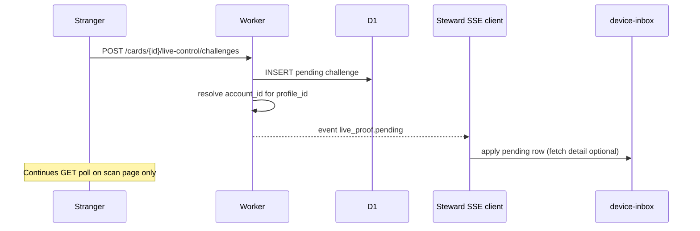

# Hosted tier — live proof push architecture (M3 RFC)

**Status:** **Planning RFC** — threat model, flows, and wire protocol; **no implementation**  
**Milestone:** M3 of [`PAID_TIER_AND_HOSTED_OPERATOR_PLAN.md`](PAID_TIER_AND_HOSTED_OPERATOR_PLAN.md)  
**Depends on:** [`HOSTED_TIER_ENTITLEMENTS_AND_METERING.md`](HOSTED_TIER_ENTITLEMENTS_AND_METERING.md) (M2)  
**Audience:** Engineering, security review, ops  
**Related:** [`DEVICE_INBOX.md`](DEVICE_INBOX.md) · [`DEVICE_OS_REQUEST_BUDGET.md`](DEVICE_OS_REQUEST_BUDGET.md) · [`REFERENCE_OPERATOR_DATA_POLICY.md`](REFERENCE_OPERATOR_DATA_POLICY.md)

---

## Summary

Today, stewards discover pending live proof via **client polling** (tab inbox + optional service worker). That is correct for the **free reference tier** but expensive at scale.

**M3** defines **server-mediated push** for hosted stewards with `notify.push.live_proof`: when a stranger creates a live-control challenge, the operator notifies **subscribed steward devices** so they can show inbox/OS UI **without** round-robin `GET …/live-control/challenges` across every saved card.

**Recommendation:** ship **Phase P1 (SSE subscribe)** on the reference operator, design **Phase P2 (Durable Object fan-out)** for federation scale, and **keep SW polling as fallback** when push is unavailable.

---

## Goals

| # | Goal |
|---|------|
| G1 | Cut steward-side poll volume for hosted accounts when strangers wait |
| G2 | Preserve **stranger pays urgency** — scan page still polls its one challenge |
| G3 | Same **inbox policy** as today — only `live_proof`; no new notification kinds |
| G4 | No new operator-held PII; no scan analytics in payloads |
| G5 | Work with M2 `steward_session` + linked `profile_id` |
| G6 | Degrade to shipped SW/tab behavior on disconnect or free tier |

## Non-goals

| Item | Notes |
|------|--------|
| Push for cross-tab keys, card-disabled, resolver health | [`DEVICE_INBOX.md`](DEVICE_INBOX.md) Phase C |
| Native iOS/Android apps (web push only in P1) | Future `web_push_subscription` field reserved |
| Email/SMS fallback | PII + latency; out of v1 |
| Stranger push | Strangers use scan UI only |
| Replacing Ed25519 signing flow | Push is notify-only; sign on `/created/` |

---

## Current architecture (shipped, free tier)

```text
Stranger                Operator (D1)              Steward devices
   |                          |                           |
   |-- POST challenge ------->| insert pending            |
   |<-- 201 ------------------|                           |
   |                          |                           |
   |-- GET challenge/status ->|                           |
   |   (poll ~2s)             |                           |
   |                          |<-- GET pending (round-robin)
   |                          |    per saved card / SW wake
   |                          |                           |
   |                          |         OS notification / inbox row
```

| Component | Role |
|-----------|------|
| Scan page | Polls **one** challenge until proven/expired |
| `device-live-control-inbox.mjs` | Round-robin `GET …/challenges?qr_id=` when watch + hub scope |
| `sw-live-proof.mjs` | Same when tab hidden, alerts on, watch on, 15 min periodic |
| Challenge TTL | **120s** (`CHALLENGE_TTL_MS` in `live-control.ts`) |

**Pain:** N saved cards ⇒ N poll slots per cycle even when zero strangers waiting.

---

## Target architecture (hosted + push)

```text
Stranger                Operator                    Steward (hosted)
   |                          |                           |
   |-- POST challenge ------->| insert pending            |
   |                          |---- fan-out event ------->| SSE / WebSocket
   |                          |     (per account)         | update inbox + optional OS
   |-- GET (poll) ----------->|                           | (no wallet round-robin)
   |                          |                           |
```

| Property | Value |
|----------|--------|
| Trigger | Successful `POST …/live-control/challenges` (pending insert) |
| Fan-out key | `account_id` linked to `profile_id` (M2) |
| Delivery | 0..N devices with active push subscription for that account |
| Steward poll | **Reduced** — poll only on reconnect, manual check, or push miss |

---

## Phased delivery

### P1 — SSE steward channel (reference MVP)

| Aspect | Choice |
|--------|--------|
| Transport | `GET /.well-known/hc/v1/steward/push` with `Accept: text/event-stream` |
| Auth | `Authorization: Bearer <steward_session>` |
| Scope | One stream per session; server filters events to linked profiles |
| Infra | Worker stream; optional short-lived Durable Object stub later |
| Client | Visible tab holds stream; hidden tab relies on **existing SW** until P1b |

**Why SSE first:** simpler than WebSocket on Cloudflare; fits “notify then fetch details” pattern; aligns with parent plan option A.

### P2 — Durable Object room per account

| Aspect | Choice |
|--------|--------|
| Transport | WebSocket `GET …/steward/push/ws` or SSE via DO |
| Fan-out | `LiveProofNotifyDO` keyed by `account_id` |
| Scale | Many devices, many profiles per account |
| Federation | Each operator runs DO namespace |

**Why DO:** connection accounting, heartbeat, backpressure, per-tenant metering ([`HOSTED_TIER_ENTITLEMENTS_AND_METERING.md`](HOSTED_TIER_ENTITLEMENTS_AND_METERING.md) `notify.push.delivered`).

### P1b — Bridge push → SW (optional before P2)

- Page receives SSE event → `postMessage` to registered SW → `showNotification` when tab hidden (same copy as Phase B).
- Avoids SW polling when push channel healthy.

### Free tier

No subscribe endpoint; `notify.push.live_proof === false`. Behavior unchanged from Phases 1–9 + 8c.

---

## End-to-end sequence (P1)



**Detail fetch policy:**

| Option | Pros | Cons |
|--------|------|------|
| **Push carries full pending payload** | One round trip | Larger events; duplicate challenge schema |
| **Push carries ids only; client GET once** | Small events; reuses ETag path | One GET per notification (acceptable) |

**Planning default:** **ids only** in push; steward client issues **one** `GET …/challenges?qr_id=` per event (replaces blind round-robin).

---

## Wire protocol

### Event transport (SSE)

| Field | Value |
|-------|--------|
| `Content-Type` | `text/event-stream` |
| `Cache-Control` | `no-store` |
| Heartbeat | Comment line `: ping` every **30s** |
| Reconnect | Client `Last-Event-ID` optional; server may replay **0** events (prefer fresh GET) |

### Event types (normative)

Only these types may be sent on the steward push channel:

| `type` | When | Policy |
|--------|------|--------|
| `live_proof.pending` | Challenge inserted, status pending | **Allowed** |
| `live_proof.expired` | Challenge expired before prove | Optional; client may ignore |
| `live_proof.proven` | Challenge proven | Optional; clears inbox |
| `connection.ack` | Subscribe accepted | Session validation |
| `connection.error` | Fatal subscribe problem | Close stream |

**Forbidden event types:** `scan.*`, `vouch.*`, `resolver.*`, `marketing.*`, `cross_tab.*`.

### Event payload (`live_proof.pending`)

```json
{
  "type": "live_proof.pending",
  "version": 1,
  "operator_id": "humanity.llc",
  "account_id": "acc_…",
  "profile_id": "7Xk9…",
  "qr_id": "qr_…",
  "challenge_id": "lc_…",
  "expires_at": "2026-05-26T12:00:00.000Z",
  "issued_at": "2026-05-26T11:58:00.000Z"
}
```

**Intentionally omitted:** stranger IP, user-agent, geo, scan URL with verifier identity, private keys.

**Client actions on `live_proof.pending`:**

1. If tab visible → update inbox via `device-live-control-inbox` path (same as poll discovery).
2. If tab hidden + browser alerts on → OS notification (existing copy from `osNotificationContentForLiveProof`).
3. Deep link → existing `buildLiveControlProofHref` / `/created/?profile_id&qr_id&live_challenge`.

### SSE framing example

```text
event: live_proof
id: lc_abc123
data: {"type":"live_proof.pending","version":1,"profile_id":"…","qr_id":"…","challenge_id":"…","expires_at":"…"}

```

---

## HTTP API (planning)

### `GET /.well-known/hc/v1/steward/push`

| Header | Required |
|--------|----------|
| `Authorization: Bearer <steward_session>` | Yes |
| `Accept: text/event-stream` | Yes |
| `X-HC-Device-Id` | Recommended (M2) |

**Preconditions (all required):**

- `entitlements.notify.push.live_proof === true`
- `entitlements.steward.hosted === true`
- Account `status === active` (or `trialing`)
- At least one `profile_id` linked to account

**Responses:**

| Code | Meaning |
|------|---------|
| 200 | SSE stream |
| 401 | Invalid session → no stream; client uses free polling |
| 403 | Not entitled → no stream |
| 429 | Too many connections (fair use) |

**Connection limits (planning):**

| Limit | Value |
|-------|--------|
| Streams per `account_id` | **5** concurrent |
| Streams per IP | **20** (abuse, O2) |
| Idle timeout | **30 min** without client TCP ack |

### `POST /.well-known/hc/v1/steward/push/subscribe` (P2 / Web Push extension)

Reserved for future **Web Push** `endpoint` + keys (VAPID). Not required for P1 SSE.

### Operator internal: fan-out hook

After `insertLiveControlChallenge` in `handlePostLiveControlChallenge`:

```text
notifyLiveProofPending({ profile_id, qr_id, challenge_id, expires_at })
  → lookup steward_account_profiles
  → for each active push connection on account_id: enqueue SSE event
  → increment meter notify.push.delivered
```

**Must not block** stranger `201` response on slow subscribers; use `waitUntil` / queue.

---

## Client integration (planning)

| Surface | Behavior |
|---------|----------|
| **New module** | `device-steward-push.mjs` (name TBD) — connects SSE when entitled + watch on + alerts on |
| **Gating** | Same as SW: `isWatchLiveProofEnabled`, `isBrowserNotifEnabled`, `notify.push.live_proof` from entitlements |
| **Leader tab** | Only **leader** tab holds SSE (reuse `device-live-control-poll-leader` pattern) |
| **Poll fallback** | If SSE down > 60s: resume shipped round-robin at **hosted** intervals from entitlements |
| **Free tier** | Module never connects |

**Interaction with request budget:**

| Mode | Steward `GET …/challenges` rate |
|------|--------------------------------|
| Free | Unchanged (round-robin) |
| Hosted + push healthy | **~0** background polls; 1 GET per push event |
| Hosted + push down | Degrade to hosted poll caps (M2) |

---

## Threat model

| Threat | Mitigation |
|--------|------------|
| Stolen `steward_session` | Short TTL; HTTPS only; cannot sign without keys |
| Subscribe without entitlement | 403 at subscribe; server checks plan |
| Leak stranger PII in events | Payload allowlist (§ Event payload) |
| Forge push events client-side | Events only from server stream; client validates `operator_id` + challenge via GET |
| Account receives push for unlinked profile | Fan-out only after `steward_account_profiles` link |
| DoS via many SSE connections | Per-account + per-IP limits; 429 |
| Replay old events | Include `expires_at`; client ignores past TTL |
| Cross-account fan-out bug | `account_id` isolation in DO / connection registry |
| Push spam if stranger spams POST | Rate-limit challenge creation per profile/IP (existing ops concern) |

**Out of scope for M3:** formal pen test; VAPID key management.

---

## Privacy & policy alignment

| Rule | How push complies |
|------|-------------------|
| No scan analytics | Events are challenge lifecycle, not scan logs |
| Live-control TTL | Events reference `expires_at`; no long-term notify history table required (connections ephemeral) |
| [`REFERENCE_OPERATOR_DATA_POLICY.md`](REFERENCE_OPERATOR_DATA_POLICY.md) | No new mandatory PII fields |

**Retention:** connection registry rows **24h**; meter aggregates per M2; no content logging of event bodies.

---

## Federation

| Topic | Rule |
|-------|------|
| `operator_id` in events | Must match API host |
| SSE URL | Always on operator origin |
| Stranger POST | Same operator as card’s network |
| Second operator | Own DO namespace + VAPID keys (future) |

---

## Failure modes & degradation

| Condition | Steward experience |
|-----------|-------------------|
| SSE disconnect | Exponential backoff reconnect; resume poll fallback |
| 403 not entitled | Free-tier polling only |
| Tab visible | Inbox row + dot overlay (no OS spam) |
| Tab hidden, no OS permission | Inbox updates when user returns |
| Push works, GET fails | Show “check connection”; retry GET |
| Challenge expires before open | Row clears on `live_proof.expired` or next GET 404 |
| 1027 / degraded resolver | No new subscriptions; existing streams close; health banner |

---

## Relationship to shipped SW (Phase D)

| | SW poll (shipped) | SSE push (M3) |
|---|-------------------|---------------|
| Entitlement | Alerts + watch | Hosted + `notify.push.live_proof` + session |
| Trigger | Timer / periodic sync | Stranger POST |
| Worker load | N cards × wakes | 1 event × subscribers |
| When push ships | **Fallback** | **Primary** for hosted |

**Planning rule:** Do not disable SW path until push reach metrics acceptable; hosted accounts prefer push when stream `connection.ack` within 5s of subscribe.

---

## Metering (M2 linkage)

| Event | When |
|-------|------|
| `notify.push.delivered` | Each SSE event written to a connection |
| `steward.push.subscribe` | Optional; 0 cost |
| `resolver.live_control.challenges.get` | Should **drop** per account when push healthy |

---

## Open questions

| # | Question | Owner |
|---|----------|--------|
| Q1 | P1 SSE on Worker vs jump straight to DO | Engineering |
| Q2 | Full payload vs ids-only in events | Engineering |
| Q3 | Single global connection registry vs DO-per-account | Engineering |
| Q4 | Rate limit stranger POST challenges per profile | Ops |
| Q5 | Web Push (VAPID) timeline vs SSE-only | Product |
| Q6 | Require watch on for SSE or only entitlement | Product (default: both) |
| Q7 | Replay proven/expired events or pending-only | Engineering |

---

## Implementation map (do not start until M4–M6 approved)

| Epic | Deliverable |
|------|-------------|
| E4a | `notifyLiveProofPending` hook on challenge POST |
| E4b | SSE endpoint + connection registry |
| E4c | `device-steward-push.mjs` + leader tab |
| E4d | SW bridge (P1b) |
| E4e | DO migration (P2) |

---

## Changelog

| Date | Note |
|------|------|
| 2026-05-26 | M3 initial RFC (planning only) |
