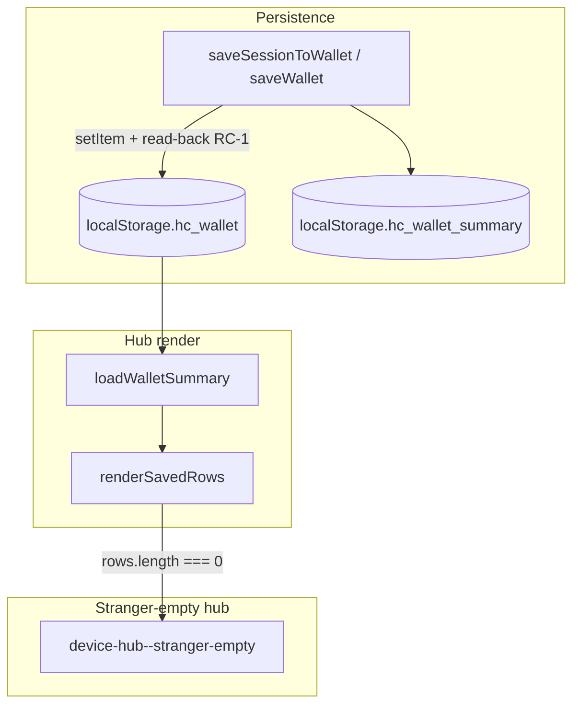

# Investigation: Saved card disappeared from hub (iPhone Safari)

**Date:** 2026-05-29 (opened from steward report — card saved, hub empty ~20 min later)  
**Status:** Active — RC-1/RC-2 shipped; RC-4+ backlog open  
**Reporter:** Steward on iPhone Safari after create + explicit save  
**Related:** [`SAFARI_KEYS_WIPE_INVESTIGATION.md`](SAFARI_KEYS_WIPE_INVESTIGATION.md) · [`KEY_LOSS_SAD_PATH_MATRIX.md`](KEY_LOSS_SAD_PATH_MATRIX.md) · [`CARD_DISABLED_SINCE_VISIT_FALSE_POSITIVE_INVESTIGATION.md`](CARD_DISABLED_SINCE_VISIT_FALSE_POSITIVE_INVESTIGATION.md) · [`PWA_INSTALL.md`](PWA_INSTALL.md)

---

## Executive summary

**A card row in the hub always reflects `localStorage.hc_wallet`.** There is no timer, poll, or hub logic that removes saved cards after N minutes. If the hub shows **stranger-empty** (“no saved cards”), `hc_wallet` is missing, `[]`, or unreadable.

The **~20 minute** delay does **not** match any client-side interval. It usually means the steward **backgrounded Safari**, **returned to a fresh tab**, or **misread session loss as hub loss** — not a scheduled purge.

| Question | Answer |
|----------|--------|
| Can the server delete my hub row? | **No.** Orphan purge is server-side resolver data after **90 days**; it does not touch browser storage. |
| Can the hub hide a card while wallet still has it? | **Rare.** Search filter, corrupt parse, or summary/cache bugs — see RC-14–RC-16. |
| Is this always true data loss? | **Often yes** when hub is stranger-empty. Sometimes **no** — tab session empty but wallet intact (RC-8). |

---

## Symptom disambiguation (read this first)

| What you see | `hc_wallet` | `hc_created` (tab) | Classification |
|--------------|-------------|--------------------|----------------|
| Hub **stranger-empty** / “no saved cards yet” | Empty or missing | Any | **True hub disappearance** — RC-1–RC-7, RC-11–RC-13, RC-21–RC-22 |
| Hub **urgent corrupt card** (“could not be read”) | Present, bad JSON | Any | **Corrupt wallet** — RC-7 |
| Hub **row visible**, cannot sign / revoke | Has row + private key | Empty | **Session loss only** — RC-8, RC-20 (not hub loss) |
| Hub row + red **“disabled since visit”** banner | Has row | Any | **Trust UI false positive** — RC-17 (row still there) |
| Status dot **“ownership saved”**, scan cannot vouch | Has row | Empty | **Misleading chrome** — RC-8 (R9; partial fix shipped) |
| Card gone on **network** scan, still in hub | Has row | Any | **Server revoke/disable** — RC-18 (hub row should remain) |

---

## Root-cause catalog (prioritized)

Fix backlog order matches this list. **RC-1, RC-2, and RC-4 are implemented.**

### RC-1 — No post-save read-back verification **(product gap · fix shipped)**

| Field | Detail |
|-------|--------|
| **Layer** | Client — `saveWallet()` |
| **Mechanism** | After `localStorage.setItem("hc_wallet", …)`, code returned `{ ok: true }` without confirming `getItem` round-trips the same bytes. Safari private mode, quota edge cases, or WebKit write quirks can leave UI showing “saved” while disk has nothing. |
| **User pattern** | Create → tap Save / auto-save → hub shows card → later hub empty with no error ever shown. |
| **Still possible?** | **No** after read-back gate in `device-wallet-save-core.mjs` + `saveWallet()`. |
| **Fix** | **Shipped** — `verifyWalletStorageWrite()`; failure returns `WALLET_SAVE_VERIFY_FAILED` and does not update in-memory wallet cache. |
| **Tests** | `worker/tests/device-wallet-save-core.test.ts` |

---

### RC-2 — `navigator.storage.persist()` denied; no steward warning **(fix shipped)**

| Field | Detail |
|-------|--------|
| **Layer** | Client — `device-storage-persist.mjs` · `safari-storage-persist-denied-notice.mjs` |
| **Mechanism** | After save we call `storage.persist()` once. If Safari returns `false`, we set `hc_storage_persist_requested_v1 = "0"` silently. Non-persistent origin storage is **more likely** evicted under iOS storage pressure (minutes to hours — explains ~20 min reports). |
| **User pattern** | Save appeared successful; card vanished after backgrounding phone or low storage. |
| **Still possible?** | **Eviction yes** — notice warns; **silent denial no** |
| **Fix** | **Shipped** — warn emphasis card on iOS shell when flag is `"0"` and wallet has signing keys; `hc-storage-persist-settled` event refreshes chrome. |
| **Tests** | `worker/tests/safari-storage-persist-denied-notice-core.test.ts` · `worker/tests/device-storage-persist-core.test.ts` |

---

### RC-3 — Safari / WebKit evicts `localStorage` (true wipe)

| Field | Detail |
|-------|--------|
| **Layer** | Platform — WebKit ITP + storage pressure |
| **Mechanism** | See R4 in [`SAFARI_KEYS_WIPE_INVESTIGATION.md`](SAFARI_KEYS_WIPE_INVESTIGATION.md): 7-day no-interaction rule, iOS cache cleanup, Settings → Clear Website Data, Home Screen PWA vs in-browser **separate ITP timers**. |
| **User pattern** | Hub stranger-empty; status dot also shows no saved ownership; no backup. |
| **Still possible?** | **Yes** — by design without backup |
| **Fix backlog** | RC-2 notice; P2-1 ITP notice (shipped); mandatory backup export before “You're live” (P0-4 shipped). |

---

### RC-4 — Save never completed (steward believed they saved) **(fix shipped)**

| Field | Detail |
|-------|--------|
| **Layer** | Client — create / setup flow |
| **Mechanism** | Auto-save off (`hc_auto_save_device = "0"`) and manual save skipped; **Protect** step (recovery ack / backup export) satisfies setup seatbelt but is **not** the same as `saveSessionToWallet`; left `/created/` before save microtask on **pre-P0-2 bundles**. |
| **User pattern** | “I finished setup” but wallet empty from the start — disappearance noticed later. |
| **Still possible?** | **Bypass without wallet row no** — finish gated on `isWalletSaved` |
| **Fix** | **Shipped** — `canCompleteSetupWizard` + `markSetupDone` wallet guard; done-step confirmation copy; finish button disabled until wallet + seatbelt. |
| **Tests** | `worker/tests/created-setup-core.test.ts` · `worker/tests/created-mode.test.ts` · `npm run worker:test:setup-protect` |

---

### RC-5 — Quota / storage full on write

| Field | Detail |
|-------|--------|
| **Layer** | Client — `saveWallet()` |
| **Mechanism** | `localStorage.setItem` throws `QuotaExceededError`. |
| **User pattern** | Error banner on save (P0-3). Large wallets + many origin keys. |
| **Still possible?** | **Yes** — surfaced as error, not silent |
| **Fix** | P0-3 shipped — `WALLET_SAVE_STORAGE_FULL` |

---

### RC-6 — Private / ephemeral browsing

| Field | Detail |
|-------|--------|
| **Layer** | Platform |
| **Mechanism** | Private mode: writes may fail or vanish when session ends. |
| **User pattern** | Worked in session; gone after close. |
| **Still possible?** | **Yes** |
| **Fix backlog** | Detect private mode; block create/save with explicit copy. |

---

### RC-7 — Corrupt `hc_wallet` JSON (R7)

| Field | Detail |
|-------|--------|
| **Layer** | Client — `classifyWalletStorageRaw` |
| **Mechanism** | Partial write, manual edit, or aborted save → parse throws → `loadWallet()` returns `[]`, `walletLoadKind = "corrupt"`. |
| **User pattern** | **Urgent corrupt coach card** (P1-4), not stranger-empty — unless corrupt UI fails to render. |
| **Still possible?** | **Yes** |
| **Fix** | P1-4 shipped — hub + `/wallet/` corrupt card |

---

### RC-8 — Tab session loss misread as hub disappearance

| Field | Detail |
|-------|--------|
| **Layer** | Client — `sessionStorage.hc_created` vs `localStorage.hc_wallet` |
| **Mechanism** | R1/R2: Camera QR, new tab, tab discard, quiet rehydrate skipped (multi-card, PIN lock, toggle off). Wallet intact; hub **should** still list the card. |
| **User pattern** | “Card gone” = cannot manage; hub may still show row if they open it. |
| **Still possible?** | **Yes** — feels identical to wipe |
| **Fix** | P0-1 scan rehydrate; P1-2 restore CTAs; not a hub-empty bug |

---

### RC-9 — PWA vs in-browser Safari (session split)

| Field | Detail |
|-------|--------|
| **Layer** | Platform + product |
| **Mechanism** | Same origin shares `hc_wallet`; **not** `hc_created`. Saved in PWA, opened hub in Safari tab — wallet should match. Saved in one **origin** (e.g. preview URL) vs another — wallet does not. |
| **User pattern** | “It was on my home screen app but gone in Safari.” |
| **Still possible?** | **Yes** for signing; **no** for hub row if same origin |
| **Fix** | P2-2 PWA mismatch notice (shipped) |

---

### RC-10 — Standalone opens system Safari for scan (`window.open`)

| Field | Detail |
|-------|--------|
| **Layer** | Client — `pwa-scan-handoff-core.mjs` |
| **Mechanism** | Scan preview in browser uses `_blank` → empty session in Safari while PWA holds keys. |
| **User pattern** | Setup test scan / merch handoff; keys “vanish” in scan tab. |
| **Still possible?** | **Yes** in browser; P1-3 mitigates standalone |
| **Fix** | P0b-2 setup no auto-advance (shipped) |

---

### RC-11 — Intentional **Remove from device**

| Field | Detail |
|-------|--------|
| **Layer** | Client — hub / wallet remove handler |
| **Mechanism** | Confirm dialog → `saveWallet(filtered)` → row gone. |
| **User pattern** | Accidental confirm on mobile. |
| **Still possible?** | **Yes** — intentional |

---

### RC-12 — Cross-tab broadcast clear after remove on another tab

| Field | Detail |
|-------|--------|
| **Layer** | Client — `device-tab-presence.mjs` |
| **Mechanism** | Remove on Tab A → optional “clear keys in other tabs” → `clearTabSessionKeys` on Tab B. **Does not remove wallet row** — only session. |
| **User pattern** | Confused with hub loss if user only checks signing in one tab. |
| **Still possible?** | **Yes** for session |

---

### RC-13 — Origin / URL mismatch

| Field | Detail |
|-------|--------|
| **Layer** | Deploy / user behavior |
| **Mechanism** | `humanity.llc` vs `www.humanity.llc`, Pages preview URL, local dev — separate `localStorage` per origin. |
| **User pattern** | Created on one URL; opened hub on another. |
| **Still possible?** | **Yes** |
| **Fix backlog** | Canonical origin redirect; in-app origin indicator in debug hub |

---

### RC-14 — Hub UI hiding rows (not deleting wallet)

| Field | Detail |
|-------|--------|
| **Layer** | Client — `device-hub-ui.mjs` |
| **Mechanism** | Active **search query** hides all rows; large-wallet DOM cap (≥10 cards) hides off-screen rows with “N more”; collapsed hub preview shows first 3 only (not zero for single card). |
| **User pattern** | “Empty” hub with search text in filter; or missed “more saved” row. |
| **Still possible?** | **Unlikely** for single new card |
| **Fix backlog** | Clear search on stranger-empty transition; audit cap UX |

---

### RC-15 — `hc_wallet_summary` fingerprint desync

| Field | Detail |
|-------|--------|
| **Layer** | Client — `loadWalletSummary()` |
| **Mechanism** | Summary cached with matching fingerprint; if wallet manually edited outside app, summary rebuilds from wallet on mismatch. **Should not** show zero when wallet has rows. |
| **User pattern** | Theoretical only. |
| **Still possible?** | **Very unlikely** |
| **Fix backlog** | Integrity heartbeat on hub open |

---

### RC-16 — In-memory wallet cache stale

| Field | Detail |
|-------|--------|
| **Layer** | Client — `device-wallet.mjs` memo |
| **Mechanism** | `walletCacheRaw` memo; `storage` event invalidates on cross-tab writes. Same-tab eviction without reload: memo could be stale until reload — reload reads empty localStorage correctly. |
| **User pattern** | Edge case without navigation after external wipe. |
| **Still possible?** | **Rare** |
| **Fix** | `storage` listener shipped |

---

### RC-17 — “Card disabled since visit” / status confusion

| Field | Detail |
|-------|--------|
| **Layer** | Client — network alert pipeline |
| **Mechanism** | Red banner on row; card **still listed**. Misread as “card removed.” |
| **User pattern** | Fresh create false positive (R10; P0b-1 mitigations). |
| **Still possible?** | **Yes** for banner; **no** for row removal |
| **Fix** | [`CARD_DISABLED_SINCE_VISIT_FALSE_POSITIVE_INVESTIGATION.md`](CARD_DISABLED_SINCE_VISIT_FALSE_POSITIVE_INVESTIGATION.md) |

---

### RC-18 — Server revoke / disable (network)

| Field | Detail |
|-------|--------|
| **Layer** | Worker resolver |
| **Mechanism** | `cards.status = revoked` → scan shows disabled; **wallet row unchanged**. |
| **User pattern** | “Card dead on network” ≠ hub empty. |
| **Still possible?** | **Yes** |

---

### RC-19 — Server orphan purge

| Field | Detail |
|-------|--------|
| **Layer** | Worker cron |
| **Mechanism** | 90-day grace, no owner updates — deletes **resolver** rows only. |
| **User pattern** | Not a 20-minute hub disappearance. |
| **Still possible?** | **N/A** for this report |

---

### RC-20 — iOS tab discard / memory pressure (sessionStorage)

| Field | Detail |
|-------|--------|
| **Layer** | Platform |
| **Mechanism** | `sessionStorage.hc_created` cleared under pressure; **`hc_wallet` usually retained** unless RC-3. |
| **User pattern** | Return after 20 min background — session dead. |
| **Still possible?** | **Yes** for session |

---

### RC-21 — User cleared website data

| Field | Detail |
|-------|--------|
| **Layer** | User / Settings |
| **Mechanism** | Safari Settings → Clear History and Website Data. |
| **Still possible?** | **Yes** |

---

### RC-22 — Different device / Safari profile / iCloud sync off

| Field | Detail |
|-------|--------|
| **Layer** | Environment |
| **Mechanism** | Wallet is **device-local**; not synced across phones. |
| **User pattern** | Created on iPhone A; checked hub on iPad B. |
| **Still possible?** | **Yes** |

---

### RC-23 — `create-card.mjs` writes `hc_created` via raw `sessionStorage.setItem`

| Field | Detail |
|-------|--------|
| **Layer** | Client |
| **Mechanism** | Bypasses `setTabSession` P0-6 guard on navigate — does not remove wallet. |
| **Hub impact** | **None** |

---

### RC-24 — Keyless session strip (P0-6)

| Field | Detail |
|-------|--------|
| **Layer** | Client — `clearKeylessTabSessionIfPresent` |
| **Mechanism** | Removes metadata-only `hc_created`; **never touches `hc_wallet`**. |
| **Hub impact** | **None** |

---

## Data flow (hub saved-card row)



---

## Diagnostic checklist (iPhone + Mac Web Inspector)

Run on the **tab where the hub looks empty** (Safari → Develop → device → page → Console):

```javascript
(() => {
  const w = localStorage.getItem("hc_wallet");
  const s = localStorage.getItem("hc_wallet_summary");
  const c = sessionStorage.getItem("hc_created");
  let wallet = null, parse = "ok";
  try { wallet = w ? JSON.parse(w) : null; } catch { parse = "corrupt"; }
  return {
    walletParse: parse,
    walletBytes: w ? w.length : 0,
    walletCount: Array.isArray(wallet) ? wallet.length : null,
    profiles: Array.isArray(wallet) ? wallet.map(e => ({
      id: e.profile_id,
      handle: e.handle,
      hasKey: !!e.owner_private_key_b58,
      saved_at: e.saved_at,
    })) : null,
    summaryBytes: s ? s.length : 0,
    sessionHasKey: !!(c && JSON.parse(c).owner_private_key_b58),
    autoSaveFailed: sessionStorage.getItem("hc_auto_save_failed"),
    persistFlag: localStorage.getItem("hc_storage_persist_requested_v1"),
    removed: localStorage.getItem("hc_wallet_removed_profile_ids"),
    standalone: matchMedia("(display-mode: standalone)").matches,
    origin: location.origin,
  };
})()
```

| Result | Likely RC |
|--------|-----------|
| `walletCount: 0`, `walletBytes: 0` | RC-3, RC-4, RC-5, RC-21 |
| `walletParse: "corrupt"` | RC-7 |
| `walletCount ≥ 1`, hub empty | RC-14–RC-16 — **file immediately** |
| `walletCount ≥ 1`, hub shows row, `sessionHasKey: false` | RC-8, RC-20 — not hub loss |
| `persistFlag: "0"` | RC-2 + RC-3 risk |

---

## Fix backlog (maps to RC)

| Priority | RC | Work | Status |
|----------|-----|------|--------|
| **1** | RC-1 | Post-save read-back in `saveWallet` | **Shipped** |
| **2** | RC-2 | Persist-denied iOS warning card | **Shipped** |
| **3** | RC-4 | Setup cannot complete until `isWalletSaved` | **Shipped** |
| 4 | RC-3 | Reinforce backup-before-live + Home Screen guidance | Partial (P0-4, P2-1) |
| 5 | RC-6 | Private mode detection | Open |
| 6 | RC-13 | Canonical origin enforcement | Open |
| 7 | RC-14 | Search/cap UX audit | Open |
| 8 | RC-15 | Hub open integrity heartbeat | Open |

---

## Automated regression

| RC | Command |
|----|---------|
| RC-1, RC-5 | `npm run worker:test -- worker/tests/device-wallet-save-core.test.ts` |
| RC-2 | `npm run worker:test:safari-persist-denied-notice` |
| RC-4 | `npm run worker:test:setup-protect` · `worker/tests/created-setup-core.test.ts` |
| RC-7 | `npm run worker:test:wallet-corrupt` · `npm run e2e:key-loss-sad-path` |
| RC-8, RC-9 | `npm run e2e:safari-keys-persistence` |
| Copy | `npm run worker:test:key-loss-copy` |

---

## Changelog

| Date | Event |
|------|--------|
| 2026-05-29 | **RC-4** setup finish gated on wallet save + done-step confirmation |
| 2026-05-29 | **RC-2** persist-denied iOS warn card shipped |
| 2026-05-29 | Initial catalog from steward report; **RC-1** read-back gate shipped |
