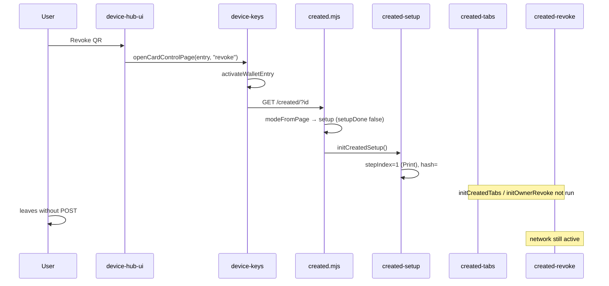

# Hub revoke & Open controls navigation - architecture and fix proposal

**Date:** 2026-05-26  
**Status:** P0–P2 shipped; verification checklist items 1–3, 5–6 covered by automated tests (item 4 manual revoke POST)  
**Scope:** Investigation + implementation reference  
**Reported symptoms:** Hub ⋯ **Revoke QR** and row **Open controls** land on the **Print** setup step on `/created/`; card stays **active** on the network.  
**Related:** `docs/CARD_WORKSPACE_UX.md`, `docs/REVOKE_UI_INVESTIGATION.md`, `docs/DEVICE_HUB_AND_LOCAL_SEARCH.md`, `docs/M4_CREATED_REVOKE_UI.md`

---

## Executive summary

| Observation | Explanation |
|---------------|-------------|
| Lands on “print page” | `/created/` is in **setup** mode (post-create wizard), not **control** mode. Saved cards skip step 1 and open **step 2 - Print** (`#setup-qr`). That is the setup QR panel, not the Advanced revoke UI. |
| Card stays active | Hub **Revoke QR** only **navigates** to `/created/#revoke`. It does **not** POST a revocation. If setup mode blocks the revoke panel, the user never reaches confirm + submit. |
| **Open controls** same destination | `openCardNowPage()` uses the same URL builder and the same mode gate; without `hc_setup_done[profile_id]`, setup mode wins again (usually Print step when the card is already saved). |

**Primary defect:** Card workspace **setup vs control** resolution is out of sync with hub steward navigation and default auto-save. Steward deep-links assume **control** mode and `initCreatedTabs()` hash handling; setup wizard overwrites the hash and never mounts revoke UI.

**Secondary defects** (still real, less likely to match “print page”): `bootstrapOwnerTools()` can reject before `initOwnerRevoke()` runs (`docs/REVOKE_UI_INVESTIGATION.md`); revoke still requires checkbox + button on `/created/` by design.

---

## Architecture (layers)

```text
┌─────────────────────────────────────────────────────────────────┐
│ Device hub / wallet row (device-hub-ui.mjs)                      │
│  Open controls → openCardNowPage()                               │
│  ⋯ Revoke QR / Update status / New QR → openCardControlPage()  │
│    (+ activateWalletEntry when saved keys exist)                 │
└────────────────────────────┬────────────────────────────────────┘
                             │ navigateTo(/created/?profile_id&qr_id[#focus])
                             ▼
┌─────────────────────────────────────────────────────────────────┐
│ Card workspace mode (created-mode.mjs → created.mjs)           │
│  view | setup | control                                          │
│  Gate: profile_id, keys in hc_created, fresh=1, wallet saved,   │
│        hc_setup_done[profile_id]                                 │
└────────────────────────────┬────────────────────────────────────┘
                             │
          setup mode         │         control mode
          (wizard)           │         (Tasks · Advanced)
                             ▼
┌─────────────────────────────────────────────────────────────────┐
│ setup: created-setup.mjs (4 steps; step 2 = Print)               │
│ control: created-tabs.mjs (hash → panel focus)                  │
│          created-revoke.mjs (sign + POST …/revoke)              │
└─────────────────────────────────────────────────────────────────┘
                             │
                             ▼
┌─────────────────────────────────────────────────────────────────┐
│ Resolver POST /.well-known/hc/v1/cards/{id}/revoke             │
│ GET …/status?q= (live truth; card/qr kind)                       │
└─────────────────────────────────────────────────────────────────┘
```

### Hub → `/created/` navigation (`device-keys.mjs`)

| API | Hash | Keys |
|-----|------|------|
| `openCardNowPage(entry)` | none (Tasks tab / `#now` cleared) | `activateWalletEntry()` if wallet row has `owner_private_key_b58` |
| `openCardControlPage(entry, focus)` | e.g. `revoke`, `update-status`, `rotate-qr`, `live-proof` | same |

`createdUrlForEntry()` always sets `profile_id` and `qr_id`. Optional `return_url` + `intent=vouch` when vouching.

### Control-mode deep links (`created-tabs.mjs`)

```javascript
const CREATED_PANEL_FOCUS = {
  "update-status": "manifesto-update-panel",
  revoke: "revoke-details",
  "rotate-qr": "qr-rotate-panel",
  "extend-qr": "qr-extend-panel",
  "live-proof": "live-control-proof",
};
```

On load, if `location.hash` matches a key in `CREATED_PANEL_FOCUS`, `focusCreatedPanel()` selects **Advanced**, opens the `<details>` target, and scrolls to it.

**This only runs when `workspaceMode === "control"`** at the bottom of `created.mjs` (the `else if (workspaceMode === "control")` branch calls `initCreatedTabs()`).

### Mode resolution (`created-mode.mjs`)

`resolveCreatedMode()` returns **setup** when **any** of:

- `freshParam === true` (post-create `?fresh=1`)
- `setupDone === false` (`localStorage.hc_setup_done[profile_id]` missing)
- `walletSaved === false` (`isWalletSaved(profile_id)`)

Returns **control** only when keys exist, wallet saved, setup done, and not fresh.

`markSetupDone(profileId)` is called **only** from setup step 4 (**Open card controls** / `#created-setup-finish`) in `created-setup.mjs`. **Auto-save does not set `hc_setup_done`.**

### Setup wizard behavior (`created-setup.mjs`)

On init:

- If `isWalletSaved(profileId)`, `stepIndex = 1` → first visible step is **Print** (`data-setup-panel="qr"`).
- `writeStepHistory()` sets `location.hash` to `#setup` or `#setup-qr`, **replacing** a steward hash such as `#revoke`.

Setup root is shown; `#created-control-root` (tabs + revoke) stays hidden.

### Revoke execution (`created-revoke.mjs`)

Shipped contract (`docs/M4_CREATED_REVOKE_UI.md`):

1. Signing keys in tab (`hc_created`).
2. `#revoke-actions` visible; checkbox + **Revoke this QR** / **Disable card** buttons.
3. Client signs `revocation`, `POST …/revoke`, session `revoke_state`, UI + `GET …/status` refresh.

Hub **Revoke QR** is intentionally **navigation + focus**, not a one-tap network revoke (confirm-before-submit product rule).

---

## Intended UX (documented product)

| Surface | User expectation (docs) | Actual mechanism |
|---------|-------------------------|------------------|
| Hub **Open controls** | Load keys, open card workspace for steward tasks (`DEVICE_HUB_AND_LOCAL_SEARCH.md`) | `openCardNowPage` → control **Tasks** tab when mode is control |
| Hub ⋯ **Revoke QR** | Steward action → revoke UI (`HUB_CARD_ROW_UX.md` Phase 2) | `openCardControlPage(..., "revoke")` → `/created/#revoke` + Advanced revoke disclosure |
| Hub ⋯ **Open card** | Same as Open controls when keys saved (`CARD_WORKSPACE_PHASE0.md`) | `openCardNowPage` |
| Tasks **Print instructions** | Scroll/open print tip on **Now** tab (`created-dashboard.mjs`) | Only in **control** mode; not the same as setup step 2, but similar copy |
| Status dot **Open controls** | Explainer CTA (`device-dot-state-core.mjs`) | Opens **hub sheet**, not `/created/` (`device-status.mjs` `open_controls` → `openHubFromChrome()`) |

Wallet banner link `#wallet-active-link` is a plain `<a href="/created/?profile_id&qr_id">` without `activateWalletEntry`; keys already in tab are assumed.

---

## Root cause: setup mode intercepts steward navigation

### Reproduction path (high confidence)

1. User creates a card; auto-save writes wallet row (`hc_auto_save_device` default on).
2. User never taps setup step 4 **Open card controls** → `hc_setup_done[profile_id]` never set.
3. From hub, user taps **Revoke QR** or **Open controls**.
4. `activateWalletEntry` loads keys → `hasSigningKeys === true`, `walletSaved === true`, `setupDone === false` → **setup** mode.
5. `initCreatedSetup()` runs; `stepIndex = 1` → **Print** panel visible.
6. Hash becomes `#setup-qr`; `#revoke` handling never runs.
7. User leaves without POST revoke → resolver still **active**.

Same path explains **Open controls** opening the print step instead of Tasks/Advanced.

### Why the card “stays active”

No bug in resolver revoke from hub click - **revoke was never submitted**. The user was on the wrong surface (setup Print), not `#revoke-details` with confirm + POST.

### When deep links work

If the user completed setup once (`hc_setup_done[profile_id] === true`) and `fresh` is absent, `workspaceMode === "control"`, `initCreatedTabs()` runs, `#revoke` opens Advanced revoke. User must still check the box and tap **Revoke this QR**.

### Orthogonal issue: revoke panel init

If mode is control but `hydrateSessionFromNetwork()` throws before `initOwnerRevoke()`, resolver rows stay **Checking…** (`docs/REVOKE_UI_INVESTIGATION.md`). That does not route to Print; treat as separate P0 for status UI.

---

## Sequence (broken path)



---

## Fix proposal (compatible with existing architecture)

**Principle:** First-time post-create keeps the setup wizard; **returning stewards** with saved keys should land in **control** mode and honor steward hashes. Do not move revoke signing into the hub (keeps confirm-before-submit and `created-revoke.mjs` single owner).

### Recommended (P0) - “Returning steward” mode gate

**Change `resolveCreatedMode()`** (and document in `CARD_WORKSPACE_UX.md`):

- If `hasSigningKeys && walletSaved && !freshParam` → **control**, even when `setupDone` is false.
- Keep **setup** for `freshParam` or missing wallet save or missing keys.

**Rationale:** Setup step 1 (“Save on this device”) is satisfied by auto-save / hub save. Forcing setup again on every hub return contradicts `DEVICE_HUB_AND_LOCAL_SEARCH.md` (“Open controls loads keys… steward actions call `openCardControlPage`”).

**Optional belt:** call `markSetupDone(profileId)` inside `saveSessionToWallet` success (or `created-device-save` `runSave`) so `hc_setup_done` matches reality.

**One-time hygiene:** on hub or `/created/` load, if `isWalletSaved(profileId)` and no `hc_setup_done` entry, set it (migration in JS, no D1).

### Recommended (P0) - Steward hash must not be clobbered

In `initCreatedSetup()`, **before** `writeStepHistory()`:

- If `location.hash` matches `CREATED_PANEL_FOCUS` (e.g. `#revoke`), **do not start setup**; call parent `enterControlWorkspace()` + `focusPanel(hash)` instead.

Alternatively, skip `initCreatedSetup` entirely when `openCardControlPage` used a steward focus (could pass `?focus=revoke` query param if hash race is a concern; hash is sufficient if setup does not overwrite it).

### Recommended (P1) - `bootstrapOwnerTools` resilience

Per `REVOKE_UI_INVESTIGATION.md`: try/catch around `hydrateSessionFromNetwork`; always `initOwnerRevoke` when `profileId` + `qrId` exist so resolver rows update even if card JSON fetch fails.

### Recommended (P2) - UX clarity (no behavior change)

| Issue | Direction |
|-------|-----------|
| Hub **Revoke QR** sounds like instant revoke | Subtitle in menu or first visit toast: “Opens card page to confirm” |
| Status dot **Open controls** vs row **Open controls** | Dot → hub only; row → `/created/`. Document in `DEVICE_OS_QA.md`; optional dot CTA `open_card_controls` when one saved card with keys |
| Wallet `#wallet-active-link` | Use `openCardNowPage` pattern (activate + navigate) for consistency |

### Explicit non-goals (bad fit for architecture)

| Idea | Why not |
|------|---------|
| Hub one-tap revoke without confirm | Breaks M4 confirm-before-submit and `REVOKE_AND_LIFECYCLE_V1.md` |
| Revoke via scan page | Out of scope per M4 |
| Separate `/revoke/` route | Duplicates `created-revoke.mjs`; fight workspace model |
| Skip keys gate on hub | Security/custody regression |

---

## Verification checklist (after implementation)

| # | Check | Automated |
|---|--------|-----------|
| 1 | Saved card, no `hc_setup_done`: hub **Revoke QR** → Advanced `#revoke-details`, not setup Print | `e2e/device-os-wallet.spec.ts` |
| 2 | **Open controls** → control Tasks (Now), not setup Print | `e2e/device-os-wallet.spec.ts` |
| 3 | **Fresh create** `?fresh=1` still shows setup wizard | `e2e/device-os-wallet.spec.ts` |
| 4 | Complete revoke: checkbox + **Revoke this QR** → `POST` 200, `qr_revoked` on scan | Manual (`docs/M4_CREATED_REVOKE_UI.md` exit test) |
| 5 | Legacy wallet: saved card reaches control (`syncSetupDoneForSavedProfile`) | `worker/tests/created-mode.test.ts` |
| 6 | Mode + hub deep-link unit/e2e | `created-mode.test.ts`, `device-os-wallet.spec.ts` |

```bash
npm run worker:test -- worker/tests/created-mode.test.ts
npm run e2e -- e2e/device-os-wallet.spec.ts
```

Manual: `docs/DEVICE_OS_QA.md` P0-2 (Open controls → `/created/` with keys), revoke exit test in `docs/M4_CREATED_REVOKE_UI.md`.

---

## Files map

| File | Role |
|------|------|
| `site/js/device-hub-ui.mjs` | Row actions, `openCardControlPage` / `openCardNowPage` |
| `site/js/device-hub-controls-core.mjs` | Steward control ids + `focus` targets |
| `site/js/device-keys.mjs` | Navigation + `activateWalletEntry` |
| `site/js/created-mode.mjs` | setup vs control gate |
| `site/js/created.mjs` | Mode branch: setup vs `initCreatedTabs` |
| `site/js/created-setup.mjs` | Wizard; overwrites hash; Print step |
| `site/js/created-tabs.mjs` | `#revoke` → `revoke-details` |
| `site/js/created-revoke.mjs` | Sign + POST revoke |
| `site/js/created-device-save.mjs` | Auto-save (does not mark setup done today) |
| `docs/CARD_WORKSPACE_UX.md` | Modes and setup contract |
| `docs/REVOKE_UI_INVESTIGATION.md` | Keys gate + stuck Checking |

---

## Answer: is a compatible fix possible?

**Yes.** The architecture already separates **navigation** (hub + `openCardControlPage`) from **revocation** (`created-revoke.mjs`). The bug is a **mode-routing** mismatch after card workspace Phase 1, not a broken revoke API. Adjusting when **setup** vs **control** runs-and not letting setup overwrite steward hashes-restores the documented hub → `/created/#revoke` flow without redesigning revoke or moving signing into the hub.
