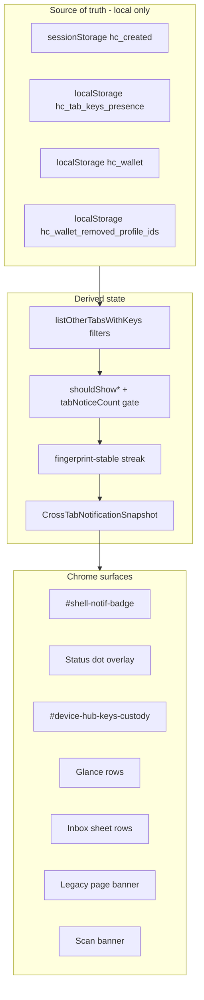

# Keys custody and notification improvement plan

**Status:** Phase 1 shipped (unified hub panel) · Phases 2–7 planned  
**Audience:** Product, engineering  
**Related:** [`KEYS_CARDS_AND_VERIFICATION.md`](KEYS_CARDS_AND_VERIFICATION.md) · [`CROSS_TAB_KEYS_NOTIFICATION_SYSTEM.md`](CROSS_TAB_KEYS_NOTIFICATION_SYSTEM.md) · [`CROSS_TAB_KEYS_REBUILD_PLAN.md`](CROSS_TAB_KEYS_REBUILD_PLAN.md) · [`DEVICE_INBOX.md`](DEVICE_INBOX.md) · [`VOUCH_READY_KEYS_DESIGN.md`](VOUCH_READY_KEYS_DESIGN.md) · [`M5_5_OWNER_KEY_PORTABILITY.md`](M5_5_OWNER_KEY_PORTABILITY.md) · [`DEVICE_OS_REQUEST_BUDGET.md`](DEVICE_OS_REQUEST_BUDGET.md) · [`PRODUCT_POSITIONING_AND_LOOP_STRATEGY.md`](PRODUCT_POSITIONING_AND_LOOP_STRATEGY.md)

---

## Executive summary

A meaningfully better keys and key-notification system is **possible** without server-side key sync or OS push for cross-tab custody. Improvements concentrate on **custody clarity** (one user mental model) and **notification surface reduction** (badge/dot as urgency, hub as authority), not on new infrastructure.

Engineering already shipped the cross-tab **notification rebuild** (Phases 1–6 in [`CROSS_TAB_KEYS_REBUILD_PLAN.md`](CROSS_TAB_KEYS_REBUILD_PLAN.md)). This plan covers **product and UX layers** that rebuild alone does not address.

---

## What exists today

Users often conflate three separate ideas. The product must keep them distinct in docs and UI.

| Idea | What it is | Where it lives |
|------|------------|----------------|
| **Keys (custody)** | Ed25519 signing material for one card | `sessionStorage.hc_created` (this tab) · `localStorage.hc_wallet` (saved) |
| **Key notifications (cross-tab)** | Other open tabs heartbeating keys you may care about | `localStorage.hc_tab_keys_presence` → inbox kinds `cross_tab_keys` / `orphan_keys_removed` |
| **Verification (trust label)** | Public resolver state (Registered, Steward, …) | Network poll / scan — not keys |

### Notification mechanism (not OS push)

| User says | What they usually mean | Actual mechanism |
|-----------|------------------------|------------------|
| “Notification” / “alert popped up” | Inbox badge, blue dot notch, hub card, banner, glance row, inbox sheet row | **In-app chrome** driven by inbox kinds `cross_tab_keys` or `orphan_keys_removed` |
| “Random notification” | Brief flash of badge/dot/banner with wrong or changing card label | **Presence churn** + historical split refresh paths (mitigated by coordinator) |
| “Notification won’t go away” | Badge/dot after save or closing the other tab | **Stale presence**, **streak not reset on custody change**, or **another tab still heartbeating** |
| OS push / browser alert | System `Notification` | **Never** for cross-tab — `live_proof` only ([`DEVICE_INBOX.md`](DEVICE_INBOX.md)) |

**Product sentence:** *Cross-tab keys tell you that **another open, visible browser tab** on this device is holding signing keys you may care about — not that a card exists on the network, and not via OS push.*

---

## Three layers (do not conflate)



| Layer | Question | Must not |
|-------|----------|----------|
| **Presence** | Which tabs heartbeated keys recently? | Store private keys in `localStorage` |
| **Inbox kinds** | Show cross-tab vs orphan vs tab-unsaved? | Double-count the same profile |
| **Chrome** | Render badge, dot, hub, sheet? | Re-derive presence per surface |

---

## Why keys + notifications still feel rough

### 1. Tab isolation is real

`hc_created` is per-tab. Heartbeat presence (~5s), show window (~7s), stale prune (~10s), and lag after force-quit are inherent.

### 2. Badge count ≠ “tabs with keys”

Badge sums live proof + cross-tab tabs + unsaved-this-tab + card-disabled. “3” is not necessarily three key tabs.

### 3. Primary label instability (aggregate UI)

Aggregate cross-tab copy uses latest `updatedAt`. Multiple tabs → changing card name in banner/subtitle.

### 4. Save vs remove semantics are subtle

- Save hides cross-tab for that `profile_id`.
- Another tab with a different profile still triggers notice (expected).
- Remove from device can increase notices until orphan/denylist path.

### 5. Multi-tab create is under-modeled

Several create tabs with unsaved keys may under-count; dedicated inbox kind is an open decision (Phase 3).

### 6. Scale breaks before storage quota

Comfortable use: **1–5 saved cards**; **~10+** out of spec until poll budget and shell perf fixed ([`KEYS_CARDS_AND_VERIFICATION.md`](KEYS_CARDS_AND_VERIFICATION.md)).

---

## Target architecture (custody-first)

Users think in **custody**. Notifications answer: **“Do I need to do something about custody right now?”**

---

## Phased improvements

### Phase 1 — Unified hub custody panel ✅

| Subpoint | Detail |
|----------|--------|
| **Surface** | `#device-hub-keys-custody` on landing, create, created hub |
| **Rows** | This tab (active/unsaved) · one row per other tab · one row per orphan · education when idle |
| **Demote duplicates** | Skip `#device-hub-crosstab-notice` and `#device-hub-notice-group` when panel present |
| **Inbox scroll** | `cross_tab_keys`, `orphan_keys_removed`, `tab_keys_unsaved` → panel |

**Code:** `device-hub-keys-custody-core.mjs`, `device-hub-keys-custody.mjs`

### Phase 2 — Badge and dot semantics

Clearer ARIA/tooltip breakdown; glance copy aligned with per-tab rows; keep dot overlay priority stack.

### Phase 3 — Richer inbox kinds

Open decisions: post-save presence ping; remove-from-device clear-everywhere confirm; multi-tab unsaved kind.

### Phase 4 — Proactive custody

Vouch-ready (shipped), default vouch card, scan strip, PIN/lock for shared devices.

### Phase 5 — Faster, quieter presence

Write on fingerprint change (partial); post-save BroadcastChannel; per-tab list copy.

### Phase 6 — Scale limits + portability

1–5 card guardrails; poll budget; backup/import ([`M5_5_OWNER_KEY_PORTABILITY.md`](M5_5_OWNER_KEY_PORTABILITY.md)).

### Phase 7 — Demote legacy banners

Hub + sheet authority; page banner only without shell badge; scan banner retained.

---

## What is probably not “better”

| Approach | Why not |
|----------|---------|
| OS push for cross-tab | Wrong channel |
| Server-side key presence | Violates browser-held keys |
| Cloud key sync / accounts | Non-goal Phase A–C |
| Global “keys active” without tab awareness | Incompatible with `sessionStorage` |

---

## Regression tests

```bash
npm run worker:test -- worker/tests/device-hub-keys-custody-core.test.ts worker/tests/device-inbox.test.ts
npm run e2e -- e2e/device-cross-tab-keys.spec.ts e2e/device-inbox.spec.ts
```

---

## Files

| Path | Role |
|------|------|
| `site/js/device-hub-keys-custody-core.mjs` | Pure panel rows |
| `site/js/device-hub-keys-custody.mjs` | Hub render + actions |
| `site/js/device-hub-ui.mjs` | Refresh hook |
| `site/js/device-cross-tab-banner.mjs` | Skips legacy hub slots |
| `site/js/device-hub-inbox-alerts.mjs` | Skips tab-keys notice group |
| `site/js/device-inbox-core.mjs` | Scroll targets |
