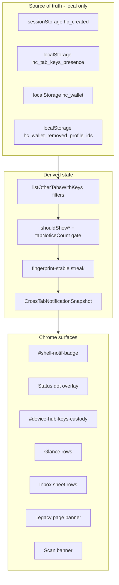

# Keys custody and notification improvement plan

**Status:** Phases 1–5 + 7 (partial) shipped · Phase 6 (partial) shipped  
**Audience:** Product, engineering  
**Related:** [`KEYS_CARDS_AND_VERIFICATION.md`](KEYS_CARDS_AND_VERIFICATION.md) · [`CROSS_TAB_KEYS_NOTIFICATION_SYSTEM.md`](CROSS_TAB_KEYS_NOTIFICATION_SYSTEM.md) · [`CROSS_TAB_KEYS_REBUILD_PLAN.md`](CROSS_TAB_KEYS_REBUILD_PLAN.md) · [`DEVICE_INBOX.md`](DEVICE_INBOX.md) · [`VOUCH_READY_KEYS_DESIGN.md`](VOUCH_READY_KEYS_DESIGN.md) · [`M5_5_OWNER_KEY_PORTABILITY.md`](M5_5_OWNER_KEY_PORTABILITY.md) · [`DEVICE_OS_REQUEST_BUDGET.md`](DEVICE_OS_REQUEST_BUDGET.md) · [`PRODUCT_POSITIONING_AND_LOOP_STRATEGY.md`](PRODUCT_POSITIONING_AND_LOOP_STRATEGY.md)

---

## Executive summary

A meaningfully better keys and key-notification system is **possible** without server-side key sync or OS push for cross-tab custody. Improvements concentrate on **custody clarity** (one user mental model) and **notification surface reduction** (badge/dot as urgency, hub as authority), not on new infrastructure.

Engineering already shipped the cross-tab **notification rebuild** (Phases 1–6 in [`CROSS_TAB_KEYS_REBUILD_PLAN.md`](CROSS_TAB_KEYS_REBUILD_PLAN.md)). This plan covers **product and UX layers** that rebuild alone does not address.

---

## What exists today

Users often conflate three separate ideas. The product must keep them distinct in docs and UI.

| Idea | What it is | Where it lives |
|------|------------|----------------|
| **Keys (custody)** | Ed25519 signing material for one card | `sessionStorage.hc_created` (this tab) · `localStorage.hc_wallet` (saved) |
| **Key notifications (cross-tab)** | Other open tabs heartbeating keys you may care about | `localStorage.hc_tab_keys_presence` → inbox kinds `cross_tab_keys` / `orphan_keys_removed` |
| **Verification (trust label)** | Public resolver state (Registered, Steward, …) | Network poll / scan — not keys |

### Notification mechanism (not OS push)

| User says | What they usually mean | Actual mechanism |
|-----------|------------------------|------------------|
| “Notification” / “alert popped up” | Inbox badge, blue dot notch, hub card, banner, glance row, inbox sheet row | **In-app chrome** driven by inbox kinds `cross_tab_keys` or `orphan_keys_removed` |
| “Random notification” | Brief flash of badge/dot/banner with wrong or changing card label | **Presence churn** + historical split refresh paths (mitigated by coordinator) |
| “Notification won’t go away” | Badge/dot after save or closing the other tab | **Stale presence**, **streak not reset on custody change**, or **another tab still heartbeating** |
| OS push / browser alert | System `Notification` | **Never** for cross-tab — `live_proof` only ([`DEVICE_INBOX.md`](DEVICE_INBOX.md)) |

**Product sentence:** *Cross-tab keys tell you that **another open, visible browser tab** on this device is holding signing keys you may care about — not that a card exists on the network, and not via OS push.*

---

## Three layers (do not conflate)



| Layer | Question | Must not |
|-------|----------|----------|
| **Presence** | Which tabs heartbeated keys recently? | Store private keys in `localStorage` |
| **Inbox kinds** | Show cross-tab vs orphan vs tab-unsaved? | Double-count the same profile |
| **Chrome** | Render badge, dot, hub, sheet? | Re-derive presence per surface |

---

## Why keys + notifications still feel rough

### 1. Tab isolation is real

`hc_created` is per-tab. Heartbeat presence (~5s), show window (~7s), stale prune (~10s), and lag after force-quit are inherent.

### 2. Badge count ≠ “tabs with keys”

Badge sums live proof + cross-tab tabs + unsaved-this-tab + card-disabled. “3” is not necessarily three key tabs.

### 3. Primary label instability (aggregate UI)

Aggregate cross-tab copy uses latest `updatedAt`. Multiple tabs → changing card name in banner/subtitle.

### 4. Save vs remove semantics are subtle

- Save hides cross-tab for that `profile_id`.
- Another tab with a different profile still triggers notice (expected).
- Remove from device can increase notices until orphan/denylist path.

### 5. Multi-tab create is under-modeled

Several create tabs with unsaved keys may under-count; dedicated inbox kind is an open decision (Phase 3).

### 6. Scale breaks before storage quota

Comfortable use: **1–5 saved cards**; **~10+** out of spec until poll budget and shell perf fixed ([`KEYS_CARDS_AND_VERIFICATION.md`](KEYS_CARDS_AND_VERIFICATION.md)).

---

## Target architecture (custody-first)

Users think in **custody**. Notifications answer: **“Do I need to do something about custody right now?”**

---

## Phased improvements

### Phase 1 — Unified hub custody panel ✅

| Subpoint | Detail |
|----------|--------|
| **Surface** | `#device-hub-keys-custody` on landing, create, created hub |
| **Rows** | This tab (active/unsaved) · one row per other tab · one row per orphan · education when idle |
| **Demote duplicates** | Skip `#device-hub-crosstab-notice` and `#device-hub-notice-group` when panel present |
| **Inbox scroll** | `cross_tab_keys`, `orphan_keys_removed`, `tab_keys_unsaved` → panel |

**Code:** `device-hub-keys-custody-core.mjs`, `device-hub-keys-custody.mjs`

### Phase 2 — Badge and dot semantics ✅

Clearer ARIA/tooltip breakdown; glance copy aligned with per-tab custody rows; dot overlay priority stack unchanged.

| Subpoint | Detail |
|----------|--------|
| **ARIA / tooltip** | `inboxBadgeAriaLabel(items, ctx)` includes total count + per-tab labels; `inboxBadgeTitle()` on `#shell-notif-badge` |
| **Glance copy** | `expandInboxItemsForChrome()` + `buildGlanceRowPlan()` one row per cross-tab/orphan tab |
| **Dot overlay** | Unchanged — `proof_waiting` → `cross_tab_keys` → `card_disabled_since_visit` |

**Code:** `device-inbox-core.mjs` (`expandInboxItemsForChrome`, `inboxBadgeTitle`), `device-status.mjs`, `device-hub-glance.mjs`

### Phase 3 — Richer inbox kinds ✅

| Decision | Shipped approach |
|----------|------------------|
| **Post-save presence ping** | `drop-profile-presence` on `hc-tab-keys-custody` — presence-only; session keys stay until tab closes |
| **Remove from device** | Optional second confirm → `clear-profile-keys` broadcast when other tabs still heartbeat |
| **Multi-tab unsaved** | Inbox kind `other_tabs_unsaved_keys` when ≥2 other tabs (single tab stays `cross_tab_keys`) |

| Subpoint | Detail |
|----------|--------|
| **Save hook** | `notifyWalletProfileSaved()` → `hc-profile-saved-on-device` → `notifyProfileSavedOnDevice()` |
| **Remove hook** | `offerClearOtherTabKeysOnRemove()` in hub + wallet remove flows |
| **Chrome** | Glance/sheet/badge expand multi-tab aggregate to per-tab rows; dot overlay unchanged |

**Code:** `device-tab-presence.mjs`, `device-wallet.mjs`, `device-inbox-core.mjs`, `device-notice-nav.mjs`, `device-hub-ui.mjs`, `card-wallet.mjs`

### Phase 4 — Proactive custody ✅

**Goal:** Reduce reactive cross-tab chrome by surfacing vouch-ready settings in the custody panel.

| Subpoint | Detail |
|----------|--------|
| **Vouch-ready keys** | Shipped on scan — opt-in auto-activate ([`VOUCH_READY_KEYS_DESIGN.md`](VOUCH_READY_KEYS_DESIGN.md)) |
| **Default vouch card** | Hub custody row when default + auto-activate set; clear default or jump to saved cards |
| **Scan strip** | Shipped on scan — `Signing as @handle` status + Stop ([`vouch-issue.mjs`](../site/js/vouch-issue.mjs)) |
| **Sign lock / PIN** | Hub custody row when keys active in tab and per-card lock enabled |
| **Multi-card nudge** | Hub row when ≥2 saved cards with keys and no default (idle, no cross-tab) |

**Code:** `device-hub-keys-custody-core.mjs`, `device-hub-keys-custody.mjs`

### Phase 5 — Faster, quieter presence ✅

**Goal:** Less `storage` churn, faster hide after custody changes; clearer per-tab copy.

| Subpoint | Detail |
|----------|--------|
| **Write on fingerprint change** | Shipped — `shouldTouchPresenceRow()` + `shouldSkipPresenceHeartbeat()` ([`device-tab-presence-core.mjs`](../site/js/device-tab-presence-core.mjs)) |
| **Post-save presence ping** | Shipped in Phase 3 — `drop-profile-presence` BroadcastChannel; receiving tab dispatches `hc-cross-tab-custody-invalidated` |
| **Per-tab list copy** | `device-cross-tab-copy-core.mjs` — “Keys open in N other tabs” + joined labels in inbox, hub custody summary, banners, sheet |

**Code:** `device-cross-tab-copy-core.mjs`, `device-inbox-core.mjs`, `device-hub-keys-custody-core.mjs`, `device-cross-tab-banner.mjs`, `device-tab-presence.mjs`

### Phase 6 — Scale limits + portability (partial) ✅

| Subpoint | Detail |
|----------|--------|
| **1–5 card guardrails** | Hub custody `wallet_scale` row when saved count > 5 (below large-wallet threshold); links to import + saved cards |
| **Large wallet copy** | Reuses `walletScaleHint()` / `walletScaleRowTitle()` from `device-wallet-scale-core.mjs` |
| **Poll budget / backup** | Large-wallet poll caps unchanged; full backup/import path — [`M5_5_OWNER_KEY_PORTABILITY.md`](M5_5_OWNER_KEY_PORTABILITY.md) |

**Code:** `device-wallet-scale-core.mjs`, `device-hub-keys-custody-core.mjs`, `device-hub-keys-custody.mjs`, `device-hub-ui.mjs`

### Phase 7 — Demote legacy banners ✅ (partial)

| Surface | Shipped behavior |
|---------|------------------|
| **Landing `#device-cross-tab-banner`** | Hidden when `#shell-notif-badge` exists (inbox authority) |
| **Hub `#device-hub-crosstab-notice` / `#device-hub-notice-group`** | Skipped when `#device-hub-keys-custody` unified panel mounts |
| **`/wallet/` `#wallet-tab-hint`** | Hidden for cross-tab/orphan when shell badge present — `shouldShowWalletTabHintCrossTabChrome()` |
| **Scan `#scan-cross-tab-banner`** | Unchanged (retained) |

**Code:** `device-cross-tab-banner.mjs`, `device-hub-inbox-alerts.mjs`, `wallet-tab-hint-chrome-core.mjs`, `wallet-page-chrome.mjs`

---

## What is probably not “better”

| Approach | Why not |
|----------|---------|
| OS push for cross-tab | Wrong channel |
| Server-side key presence | Violates browser-held keys |
| Cloud key sync / accounts | Non-goal Phase A–C |
| Global “keys active” without tab awareness | Incompatible with `sessionStorage` |

---

## Regression tests

```bash
npm run worker:test -- worker/tests/device-hub-keys-custody-core.test.ts worker/tests/device-inbox.test.ts worker/tests/wallet-tab-hint-chrome.test.ts
npm run e2e -- e2e/device-cross-tab-keys.spec.ts e2e/device-inbox.spec.ts
```

---

## Files

| Path | Role |
|------|------|
| `site/js/device-hub-keys-custody-core.mjs` | Pure panel rows |
| `site/js/device-hub-keys-custody.mjs` | Hub render + actions |
| `site/js/device-hub-ui.mjs` | Refresh hook |
| `site/js/device-cross-tab-banner.mjs` | Skips legacy hub slots |
| `site/js/device-hub-inbox-alerts.mjs` | Skips tab-keys notice group |
| `site/js/device-inbox-core.mjs` | Scroll targets |
