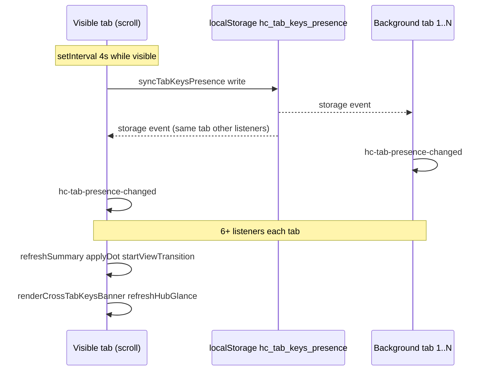

# Investigation: Laggy landing scroll after cross-tab inbox work (May 26)

**Date:** 2026-05-26  
**Status:** Root cause identified — fix tracked in [`CROSS_TAB_KEYS_REBUILD_PLAN.md`](CROSS_TAB_KEYS_REBUILD_PLAN.md) Phase 2/5  
**Related:** [`SAFARI_WEBKIT_SHELL_REGRESSION_INVESTIGATION.md`](SAFARI_WEBKIT_SHELL_REGRESSION_INVESTIGATION.md) · [`CROSS_TAB_KEYS_FLASH_AFTER_CARD_DELETE_INVESTIGATION.md`](CROSS_TAB_KEYS_FLASH_AFTER_CARD_DELETE_INVESTIGATION.md) · [`CROSS_TAB_KEYS_NOTIFICATION_SYSTEM.md`](CROSS_TAB_KEYS_NOTIFICATION_SYSTEM.md) · [`DEVICE_INBOX.md`](DEVICE_INBOX.md) · [`DEVICE_OS_REQUEST_BUDGET.md`](DEVICE_OS_REQUEST_BUDGET.md)

---

## Executive summary

**Laggy landing scroll returned after the May 26 cross-tab commits, not because document scroll-edge chrome was re-enabled** (`body.shell-scroll-chrome-off` is still on; `device-shell-chrome.mjs` has no `scroll` listener).

The regression is **main-thread churn from inter-tab keys presence** (`localStorage` `hc_tab_keys_presence`, ~4s heartbeats) fanning out to **every open Humanity tab**, each running **multiple synchronous chrome refreshes** — especially `refreshSummary()` in `device-status.mjs`, which calls `applyDot()` with **`document.startViewTransition`** on every tick when the hub is closed.

**Your “6 keys in 6 tabs” setup is a strong match:** each tab with an active signing session heartbeats when visible; writes hit all other tabs via the `storage` event. More tabs ⇒ more events ⇒ more duplicate DOM/inbox work per second on the tab you are trying to scroll.

**Commits that made it worse (on `main` at `0f80ede`):**

| Commit | Role |
|--------|------|
| **`0f80ede`** | **Primary regressor** — orphan-keys inbox path, extra presence reads (`getOrphanRemovedTabsWithKeys`), heavier hub banner DOM, more `getInboxItems()` work per refresh. |
| **`918c4ab`** | **Amplifier** — denylist reads on every `getOtherTabsWithKeys()`, extra `hc-tab-presence-changed` from `hc-wallet-removed-profiles-changed` / `purgePresenceForProfile`. |
| **`b3ed164`** (May 24) | **Latent architecture** — wired `hc-tab-presence-changed` → full `refreshSummary()`; tolerable with fewer tabs / lighter inbox, not the May 26 trigger alone. |

**Not the cause:** `b8cfb11` (live-control poll scoped to hub/inbox/wallet — polling should **stop** on closed-hub landing). `14a9df8` (chrome inset floor + `ResizeObserver` only — no scroll-edge hide/show).

---

## Symptoms vs prior Safari incident

| Clue | Interpretation |
|------|----------------|
| Hub open → smooth inner scroll | Same as [`SAFARI_WEBKIT_SHELL_REGRESSION_INVESTIGATION.md`](SAFARI_WEBKIT_SHELL_REGRESSION_INVESTIGATION.md): `body.device-hub-sheet-open { overflow: hidden }` stops document scroll; hub scroll does not run landing chrome refresh storms. |
| Hub closed → landing scroll feels heavy again | Document scroll is fine structurally; **periodic / cross-tab-driven chrome refresh** competes with compositor on WebKit. |
| ~6 Humanity tabs with keys | Presence map has multiple rows; badge/inbox counts reflect **other tabs**, not “6 keys in one tab.” |
| Lag “started again” after recent deploy | Aligns with **`918c4ab` + `0f80ede`** shipping same day as cross-tab UX, not Step 5 chrome inset alone. |

---

## Mechanism (end-to-end)

### 1. Presence heartbeat (local only, no Worker)

- `device-tab-presence.mjs`: `PRESENCE_HEARTBEAT_MS = 4000`, visible tab only.
- `storage` on `hc_tab_keys_presence` → `hc-tab-presence-changed` on **all** tabs (including the writer).

### 2. Event fan-out per tab (HEAD `0f80ede`)

Listeners on `hc-tab-presence-changed` include at least:

- `device-status.mjs` → **`refreshSummary()`** (immediate on HEAD)
- `device-cross-tab-banner.mjs` → `renderCrossTabKeysBanner()`
- `device-hub-glance.mjs` → `refreshHubGlance()`
- `device-hub-ui.mjs` → `syncHubInboxAlertGroups()` + `refreshEmptyHint()`
- `device-inbox-sheet.mjs` → `refresh()`
- `wallet-page.mjs` → `updateContextBanners()` (wallet route)

So one heartbeat on one machine with **six open tabs** can mean **six tabs × several listeners** of synchronous work, plus duplicate inbox gathers.

### 3. Why `refreshSummary()` hurts scroll

On HEAD (`0f80ede`), each `refreshSummary()`:

1. Calls **`applyDot()`** → often **`document.startViewTransition`** when hub is collapsed (no skip for presence-only overlay churn). Console may show `AbortError: Old view transition aborted…` under churn ([`CARD_DISABLED_SINCE_VISIT_FALSE_POSITIVE_INVESTIGATION.md`](CARD_DISABLED_SINCE_VISIT_FALSE_POSITIVE_INVESTIGATION.md) § view transition noise).
2. Calls **`getInboxItems()`** multiple times indirectly (`dotOverlayState`, `notificationCount`, banner `shouldShow*` paths, glance) — each **`gatherInboxInput()`** on HEAD runs card-disabled gather + **`getOtherTabsWithKeys()`** + **`getOrphanRemovedTabsWithKeys()`** (added in `0f80ede`) + live-control count.
3. Re-renders cross-tab / orphan hub banner HTML.

When the user scrolls the landing document for several seconds, a **visible-tab heartbeat can land mid-gesture** → single-frame jank spike. With many tabs, **background tabs also refresh** when any tab writes presence (wakes layout/badge paths if that tab is later focused).

### 4. What `918c4ab` added

- `loadRemovedProfileIds()` on every `getOtherTabsWithKeys()` (sessionStorage read).
- `hc-wallet-removed-profiles-changed` → synthetic `hc-tab-presence-changed`.
- `purgePresenceForProfile()` → extra `localStorage` writes → extra `storage` storms after remove-from-device.

### 5. What did **not** come back

- Document **`scroll`** listener / `top-chrome--edge-hidden` toggling on landing (`shell-scroll-chrome-off`).
- Global `initDeviceOsCoordinator()` auto-start (reverted in `277d08e` for rate limits).

---

## Reproduction hints

1. Open **5–6** Humanity tabs on the same origin, each with **active signing keys** (different profiles or same — presence is per tab id).
2. Focus landing `/`, hub **closed**, scroll the main document for 10+ s.
3. In Performance or logging, count `hc-tab-presence-changed` / `refreshSummary` — expect roughly **one burst per ~4s per visible tab**, plus bursts when **switching tabs** (new tab heartbeats immediately).
4. Close all but one tab — scroll should feel **materially lighter** if presence fan-out is the dominant cost.

---

## Fix directions (not implemented in this doc)

Priority order aligned with cross-tab investigation **Path G** (partially present in workspace, not on `main` at `0f80ede`):

1. **Debounce** `hc-tab-presence-changed` → `refreshSummary()` (`DEVICE_OS_DEBOUNCE_MS`, e.g. 300ms).
2. **Coalesce** `gatherInboxInput()` within one refresh (50ms cache) so banner/dot/badge share one read.
3. **Skip `startViewTransition`** when only cross-tab/orphan overlay changes (`shouldSkipCrossTabOverlayViewTransition`).
4. **Single chrome coordinator** for presence (one listener → one `refreshSummary`, drop duplicate banner/glance passes) — longer term.
5. **Operational:** reduce open Humanity tabs with keys during heavy landing use; use **Clear keys on this device** / close orphan tabs after remove (`0f80ede` UX).

---

## Verification checklist

- [ ] Repro with N tabs → repro with 1 tab (same profile).
- [ ] Confirm `body.shell-scroll-chrome-off` on landing (scroll-edge chrome still off).
- [ ] Confirm hub closed → `liveControlPollingShouldRun` false (no 5s poll loop on landing).
- [ ] After Path G ship: presence bursts coalesce; view-transition abort noise drops.
