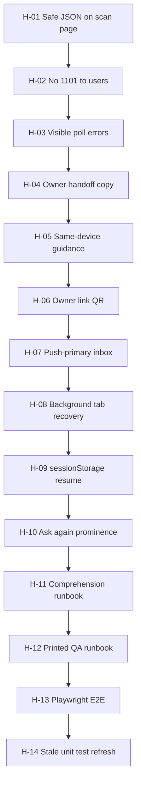

# Live control usability hardening

**Status:** In progress — Slice A shipped (H-01–H-03); Slice B shipped (H-04–H-06); Slice C shipped (H-07–H-08)  
**Gate:** `docs/M7_LIVE_CONTROL_ALPHA.md` Step 2 · post–production FK repair (`docs/LIVE_PROOF_FAILURE_INVESTIGATION.md`)  
**Related:** [`M7_LIVE_CONTROL_COPY_COMPREHENSION_RUNBOOK.md`](M7_LIVE_CONTROL_COPY_COMPREHENSION_RUNBOOK.md) · [`M7_LIVE_CONTROL_PRINTED_QA_RUNBOOK.md`](M7_LIVE_CONTROL_PRINTED_QA_RUNBOOK.md) · [`SCAN_PAGE_TRUST_UI.md`](SCAN_PAGE_TRUST_UI.md) · [`DEVICE_INBOX.md`](DEVICE_INBOX.md) · [`HOSTED_TIER_PUSH_ARCHITECTURE_RFC.md`](HOSTED_TIER_PUSH_ARCHITECTURE_RFC.md) · [`PRODUCT_LANGUAGE_STRATEGY.md`](PRODUCT_LANGUAGE_STRATEGY.md) (plain-language errors)

---

## Purpose

Step 1 shipped the live proof loop (ask → challenge → owner sign → poll → success/expiry). Step 2 shipped in-person layout, countdowns, and stale-proof gating. Production FK drift (May 2026) showed that **unhappy paths** — server errors, silent poll failures, same-device confusion, owner handoff — are where strangers bounce, not the trust model itself.

This document is the **implementation backlog** for hardening live control **usability**: plain-language errors, in-person handoff, session recovery, comprehension QA, and rollout gates. Each item is independently shippable.

---

## What is already solid

| Area | Shipped behavior | Primary code |
|------|------------------|--------------|
| Core loop | `POST` challenge → owner sign → scanner poll → proven/expired | `worker/src/resolver/live-control.ts`, `scan-html.ts`, `site/js/created.mjs` |
| In-person layout | Side-by-side **Scanner** \| **Owner** at ≥640px when waiting | `scan-html.ts`, `scan-pass.css` |
| Countdowns | Challenge wait **Expires in M:SS**; success **Proof display expires in M:SS** | `renderLiveControlScript()` in `scan-html.ts` |
| Stale proof | SSR + client gates; no revived stale `proof_expires_at` | `scan.ts`, `scan-html.ts` |
| Owner deeplink | `/created/?live_challenge=…&return_url=…` + poll for pending | `created.mjs` `initLiveControlProof()` |
| Owner errors | `resolverErrorMessage()` on sign/submit | `resolver-user-error-core.mjs`, `created.mjs` |
| Device inbox | Poll + push path to surface waiting requests (signing stays on `/created/`) | `device-live-control-inbox.mjs` |
| Production smoke | `POST …/live-control/challenges` in rollout step 2/4 | `hosted-rollout-scan-smoke.mjs` |
| FK repair | `worker:repair-live-control-challenges-fk`; rebuild in child-object QR script | `repair-live-control-challenges-fk.sql` |

---

## Priority legend

| Priority | Meaning |
|----------|---------|
| **P0** | Blocks comprehension or produces cryptic failures; ship before stranger QA |
| **P1** | In-person / recovery friction; ship during Step 2 polish |
| **P2** | Process gates and validation; run in parallel with engineering |

---

## P0 — Stop confusing failures

### H-01 — Safe fetch parsing on the scan page

**Status:** Shipped (2026-05-29)

**Problem:** The scanner inline script (`renderLiveControlScript()` in `worker/src/resolver/scan-html.ts`) calls `res.json()` without checking `res.ok` or content type. Non-JSON bodies (e.g. Cloudflare **Error 1101**) throw in Safari as *“The string did not match the expected pattern.”* The owner path on `/created/` already uses `resolverErrorMessage()` — the scan client does not.

**Proposed behavior:**

- Parse response body safely: if `Content-Type` is not JSON or parse fails, use a status-based fallback string.
- On `!res.ok`, map resolver JSON `message` / `error` through the same plain-language rules as `resolver-user-error-core.mjs` (inline equivalent or shared bundle snippet).
- Log full URL + status to `console.warn` only; never show raw URLs in UI.

**Suggested copy (examples):**

| HTTP | User-facing status |
|------|-------------------|
| 500 / 1101 / non-JSON | *Could not create live proof request. Try again in a moment.* |
| 503 `RESOLVER_SCHEMA` | *Live proof is temporarily unavailable. Try again shortly.* |
| 409 `LIVE_CONTROL_UNAVAILABLE` | *Live proof is not available for this scan right now.* |
| 422 validation | Use server `message` when present |

**Files:** `worker/src/resolver/scan-html.ts` · `worker/tests/scan.test.ts` · optionally `worker/tests/scan-live-control-client.test.ts` (refresh stale assertions)

**Acceptance:**

- [x] Simulated 500 HTML body on challenge `POST` shows plain English, not Safari pattern error.
- [x] Challenge `POST` 503/409/422 show server message or fallback copy.
- [x] Vitest asserts error-handling strings in bundled scan script.

---

### H-02 — Never surface Error 1101 to users

**Status:** Shipped (2026-05-29)

**Problem:** Uncaught D1 exceptions in `handlePostLiveControlChallenge()` become Cloudflare **500 / error 1101** with no JSON body. Users cannot distinguish infra failure from “owner didn’t sign.”

**Proposed behavior:**

- In `insertLiveControlChallenge` catch block (`worker/src/resolver/live-control.ts`), map known failures to structured responses instead of rethrowing:
  - FK / constraint / missing table → `503 RESOLVER_SCHEMA` with operator-oriented `message` (safe for users: “temporarily unavailable”).
  - Card/QR integrity failures → `409` or existing `422`/`409` codes as appropriate.
- Only unknown errors may still 500; log `challenge_insert_failed` with error class, not PII.

**Files:** `worker/src/resolver/live-control.ts` · `worker/src/db/live-control.ts` · `worker/tests/live-control.test.ts`

**Acceptance:**

- [x] Mock D1 FK failure returns JSON 503, not thrown exception.
- [x] Production tail shows no 1101 on challenge `POST` for schema-class errors (after FK repair + deploy).
- [x] `smokeProductionLiveControlChallenge` still passes after deploy.

---

### H-03 — Visible poll and network errors (scanner)

**Status:** Shipped (2026-05-29)

**Problem:** The scanner poll loop uses `.catch(function () {})` — network blips leave the UI stuck on “Waiting…” with no recovery path.

**Proposed behavior:**

- Track consecutive poll failures (e.g. increment on catch, reset on 2xx JSON).
- After **3** consecutive failures (~6s at 2s interval), set status: *Having trouble checking proof status. Tap to retry.*
- Add a **Retry** control (or re-enable **Ask for live proof** with clear copy) that clears failure count and resumes poll from current `status_url`.
- On challenge `POST` failure, always restore button + status (already partially done); ensure countdown is stopped.

**Files:** `worker/src/resolver/scan-html.ts` · `scan-pass.css` (retry affordance) · `worker/tests/scan.test.ts`

**Acceptance:**

- [x] Mock fetch reject ×3 shows retry copy; manual retry resumes polling.
- [x] Successful poll after failures clears error state.
- [x] No silent infinite wait in E2E or unit simulation.

---

## P1 — In-person handoff

### H-04 — Owner path copy at ask-time

**Status:** Shipped (2026-05-29)

**Problem:** When the scanner taps **Ask for live proof**, the owner pane appears but strangers may not know what to do with the link.

**Proposed behavior:**

- Above the owner link / **Open link** / **Copy owner link** controls, add one line of plain copy, e.g.:  
  *Show this to the card owner. They tap **Prove control now** on a device that has their keys.*
- Copy must not mention cryptography, sessions, or “signing.” Align with [`M7_LIVE_CONTROL_ALPHA.md`](M7_LIVE_CONTROL_ALPHA.md) UX rules.

**Files:** `worker/src/resolver/scan-html.ts` (SSR markup) · `scan-pass.css` · `worker/tests/scan.test.ts` (copy guard)

**Acceptance:**

- [x] Copy visible when `ownerPanel` is shown after successful challenge `POST`.
- [ ] Comprehension runbook L1–L2 still pass after change.

---

### H-05 — Same-device owner guidance

**Status:** Shipped (2026-05-29)

**Problem:** If the owner opens the **scan URL** in a tab that has `sessionStorage.hc_created` for the same `profile_id` + `qr_id`, `applyOwnerBrowserLiveControl()` replaces the scanner UI with the owner view. One-phone testing and confused stewards hit a dead end.

**Proposed behavior:**

- When `isOwnerBrowser()` is true **before** hiding the scanner flow, show an explicit banner instead of silently switching modes:
  - *You're viewing your own QR on this device. For live proof, open **My card** (`/created/`) in another tab or use a second phone. Someone else should scan this code to ask for proof.*
- Keep owner-view shortcut for stewards who intentionally opened their own scan link, but do not block the scanner flow without explanation.
- Document in [`DEVICE_OS_QA.md`](DEVICE_OS_QA.md) as a manual check.

**Files:** `worker/src/resolver/scan-html.ts` · `scan-pass.css` · `worker/tests/scan.test.ts`

**Acceptance:**

- [x] Same-device session shows banner; scanner **Ask for live proof** remains available or clearly explains next step.
- [x] Two-device flow unchanged.

---

### H-06 — QR encode owner link (in-person)

**Status:** Shipped (2026-05-29)

**Problem:** Handing a URL verbally or via copy/paste is awkward in person (events, merch table, lost-item return).

**Proposed behavior:**

- When `owner_url` is known, render a small QR (or link to a data-URL PNG) encoding `owner_url` in the **Owner** pane.
- Label: *Owner: scan this to prove control* (or similar).
- QR must use HTTPS; respect existing branding constraints in [`QR_BRANDING.md`](QR_BRANDING.md).
- Optional: hide on very narrow viewports if layout breaks; show **Copy owner link** as fallback.

**Files:** `scan-html.ts` · `scan-pass.css` · optional small helper in Worker bundle (no new npm dep if SVG QR already exists elsewhere)

**Acceptance:**

- [x] Owner can scan QR from scanner screen; lands on `/created/` with `live_challenge` param.
- [ ] Printed QA runbook § B3 pass with QR handoff variant.

---

### H-07 — Push-primary, poll-fallback for stewards

**Status:** Shipped (2026-05-29)

**Problem:** `notifyLiveProofPending` runs in `waitUntil` on challenge create; failures only log `steward_push_notify_failed`. Owners with wallet keys depend on poll intervals or manually opening `/created/`.

**Proposed behavior:**

- **Product:** When hosted push is healthy, hub inbox + optional browser notification is the primary “someone asked” signal; `/created/` poll is fallback.
- **Usability:** Inbox row copy: *Live proof waiting — tap to sign* → deep link to `buildLiveControlProofHref()`.
- **Observability:** Surface push notify failure count in steward-ops (operator only); do not expose to scanner.
- Align push schema checks with `stewardSchemaReady()` if gaps remain (see `LIVE_PROOF_FAILURE_INVESTIGATION.md`).

**Files:** `device-live-control-inbox.mjs` · `device-hub-ui.mjs` · `worker/src/resolver/live-control.ts` · `docs/DEVICE_INBOX.md`

**Acceptance:**

- [ ] Push-enabled steward receives notification within N seconds of stranger ask (manual QA).
- [x] Inbox row opens correct `/created/?live_challenge=…` without re-asking on scanner.
- [x] Push disabled: poll path still discovers pending challenge within poll budget.
- [x] Steward-ops exposes `push.notify_failures_since_boot` for operator triage.

---

## P1 — Recovery and continuity

### H-08 — Tab backgrounding recovery (owner)

**Status:** Shipped (2026-05-29)

**Problem:** `/created/` stops live-proof poll when `document.visibilityState === "hidden"` (battery). Owner switching to Messages/Camera may return after missing visual cue.

**Proposed behavior:**

- On `visibilitychange` → `visible`, immediately call `pollPendingChallenge()` once (in addition to existing `refresh()`).
- If a pending challenge arrived while hidden, scroll live-proof panel into view (`scheduleScrollPanelIntoView("visibility_resume")`).
- Do not increase poll rate while hidden.

**Files:** `site/js/created.mjs` · `site/js/created-live-proof-poll-core.mjs` · manual **P1** in `DEVICE_OS_QA.md`

**Acceptance:**

- [ ] iOS Safari: background `/created/` 30s while stranger asks; return shows **Prove control now** without manual refresh.
- [x] `visibilitychange` → visible triggers immediate `pollPendingChallenge()` + scroll when pending.
- [x] No poll storm when tab hidden.

---

### H-09 — Resume polling after scan page refresh

**Problem:** Scanner loses in-memory `status_url` on refresh mid-wait; user must tap **Ask for live proof** again even if challenge is still pending.

**Proposed behavior:**

- On successful challenge `POST`, persist `{ challenge_id, status_url, expires_at }` in `sessionStorage` keyed by `profile_id` + `qr_id` (e.g. `hc_live_control_pending`).
- On load, `checkExistingProof()` reads sessionStorage if `live_challenge` query param absent but pending record unexpired.
- Clear storage on proven, expired, or explicit **Ask again**.

**Files:** `worker/src/resolver/scan-html.ts` · `worker/tests/scan.test.ts`

**Acceptance:**

- [ ] Refresh scanner tab during wait resumes countdown + poll without second `POST`.
- [ ] Expired challenge clears storage and shows expired copy.
- [ ] Private browsing / storage blocked degrades gracefully (re-ask path).

---

### H-10 — Prominent “ask again” after expiry

**Problem:** `showRequestExpired()` resets status text but strangers may not notice they can retry.

**Proposed behavior:**

- After challenge expiry (`showRequestExpired`), ensure **Ask for live proof** is visually primary (not disabled).
- Status line: *The 2-minute window ended. You can ask again.*
- Optional: brief emphasis on button (existing design tokens; no new animation language per [`VISUAL_IDENTITY_PRINCIPLES.md`](VISUAL_IDENTITY_PRINCIPLES.md)).

**Files:** `scan-html.ts` · `scan-pass.css` · `worker/tests/scan.test.ts`

**Acceptance:**

- [ ] Expired state shows retry copy + enabled button.
- [ ] Second ask creates new challenge; owner panel updates to new `owner_url`.

---

## P2 — Trust comprehension (human QA)

### H-11 — Copy comprehension runbook execution

**Problem:** Automated copy guards exist; stranger comprehension is unverified.

**Action:** Execute [`M7_LIVE_CONTROL_COPY_COMPREHENSION_RUNBOOK.md`](M7_LIVE_CONTROL_COPY_COMPREHENSION_RUNBOOK.md).

**Pass bar:** ≥5 strangers; L1 + L2 required; at most one miss across L3–L6 per tester.

**Exit artifact:** Sign-off table in runbook with date + tester initials; link from this doc changelog.

**Acceptance:**

- [ ] Runbook sign-off completed.
- [ ] Any copy failures filed as H-04 / scan-html tickets before marking M7 Step 2 comprehension done.

---

### H-12 — Printed camera QA runbook execution

**Problem:** In-app and pasted URLs do not prove camera-app + print path.

**Action:** Execute [`M7_LIVE_CONTROL_PRINTED_QA_RUNBOOK.md`](M7_LIVE_CONTROL_PRINTED_QA_RUNBOOK.md) on ≥3 phones.

**Exit artifact:** Completed § A–C scorecards; failures mapped to H-04–H-10.

**Acceptance:**

- [ ] B1–B6 pass on all three phones.
- [ ] Any layout/copy failures tracked against items in this doc.

---

## P2 — Engineering gates

### H-13 — Playwright full-loop E2E

**Problem:** Rollout step 6 uses mocked challenge APIs; production smoke only `POST`s create — not poll-to-proven client behavior.

**Proposed spec:** `e2e/live-control-loop.spec.ts` (name TBD)

1. Open scan fixture URL (active card).
2. Mock or seed challenge `POST` → 201 with `status_url`.
3. Assert scanner enters waiting state + countdown.
4. Mock `GET status_url` → `proven` with fresh `proof_expires_at`.
5. Assert success copy includes *does not prove legal identity*.
6. Optional: expiry path without sign.

**Wire into:** `hosted:rollout:step6` preflight or `e2e:merch-funnel`-style optional gate.

**Acceptance:**

- [ ] Spec runs in CI on Pages dev + local worker.
- [ ] Fails if scan script removes poll or success markup.

---

### H-14 — Refresh `scan-live-control-client.test.ts`

**Problem:** Test expects removed markup (`ownerLink.hidden`, `ownerHint`); diverges from `scan.test.ts`.

**Action:** Align assertions with side-by-side owner panel (`ownerPanel.hidden`, `ownerLink.href`, in-person layout).

**Files:** `worker/tests/scan-live-control-client.test.ts`

**Acceptance:**

- [ ] `npm run worker:test -- worker/tests/scan-live-control-client.test.ts` passes.
- [ ] No duplicate coverage that fights `scan.test.ts` — prefer consolidating if redundant.

---

### H-15 — Rollout and schema gates (ongoing)

| Gate | Status | Notes |
|------|--------|-------|
| `smokeProductionLiveControlChallenge` | Shipped | `hosted-rollout-scan-smoke.mjs` step 2/4 |
| `worker:repair-live-control-challenges-fk` | Shipped | Run after child-object QR rebuild if needed |
| Child-object rebuild includes `live_control_challenges` | Shipped | `child-object-qr-schema-rebuild.sql` |
| `PRAGMA foreign_key_check` in health or ops script | **Planned** | Catches FK drift before users do |
| H-01–H-03 in production | **Planned** | Client + server error hardening |

---

## Implementation order

**Suggested engineering slices:**

| Slice | Items | Rough scope |
|-------|-------|-------------|
| **A — Error surfaces** | H-01, H-02, H-03 | One PR; highest ROI from May 2026 incident |
| **B — In-person** | H-04, H-05, H-06 | Scan HTML + CSS + copy tests |
| **C — Steward paths** | H-07, H-08 | Device shell + created poll |
| **D — Scanner recovery** | H-09, H-10 | Scan client only |
| **E — QA + gates** | H-11–H-15 | Human runbooks + E2E + test cleanup |

---

## Code map (quick reference)

| Layer | File | Hardening touchpoints |
|-------|------|------------------------|
| Scan SSR + client | `worker/src/resolver/scan-html.ts` | H-01, H-03, H-04, H-05, H-06, H-09, H-10 |
| Scan styles | `site/scan-pass.css` | H-04, H-06, H-10 |
| Challenge API | `worker/src/resolver/live-control.ts` | H-02, H-07 |
| Owner UI | `site/js/created.mjs` | H-08 |
| Error copy | `site/js/resolver-user-error-core.mjs` | H-01 (parity) |
| Device inbox | `site/js/device-live-control-inbox.mjs` | H-07 |
| Tests | `worker/tests/scan.test.ts`, `live-control.test.ts` | H-01–H-10 |
| E2E | `e2e/live-control-loop.spec.ts` (new) | H-13 |
| Rollout | `worker/scripts/hosted-rollout-scan-smoke.mjs` | H-15 |

---

## Changelog

| Date | Notes |
|------|-------|
| 2026-05-29 | Initial backlog from production FK incident + Step 2 usability review (H-01–H-15) |
| 2026-05-29 | Slice A shipped: H-01 scan client helpers, H-02 insert error mapping, H-03 poll retry |
| 2026-05-29 | Slice B shipped: H-04 handoff copy, H-05 same-device banner, H-06 owner QR in challenge JSON |
| 2026-05-29 | Slice C shipped: H-07 inbox tap-to-sign copy + push schema/ops observability; H-08 owner visibility resume poll |
