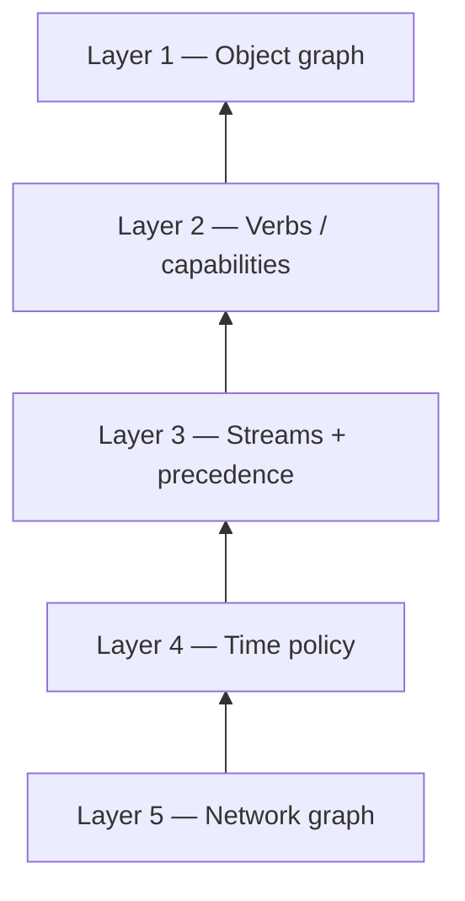

# Live object architecture

**Status:** Canonical engineering companion — implementation map for expanded design space  
**Workstream:** **WS-LIVE** — [`PRODUCT_WORKSTREAM_COORDINATION.md`](PRODUCT_WORKSTREAM_COORDINATION.md) § [WS-LIVE — Physical software objects + evolving five-layer stack](PRODUCT_WORKSTREAM_COORDINATION.md#ws-live--physical-software-objects--evolving-five-layer-stack) owns completing **Orders 1–6** exit criteria and **LO-1–LO-5** MVP gates  
**Audience:** Product, resolver, frontend, operators, agents  
**Public catalog (research):** [`QR_DESIGN_SPACE.md`](QR_DESIGN_SPACE.md) · [`site/what-can-a-qr-do/design-space/`](../site/what-can-a-qr-do/design-space/index.html)  
**Trust boundaries:** [`V1_PRODUCT_TRUST_MODEL.md`](V1_PRODUCT_TRUST_MODEL.md) · [`SYSTEM_INVARIANTS.md`](SYSTEM_INVARIANTS.md)  
**Object model:** [`ROOT_CARD_AND_CHILD_OBJECTS.md`](ROOT_CARD_AND_CHILD_OBJECTS.md) · [`V1_IMPLEMENTATION_CONTRACTS.md`](V1_IMPLEMENTATION_CONTRACTS.md) · **Semantic ontology:** § [Semantic model — Identity + Address + Interpretation](#semantic-model--identity--address--interpretation) · companion [`IDENTITY_DURABILITY_ONTOLOGY.md`](IDENTITY_DURABILITY_ONTOLOGY.md)

---

## Purpose

[`QR_DESIGN_SPACE.md`](QR_DESIGN_SPACE.md) names **verbs**, **blind spots**, **network grammar**, and **open questions** for positioning and pilot selection. This doc names **how those concepts map onto the resolver and object model** without forking new products.

**Rule:** Every catalog item must still pass the [Use-Case Rule](V1_USE_CASES.md#use-case-rule) and a phase row in [`V1_USE_CASES.md`](V1_USE_CASES.md#examples-by-build-phase) before it becomes engineering work. See [Promotion path](#promotion-path-research--partial--shipped).

**Operating constraint:** [`PHASE_A_STRANGER_PATH_PRIORITIES.md`](PHASE_A_STRANGER_PATH_PRIORITIES.md) — one vertical on real printed QRs beats expanding the public hub faster than pilots.

**Front door (presentation):** Public entry is **Three ways in** — wear · deploy on something · play the city game ([`PRODUCT_POSITIONING_AND_LOOP_STRATEGY.md`](PRODUCT_POSITIONING_AND_LOOP_STRATEGY.md)). This five-layer map is **engineering composition**; stewards do not pick layers at create time. L1 object graph (root → child → QR) stays protocol truth; L5 network graph is **live game / season** for organizers only.

**Steward UX target (step 20):** Room-native control maps each job to L1–L5 explicitly — deploy (L1–L3 + `request`/`offer`), wear (L1 `print_artifact` vs `card` lifecycle), season (L4–L5 + `contribute`). Design checklist and presentation policy: [`STEWARD_UX_PRESENTATION_TARGET.md`](STEWARD_UX_PRESENTATION_TARGET.md) § Layer map · § Presentation policy table.

---

## One-sentence model

> A **live object** is an HTTPS endpoint (usually reached via QR) that returns **current, revocable, signed public state** — composed from a root card, optional child object, streams, time policy, and optional network overlay.

The printed URL stays fixed. Resolver truth changes.

---

## Semantic model — Identity + Address + Interpretation

**Canonical home** for this ontology (WS-ONTOLOGY). The [five-layer stack](#five-layers) below is **engineering composition** inside Interpretation; it does not replace these three semantic roles. Durability tiers and discovery planes: [`IDENTITY_DURABILITY_ONTOLOGY.md`](IDENTITY_DURABILITY_ONTOLOGY.md).

### Storage vs semantic primitives

| Storage (resolver persistence) | Semantic (meaning at scan time) | Role |
|--------------------------------|----------------------------------|------|
| **Entity** — signed documents, `profile_id` / `object_id`, lifecycle | **Identity** — durable truth bearer | What state attaches to |
| **Locator** — QR row, `/c/…?q=…`, scope, revocable binding | **Address** — stable pointer → identity context | How scan enters the graph |
| *(no third storage species)* | **Interpretation** — composition grammar | How state becomes public meaning |
| Charter bytes may persist **as** entity documents | **Charter** — domain-scoped interpretation **policy** | Constitution for one trust domain |
| — | **Representation** — scan HTML / status JSON | **Emergent** output, not stored |

**Entity + Locator** are sufficient to **store** data. They are **not** sufficient to answer *what does this pointer mean right now?* — that requires **Interpretation**.

### Interpretation tiers

| Tier | What it is | Where it lives |
|------|------------|----------------|
| **Base protocol** | Global resolver grammar: signature verification, lifecycle phases, stream precedence (e.g. care > game), verbs, limits copy | Spec · [`V1_PRODUCT_TRUST_MODEL.md`](V1_PRODUCT_TRUST_MODEL.md) · `buildScanViewModel` in `scan-state.ts` |
| **Domain charter** | Signed policy for one constituted trust domain: season window, signer roles, quorum, membership, overlay refs | Season JSON · charter-bearing root · [`CITY_GAME_V1_IMPLEMENTATION.md`](CITY_GAME_V1_IMPLEMENTATION.md) authority model |

Charter is **storage-reducible** (bytes on an entity) but **semantically non-reducible** to Identity taxonomy — it is not a “profile” like `status_plate` vs `game_node`. It determines **how** truth is composed, not **what** one place attests.

```text
Representation = Interpret( Address → Identity graph , Charter , Context )

                    ┌── Representation (scan view — emergent)
                    │
        ┌───────────▼──────────────────────────┐
        │     INTERPRETATION                    │
        │  base protocol + domain charter       │
        └───────────┬──────────────────────────┘
                    │ reads
     ADDRESS ──binds──► IDENTITY (root · child · charter bearer)
```

**Five-layer map:** L1 = Identity graph · L2 = protocol verbs · L3 = stream precedence (protocol) · L4 = time policy (charter + identity) · L5 = network overlay (charter + graph rules).

### Web analogy (durable abstraction)

| Web | humanity.llc (semantic) |
|-----|-------------------------|
| Resource | Identity |
| URI | Address |
| Protocol (HTTP + policy) | Interpretation (base protocol + charter) |
| Response body | Representation |

### Implementation artifacts → semantic layer

| Artifact | Semantic layer | Shipped vs emergent |
|----------|----------------|---------------------|
| `object_type` (`status_plate`, `game_node`, …) | Identity **profile** (implementation label) | Shipped |
| `qr_id`, scope, D1 QR row | Address | Shipped |
| `buildScanViewModel`, stream precedence | Base protocol | Shipped |
| `site/data/city-game-*.json`, season overlay | Domain charter | Shipped |
| `network_charter` / rules copy (when present) | Domain charter | Partial / emergent |
| Vouch documents, unlock edges | Identity + refs; meaning via protocol | Shipped |
| `DiscoveryPin`, `place_ref`, geo browse | **Outside** resolver meaning — discovery plane | Spec / in progress · [`DISCOVERY_PROJECTION.md`](DISCOVERY_PROJECTION.md) |
| “Place”, “network type” (game, market, fund) | **Emergent** — human/discovery labels + charter profiles | Presentation |

Places and discovery pins are **not** resolver semantic primitives. Networks as product nouns are **constituted domains** — charter + overlay, not a parallel storage species.

### One-sentence durability test

> A pointer means something at scan time when an **address** selects **identities** whose signed state is composed by a **published interpretation** (protocol + charter) into a bounded **representation**.

### Agent checklist (which layer am I touching?)

1. **Identity** — new object kind, signed fields, lifecycle, custody? → L1 · [`ROOT_CARD_AND_CHILD_OBJECTS.md`](ROOT_CARD_AND_CHILD_OBJECTS.md)
2. **Address** — new pointer scope, QR revoke, URL shape? → Locator binding · Technical Standards
3. **Interpretation** — precedence, verbs, season rules, governance? → Protocol spec and/or charter schema · do not hide in `object_type` alone
4. **Representation** — scan copy, board UI? → Must trace to Interpret(Identity, Charter) · [`AI_FEATURE_DEVELOPMENT.md`](AI_FEATURE_DEVELOPMENT.md) (readers ≠ truth)
5. **Discovery** — browse, pins, near-me? → Discovery plane only · must not fork scan proof

---

## Architecture spine (do not replace)

```text
                    ┌─────────────────────────────────────┐
                    │  QR credential (qr_id, scope)       │
                    └─────────────────┬───────────────────┘
                                      │
                    ┌─────────────────▼───────────────────┐
                    │  Resolver context (D1 + signed docs)   │
                    │  root card · child object · QR row     │
                    └─────────────────┬───────────────────┘
                                      │
                    ┌─────────────────▼───────────────────┐
                    │  buildScanViewModel (composition)    │
                    │  lifecycle → time → streams → game     │
                    └─────────────────┬───────────────────┘
                                      │
              ┌───────────────────────┴───────────────────────┐
              │                                               │
    scan HTML (SSR)                              GET …/status JSON
    scan-html.ts                                 scan-status.ts
```

**Canonical composition entry:** `worker/src/resolver/scan-state.ts` → `buildScanViewModel()`.

New design-space capabilities extend this pipeline — they do not add parallel scan page products.

---

## Five layers

Evolve the stack **bottom-up**. Higher layers depend on lower layers; do not skip.

| Layer | Responsibility | Primary docs | Code today |
|-------|----------------|--------------|------------|
| **1. Object graph** | Root → child → QR; custody; types | [`ROOT_CARD_AND_CHILD_OBJECTS.md`](ROOT_CARD_AND_CHILD_OBJECTS.md) | `child-objects.ts`, `scan-state.ts`, `live-object/custody.ts`, `live-object/time-policy.ts` |
| **2. Verbs** | What scanners and owners may do | This doc § [Interaction verbs](#interaction-verbs) | Live proof, `game-contribute` (partial) |
| **3. Streams + precedence** | Multi-signer public fields | [`QR_DESIGN_SPACE.md`](QR_DESIGN_SPACE.md) § blind spot 5 | `object-streams.ts`, game care override |
| **4. Time policy** | Schedules, expiry, dormancy | § [Time policy](#time-policy) | `season-window.ts`, `route-window-schedule.ts`, manifesto |
| **5. Network graph** | Quorum, routes, season structure | [`CITY_GAME_V1_IMPLEMENTATION.md`](CITY_GAME_V1_IMPLEMENTATION.md) | `quorum-contribute.ts`, unlock evaluator, season config |



---

## Layer 1 — Object graph

### Target shape

```text
Root Humanity Card (profile_id, owner key, verification)
  │
  ├── child object: status_plate | lost_item_relay | game_node | …
  │     public_label, public_state, object_streams?, custody?, time_policy?
  │     │
  │     └── QR credential(s)  scope: child_object | print_artifact
  │
  └── root QR (optional)  scope: card
```

### Authority (unchanged)

From [`ROOT_CARD_AND_CHILD_OBJECTS.md`](ROOT_CARD_AND_CHILD_OBJECTS.md):

- Human trust (vouch, verification) lives on the **root** only.
- Child objects inherit **control**, not separate human identity.
- Default edits are **parent-signed** until delegated capabilities ship.
- Per-QR revoke must not revoke sibling objects.

### Bridge today

| Pilot | Current create | Legacy storage (scan/update compat) | Status |
|-------|----------------|-------------------------------------|--------|
| Status plate | Deploy wizard + `/created/` add → child `status_plate` | Two-line `manifesto_line` on root card | **Shipped (create)** · legacy read/update retained |
| Lost-item relay | Deploy wizard + `/created/` add → child `lost_item_relay` | `[relay]` prefix in root `manifesto_line` | **Shipped (create)** · legacy read/update retained |
| Game node | `game_node` child + `game_meta` JSON | — | **Shipped** |
| Merch / print | `scope: print_artifact` | — | **Shipped** |

Scan composition reads **`childPublicLabel` / `childPublicState`** on the view model when `scope: child_object` (see `resolveScanHeroDisplay` in `manifesto-display.ts`) — not manifesto parsing alone.

### Planned fields (not all routed yet)

| Field | Purpose | Design-space link |
|-------|---------|-------------------|
| `custody` | “Held by @handle until Friday” — possession, not ownership proof | Custody & handoff — **Partial** (`live-object/custody.ts` + `/created/` editor) |
| `delegated_capability` | Time-boxed child edit without new root key | Delegate |
| `time_policy` | See [Time policy](#time-policy) | Time-bound objects — **Partial** (`live-object/time-policy.ts`; `/created/` editor on status plates + lost-item relays) |

**Do not** give every child object its own private key by default. Delegation is an explicit, signed, revocable capability document — not a second account.

---

## Layer 2 — Interaction verbs

Verbs are **capabilities the resolver advertises**, not marketing categories. Scan HTML and clients render from the capability list; handlers implement each verb.

### Verb registry

| Verb | Actor | Meaning | Shipped | Handler / surface |
|------|-------|---------|---------|-------------------|
| **read** | Scanner | Current signed state at scan time | ✅ | Default `GET /c/…`, `GET …/status` |
| **request** | Scanner → owner | Ask for action (live proof, permission, reply) | Partial | Live control (`scan-live-control*`) |
| **offer** | Scanner → object | Contribute message or signal **without identity trail** | Partial | `POST …/objects/{id}/offer` (finder) · `POST …/offer/owner` (signed list/dismiss) · scan offer form on `lost_item_relay` |
| **contribute** | Scanner → network | Append-only **aggregate** public effect | Partial | `POST …/game-contribute` · `scan.capabilities[]` on status JSON (game nodes) |
| **delegate** | Owner → holder | Temporary capability on object | Research | Future `delegated_capability` on child doc |
| **inherit** | Governance | Succession when signer/org ends | Research | Future stream signer rotation |
| **archive** | Owner / governance | Live → read-only canon; season end | Partial | Dormant copy · `scan.capabilities[]` `archive` state on game nodes |

**Product priority (Phase A):** optimize **read + owner update** first, then **contribute** (city game), then **offer** (lost-item). See [`PHASE_A_STRANGER_PATH_PRIORITIES.md`](PHASE_A_STRANGER_PATH_PRIORITIES.md).

### Target scan contract extension

Add to `GET …/status` (and derive scan blocks from) a capability list:

```json
{
  "scan": {
    "capabilities": [
      { "verb": "read", "available": true },
      { "verb": "request", "kind": "live_proof", "available": true },
      {
        "verb": "contribute",
        "kind": "game_fragment",
        "available": false,
        "reason": "season_not_open"
      }
    ]
  }
}
```

**Invariants when implementing:**

- Passive scan must not log scanner identity ([`REFERENCE_OPERATOR_DATA_POLICY.md`](REFERENCE_OPERATOR_DATA_POLICY.md)).
- **Request** verbs require explicit scanner action (tap, form submit) — never background beacons.
- **Contribute** updates aggregate fields only for game ([`SYSTEM_INVARIANTS.md`](SYSTEM_INVARIANTS.md) § Cedar Rapids city game).
- Stranger-facing **delegate** / **inherit** are off by default.

**Implementation order:**

1. Document capabilities in JSON from existing flags (`liveControlAvailable`, game contribute gate, season phase). **Shipped (2026-06-03):** all scans via `ScanViewModel.capabilities` + status JSON.
2. Refactor `scan-html.ts` hero blocks to key off capabilities, not ad-hoc booleans. **Shipped:** contribute, offer form + API, merch funnel, hero template, game dormant copy, live control trust group + script, card/human/QR trust groups via `read.trust_groups`.
3. Add new verbs as new capability kinds + one handler each.

---

## Layer 3 — Streams and precedence

### What streams are

Signed plain-text rows on the card or child document:

```json
"object_streams": [
  { "id": "tasks", "class": "care", "label": "Today's tasks", "value": "Water bed 3" }
]
```

Classes today: `place` | `care` | `narrative` | `route` (see `site/js/object-streams-core.mjs`).

Streams let **multiple signers** attach truth to one physical object without merging into unreadable soup — if precedence rules are explicit.

### Precedence grammar (target)

Extract from city-game-only logic into a shared resolver step:

```text
raw streams (owner + child + scheduled overlays)
        │
        ▼
  StreamPolicy.resolve(streams, context)
        │
        ├── lifecycle (revoked / paused) wins — no game hero override
        ├── care (maintenance pause / closure) mutes game bulletins
        ├── game (bulletin, route) when season open and not compromised
        └── narrative / place (default display)
```

**Shipped precedent:** care wins over game — [`SYSTEM_INVARIANTS.md`](SYSTEM_INVARIANTS.md) · `worker/src/live-object/stream-policy.ts` · scan SSR and map snapshot both use `composeChildObjectScanState`.

**Target module (planned):** `worker/src/live-object/stream-precedence.ts` (name TBD) consumed by `buildScanViewModel` before HTML render.

**Shipped (2026-06-03):** `worker/src/live-object/stream-policy.ts` (`resolveStreamPolicy`) + `compose-child-object-scan.ts` — consumed by `buildScanViewModel` for child-object scans.

### Multi-signer without new identity

| Signer role | Typical stream class | Example |
|-------------|---------------------|---------|
| Owner / root | `place`, `narrative` | Studio door name, artist note |
| Maintainer | `care` | “Closed for repair until Tue” |
| Game operator | `route`, game bulletin | Season window, district hold |
| Institution (future) | `care`, hours | Library witness hours |

Game-operator `game-update` remains scoped to **`game_node` only** — not owner manifesto or human vouch graph.

### Adversarial physical world

Not a separate API layer. Enforce via:

- Bearer / limits copy on every scan ([`SCANNER_EXPERIENCE.md`](SCANNER_EXPERIENCE.md))
- `credential_code` fingerprint on scan ([`V1_IMPLEMENTATION_CONTRACTS.md`](V1_IMPLEMENTATION_CONTRACTS.md))
- Game trust chains and compromise propagation (city game)
- Anti-patterns documented in [`QR_DESIGN_SPACE.md`](QR_DESIGN_SPACE.md) § blind spot 6 — blocked in product policy, not engagement features

---

## Layer 4 — Time policy

Time-bound truth is a **core differentiator** vs static QR. Today it is split across manifesto updates (status plate), season window (game dormancy), and route/bulletin schedules (game-only).

### Target `ObjectTimePolicy` (child object or card)

| Field | Example | Status |
|-------|---------|--------|
| `valid_from` / `valid_until` | Flyer valid through Sunday | **Shipped** — `time-policy.ts` |
| `schedule` | Open Thu–Sat (local TZ slots) | **Shipped** — `time-policy.ts` schedule slots |
| `dormant_until` | Season start; object readable but game actions gated | Partial — child `time_policy` + `season-window.ts` |
| `grace_period_hours` | “Recall in 48h unless cleared” after `valid_until` | **Shipped** — `time-policy.ts` grace phase + owner form |

### Application order in `buildScanViewModel`

Child-object scans use `composeChildObjectScanState` (`live-object/compose-child-object-scan.ts`).
Card-scope scans (`qr.scope: card`) use `composeCardScanState` (`live-object/compose-card-scan-state.ts`).

```text
1. Lifecycle (revoked / suspended / QR revoked) — scan-state before compose
2. Base object_streams from signed child document OR card document
3. Game node context (mode, season window, care pause detection) — child game_node only
4. StreamPolicy.resolve — bulletin + route overlays (care mutes game)
5. ObjectTimePolicy — valid_from/until, schedule slots → public_state (child objects)
6. Custody overlay (optional, child objects)
7. Capabilities + HTML
```

**Status plate today:** new creates use child endpoint `POST …/objects/{id}/update`. Legacy flat accounts still update via root manifesto bridge ([`MANIFESTO_STATUS_UPDATE.md`](MANIFESTO_STATUS_UPDATE.md)).

**Time policy:** `worker/src/live-object/time-policy.ts` — shared with Phase A child types; game season dormancy remains in `season-window.ts`.

---

## Layer 5 — Network graph

A **network** is not “many QRs.” It is a **graph of signed state with conflict rules** — one season config is the reference implementation.

### Three concepts (keep separate)

| Concept | Definition | Cedar Rapids |
|---------|------------|--------------|
| **Object** | One resolver endpoint (`/c/…?q=…`) | One bench, plate, arch |
| **Network / season** | Config + graph edges + quotas | `cr_season_01_wake` |
| **Network effects** | Quorum, route SM, compromise relay, unlock evaluator | Shipped in game code |

### Reference implementation

| Capability | Module / doc |
|------------|--------------|
| Quorum / threshold | `quorum-contribute.ts`, unlock evaluator |
| Route state machine | `route-window-schedule.ts` |
| Season / act structure | `network-graph.ts`, `season-config.ts`, `season-window.ts` |
| Read-only city board | [`CITY_GAME_MAP_DASHBOARD.md`](CITY_GAME_MAP_DASHBOARD.md) |
| Fair-use metering | [`HOSTED_TIER_ENTITLEMENTS_AND_METERING.md`](HOSTED_TIER_ENTITLEMENTS_AND_METERING.md) |

**After S1:** `worker/src/live-object/network-graph.ts` — city-agnostic graph + automation thresholds; `season-config.ts` delegates lookups for any loaded season JSON.

### Federation and carriers (research)

Alternate carriers (NFC, SMS, mesh relay) must preserve **same URL semantics and trust model** — see [`RESEARCH_DIRECTIONS_AND_NODES.md`](RESEARCH_DIRECTIONS_AND_NODES.md). Mesh/cache serves **signed blobs**; resolver remains source of truth unless a [staleness contract](#staleness-contract-research) says otherwise.

---

## Composition pipeline (implementation map)

Current `buildScanViewModel` flow for `game_node` child (simplified):

```text
load ScanContext (card, qr, child, verification)
  → if child_object:
       composeChildObjectScanState (streams → StreamPolicy → time → custody)
  → if card scope:
       composeCardScanState (streams → StreamPolicy)
  → baseView → ScanViewModel (+ capabilities)
  → scan-html.ts / scan-status.ts

Map snapshot (season board):
  deriveMapNodeSnapshot → same composeChildObjectScanState pipeline
```

| Step to add | Layer | Touches |
|-------------|-------|---------|
| `resolveTimePolicy(child, now)` | 4 | Before stream overlays |
| `resolveStreamPrecedence(streams, policy)` | 3 | Replace ad-hoc care/game mute |
| `buildScanCapabilities(vm, policy)` | 2 | `scan-status.ts`, then HTML |
| Generic network hooks (non-game) | 5 | `live-object/network-graph.ts` (shipped); unlock side effects still game-specific |

---

## Blind spots → architecture responses

| Blind spot ([`QR_DESIGN_SPACE.md`](QR_DESIGN_SPACE.md)) | Architectural response | Layer |
|--------------------------------------------------------|-------------------------|-------|
| One-way interaction | Verb capability registry + scanner action endpoints | 2 |
| Time underplayed | `ObjectTimePolicy` on child objects | 4 |
| Custody / handoff | Child `custody` block; transfer = signed handoff event | 1 |
| Stale / offline truth | Staleness contract on cache + status JSON metadata | **Partial** — `scan.freshness` on status JSON |
| Governance / succession | Stream signers + organizer revoke; inherit/archive lifecycle | **Partial** — `scan.succession` + archive capabilities |
| Adversarial physical | Scan limits, credential fingerprint, game trust chains | Policy + 3 |
| Accessibility | Same `/c/…` URL; NFC/SMS as alternate carriers | Research |
| Institutional operators | Multiple stream signers, not shared root password | 3 |
| Anti-patterns | Resolver policy + invariants — no scan analytics, streaks, dossiers | All |

---

## Staleness contract

Clients and cache layers must treat resolver truth as **time-stamped**, not infinitely fresh.

| Field | Meaning | Status |
|-------|---------|--------|
| `freshness.fetched_at` | When resolver built this response | **Shipped** — `scan-status.ts` |
| `freshness.max_age_seconds` | Client may treat as live without re-fetch | **Shipped** — from `Cache-Control` |
| `freshness.stale_disclosure` | Honest copy when serving cached or last-known-good | **Shipped** |
| `freshness.source` | `resolver` today; `cache` / `mesh` when offline ships | **Partial** |

Module: `worker/src/live-object/staleness-contract.ts`. Mesh/offline clients must set `source` ≠ `resolver` and must not claim live without re-fetch.

Crisis cards, food tags, and protest coordination need **honest staleness** as much as live updates. Scan HTML embeds the same `freshness` block as status JSON; a client banner appears when document age exceeds `max_age_seconds` (CDN SWR, bfcache) or when `source` is `cache` / `mesh`.

### Delegation spec (deferred implementation)

Canonical docs: [`DELEGATED_CHILD_CAPABILITY_SCHEMA.md`](DELEGATED_CHILD_CAPABILITY_SCHEMA.md) · gates [`DELEGATED_CHILD_CAPABILITIES_GATE.md`](DELEGATED_CHILD_CAPABILITIES_GATE.md).

Code: `worker/src/live-object/delegation-spec.ts` — allowed/forbidden operations + document shape validation only. **No resolver routes** until G1–G5 pass.

### Succession hints (partial)

Code: `worker/src/live-object/succession-spec.ts` — `scan.succession` on status JSON (`live` \| `sunset` \| `archived`) from revoke state + archive capabilities. **`inherit` verb and dispute fork** remain research.

---

## Promotion path: research → partial → shipped

| Stage | QR_DESIGN_SPACE | Engineering |
|-------|-----------------|-------------|
| **Research** | Catalog + public design-space page | No resolver change; traceability row = Research |
| **Partial** | Unchanged public copy | One pilot or season demo on real QRs; tests for touched paths |
| **Shipped** | Optional “live today” walkthrough | Row in [`SYSTEM_INVARIANTS.md`](SYSTEM_INVARIANTS.md) + [`V1_IMPLEMENTATION_CONTRACTS.md`](V1_IMPLEMENTATION_CONTRACTS.md) |

**Traceability table:** [`QR_DESIGN_SPACE.md`](QR_DESIGN_SPACE.md) § Implementation traceability — update status when promoting.

**Do not** add new `*_INVESTIGATION.md` for routine promotion — per [`DOC_MAINTENANCE.md`](DOC_MAINTENANCE.md).

---

## Recommended build sequence

Aligned with **[WS-LIVE](PRODUCT_WORKSTREAM_COORDINATION.md#ws-live--physical-software-objects--evolving-five-layer-stack)** and Phase A. Mark **LO-1–LO-5** in [`PRODUCT_WORKSTREAM_COORDINATION.md`](PRODUCT_WORKSTREAM_COORDINATION.md) when exit rows below pass.

| Order | Work | Proves verb / blind spot |
|-------|------|--------------------------|
| **1** | Finish child-object model for status plate + lost-item relay | Read, time-bound, offer |

### Order 1 — exit criteria (Layer 1)

Engineering (**done** unless noted):

| Criterion | Surface | Status |
|-----------|---------|--------|
| Child object create / update / revoke API | `child-objects.ts`, D1 `child_objects` | Shipped |
| Issue `scope: child_object` QR | `POST …/objects/{id}/issue-qr` | Shipped |
| Scan reads `public_label` / `public_state` first-class | `ScanViewModel.childPublicLabel`, `childPublicState`, `resolveScanHeroDisplay` | Shipped |
| Child `object_streams` on scan | `objectStreamsFromChildDocumentJson` | Shipped |
| Owner UX: add + update under `/created/` | `created-child-object*.mjs` | Shipped |
| Deploy wizard create (Account → Endpoint → Scan link) | `?intent=deploy`, `create-deploy-submit.mjs` | Shipped |
| Legacy flat-card create (field-kit regression) | `/create/?template=status_plate\|lost_item_relay` | Shipped (compatibility) |

Still open before **Partial → Shipped** promotion on traceability rows:

| Criterion | Surface | Status |
|-----------|---------|--------|
| Manual pilot sign-off on real printed QRs | [`STATUS_PLATE_PILOT.md`](STATUS_PLATE_PILOT.md), [`LOST_ITEM_RELAY_PILOT.md`](LOST_ITEM_RELAY_PILOT.md) | Open |
| `custody`, `delegated_capability`, `time_policy` on child doc | Layer 1 planned fields | `time_policy` + `custody` **Partial** on Phase A child types · `delegated_capability` research |

**Do not start Order 3** (`scan.capabilities[]`) until manual pilot rows above are signed off or explicitly waived in the workstream doc.

---
| **2** | Cedar Rapids S1 (in flight) | Contribute, network, archive/sleep |

### Order 2 — exit criteria (Cedar Rapids S1)

Engineering (**done** unless noted):

| Criterion | Surface | Status |
|-----------|---------|--------|
| Game node scan + contribute handler | `game-contribute.ts`, `scan-view.ts` | Shipped |
| Season window / dormancy (archive sleep) | `season-window.ts`, dormant scan copy | Shipped |
| Network snapshot + map board (M1–M3) | `season-snapshot.ts`, `/play/cedar-rapids/#city-state` | Shipped |
| `scan.capabilities[]` for game verbs (status JSON) | `live-object/scan-capabilities.ts`, `scan-status.ts` | Shipped |
| Production smoke (season-aware dormant OK) | `city-game:smoke-production` | Shipped |
| `verify:city-game` regression block | `npm run verify:city-game` | Shipped |

Still open before S1 launch sign-off:

| Criterion | Surface | Status |
|-----------|---------|--------|
| Physical install QA (≥3 phones × 15 nodes) | [`CITY_GAME_INSTALL_QA.md`](CITY_GAME_INSTALL_QA.md) **P2** | Open (human) |
| Operator install map complete | [`CITY_GAME_NODE_INSTALL_MAP.md`](CITY_GAME_NODE_INSTALL_MAP.md) **O2** | Open (ops) |
| Map board privacy review before “live city board” marketing | **B13** GT-7 | Open (human) |
| Production season root + 15 nodes minted | Launch checklist **E3** | Open (ops) |
| Refactor scan HTML from capabilities (Order 3 step 2) | `scan-html.ts` | Shipped (core paths) |

---
| **3** | `scan.capabilities[]` in status JSON; HTML from capabilities | Verbs explicit |

### Order 3 — exit criteria

Engineering (**done** unless noted):

| Criterion | Surface | Status |
|-----------|---------|--------|
| `scan.capabilities[]` on every scan view model | `buildScanCapabilities` in `baseView` | Shipped |
| Status JSON exposes same list | `scan-status.ts` → `scan.capabilities` | Shipped |
| Game contribute / archive / read kinds | `live-object/scan-capabilities.ts` | Shipped |
| Phase A `offer` (lost-item) + time_policy `archive` | `scan-capabilities.ts` | Shipped |
| Lost-item offer API (finder POST + owner signed list/dismiss) | `lost-item-offer.ts`, `0033_lost_item_relay_offers.sql` | Shipped |
| Scan HTML gates contribute block + scripts from capabilities | `scan-html.ts` | Shipped |
| Scan HTML hero routing from `read.kind` | `readHeroTemplate(vm.capabilities)` | Shipped |
| Scan HTML game dormant copy from `archive.state` | `gameNodeMutedCopy` | Shipped |

Still open:

| Criterion | Surface | Status |
|-----------|---------|--------|
| Live control trust group keyed off `request` capability | `renderTrustGroups`, `renderLiveControlScript` | Shipped |
| Full verb registry in HTML (all blocks) | `scan-html.ts`, `read.trust_groups` on capabilities | Shipped |
| Order 1 pilot sign-off before **Shipped** promotion | Pilot docs | Open |

---
| **4** | Extract `StreamPolicy` + `ObjectTimePolicy` from game code | Multi-signer, time |

### Order 4 — exit criteria

Engineering (**done** unless noted):

| Criterion | Surface | Status |
|-----------|---------|--------|
| `ObjectTimePolicy` parse + scan context | `live-object/time-policy.ts` | Shipped |
| `StreamPolicy.resolve` — care mutes game schedules | `live-object/stream-policy.ts` | Shipped |
| Child scan pipeline (streams → time → custody) | `live-object/compose-child-object-scan.ts` | Shipped |
| `buildScanViewModel` uses compose module | `scan-state.ts` | Shipped |
| Care pause detection shared (scan-view re-exports) | `stream-policy.ts` ← `scan-view.ts` | Shipped |

Still open:

| Criterion | Surface | Status |
|-----------|---------|--------|
| Map snapshot uses `resolveStreamPolicy` (not parallel slot logic) | `map-node-snapshot.ts` via `composeChildObjectScanState` | Shipped |
| `StreamPolicy` for root-card `object_streams` only scans | `compose-card-scan-state.ts` + `scan-state.ts` card scope | Shipped |
| `grace_period_hours` on time policy | `live-object/time-policy.ts` + `/created/` editor | Shipped |

---
| **5** | Extract network graph config from city-game modules | Network grammar |

### Order 5 — exit criteria

Engineering (**done** unless noted):

| Criterion | Surface | Status |
|-----------|---------|--------|
| `NetworkGraph` — nodes, edges, object↔node indexes | `live-object/network-graph.ts` | Shipped |
| Automation thresholds (quorum, fragment, finale, scarcity) | `NetworkGraph.contributableNodeIds()` etc. | Shipped |
| Unlock edge satisfaction for public snapshot | `publicUnlockEdges`, `isUnlockEdgeSatisfied` | Shipped |
| Graph validation (structure) | `validateNetworkGraph` | Shipped |
| `season-config.ts` delegates to shared graph | thin wrappers + re-exports | Shipped |

Still open:

| Criterion | Surface | Status |
|-----------|---------|--------|
| Scripts align on `network-graph` (`network-graph-core.mjs`) | shared core + seed/readiness | Shipped |
| Unlock side effects generic beyond CR patches | `unlock-engine.ts` | Open (game-specific) |
| Next-organizer JSON loader only (no CR import in graph module) | `season-loader` | Partial |

---
| **6** | Staleness contract + delegation + succession specs | Blind spots 4–5 |

### Order 6 — exit criteria

Engineering (**done** unless noted):

| Criterion | Surface | Status |
|-----------|---------|--------|
| Staleness contract types + disclosure copy | `live-object/staleness-contract.ts` | Shipped |
| `scan.freshness` on status JSON | `scan-status.ts` | Shipped |
| Succession phase hints on status JSON | `live-object/succession-spec.ts` | Shipped |
| Delegation capability shape validation (spec-only) | `live-object/delegation-spec.ts` | Shipped |
| Cross-links to gate docs | `DELEGATED_CHILD_CAPABILITY_SCHEMA.md`, `DELEGATED_CHILD_CAPABILITIES_GATE.md` | Shipped |

Still open (implementation deferred):

| Criterion | Surface | Status |
|-----------|---------|--------|
| Mesh/cache clients emit `freshness.source: cache \| mesh` | Offline/mesh relay | Open |
| Resolver accepts delegated signer on child routes | Step 17 gates G1–G5 | Open |
| `inherit` verb + dispute fork UX | Governance research | Open |
| HTML staleness banner from `freshness` block | `scan-freshness-banner.ts`, `scan-html.ts` | Shipped |

---

## Open questions (product gates)

These from [`QR_DESIGN_SPACE.md`](QR_DESIGN_SPACE.md) are **decisions**, not backlog. Record answers here when resolved.

| Question | Working answer (2026-06) |
|----------|--------------------------|
| Which verb to optimize scan UX for first? | **Read + owner update** (Phase A); then contribute (game), then offer (lost-item) |
| When is a live object the wrong tool? | When static paper or a phone call suffices; when threat model needs anonymity beyond public card; when regulated domain needs jurisdiction we defer |
| Minimum network size before multiplayer beats solo objects? | Cedar Rapids S1 (15 nodes) is the first proof; revisit after comprehension + install QA |
| Staleness vs live menu sold out? | Spec § Staleness contract before mesh/offline ship |
| Can an object outlive its operator? | Export/migrate/archive — Phase D+; inherit verb |
| Stream stacking readability? | Stream precedence module + scan UI caps (max streams already validated) |

---

## Regression and touch surfaces

When changing live-object composition:

```bash
npm run worker:test -- worker/tests/live-object-staleness-contract.test.ts worker/tests/live-object-delegation-spec.test.ts worker/tests/live-object-succession-spec.test.ts worker/tests/scan-freshness-banner.test.ts worker/tests/network-graph-core.test.ts worker/tests/live-object-network-graph.test.ts
npm run verify:city-game   # if game overlay touched
npm run worker:test -- worker/tests/update-card.test.ts worker/tests/create-card-object-streams.test.ts worker/tests/scan-status.test.ts
```

**File ownership hints:**

| Area | Files |
|------|-------|
| Composition | `worker/src/resolver/scan-state.ts`, `scan-html.ts`, `scan-status.ts` |
| Child objects | `worker/src/db/child-objects.ts`, `worker/src/resolver/child-objects.ts` |
| Streams | `worker/src/validation/object-streams.ts`, `worker/src/live-object/stream-policy.ts`, `worker/src/live-object/compose-card-scan-state.ts`, `site/js/object-streams-core.mjs` |
| Time (game + child) | `worker/src/live-object/time-policy.ts`, `worker/src/live-object/compose-child-object-scan.ts`, `worker/src/city-game/season-window.ts` |
| Network (game) | `worker/scripts/network-graph-core.mjs`, `worker/src/live-object/network-graph.ts`, `worker/src/city-game/*`, `game-contribute.ts` |
| Staleness / succession | `worker/src/live-object/staleness-contract.ts`, `succession-spec.ts`, `delegation-spec.ts`, `scan-status.ts`, `scan-freshness-banner.ts` |
| Owner update | `worker/src/resolver/update-card.ts`, `site/js/created-manifesto-update.mjs` |

Bump `DEVICE_SHELL_ASSET_VERSION` only when adding imports to the device status module graph ([`AGENTS.md`](../AGENTS.md)).

---

## Related docs

| Doc | Role |
|-----|------|
| [`QR_DESIGN_SPACE.md`](QR_DESIGN_SPACE.md) | Public design catalog + traceability index |
| [`ROOT_CARD_AND_CHILD_OBJECTS.md`](ROOT_CARD_AND_CHILD_OBJECTS.md) | Layer 1 authority and UX maturity |
| [`MANIFESTO_STATUS_UPDATE.md`](MANIFESTO_STATUS_UPDATE.md) | Live copy bridge (Phase A) |
| [`CITY_GAME_V1_IMPLEMENTATION.md`](CITY_GAME_V1_IMPLEMENTATION.md) | Layer 5 reference network |
| [`V1_USE_CASES.md`](V1_USE_CASES.md) | Phase table + use-case rule |
| [`PHASE_A_STRANGER_PATH_PRIORITIES.md`](PHASE_A_STRANGER_PATH_PRIORITIES.md) | Pilot discipline |
| [`RESEARCH_DIRECTIONS_AND_NODES.md`](RESEARCH_DIRECTIONS_AND_NODES.md) | NFC, mesh, Humanity node |
| [`SYSTEM_INVARIANTS.md`](SYSTEM_INVARIANTS.md) | Rules that must stay true when layers ship |
