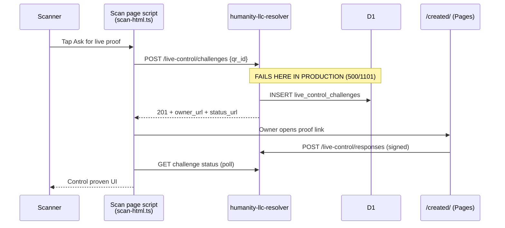

# Live proof failure investigation

**Status:** Resolved on production (2026-05-29) — `npm run worker:repair-live-control-challenges-fk -- --remote`  
**Reported:** 2026-05-29  
**Scope:** M7 live proof loop (scan → challenge → owner sign → scanner success)  
**Related:** [`M7_LIVE_CONTROL_ALPHA.md`](M7_LIVE_CONTROL_ALPHA.md) · [`SCAN_WORKER_1101_POSTMORTEM.md`](SCAN_WORKER_1101_POSTMORTEM.md) · [`HOSTED_TIER_PUSH_ARCHITECTURE_RFC.md`](HOSTED_TIER_PUSH_ARCHITECTURE_RFC.md)

---

## Executive summary

Live proof is **broken in production** at the first step of the loop. When a scanner taps **Ask for live proof**, the scan page `POST`s to the resolver to create a challenge. That request **always fails with HTTP 500** (`error code: 1101` — Cloudflare “Worker threw exception”) for real active cards on `https://humanity.llc`.

Downstream effects:

- Scanner never enters the waiting/polling state with a valid `status_url`.
- Owner proof links are never issued.
- `/created/` signing and device-hub **Live proof waiting** never activate from real stranger scans (only from mocks/tests).

The Worker code path works locally against D1 with the same build logic; the failure is **production-specific** and **limited to challenge creation** (`POST …/live-control/challenges` for active scans).

---

## Symptom (user-visible)

| Surface | Expected | Observed |
|---------|----------|----------|
| Scan page → **Ask for live proof** | Creates challenge; scanner waits; owner link appears | Button returns to **Ask for live proof** with *Could not create live proof request.* (or generic fetch failure) |
| Owner `/created/?live_challenge=…` | Panel shows **Prove control now** | Deeplink never issued because challenge is never created |
| Device hub → **Check for live proof** / inbox | Pending row when stranger asked | No pending challenge in D1 |
| Two-phone / printed QA ([`M7_LIVE_CONTROL_PRINTED_QA_RUNBOOK.md`](M7_LIVE_CONTROL_PRINTED_QA_RUNBOOK.md)) | Full loop | Fails at step B1 |

---

## Reproduction (confirmed 2026-05-29)

### Production — fails

```bash
# Showcase live object (site/data/showcase-live-object.json)
curl -s -w "\nHTTP:%{http_code}\n" \
  -X POST "https://humanity.llc/.well-known/hc/v1/cards/mht4JbKX7Q9L5owpNw9wnAC8/live-control/challenges" \
  -H 'Content-Type: application/json' \
  -d '{"qr_id":"qr_3JNFm4wMGyrcm1e9","client_origin":"https://humanity.llc"}'
# → error code: 1101
# → HTTP:500

# Showcase status plate (site/data/showcase-status-plate.json) — same 500
```

### Production — adjacent routes still healthy

| Request | Result | Implies |
|---------|--------|---------|
| `GET /.well-known/hc/v1/health` | `200`, `database: ok` | `schemaReady()` passes (incl. `live_control_challenges` table name) |
| `GET …/cards/{id}/status?q={qr}` | `200`, `scan.kind: active` | Card + QR load; scan context OK |
| `GET /c/{id}?q={qr}` (scan HTML) | `200` | [`hosted-rollout-scan-smoke.mjs`](../worker/scripts/hosted-rollout-scan-smoke.mjs) passes |
| `GET …/live-control/challenges?qr_id={qr}` | `404 CHALLENGE_NOT_FOUND` | Pending GET handler + table query work |
| `GET …/live-control/challenges/{id}` | `404 CHALLENGE_NOT_FOUND` | Challenge-by-id route works |
| `POST …/live-control/responses` (empty body) | `400 MALFORMED_REQUEST` | Response route wired |
| `POST …/live-control/challenges` invalid profile | `422 INVALID_PROFILE_ID` | Validation before active-card path |
| `POST …` wrong/missing QR | `422` / `409 LIVE_CONTROL_UNAVAILABLE` | Reaches `buildScanViewModel` |

**Only** `POST` challenge creation for **`vm.kind === "active"`** returns 500.

### Local worker — succeeds

With `npm run worker:migrate:local`, `npm run worker:dev`, and a seeded active card in local D1:

```bash
curl -s -w "\nHTTP:%{http_code}\n" \
  -X POST "http://127.0.0.1:8787/.well-known/hc/v1/cards/7Xk9mP2nQ4rT6vW8yZ1aB3cD5/live-control/challenges" \
  -H 'Content-Type: application/json' \
  -d '{"qr_id":"qr_7Xk9mP2nQ4rT6vW8yZ1aB3cD5","client_origin":"https://humanity.llc"}'
# → HTTP:201, challenge_id lc_…, owner_url, status_url
```

Production deploy stamp at time of test: `build.gitSha = 303e5139` (same `live-control.ts` as local `main`).

---

## Architecture: where live proof runs



**Scanner client** — inline script from `renderLiveControlScript()` in `worker/src/resolver/scan-html.ts` (bundled into scan HTML). On button click it `POST`s JSON `{ qr_id, client_origin: location.origin }`.

**Challenge API** — `handlePostLiveControlChallenge()` in `worker/src/resolver/live-control.ts`, routed from `worker/src/index.ts` with `{ env, executionCtx: ctx }` so hosted push notify can run in `waitUntil`.

**Owner client** — `initLiveControlProof()` in `site/js/created.mjs` (poll + sign). Never reached in production until `POST` succeeds.

**Device inbox** — `device-live-control-inbox.mjs` polls `GET …/live-control/challenges?qr_id=…`. Returns `404` today because no row is inserted.

---

## Root cause (confirmed)

### Primary: uncaught exception on production challenge `POST`

Cloudflare **Error 1101** means the Worker handler threw **without** being converted to a JSON error response.

The throw happens in `handlePostLiveControlChallenge` **after** the scan is validated as active (`vm.kind === "active"`) and **before** a `201` is returned. In source order that is:

1. `insertLiveControlChallenge()` — `worker/src/db/live-control.ts`
2. `executionCtx.waitUntil(notifyLiveProofPending(…))` — unlikely to block response (async, `.catch` logged)
3. `jsonResponse(challengeBody(…), 201)` — works locally with production-like origins

#### Insert error handling gap (high-confidence mechanism)

```118:137:worker/src/resolver/live-control.ts
  try {
    await insertLiveControlChallenge(db, {
      challengeId,
      profileId,
      qrId,
      nonce,
      verifierSessionId,
      issuedAt: issuedAt.toISOString(),
      expiresAt: expiresAt.toISOString(),
    });
  } catch (e) {
    if (String(e).includes("live_control_challenges")) {
      return errorResponse(
        "RESOLVER_SCHEMA",
        "Resolver database is missing live control storage. Apply D1 migration 0006_live_control_challenges.sql and redeploy.",
        503
      );
    }
    throw e;
  }
```

Only errors whose string form contains `live_control_challenges` become a structured `503`. Other D1 failures — notably **`FOREIGN KEY constraint failed`** when `profile_id` / `qr_id` FK checks fail, or other `SQLITE_*` errors — are **rethrown** and surface as **500 / 1101**.

`live_control_challenges` defines FK references:

```1:17:worker/migrations/0006_live_control_challenges.sql
CREATE TABLE live_control_challenges (
  challenge_id TEXT PRIMARY KEY NOT NULL,
  profile_id TEXT NOT NULL REFERENCES cards (profile_id),
  qr_id TEXT REFERENCES qr_credentials (qr_id),
  ...
);
```

Production health reports `database: ok`, so the **table exists** (`schemaReady()` counts it in `REQUIRED_TABLES`). The failure is therefore **not** “missing migration 0006” (that path returns `503 RESOLVER_SCHEMA`). It is **stale foreign-key metadata** on `live_control_challenges` after a partial child-object QR schema rebuild.

#### Confirmed via production tail + remote D1 (2026-05-29)

**Worker tail** when tapping **Ask for live proof**:

```
POST …/live-control/challenges — Exception Thrown
Error: D1_ERROR: no such table: main.qr_credentials_v23_legacy: SQLITE_ERROR
```

**Remote D1** (`PRAGMA foreign_key_list(live_control_challenges)`):

| from | references table |
|------|------------------|
| `profile_id` | `cards` ✓ |
| `qr_id` | **`qr_credentials_v23_legacy`** ✗ |

`qr_credentials` exists; `qr_credentials_v23_legacy` does **not**. The child-object QR rebuild (`worker/scripts/child-object-qr-schema-rebuild.sql`) drops and recreates `qr_credentials` with `PRAGMA foreign_keys = OFF`, but **`live_control_challenges` was not rebuilt**, so its `qr_id` FK still points at the dropped backup table name. `INSERT` triggers FK validation → D1 throws → uncaught → **500 / 1101**.

`SELECT COUNT(*) FROM live_control_challenges` on production: **44 rows** (preserve on repair).

**No Worker redeploy required** once D1 FK metadata is repaired.

### Contributing factor: no production smoke for challenge `POST`

Rollout smoke ([`hosted-rollout-scan-smoke.mjs`](../worker/scripts/hosted-rollout-scan-smoke.mjs)) only **GETs scan HTML** — the same class of gap documented in [`SCAN_WORKER_1101_POSTMORTEM.md`](SCAN_WORKER_1101_POSTMORTEM.md) for missing `qr_credentials.object_id`. It does **not** exercise:

```bash
POST /.well-known/hc/v1/cards/{profile_id}/live-control/challenges
```

Hosted rollout step 6 (`hosted:rollout:step6`) runs Vitest + Playwright with **mocked** challenge APIs, not a live production `POST`. A 500 on challenge creation would not block rollout gates.

### Contributing factor: hosted push hook on challenge create

Since [`410629f7`](https://github.com/h6811127/humanity.llc/commit/410629f7) / M3 E4, successful inserts schedule:

```142:154:worker/src/resolver/live-control.ts
  if (opts?.env && opts?.executionCtx) {
    opts.executionCtx.waitUntil(
      notifyLiveProofPending(opts.env, db, {
        profile_id: profileId,
        qr_id: qrId,
        challenge_id: challengeId,
        issued_at: issuedAtIso,
        expires_at: expiresAtIso,
      }).catch((err) => {
        console.error("steward_push_notify_failed", err);
      })
    );
  }
```

`HOSTED_STEWARD_ENABLED = "1"` in production [`worker/wrangler.toml`](../worker/wrangler.toml). `notifyLiveProofPending` should not block the HTTP response, but `stewardSchemaReady()` only checks for `steward_accounts`, not the full push schema (`steward_account_profiles`, etc.). Errors there appear in **`steward_push_notify_failed`** logs, not to the scanner — they are **not** the observed 500 unless platform behavior differs.

---

## What is *not* the primary production break

| Hypothesis | Why ruled out |
|------------|----------------|
| Scan HTML / client script regression | `POST` never returns `201`; client catch path is working as designed |
| Stale owner link race ([`scan-live-control-client.test.ts`](../worker/tests/scan-live-control-client.test.ts)) | Test expects pre-2026-05 side-by-side markup (`ownerLink.hidden`, `ownerHint`); **stale test**, not production blocker. Updated assertions live in [`scan.test.ts`](../worker/tests/scan.test.ts) (`ownerPanel.hidden`, `ownerLink.href = "#"`) |
| `proof_expires_at` stale UI (PR #47) | Server `GET` + client gating ship in `scan-html.ts`; unrelated to challenge creation |
| Missing `live_control_challenges` table | Would be `503 RESOLVER_SCHEMA`, not 1101; `GET` pending queries the table successfully |
| Rate limit on `POST` | No rate limit on challenge `POST`; `GET` pending returns normal `404` |
| `/created/` route gate | Never reached without a created challenge |

### Same-device testing pitfall (dev/QA only)

If the **owner** opens the **scan URL** in a tab that still has `sessionStorage.hc_created` with keys for the same `profile_id` + `qr_id`, `applyOwnerBrowserLiveControl()` in the scan script **replaces the scanner UI** with the owner view and returns early. That blocks the scanner flow on one device but does **not** explain production `POST` 500 from `curl`.

---

## Code map

| Layer | File | Role |
|-------|------|------|
| Route | `worker/src/index.ts` | `POST` → `handlePostLiveControlChallenge(…, { env, executionCtx })` |
| API | `worker/src/resolver/live-control.ts` | Create / get / submit challenges |
| D1 | `worker/src/db/live-control.ts` | `INSERT INTO live_control_challenges` |
| Scan UI | `worker/src/resolver/scan-html.ts` | `renderLiveControlScript()` — fetch + poll |
| Owner UI | `site/js/created.mjs` | `initLiveControlProof()` |
| Inbox | `site/js/device-live-control-inbox.mjs` | Pending poll for stewards |
| Tests | `worker/tests/live-control.test.ts` | Handler unit tests (mock D1, pass) |
| Tests | `worker/tests/scan.test.ts` | Scan HTML + client script regressions (pass) |
| Tests | `worker/tests/scan-live-control-client.test.ts` | **Fails** — outdated string expectations |

---

## Test evidence (local, 2026-05-29)

```bash
npm run worker:test -- worker/tests/live-control.test.ts worker/tests/scan.test.ts
# ✓ all pass

npm run worker:test -- worker/tests/scan-live-control-client.test.ts
# ✗ expects ownerLink.hidden / ownerHint (removed in side-by-side layout refactor)
```

---

## Operator fix (production)

**Applied 2026-05-29:**

```bash
npm run worker:repair-live-control-challenges-fk -- --remote
```

Verified: `qr_id` FK → `qr_credentials`; showcase `POST …/live-control/challenges` returns **201**.

Rebuild SQL lives in `worker/scripts/repair-live-control-challenges-fk.sql`. Future `worker:apply-child-object-qr-schema` runs also rebuild `live_control_challenges` (see `child-object-qr-schema-rebuild.sql`).

**Usability follow-up:** [`LIVE_CONTROL_USABILITY_HARDENING.md`](LIVE_CONTROL_USABILITY_HARDENING.md) (H-01–H-15).

## Operator next steps (investigation closure)

1. ~~Tail production logs~~ — done; `qr_credentials_v23_legacy` missing table.
2. ~~Remote D1 integrity~~ — done; FK drift confirmed.
3. ~~**Apply repair SQL**~~ — done via `worker:repair-live-control-challenges-fk -- --remote`.
4. ~~**Add rollout smoke**~~ — `smokeProductionLiveControlChallenge` in `hosted-rollout-scan-smoke.mjs` (step 2/4).

---

## Suggested fix directions

Superseded by [`LIVE_CONTROL_USABILITY_HARDENING.md`](LIVE_CONTROL_USABILITY_HARDENING.md) (H-01–H-15). Key items from this incident:

1. **H-02** — map D1 insert failures to JSON 503/409 instead of 1101.
2. **H-01, H-03** — safe JSON + visible poll errors on scan page.
3. **H-15** — production smoke for `POST` challenge (shipped in rollout step 2/4).
4. **H-14** — refresh `scan-live-control-client.test.ts`.

---

## Impact

| Area | Severity |
|------|----------|
| M7 Step 1 live proof loop | **P0** — blocked in production |
| M7 printed/camera QA runbooks | **P0** — cannot execute B1+ |
| Device hub live proof inbox | **P1** — no real pending challenges |
| Hosted tier push notify | **P2** — notify never fires (no insert) |
| Legal/trust copy | N/A — feature unavailable, not misleading |

---

## Changelog

| Date | Author | Notes |
|------|--------|-------|
| 2026-05-29 | Investigation | Initial production repro, code-path analysis, local control experiment |
| 2026-05-29 | Investigation | Tail + remote `PRAGMA foreign_key_list` — `qr_id` FK → `qr_credentials_v23_legacy` |
