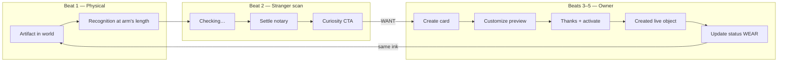

# Merch visual choreography — physical object, owner delight, scan notary

**Status:** Approved product + design spec (2026-05-30) — **V1–V4 shipped** (full owner-surface choreography stack)  
**Audience:** Product, design, frontend  
**Parent:** [`MERCH_FUNNEL_MVP.md`](MERCH_FUNNEL_MVP.md) · [`MERCH_LED_V1.md`](MERCH_LED_V1.md) · [`EPHEMERAL_STATE_AND_MERCH.md`](EPHEMERAL_STATE_AND_MERCH.md)  
**Related:** [`VISUAL_IDENTITY_PRINCIPLES.md`](VISUAL_IDENTITY_PRINCIPLES.md) · [`SCAN_PAGE_TRUST_UI.md`](SCAN_PAGE_TRUST_UI.md) · [`SCAN_HERO_CARD_VISUAL_SPEC.md`](SCAN_HERO_CARD_VISUAL_SPEC.md) · [`SCANNER_EXPERIENCE.md`](SCANNER_EXPERIENCE.md) · [`MERCH_PRODUCT_COPY.md`](MERCH_PRODUCT_COPY.md) · [`CREATED_TASKS_TAB_REDESIGN.md`](CREATED_TASKS_TAB_REDESIGN.md) · [`MERCH_PHYSICAL_QA_RUNBOOK.md`](MERCH_PHYSICAL_QA_RUNBOOK.md)

---

## One-sentence claim

**Wow belongs across the funnel, not crammed into the scan page:** physical ink is the first beat; stranger scan is the **notary**; customize / created / thanks are **belonging and imagination** — same product story, two emotional registers.

---

## Problem this doc solves

Merch funnel docs ([`MERCH_FUNNEL_MVP.md`](MERCH_FUNNEL_MVP.md), [`EPHEMERAL_STATE_AND_MERCH.md`](EPHEMERAL_STATE_AND_MERCH.md)) define **what happens** (SEE → WEAR). Scan docs ([`SCAN_PAGE_TRUST_UI.md`](SCAN_PAGE_TRUST_UI.md), [`SCAN_HERO_CARD_VISUAL_SPEC.md`](SCAN_HERO_CARD_VISUAL_SPEC.md)) define **how strangers read resolver truth**. Nothing previously tied those into one **choreography map** — where delight is allowed vs where calm is mandatory.

This doc is that map.

---

## Two registers (non-negotiable)

| Register | Audience | Surfaces | Job | Tone |
|----------|----------|----------|-----|------|
| **A — Belonging / imagination** | Card owner, buyer | `/shop/customize/`, `/created/`, `/shop/thanks/`, shop PDP, landing merch rows | “This will be *mine*; I control what strangers read.” | Meaningful artifact — can be warmer and more expressive ([`VISUAL_IDENTITY_PRINCIPLES.md`](VISUAL_IDENTITY_PRINCIPLES.md) § Tone by surface · Storefront) |
| **B — Notary / verification** | Stranger after scan | `GET /c/{profile_id}?q={qr_id}` (Worker scan HTML) | “Is this a real Humanity check, what does it claim, what doesn’t it prove?” | Calm, precise, fast ([`SCANNER_EXPERIENCE.md`](SCANNER_EXPERIENCE.md)) |

**Register C — Physical** (garment or sticker in the world) is the **persistent bridge** between A and B: recognition at arm’s length, then resolver truth on scan. See § Beat 1.

**Rule:** Curiosity and belonging share **one scan URL pattern** ([`MERCH_LED_V1.md`](MERCH_LED_V1.md)). Do **not** fork a hoodie-only scan template or a looping “profile bubble” on the resolver.

**Privacy rule:** Do **not** choreograph delight around scan counts or passive scan alerts. Hoodie awareness may be coarse object state, but the emotional engine is programmable resolution — same ink, new meaning.

---

## Five beats (choreography)

```text
Act 1 — Physical     Hoodie/sticker in world → arm-length recognition
Act 2 — Stranger     Scan → Settle notary → optional curiosity CTA
Act 3 — Owner buy    Create → customize preview (bubble / object forming)
Act 4 — Owner activate  Thanks → created live object card
Act 5 — WEAR         Publish update → same ink, new meaning → back to Act 1
```



Cross-ref funnel steps: [`MERCH_FUNNEL_MVP.md`](MERCH_FUNNEL_MVP.md) § Funnel (user journey).

---

## Beat 1 — Physical recognition (pre-scan)

**Canonical:** [`SCANNER_EXPERIENCE.md`](SCANNER_EXPERIENCE.md) § Physical · [`QR_BRANDING.md`](QR_BRANDING.md)

| Element | Role |
|---------|------|
| White QR inset + brand border (`#DB1B43`) | Recognition before scan |
| Optional `LIVE OBJECT` band | Teaches status is online, not frozen on fabric |
| Print template size / contrast | Scan reliability — [`MERCH_PHYSICAL_QA_RUNBOOK.md`](MERCH_PHYSICAL_QA_RUNBOOK.md) |

**Wow lever:** Primary wow is **wearing a live object in public**. Digital surfaces **echo** physical geometry (round inset, white island, red band) — they do not compete with ink.

**Hoodie-specific (print-safe):**

- Back/chest placement per approved print template (`hc-glitch-hoodie-v1`, `hc-hoodie-live-object-v1`)
- Fulfillment artwork: **tight** white island on hoodies (`print-template-render.ts`); digital previews stay **default** full card ([`QR_BRANDING.md`](QR_BRANDING.md) § Two registers)
- QA: flat chest/back scan, wash — runbook § A4, A6
- Garment context in **marketing copy only** — never mutable trust claims on fabric ([`V1_PRODUCT_TRUST_MODEL.md`](V1_PRODUCT_TRUST_MODEL.md) Level 0)

**Shipped:** Print templates, QR branding, physical QA runbook.  
**Planned:** Optional subtle textile-adjacent texture on **owner** mockups only (customizer), not on scan.

---

## Beat 2 — Stranger scan settle (notary)

**Canonical:** [`SCAN_PAGE_TRUST_UI.md`](SCAN_PAGE_TRUST_UI.md) · [`SCAN_HERO_CARD_VISUAL_SPEC.md`](SCAN_HERO_CARD_VISUAL_SPEC.md)

| Moment | Stranger should feel | System behavior |
|--------|----------------------|-----------------|
| T+0 | “Something official is loading” | Hero `scan-live-check--pending`; strip **Checking live status…**; corner dot static |
| T+settle (~380ms min) | “It’s live; here’s what it says” | Strip → resolver label; H1 = object message; limit line appears; one-shot hero pulse + row stagger |
| T+after | “I understand limits; maybe I want one” | Stillness; merch funnel CTA when `print_artifact` / live object ([`scan-merch-funnel.mjs`](../site/js/scan-merch-funnel.mjs)) |

**Shipped:** Path 2 Settle (`pass-v33`), merch scan CTA, print_artifact limits copy.

**Allowed on scan:**

- One-shot **Settle** motion only ([`VISUAL_IDENTITY_PRINCIPLES.md`](VISUAL_IDENTITY_PRINCIPLES.md) § Motion & data arriving)
- Optional **muted context line** under hero for wearables, e.g. *Live object on apparel* — same IA, no new animation grammar
- Same hero shell for hoodie, sticker, status plate, personal card (template branch on manifesto, not product SKU)

**Rejected on scan:**

- Looping floating bubble or Breathe decoration
- Hoodie-only scan page or scan template fork
- Profile-avatar / social-feed hero (handle as H1 on live object scans)
- QR visually larger than object message on narrow viewports

**Stranger 5-second gate unchanged:** [`SCANNER_EXPERIENCE.md`](SCANNER_EXPERIENCE.md) § What a scanner must understand in under five seconds.

---

## Beat 3 — Customize preview (primary “bubble” home)

**Canonical:** [`MERCH_TIER1_TECHNICAL_FEASIBILITY.md`](MERCH_TIER1_TECHNICAL_FEASIBILITY.md) § Preview · [`MERCH_PRODUCT_COPY.md`](MERCH_PRODUCT_COPY.md) § Customize hero

**Surfaces:** `/shop/customize/` · `site/js/shop-customize.mjs` · CSS mock (`data-preview=hoodie|sticker`)

**Job:** Peak **purchase intent** — owner imagines their live object on body or sticker before checkout.

**Shipped today:**

- Deterministic LIVE OBJECT QR preview on product mockup
- Artifact intent + planned `qr_id` preview URL
- Product picker (hoodie vs sticker) switches mock silhouette only

**Planned — “Object forming” (Settle on preview):**

1. User selects product → mock silhouette fades in
2. Branded QR generates → soft **round mask expands/settles** onto placement (chest or sticker zone)
3. Copy lands ([`MERCH_PRODUCT_COPY.md`](MERCH_PRODUCT_COPY.md)): *Your unique QR on the garment. Change what strangers read from your phone; the ink stays the same.*
4. **Shipped (2026-05-30, V4):** **Preview as stranger** — opens real scan URL in new context (browser) or same-tab with return banner (standalone PWA) so owner experiences Register B notary (`shop-customize-stranger-preview-core.mjs` · `shop-customize-stranger-preview.mjs`)

**Shipped (2026-05-30, V1):**

- Round **vessel** on mock with one-shot Settle (`shop-customize-preview-arrive*.mjs`, `styles.css`)
- Forming label **Forming your live object…** during QR generation
- Vessel shows handle (muted), manifesto teaser, **Updates from your phone**, then preview note stagger
- `prefers-reduced-motion`: instant reveal
- Event: `hc-shop-customize-preview-settled`

**Bubble reframe:** Not a looping float with social-profile energy — a **soft round vessel** that performs **one Settle** when preview artwork lands. Reuse motion **word** from scan; different **permission** on owner surfaces.

**Content inside preview vessel:**

| Show | Hide |
|------|------|
| Handle (small, muted) | Vouch badges as hero |
| Current manifesto line | “Verified” or commerce-as-status |
| LIVE OBJECT band + QR | Full scan trust modules |
| “Updates from your phone” | Credential codes |

**Product fork rule:** Differentiate **mock silhouette and copy** (Glitch hoodie vs generic hoodie vs sticker), not scan resolver. **Glitch launch** uses Glitch mock + Tier 1 customizer copy ([`MERCH_PRODUCT_COPY.md`](MERCH_PRODUCT_COPY.md)); scan shell stays shared notary for all `print_artifact` scans.

**Prototype target:** `/prototypes/customize-preview-demo.html` (planned) — tune timing without touching production scan. Scan timing lab remains [`/prototypes/scan-trust-ui-demo.html`](../site/prototypes/scan-trust-ui-demo.html).

---

## Beat 4 — Thanks + created (owner activation)

**Canonical:** [`EPHEMERAL_STATE_AND_MERCH.md`](EPHEMERAL_STATE_AND_MERCH.md) · [`CREATED_TASKS_TAB_REDESIGN.md`](CREATED_TASKS_TAB_REDESIGN.md) § Live object card

### `/shop/thanks/` (Tier 1)

**Shipped:** Tier 1 copy from `hc_ref`; link to `/created/#update-status`; **Activate print QR** when mint pending.

**Shipped (2026-05-30, V3):** One-shot **Settle** when mint completes — *Your print QR is live* → CTA to update what scanners see. Transition beat, not a playground (`shop-thanks-activation-core.mjs` · `shop-thanks-activation-arrive.mjs` · event `hc-shop-thanks-activation-settled`).

### `/created/` — Live object card

**Shipped (2026-05-30, V2):**

- **Live object card** on Live tab — owner mirror of scan hierarchy (status → message → limit → meta → QR → handle)
- One-shot **Settle** on first paint when QR is ready (`created-live-object-arrive.mjs`)
- Primary CTA: **Update what scanners see** · secondary **Open scan page** (`created-live-primary-cta-core.mjs`)
- **Publish pulse** + *Same ink. New meaning.* after manifesto update (`created-live-publish-pulse.mjs`)
- Event: `hc-created-live-object-settled`

**Shipped (partial, earlier):** Ephemeral update unlock for Tier 1; update status path.

---

## Beat 5 — WEAR (ephemeral publish)

**Canonical:** [`EPHEMERAL_STATE_AND_MERCH.md`](EPHEMERAL_STATE_AND_MERCH.md) · moat line **Same ink, new meaning**

| Actor | Surface | Visual (planned) |
|-------|---------|------------------|
| Owner | `/created/#update-status` | One-shot **published** pulse on live object card after successful sign |
| Stranger | Unchanged physical QR | Re-scan → Beat 2 notary shows new manifesto |

Optional owner copy on publish: *Same ink. New meaning.*

**Shipped:** Resolver update API, Tier 1 ephemeral unlock, hub **Update status** deep link, **publish pulse** on live object card (V2).

**Glitch hoodie feature frame:** prioritize resolver changes over scan analytics: new artwork unlocks, rotating pseudonyms, event access, seasonal messages, limited-time status, authenticity, revoke, and replace.

---

## Motion budget by surface

Reuses motion dictionary from [`VISUAL_IDENTITY_PRINCIPLES.md`](VISUAL_IDENTITY_PRINCIPLES.md) · [`SCAN_PAGE_TRUST_UI.md`](SCAN_PAGE_TRUST_UI.md).

| Surface | Settle | Breathe | Urgent | Infinite loops |
|---------|--------|---------|--------|----------------|
| Stranger scan | ✅ (hero + dot sync) | ❌ | ❌ (corner dot) | **0** |
| `/shop/customize/` preview | ✅ (QR lands on mock) | Optional low-amplitude on mock | ❌ | ❌ in v1 |
| `/created/` live object card | ✅ (publish, card reveal) | Optional | Shell dot only | ❌ |
| `/shop/thanks/` | ✅ (mint complete) | ❌ | ❌ | ❌ |
| Shop PDP / landing | Demo OK | ✅ (marketing) | ❌ | Avoid on trust copy |
| Device shell hub/dot | ✅ (network settle — not scan semantics) | ❌ | ✅ (custody) | Urgent only |

**`prefers-reduced-motion`:** Instant text + visibility on all surfaces; no pulse ([`SCAN_PAGE_TRUST_UI.md`](SCAN_PAGE_TRUST_UI.md) § Reduced motion).

---

## Shared visual tokens

Owner surfaces should **echo** scan tokens without forking Worker bundles blindly:

| Token | Scan (Register B) | Owner (Register A) |
|-------|-------------------|---------------------|
| Round inset / vessel | Hero plate (tier 4) | Preview bubble, live object card |
| LIVE OBJECT band | On-page QR (secondary) | Preview QR (primary on mock) |
| Status strip language | Resolver truth | “Reachable” / network summary on created |
| Limit line | Bearer warning (always visible) | Teaser + link to full policy |
| Brand red | Dot, CTA, QR accent | Same — not full-card fill |

Hero elevation tiers: [`SCAN_HERO_CARD_VISUAL_SPEC.md`](SCAN_HERO_CARD_VISUAL_SPEC.md). Owner live object card ≈ tier 3–4 on `/created/` only — must not outrank scan hero on the actual resolver page.

---

## Implementation priority (visual)

Ordered after functional merch close-out ([`MERCH_FUNNEL_MVP.md`](MERCH_FUNNEL_MVP.md) Priority 1). Engineering gates unchanged until operator QA passes.

| Priority | Work | Register | Status |
|----------|------|----------|--------|
| **V0** | Physical print QA + scan reliability | Physical + B | Operator — [`MERCH_PHYSICAL_QA_RUNBOOK.md`](MERCH_PHYSICAL_QA_RUNBOOK.md) |
| **V1** | Customize preview Settle (object forming on mock) | A | **✅ Shipped** — `shop-customize-preview-arrive-core.mjs` · `shop-customize-preview-arrive.mjs` |
| **V2** | Created live object card + publish pulse | A | **✅ Shipped** — `created-live-object-card.mjs` · `created-live-object-arrive.mjs` · `created-live-publish-pulse.mjs` |
| **V3** | Thanks mint activation Settle | A | **✅ Shipped** — `shop-thanks-activation-core.mjs` · `shop-thanks-activation-arrive.mjs` |
| **V4** | Customize → **Preview as stranger** handoff | A → B | **✅ Shipped** — `shop-customize-stranger-preview-core.mjs` · `shop-customize-stranger-preview.mjs` |
| **Defer** | Hoodie-only scan template · looping scan bubble | B | **Rejected** |

---

## QA and acceptance

| Test | Pass criterion | Doc |
|------|----------------|-----|
| Stranger 5-second | Paraphrase status, message, limit without protocol nouns | [`M5_STRANGER_TEST_RUNBOOK.md`](M5_STRANGER_TEST_RUNBOOK.md) |
| Scan Settle regression | Pending → settle; reduced motion; revoked/expired | [`SCAN_PAGE_TRUST_UI.md`](SCAN_PAGE_TRUST_UI.md) § Tests |
| Owner comprehension | “What will strangers see after I buy?” before checkout | Merch funnel E2E + manual |
| Physical scan | Arm’s length + 2 m; hoodie flat chest | [`MERCH_PHYSICAL_QA_RUNBOOK.md`](MERCH_PHYSICAL_QA_RUNBOOK.md) |
| Customize preview Settle | Vessel pending → settled; reduced motion instant | `worker/tests/shop-customize-preview-arrive-core.test.ts` |
| Created live object card | Settle on QR ready; publish pulse on update | `worker/tests/created-live-object-card-core.test.ts` |
| Thanks activation Settle | Settle on mint complete; reduced motion instant | `worker/tests/shop-thanks-activation-core.test.ts` |
| Customize stranger preview | CTA after preview Settle; real scan URL handoff | `worker/tests/shop-customize-stranger-preview-core.test.ts` |
| No scan regression | Stranger scan unchanged when owner surfaces gain motion | `e2e:scan-hero-visual` |

```bash
npm run worker:test -- worker/tests/shop-customize-preview-arrive-core.test.ts worker/tests/shop-customize-core.test.ts worker/tests/created-live-object-card-core.test.ts
```

---

## Anti-patterns

| Anti-pattern | Why |
|--------------|-----|
| Hoodie-only scan page | Breaks one URL pattern; duplicates notary logic |
| Looping bubble on stranger scan | Reads childish / social; fights Path 2 ([`SCAN_HERO_CARD_VISUAL_SPEC.md`](SCAN_HERO_CARD_VISUAL_SPEC.md)) |
| QR larger than message on scan | Wrong hierarchy ([`SCANNER_EXPERIENCE.md`](SCANNER_EXPERIENCE.md)) |
| Commerce visuals implying vouch | [`MERCH_PRODUCT_COPY.md`](MERCH_PRODUCT_COPY.md) · [`V1_PRODUCT_TRUST_MODEL.md`](V1_PRODUCT_TRUST_MODEL.md) |
| Forking `scan-pass.css` for merch delight | Owner motion belongs on Pages (`styles.css` / shop modules) |
| Print mutable “Verified Human” on garment | Level 0 — state on resolver only |
| Scan-count dashboards or "someone scanned your hoodie" alerts | Violates the no-scan-surveillance product identity |

---

## Code map (current)

| Beat | Shipped paths | Planned |
|------|---------------|---------|
| 1 Physical | `qr-print-sticker.mjs`, print catalog, Printify line items | Mock texture on customize only |
| 2 Scan notary | `scan-html.ts`, `scan-pass.css`, `scan-live-check-arrive.mjs`, `scan-merch-funnel.mjs` | Optional wearable context line |
| 3 Customize | `shop-customize.mjs`, `shop-customize-preview-arrive*.mjs`, `shop-customize-stranger-preview*.mjs`, `/shop/customize/` | — |
| 4 Thanks / created | `created-live-object-card.mjs`, `created-live-object-arrive.mjs`, `created-live-publish-pulse.mjs`, `shop-thanks-activation-arrive.mjs` | — |
| 5 WEAR | `#update-status` + publish pulse | — |

---

## Related docs

| Path | Role |
|------|------|
| [`MERCH_FUNNEL_MVP.md`](MERCH_FUNNEL_MVP.md) | Funnel steps + engineering priority stack |
| [`MERCH_LED_V1.md`](MERCH_LED_V1.md) | Curiosity vs belonging; one scan URL |
| [`EPHEMERAL_STATE_AND_MERCH.md`](EPHEMERAL_STATE_AND_MERCH.md) | Same ink / new meaning — WEAR beat |
| [`MERCH_PRODUCT_COPY.md`](MERCH_PRODUCT_COPY.md) | Customizer + PDP copy |
| [`MERCH_HEADLESS_COMMERCE.md`](MERCH_HEADLESS_COMMERCE.md) | Customize → pay → mint |
| [`MERCH_PHYSICAL_QA_RUNBOOK.md`](MERCH_PHYSICAL_QA_RUNBOOK.md) | Beat 1 QA |
| [`VISUAL_IDENTITY_PRINCIPLES.md`](VISUAL_IDENTITY_PRINCIPLES.md) | Product Surface Rule + motion dictionary |
| [`SCAN_PAGE_TRUST_UI.md`](SCAN_PAGE_TRUST_UI.md) | Beat 2 notary (shipped) |
| [`SCAN_HERO_CARD_VISUAL_SPEC.md`](SCAN_HERO_CARD_VISUAL_SPEC.md) | Hero tier + scan anti-patterns |
| [`SCANNER_EXPERIENCE.md`](SCANNER_EXPERIENCE.md) | Stranger IA + physical layer |
| [`CREATED_TASKS_TAB_REDESIGN.md`](CREATED_TASKS_TAB_REDESIGN.md) | Live object card direction |

---

## Changelog

| Date | Change |
|------|--------|
| 2026-05-30 | Initial spec — two registers, five beats, motion budget, implementation priorities V0–V4, bubble-on-customize / notary-on-scan split |
| 2026-05-30 | **V2 shipped** — created live object card Settle + publish pulse |
