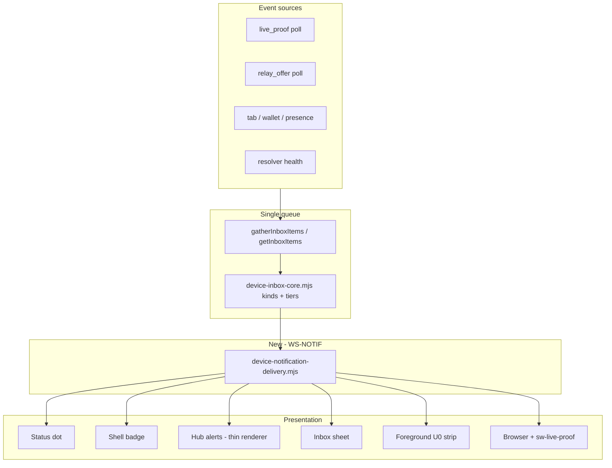

# Notification system v2 — unified tiered inbox (WS-NOTIF)

**Status:** **Engineering closed** — **N0–N5 ☑** · **N4 partial** (in-app only) · **Background OS alerts (P0-N2) — non-functional** on Android Chrome PWA (2026-06-04 field) — **do not invest** until a new workstream reopens transport · hosted push **E4** rollout gated by M4/M8  
**Workstream ID:** **WS-NOTIF**  
**Selected approach:** **Tiered inbox-first + foreground interrupt (TIF)**  
**Coordination:** [`PRODUCT_WORKSTREAM_COORDINATION.md`](PRODUCT_WORKSTREAM_COORDINATION.md) · prior custody work: [`CORE_PRODUCT_LOOP.md`](CORE_PRODUCT_LOOP.md) § View-only deprecation  
**Supersedes (incrementally):** parallel notify paths documented in [`DEVICE_INBOX.md`](DEVICE_INBOX.md) (v1 shipped layers remain valid; delivery is consolidated)  
**Last updated:** 2026-06-04

---

## Executive summary

Stewards need **many event types** with **different urgencies**. The failure mode today is not “no architecture doc” — it is **multiple independent pipelines** (hub alert stack, inbox sheet, glance, relay-offer module, live-proof poll → OS, cross-tab chrome, wallet tab hint) that each invent their own copy, triggers, and CTAs.

**Selected approach (TIF):**

1. **One queue** — every actionable event is an **inbox item** (`device-inbox-core.mjs`), with a stable `kind` and **urgency tier**.
2. **One router** — `device-notification-delivery.mjs` (new) maps tier + context → chrome (dot, badge, hub row, sheet, foreground strip, OS).
3. **Three presentation layers** (unchanged north star from [`DEVICE_INBOX.md`](DEVICE_INBOX.md)) — status dot, inbox, background alerts — but **no feature may bypass the inbox** for badge/OS counts.
4. **Foreground interrupt** — for **tier U0 only**, when the PWA/tab is **visible**, show a single **dismissible strip** (not a second inbox). OS alerts remain **opt-in and tab-hidden only**.

We are **not** building a generic push platform, scan surveillance, or email in this workstream.

---

## Known limitations (2026-06-04 — do not promise in product)

| Surface | Status | What works today | What does **not** work |
|---------|--------|------------------|------------------------|
| **Background OS alert** (P0-N2) | **Non-functional** | Opt-in UI, inbox badge, hub rows, **foreground strip** when app is open | Reliable Chrome system notification when PWA is backgrounded or force-quit; tap-to-sign deep link from tray on Android PWA |
| **SW `sw-live-proof.mjs`** | **Deferred with OS** | Code + tests in repo | Field-validated away-tab delivery on Android Chrome installed PWA |
| **Hosted SSE push (E4)** | Rollout gated | TIF contract in repo (`notify:hosted-push`) | Production enablement — **M4/M8**, not WS-NOTIF |

**Steward workaround until reopened:** Keep the app **foreground** (foreground strip + badge), use **Watch for live proof** + hub scope, or open the app when the dot/badge changes. Do **not** tell stewards that background alerts are shipped.

**Tracking:** [`DEVICE_OS_QA.md`](DEVICE_OS_QA.md) **P0-N2** (blocked) · [`SAD_PATH_COVERAGE_AND_BACKLOG.md`](SAD_PATH_COVERAGE_AND_BACKLOG.md) **H-08** · WS-QUALITY **P1-MOTO-21** (foreground path only).

**Next engineering owner:** [**WS-QUALITY**](CORE_PRODUCT_LOOP.md) — core loop Q2/Q3; Phase 2 SCALE/SW remains deprioritized until Q3 sign-off.

---

## Why this approach (vs alternatives)

| Alternative | Verdict |
|-------------|---------|
| **Patch each bug** (MOTO-06/10/21 style) | Rejected — drift continues; relay stays outside inbox taxonomy. |
| **OS-first** (everything → browser notify) | Rejected — privacy, permission fatigue, wrong for cross-tab/unsaved (see v1 Phase C matrix). |
| **Floating toast only** (no inbox) | Rejected — no ordering, no history, bad for multi-card stewards. |
| **Greenfield second SPA** | Rejected — violates Q4 gate in [`CORE_PRODUCT_LOOP.md`](CORE_PRODUCT_LOOP.md). |
| **TIF (selected)** | One mental model for users; room for many kinds; urgencies explicit in code and tests. |

---

## User-facing model (one sentence)

> **Dot** = device health + the single most urgent thing at a glance. **Inbox** = everything you should do, in order. **Background alerts** = optional pings when you’re not looking (high-urgency kinds only). **Banner strip** = unmissable only when someone is waiting *now* and you’re in the app.

---

## Urgency tiers and delivery matrix

Tiers are **product policy**. Implementation must read tiers from inbox core — not hardcode per module.

| Tier | Name | Target latency | Examples (current + planned) |
|------|------|----------------|------------------------------|
| **U0** | **Time-critical** | Seconds | `live_proof` (shipped) · `relay_offer` / finder message (today: parallel hub group — **fold in**) |
| **U1** | **Action soon** | Minutes | `cross_tab_keys` · `orphan_keys_removed` · `tab_keys_unsaved` · `card_disabled_since_visit` |
| **U2** | **Awareness** | When opened | `resolver_degraded` (no badge count) · future: hosted quota nudge |
| **U3** | **Never surface** | — | Passive scan · per-scan history · marketing |

### Delivery by tier (normative)

| Channel | U0 | U1 | U2 | U3 |
|---------|----|----|----|-----|
| Dot overlay / device axis | Highest overlay (`proof_waiting`) or tier-specific | `cross_tab_keys` / `unsaved` / soft notches | Network color only | — |
| Inbox badge count | Yes | Yes | **No** | — |
| Hub alerts + inbox sheet + glance | Yes (ordered by tier, then age) | Yes | Hub/system banner only | — |
| **Foreground interrupt strip** | **Yes** when `document.visibilityState === 'visible'` | No | No | — |
| Browser / SW OS notification | **Non-functional (deferred)** — policy U0+opt-in+hidden; see § Known limitations | **No** | **No** | — |

**Rules (codify in Vitest):**

1. Badge count = sum of **U0 + U1** actionable items only.
2. OS notify may only fire for kinds where `tier(kind) === 'U0'` and policy allows (extend `device-browser-notifications-core.mjs`).
3. Foreground strip shows **at most one** U0 item; tap CTA = same as inbox row primary action.
4. **Never** duplicate U0 in hub stack *and* strip *and* OS without going through the same inbox item id (dedupe by `kind` + stable key).

---

## Architecture (target)



**Delete or fold (inventory in N0):**

- Direct `maybeNotify*` calls that skip inbox item identity.
- Separate hub-only relay list that does not appear in `getInboxItems()` / badge count.
- In-tab-only “restore” notify copy (custody deprecation shipped — do not reintroduce).

**Keep:**

- `sw-live-proof.mjs` as **U0 background transport** when no visible tab (align payloads with router).
- Request budget rules in [`DEVICE_OS_REQUEST_BUDGET.md`](DEVICE_OS_REQUEST_BUDGET.md) — polling scope tied to **watch** + **alerts on** + inbox kinds that require network.

---

## Phases

| Phase | Exit criteria | Primary commands |
|-------|---------------|------------------|
| **N0 Inventory** | ☑ Markdown table § N0 + `device-notification-inventory-core.mjs` + `notification-system-inventory.test.ts` | `npm run notify:inventory` |
| **N1 Taxonomy** | ☑ `relay_offer` in inbox core + gather; `inboxTier(kind)`; OS policy U0 for relay | `npm run notify:verify` |
| **N2 Router** | ☑ `device-notification-delivery*.mjs` — badge, OS, hub visibility from inbox | `npm run notify:verify` |
| **N3 Foreground strip** | ☑ `#device-foreground-attention` on `/`, `/wallet/`, `/create/`; U0 via delivery router; legacy banner suppressed | `npm run notify:foreground:e2e` · `npm run notify:verify` |
| **N4 Field sign-off** | **Impl ☑** [`DEVICE_OS_QA.md`](DEVICE_OS_QA.md) **P0-N1–N4** + Chrome background-alert copy · **Exit:** all P0-N rows pass on physical Android Chrome PWA (triage log) | `npm run notify:field-signoff` · `npm run notify:verify` |
| **N5 Hosted push (TIF contract)** | ☑ Normative bridge: SSE is **transport** → `live_proof` inbox row → delivery router; no parallel badge/OS | [`HOSTED_TIER_PUSH_ARCHITECTURE_RFC.md`](HOSTED_TIER_PUSH_ARCHITECTURE_RFC.md) § WS-NOTIF · `npm run notify:hosted-push` |

**Do not start N3 until N2 tests green.** Do not add new inbox kinds without a tier row in this doc. **Do not** add steward SSE event types without an inbox `kind` + tier row (N5).

---

## Regression belt (WS-NOTIF)

| When | Command |
|------|---------|
| N0 inventory / new notify path | `npm run notify:inventory` |
| Every PR | `npm run verify:desk:fast` |
| Touch inbox / dot / browser notify | `npm run worker:test -- worker/tests/device-inbox-core.test.ts worker/tests/device-dot-state.test.ts worker/tests/device-browser-notifications-core.test.ts` |
| Touch hub alerts / relay | `npm run e2e -- e2e/device-inbox.spec.ts` |
| Pre-merge | `npm run verify:desk` |
| Android PWA sign-off | `npm run notify:field-signoff` · manual **P0-N** in [`DEVICE_OS_QA.md`](DEVICE_OS_QA.md) |
| N5 hosted push TIF guards | `npm run notify:hosted-push` |

Package scripts:

```bash
npm run notify:verify
# → vitest device-inbox-core + device-dot-state + device-browser-notifications-core + e2e/device-inbox
```

---

## File ownership

| Area | Files |
|------|--------|
| **Taxonomy + ordering** | `site/js/device-inbox-core.mjs` |
| **Gather / poll** | `site/js/device-inbox.mjs` · `device-live-control-inbox.mjs` · `device-relay-offer-inbox*.mjs` |
| **Delivery router (new)** | `site/js/device-notification-delivery.mjs` · `device-notification-delivery-core.mjs` |
| **Foreground strip (new)** | `site/js/device-foreground-attention.mjs` · shell HTML/CSS in `site/css/device-shell.css` |
| **OS channel** | `device-browser-notifications.mjs` · `device-browser-notifications-core.mjs` · `device-browser-notifications-sw.mjs` · `site/sw-live-proof.mjs` |
| **Hub render (thin)** | `device-hub-inbox-alerts.mjs` — render rows from inbox items; delete parallel relay-only DOM path |
| **Dot** | `device-dot-state-core.mjs` — overlay priority from inbox tiers |
| **Tests** | `worker/tests/device-inbox*.test.ts` · `device-dot-state.test.ts` · `e2e/device-inbox.spec.ts` |

**Coordination:** Do not collide with **WS-QUALITY** `/created/` loop unless fixing **L5** (live proof) or **L8** (notify). Do not expand **WS-SCALE / WS-SW** until N4 sign-off unless a red **P0-N** blocker.

---

## N0 inventory (complete — 2026-06-04)

**Machine-readable:** [`site/js/device-notification-inventory-core.mjs`](../site/js/device-notification-inventory-core.mjs) (`NOTIFICATION_INVENTORY`)  
**Regression:** `npm run notify:inventory` → `worker/tests/notification-system-inventory.test.ts`

### N1 shipped (2026-06-04)

`relay_offer` is emitted by `buildInboxItems()` from `gatherInboxInput().relayOfferCount` / `relayOfferPending`. Badge, hub visibility, and inbox sheet rows include finder messages.

### N2 shipped (2026-06-04)

[`device-notification-delivery-core.mjs`](../site/js/device-notification-delivery-core.mjs) + [`device-notification-delivery.mjs`](../site/js/device-notification-delivery.mjs) drive shell badge chroma, OS notify dedupe, and hub group visibility from `getInboxItems()` only. Hub relay/live-proof rows read `meta.relayOfferPending` / `meta.liveProofPending` — no parallel poll stores in hub renderer.

### N3 shipped (2026-06-04)

[`device-foreground-attention-core.mjs`](../site/js/device-foreground-attention-core.mjs) + [`device-foreground-attention.mjs`](../site/js/device-foreground-attention.mjs) render **one** U0 strip when the tab is visible (`buildForegroundAttentionPlan` → `buildForegroundAttentionStripModel`). Live proof wins over relay; CTA matches inbox primary action. `#device-live-proof-banner` stays hidden when the strip host exists. Skipped on `/created/` (`device-shell-created`). E2E: [`e2e/notification-foreground.spec.ts`](../e2e/notification-foreground.spec.ts).

### Unified inbox queue (shipped kinds)

| Kind | Tier | Source module | Surfaces |
|------|------|---------------|----------|
| `live_proof` | U0 | `device-live-control-inbox.mjs` | Badge, hub group, sheet, glance, dot `proof_waiting`, OS+SW (opt-in) |
| `relay_offer` | U0 | `device-relay-offer-inbox.mjs` → gather | Badge, hub group, sheet, glance; OS via `inboxKindAllowsOsNotification` (router N2) |
| `tab_keys_unsaved` | U1 | `device-inbox-core.mjs` ← tab notice count | Badge, hub notice, sheet |
| `cross_tab_keys` | U1 | `device-inbox-core.mjs` ← cross-tab state | Badge, sheet, dot overlay, legacy banners |
| `other_tabs_unsaved_keys` | U1 | `device-inbox-core.mjs` | Badge, sheet |
| `orphan_keys_removed` | U1 | `device-inbox-core.mjs` | Badge, sheet |
| `card_disabled_since_visit` | U1 | `device-inbox-card-disabled.mjs` | Badge, hub rows, sheet, dot overlay (shell only) |

### Parallel / bypass paths (fold or delete)

| ID | File | Trigger | Current | N phase |
|----|------|---------|---------|---------|
| `relay-offer-poll` | `device-relay-offer-inbox.mjs` | Hub open, manual check | Pending store + `hc-relay-offer-inbox-changed` | **N1 fold** → `relay_offer` U0 |
| `os-relay-offer-page` | `device-browser-notifications.mjs` | Relay inbox changed | `maybeNotifyRelayOffer` — not `inboxKindAllowsOsNotification` | **N2 router** |
| `os-live-proof-page` | `device-browser-notifications.mjs` | Live control changed / tab hidden | `maybeNotifyLiveProof` | **N2 router** |
| `sw-live-proof` | `site/sw-live-proof.mjs` | No visible client | SW `showNotification` live proof | **N2 align** with router |
| `live-proof-page-banner` | `device-live-proof-banner.mjs` | Chrome refresh | Suppressed when `#device-foreground-attention` present | **N3 shipped** (fallback only) |
| `cross-tab-page-banner` | `device-cross-tab-banner.mjs` | Chrome refresh | U1 duplicate when shell badge | **N2+ demote** |
| `hub-inbox-alerts` | `device-hub-inbox-alerts.mjs` | Hub refresh | Renders kinds + direct `getRelayOfferPending` | **N2 thin renderer** |

### Presentation chrome (keep — data from inbox after N2)

| ID | File | Role |
|----|------|------|
| `inbox-sheet` | `device-inbox-sheet.mjs` | Badge tap → sheet rows |
| `shell-badge` | `device-status.mjs` | Count + chroma from `notificationCount()` |
| `status-dot-overlay` | `device-dot-state-core.mjs` | Glance + scan dot overlays |
| `hub-glance` | `device-hub-glance.mjs` | Dot long-press copy |
| `wallet-tab-hint` | `wallet-page-chrome.mjs` | U1 wallet tab hint → open controls |
| `scan-page-dot` | `scan-page-dot.mjs` | Scan dot (live proof + cross-tab) |
| `browser-notif-prompt` | `device-browser-notifications.mjs` | Opt-in education (not an event) |

### Out of WS-NOTIF scope (`not_notification`)

| ID | File | Why |
|----|------|-----|
| `hub-keys-custody` | `device-hub-keys-custody.mjs` | Custody panel, not alert queue |
| `scan-actor-band` | `scan-actor-band.mjs` | Scan context CTA |
| `created-relay-offers-section` | `created-child-object-lost-item-offers.mjs` | Now-tab object UI (deep link target) |
| `resolver-system-banner` | `device-status.mjs` | U2 resolver health — no badge |
| `hub-network-tools` | `device-hub-network-tools.mjs` | Poll controls |
| `safari-itp-notice` | `safari-itp-storage-notice.mjs` | Storage education |
| `pwa-install-card` | `pwa-install.mjs` | Install prompt |
| `created-live-control-proof` | `/created/` `#live-control-proof` | Signing surface |

### Transport (not a user-facing channel)

| ID | File | Role |
|----|------|------|
| `steward-push-sse` | `device-steward-push.mjs` | Hosted SSE → poll nudge for `live_proof` |
| `sw-page-bridge` | `device-browser-notifications-sw.mjs` | Visible tab → SW state cache |

**Agent rule:** Extend `NOTIFICATION_INVENTORY` in the same PR when adding a notify path; do not add hub-only alert groups without an inbox `kind`.

---

## Q4 decision record

| Date | Decision | Rationale |
|------|----------|-----------|
| 2026-06-04 | **Go — WS-NOTIF (TIF)** | View-only custody steps 1–3 shipped; field pain on live proof + relay + PWA copy; v1 layers good but delivery fragmented |
| 2026-06-04 | **No** second SPA / email / scan alerts | Privacy + scope |

WS-NOTIF step 4 in [`CORE_PRODUCT_LOOP.md`](CORE_PRODUCT_LOOP.md) is **closed for in-app delivery**; **P0-N2 is excluded** until background OS is reopened under a future workstream.

---

## N5 — Hosted push and TIF (complete — 2026-06-04)

**Scope:** Document and guard the contract between **M3/E4 hosted SSE** and **WS-NOTIF** delivery. **No new push implementation** in this phase — worker SSE (E4b) and `device-steward-push.mjs` (E4c) already ship; production enablement stays on **M4/M8** ([`HOSTED_TIER_IMPLEMENTATION_EPICS.md`](HOSTED_TIER_IMPLEMENTATION_EPICS.md) § E4).

### Normative rule

> **Server push is transport only.** A steward SSE event must **refresh the same inbox queue** as polling, then **all chrome** (badge, hub, strip, OS) flows through `getInboxItems()` → `device-notification-delivery*.mjs`.

### Shipped pipeline (`live_proof` U0)

```text
POST challenge (worker) → notifyLiveProofPending (E4a)
  → SSE live_proof.pending (leader tab, entitled)
  → device-steward-push.mjs (parse only — no showNotification)
  → hc-steward-push-live-proof
  → applyLiveProofPendingFromPush (one GET per event)
  → hc-live-control-inbox-changed
  → gatherInboxItems → buildInboxItems (kind live_proof)
  → device-notification-delivery (badge / strip / OS / hub meta)
```

| Layer | Module | Must not |
|-------|--------|----------|
| Transport | `device-steward-push.mjs` | Call `Notification`, bump badge, or render hub rows |
| Pending store | `device-live-control-inbox.mjs` | Skip `hc-live-control-inbox-changed` after push apply |
| Queue | `device-inbox.mjs` | Special-case push in badge count |
| Router | `device-notification-delivery*.mjs` | Read SSE payloads directly |
| SW bridge (E4d) | `forwardLiveProofPushToServiceWorker` | Replace inbox gather; only nudge SW when push healthy + alerts on |

**Poll fallback:** When SSE is down > 60s (`STEWARD_PUSH_DOWN_FALLBACK_MS`), round-robin resumes — same inbox path.

### Future event types (RFC only until product approves)

| SSE `type` (planning) | Inbox `kind` | Tier | WS-NOTIF gate |
|----------------------|--------------|------|----------------|
| `live_proof.pending` | `live_proof` | U0 | **Shipped** |
| `live_proof.expired` / `proven` | `live_proof` (clear) | U0 | Optional; client may ignore |
| `relay_offer.*` (hypothetical) | `relay_offer` | U0 | **Forbidden** until tier row + gather + `inboxKindAllowsOsNotification` updated together |
| `scan.*`, `cross_tab.*`, … | — | — | **Forbidden** per RFC |

**WS-REV / M8** may implement new server events; **WS-NOTIF** only accepts them when folded into inbox core + inventory + `notify:hosted-push` guards.

### Regression

```bash
npm run notify:hosted-push   # N5 TIF contract guards
npm run notify:verify        # full belt including N5
```

E2E (hosted tier, separate from WS-NOTIF): `e2e/hosted-tier-push.spec.ts` · worker: `steward-push-*.test.ts`.

---

## Agent assignment

| Role | Mission |
|------|---------|
| **WS-NOTIF owner** | One phase per PR; update § N0 inventory; keep belt green |
| **Other agents** | No new `maybeNotify*` or hub-only alert groups without inbox kind |

**PR size:** ≤400 lines; one phase (N1, N2, …) per PR preferred.

---

## Changelog

| Date | Note |
|------|------|
| 2026-06-04 | Workstream opened — TIF approach selected; WS-NOTIF charter |
| 2026-06-04 | **N5 ☑** — hosted push TIF contract in RFC § WS-NOTIF; `notify:hosted-push` guards |
| 2026-06-04 | **Background OS (P0-N2) marked non-functional** — WS-NOTIF engineering closed; hand off to WS-QUALITY |
