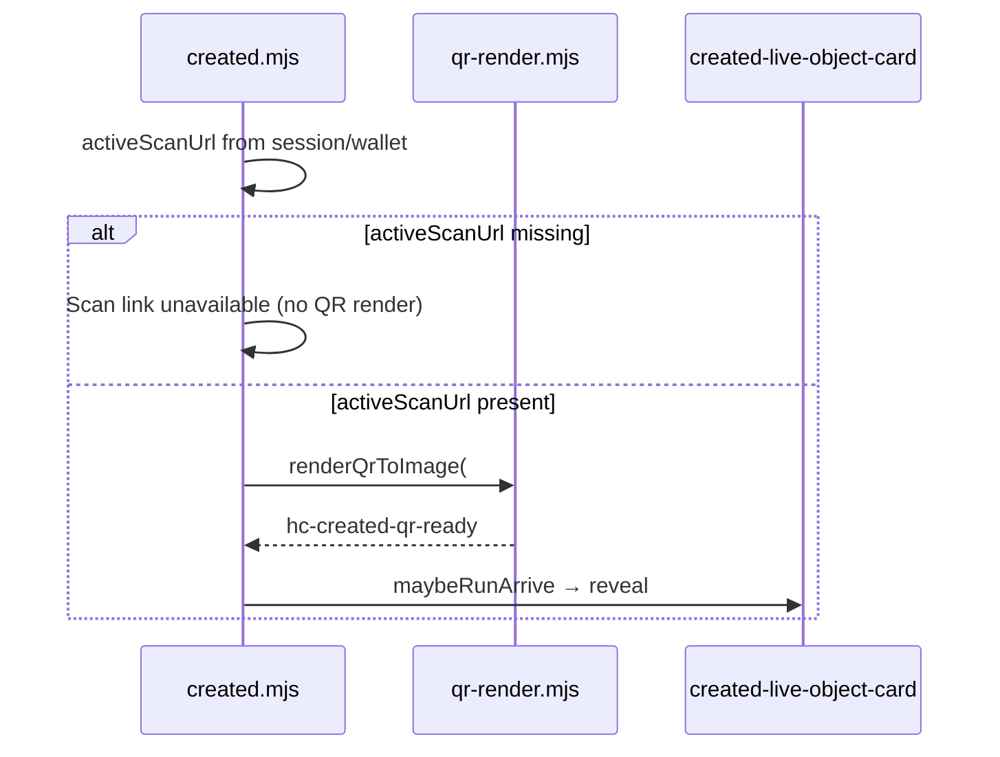

# Investigation: PWA `/created/` Live tab — missing QR, “Card error”, resolver unreachable

**Date:** 2026-05-30  
**Status:** Open — investigation complete; fixes not shipped in this doc  
**Reporter:** Steward on installed PWA (Home Screen shell)  
**Symptoms:**

1. **Open workspace** / **Open controls** lands on **Live · Manage** (expected after returning-steward mode gate `b80322e7`).
2. **QR does not display** on the Live object card.
3. Both saved cards show **“Card error”** (user wording).
4. Hub rows show **“Can't reach resolver · checked 2m ago”**.
5. **Update what scanners see** / status publish does not work (including a root card).

**Related:** [`CARD_WORKSPACE_UX.md`](CARD_WORKSPACE_UX.md) · [`HUB_REVOKE_AND_CONTROLS_NAVIGATION.md`](HUB_REVOKE_AND_CONTROLS_NAVIGATION.md) · [`HUB_CARD_ROW_UX.md`](HUB_CARD_ROW_UX.md) · [`PWA_INSTALL.md`](PWA_INSTALL.md) · [`PWA_STANDALONE_EXTERNAL_NAVIGATION.md`](PWA_STANDALONE_EXTERNAL_NAVIGATION.md) · [`MERCH_VISUAL_CHOREOGRAPHY.md`](MERCH_VISUAL_CHOREOGRAPHY.md) · [`CARD_DISABLED_SINCE_VISIT_FALSE_POSITIVE_INVESTIGATION.md`](CARD_DISABLED_SINCE_VISIT_FALSE_POSITIVE_INVESTIGATION.md) · [`HUB_CARD_DISAPPEARED_SAFARI_INVESTIGATION.md`](HUB_CARD_DISAPPEARED_SAFARI_INVESTIGATION.md) RC-13

---

## Executive summary

These symptoms share one **client-visible failure mode**: the device shell cannot complete resolver `GET`/`POST` to `/.well-known/hc/v1/*` from the **origin the tab is using**. That blocks hub status chips, Live tab network truth, manifesto publish (`POST …/cards/{id}`), and resolver-backed hydration — while **local keys and wallet rows can still look fine**.

A **second, independent** issue explains **missing Live QR even when the scan URL exists**: the Live tab QR is **hidden by default** and only revealed after **canvas QR render** + **`hc-created-qr-ready`** + **arrive animation**. Direct entry into **control** mode (new behavior) does not call `maybeRunArrive()` except via that event; any failure or race in the QR pipeline leaves an empty card.

**Highest-confidence infrastructure finding (reproducible from server):** `https://www.humanity.llc` returns **HTTP 522** for shell and API paths, while `https://humanity.llc` returns **200** for `/.well-known/hc/v1/health`. `resolverApiOrigin()` uses `location.origin` for any host that is not exactly `humanity.llc`, localhost, or `*.pages.dev` — so a PWA or tab on **www** targets a **broken API origin**.

---

## Symptom → UI mapping

| User report | Likely UI source | Mechanism |
|-------------|------------------|-----------|
| **Can't reach resolver · checked 2m ago** | Hub saved row `.hub-card-status-label` | `refreshWalletNetworkStatuses()` → `statusMap[pid] = "error"` (non-2xx) or `"offline"` (fetch throw) → `hubCardStatusLine()` in `device-hub-card-row-core.mjs` |
| **“Card error”** | `/created/` → **Network status & IDs** row **Card** + sublabel, and/or `#created-live-status-meta` hero line | `buildHeroMetaParts()` prefixes `Card ${networkCardStatusEl}` → e.g. **“Card error”** if sublabel is `Error`; or user paraphrase of hub unreachable copy |
| **QR not showing** | `#created-live-qr-hit` / `#created-live-qr-img` inside `#created-live-object-card` | Items start `hidden`; `syncQrPreview()` copies `#qr-img` only when render succeeded; `runCreatedLiveObjectArrive()` reveals `.created-live-arrive-item` after `hc-created-qr-ready` |
| **Status update fails** | `#manifesto-update-form` / `#manifesto-update-status` | `postCardUpdate()` → `fetch(postCardUpdateUrl(profileId))` uses same `resolverApiOrigin()`; failure surfaces as thrown error text. **Additionally**, `#created-live-scanners-see` may be **hidden** by first-revoke gate for **general** cards (not pilot / Tier 1) |

---

## Architecture (data flow)

```text
PWA tab (location.origin)
  │
  ├─ resolverApiOrigin()  →  base for all /.well-known/hc/v1/*
  │
  ├─ Hub poll (device-wallet-network.mjs)
  │     GET …/cards/{profile_id}/status?q={qr_id}
  │     → statusMap error/offline → "Can't reach resolver"
  │
  └─ /created/ (created.mjs)
        ├─ gateCreatedRoute → GET card JSON + status (boot)
        ├─ refreshNetworkStatus() → GET status (Live meta)
        ├─ renderQrToImage(qrImg, activeScanUrl) → hc-created-qr-ready
        ├─ initCreatedLiveObjectCard → maybeRunArrive (QR visible)
        └─ initManifestoUpdate → POST card update (publish)
```

Worker routes in `worker/wrangler.toml` attach the resolver only to **`humanity.llc`** (apex), not `www.humanity.llc`:

- `humanity.llc/.well-known/hc/v1/*`
- `humanity.llc/c/*`
- `humanity.llc/v/*`
- `humanity.llc/v1/*`

---

## Root-cause catalog (prioritized)

### RC-1 — API origin ≠ apex Worker routes (**www / wrong host**) — **High**

| Field | Detail |
|-------|--------|
| **Layer** | Client `resolverApiOrigin()` + DNS/Cloudflare |
| **Code** | `site/js/hc-sign.mjs` — only `humanity.llc`, localhost, and `*.pages.dev` get special handling; **all other hosts** fall through to `return location.origin` |
| **Repro (2026-05-30)** | `curl https://humanity.llc/.well-known/hc/v1/health` → **200**; `curl https://www.humanity.llc/.well-known/hc/v1/health` → **522**; `curl https://www.humanity.llc/wallet/` → **522** |
| **User pattern** | PWA installed or opened on **www** (bookmark, old install, link, or redirect race before inline script runs) → every resolver fetch fails → hub + Live + publish broken |
| **Mitigation shipped elsewhere** | Inline `www` → apex redirect on shell HTML (`site/wallet/index.html`, `site/created/index.html`, …) per RC-13 |
| **Gap** | Redirect does not run if user never loads a shell page with that script; **`resolverApiOrigin()` does not force apex** the way preview hosts force `PRODUCTION_RESOLVER_ORIGIN` |

**Recommended fix:** In `resolverApiOrigin()`, treat `www.humanity.llc` (and optionally any `*.humanity.llc` shell host without Worker routes) like `isPagesPreviewHost` — return `https://humanity.llc`.

---

### RC-2 — Live QR hidden until async pipeline completes — **High** (UX / regression vector)

| Field | Detail |
|-------|--------|
| **Layer** | `created.mjs` + `created-live-object-arrive.mjs` + `MERCH_VISUAL_CHOREOGRAPHY` Beat 4 |
| **Mechanism** | `#created-live-qr-hit` has class `created-live-arrive-item` and **`hidden`**. `syncQrPreview()` unhides it only when `#qr-img` has `src`. `runCreatedLiveObjectArrive()` hides all arrive items again, then staggers them visible |
| **Control-mode entry** | `workspaceMode === "control"` branch calls `initCreatedTabs()` but **does not** call `liveObjectCardCtl.maybeRunArrive()` (unlike **view** mode at `created.mjs` ~1046). Arrive depends on **`hc-created-qr-ready`** after `renderQrToImage` |
| **Regression link** | Returning-steward gate (`firstSessionSetupRequired`) now skips setup Print step and opens **control** directly — stewards no longer see setup step 2 QR (`#created-setup-qr-img`), only the Live card pipeline |
| **Failure modes** | `activeScanUrl` null → “Scan link unavailable”, no render, no event; `qr-render.mjs` throws → catch shows copy link error, **no** `hc-created-qr-ready`; arrive never runs → QR stays hidden |

**Recommended fix:** After control-mode boot, call `void liveObjectCardCtl?.maybeRunArrive()`; if `activeScanUrl` exists but `#qr-img` already has `src`, dispatch `hc-created-qr-ready` or `settleCreatedLiveObjectInstant()` as fallback.

---

### RC-3 — Resolver unreachable (true network / edge) — **Medium** (environment-specific)

| Field | Detail |
|-------|--------|
| **Layer** | Network, Cloudflare, device |
| **Prior art** | [`CARD_DISABLED_SINCE_VISIT_FALSE_POSITIVE_INVESTIGATION.md`](CARD_DISABLED_SINCE_VISIT_FALSE_POSITIVE_INVESTIGATION.md) — `curl` to health returned Cloudflare **1027** from an agent environment; browser may see same |
| **Client behavior** | `fetchResolverHealth` → `offline`; wallet status poll → `error` / `offline`; `refreshNetworkStatus` → `data-created-resolver-reachable=offline`, primary CTA **Check network** (`created-live-primary-cta-core.mjs`) |
| **Note** | Apex health is **ok** from CI/server as of investigation; steward device may still block or intermittently fail |

---

### RC-4 — First-revoke gate hides “What scanners see” (general root) — **Medium** (product, not resolver)

| Field | Detail |
|-------|--------|
| **Layer** | `created-first-revoke-gate.mjs` |
| **Mechanism** | `#created-live-scanners-see` hidden until `hc_created_first_qr_revoke[profile_id]` or pilot / Tier 1 ephemeral unlock |
| **User pattern** | Root **general** card: steward expects **Update what scanners see** on Live tab; panel is hidden with hint — feels like “update broken” even if resolver is up |
| **Does not explain** | Hub **Can't reach resolver** (independent of gate) |

---

### RC-5 — PWA vs Safari storage / session split (iPhone) — **Low** for this report

| Field | Detail |
|-------|--------|
| **Layer** | Platform |
| **Docs** | [`PWA_INSTALL.md`](PWA_INSTALL.md) — PWA and Safari can be separate top-level contexts; [`PWA_STANDALONE_EXTERNAL_NAVIGATION.md`](PWA_STANDALONE_EXTERNAL_NAVIGATION.md) |
| **Why lower** | Reporter sees **two saved cards** and reaches **Live** with keys — `hc_wallet` / `hc_created` exist in the PWA origin. Unreachable resolver is not explained by empty wallet alone |

---

### RC-6 — Optimistic “resolver reachable” on `/created/` — **Low** (misleading chrome)

| Field | Detail |
|-------|--------|
| **Code** | `created.mjs` calls `setResolverReachable(true)` before `refreshNetworkStatus()` completes |
| **Effect** | Brief wrong CTA state; after failed GET, `data-created-resolver-reachable=offline` and **Check network** primary |

---

## Sequence (broken resolver path)

```mermaid
sequenceDiagram
  participant User
  participant PWA as PWA shell (www or apex)
  participant API as resolverApiOrigin host
  participant Worker as Worker (apex only)

  User->>PWA: Open controls / Open workspace
  PWA->>PWA: activateWalletEntry, navigate /created/
  PWA->>API: GET /.well-known/hc/v1/cards/.../status
  alt www.humanity.llc or unreachable edge
    API--xPWA: 522 / network error
    PWA->>PWA: statusMap error/offline, resolverReachable offline
    Note over PWA: Hub "Can't reach resolver"; publish POST fails
  else apex humanity.llc
    API->>Worker: route match
    Worker-->>PWA: 200 scan JSON
    PWA->>PWA: refreshNetworkStatus, manifesto POST OK
  end
```

---

## Sequence (QR hidden while resolver down)



QR generation is **local** (canvas) and does **not** require resolver — so **missing QR with valid `activeScanUrl`** implicates **RC-2** (arrive / event), not resolver outage alone.

---

## Correlation with recent “Open workspace → control” change

| Before (`hc_setup_done` unset) | After (`b80322e7`) |
|--------------------------------|---------------------|
| **Open controls** → **setup** step 2 **Download QR** (`#setup-qr`) | **Open workspace** → **control** **Live** tab |
| QR visible in wizard panel when `triggerDownloadQr` / preview mount runs | QR only on Live object card via arrive pipeline |

If resolver polls fail **and** the Live QR pipeline does not complete, the steward sees **empty Live card + unreachable hub** — a stricter failure surface than the old setup Print step (which still showed QR from the same `renderQrToImage` path when `activeScanUrl` existed).

---

## Verification checklist (steward / QA)

Run on the **same installed PWA** as the report. **Standalone mode has no URL bar** — do not rely on reading the address bar ([`PWA_INSTALL.md`](PWA_INSTALL.md) § Standalone refresh & resume).

### Without a laptop (symptom-only)

| Signal | Likely meaning |
|--------|----------------|
| Hub **Can't reach resolver · checked …** on **every** saved card | Resolver `GET` failing from this install’s API origin (RC-1 www, RC-3 network, or edge) |
| Live primary CTA **Check network** | `data-created-resolver-reachable=offline` on `/created/` |
| Live card has copy/manifesto but **no QR thumbnail** | RC-2 (arrive / render pipeline), not necessarily resolver |
| **What scanners see** missing + small gate hint | RC-4 first-revoke gate (general card) — separate from resolver |

### With Web Inspector (Mac + USB iPhone, or Safari Develop menu)

1. Attach inspector to the **Home Screen app** (not only a Safari tab — they can be different contexts on iOS).
2. **Network:** confirm requests go to `https://humanity.llc/.well-known/hc/v1/…` (**200**), not `https://www.humanity.llc/…` (**522** today).
3. **Console:** `location.origin` and `location.hostname` in the PWA context.

### Debug hub stamp (no URL bar needed)

Enable debug once (persists in `localStorage` for that origin):

- **Safari tab (same install path):** open `https://humanity.llc/wallet/?hc_debug=1` once, then use the PWA again **only if** that tab shares storage with the PWA (often **not** on iPhone — prefer inspector).
- **Inspector console in the PWA:** `localStorage.setItem('hc_debug','1')` then reload the PWA (force-quit and reopen, or hub **Refresh** in standalone).

Then: **status dot → hub sheet → Build (debug) → Copy build info**. Paste should include:

- `Origin: https://humanity.llc (canonical)` — good  
- `Origin: https://www.humanity.llc → use https://humanity.llc` — RC-1  
- `Worker (health unavailable)` while Site line exists — resolver host unreachable from device

See [`SITE_BUILD_VERSIONING.md`](SITE_BUILD_VERSIONING.md) · RC-13 in [`HUB_CARD_DISAPPEARED_SAFARI_INVESTIGATION.md`](HUB_CARD_DISAPPEARED_SAFARI_INVESTIGATION.md).

| # | Check | Pass criterion |
|---|--------|----------------|
| 1 | **Origin** (debug stamp / inspector) | `humanity.llc` apex, not `www` |
| 2 | **Health** | `GET …/health` → **200**, `status: "ok"` |
| 3 | **Card status** | `GET …/status?q=…` → **200** |
| 4 | **Hub chip** | **Reachable · checked …** |
| 5 | **Live QR** | QR on object card + full-size QR in Advanced |
| 6 | **Publish** | Panel visible (or gate hint); submit succeeds |

**Quick apex vs www test (desktop shell only):**

```bash
curl -sS -o /dev/null -w "apex %{http_code}\n" https://humanity.llc/.well-known/hc/v1/health
curl -sS -o /dev/null -w "www %{http_code}\n" https://www.humanity.llc/.well-known/hc/v1/health
```

Expected: apex **200**, www **not** relied upon for API (today www returns **522**).

---

## Recommended fix stack (engineering)

| Priority | Change | Files |
|----------|--------|-------|
| **P0** | Force resolver API to `https://humanity.llc` when `location.hostname` is `www.humanity.llc` (mirror preview behavior) | `site/js/hc-sign.mjs`, Vitest |
| **P0** | Control-mode boot: `void liveObjectCardCtl?.maybeRunArrive()` + instant settle if `#qr-img`.src already set | `site/js/created.mjs` |
| **P1** | When `refreshNetworkStatus` fails, set `#network-card-status` to plain “Unreachable” (not ambiguous **Error**) and sync hero meta | `site/js/created.mjs` |
| **P1** | Hub debug line when `resolverApiOrigin() !== location.origin` (API override) | `device-hub-build-stamp.mjs` or `hc_debug` |
| **P2** | Document first-revoke gate in Live tab hint when publish panel hidden | `created-first-revoke-gate.mjs` copy |

---

## Explicit non-causes

| Idea | Why not |
|------|---------|
| Returning-steward mode gate breaks signing keys | Keys are local; user reaches control mode with Live tab |
| Open workspace bypasses `openCardNowPage` | `wallet-page.mjs` still intercepts; regression is **destination mode**, not navigation |
| Service worker caches API | v1 live-proof SW does not cache `/.well-known/hc/v1/*` for shell fetches |
| Server revoked both cards | Would show **Disabled on network** / **QR revoked**, not generic unreachable (unless status fetch fails entirely) |

---

## Files map

| File | Role |
|------|------|
| `site/js/hc-sign.mjs` | `resolverApiOrigin()` |
| `site/js/device-wallet-network.mjs` | Hub status polls → `error` / `offline` |
| `site/js/device-hub-card-row-core.mjs` | “Can't reach resolver” copy |
| `site/js/created.mjs` | Live meta, QR render, `refreshNetworkStatus`, control boot |
| `site/js/created-live-object-card.mjs` | Arrive + `hc-created-qr-ready` |
| `site/js/created-live-object-arrive.mjs` | Hides/reveals Live QR |
| `site/js/created-manifesto-update.mjs` | Publish POST |
| `site/js/created-first-revoke-gate.mjs` | Hide scanners-see panel |
| `site/js/created-first-session-gate-core.mjs` | Returning steward → control |
| `worker/wrangler.toml` | Apex-only Worker routes |

---

## Agent / operator handoff

1. Confirm steward **origin** (apex vs www) via **inspector** or **hub debug stamp** — not the URL bar (hidden in standalone PWA).
2. On iPhone, attach Web Inspector to the **installed app**; a normal Safari tab is not always the same storage context as the PWA ([`PWA_INSTALL.md`](PWA_INSTALL.md)).
3. If apex and health OK, inspect **status GET**, **`activeScanUrl`**, and whether **`hc-created-qr-ready`** fired on `/created/`.
4. Do not treat as wallet data loss while rows still appear in hub ([`HUB_CARD_DISAPPEARED_SAFARI_INVESTIGATION.md`](HUB_CARD_DISAPPEARED_SAFARI_INVESTIGATION.md)).

---

## Changelog

| Date | Note |
|------|------|
| 2026-05-30 | Initial investigation (post Open workspace → control gate `b80322e7`) |
