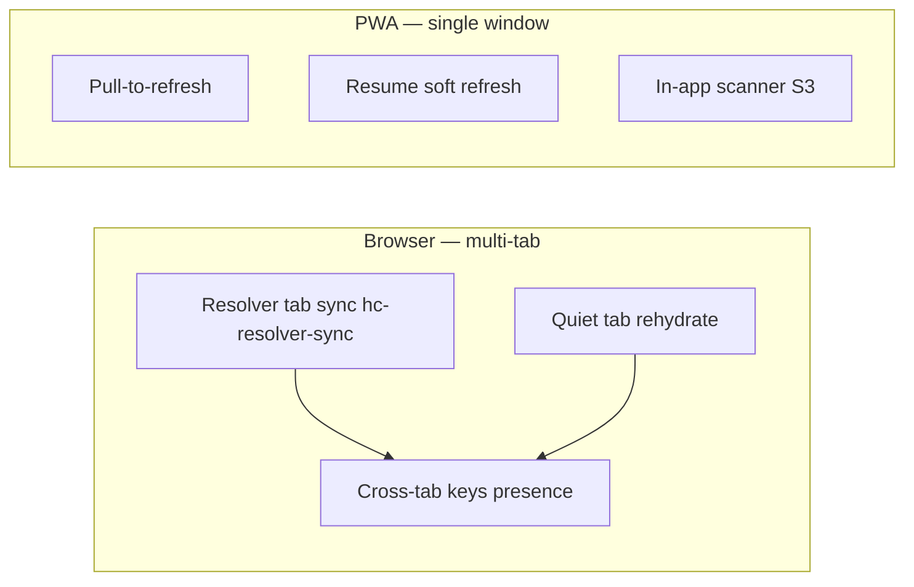
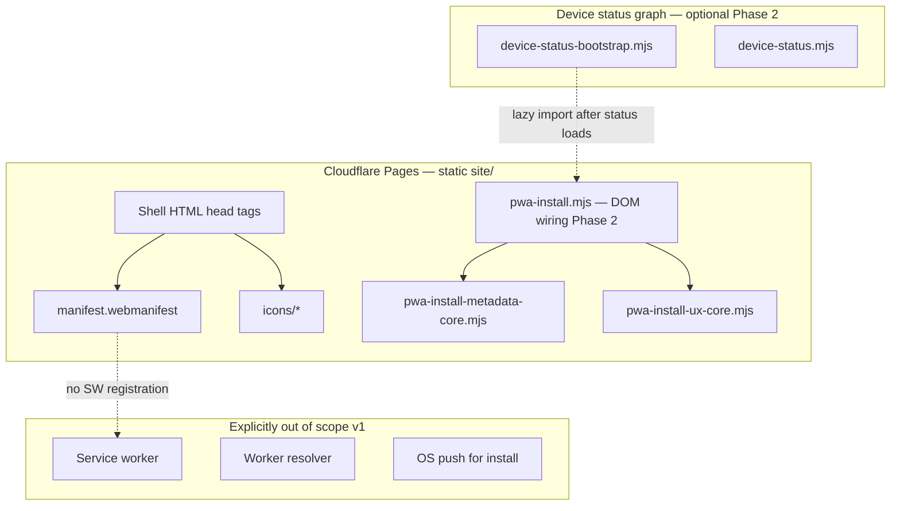

# PWA install (device shell)

**Status:** Spec locked · **Phases 1–9 shipped** (standalone refresh complete) · **Phase 10 shipped** (browser vs PWA shortcut visibility)  
**Audience:** Product, frontend, ops  
**Related:** [`DEVICE_OS.md`](DEVICE_OS.md) · [`PWA_INSTALL_IMPLEMENTATION.md`](PWA_INSTALL_IMPLEMENTATION.md) · [`DEVICE_TAB_RESOLVER_SYNC.md`](DEVICE_TAB_RESOLVER_SYNC.md) · [`QUIET_TAB_REHYDRATE.md`](QUIET_TAB_REHYDRATE.md) · [`PWA_STANDALONE_EXTERNAL_NAVIGATION.md`](PWA_STANDALONE_EXTERNAL_NAVIGATION.md) · [`STEWARD_SCAN_HANDOFF_AND_PWA_VOUCH.md`](STEWARD_SCAN_HANDOFF_AND_PWA_VOUCH.md) · [`VISUAL_DEVICE_SHELL.md`](VISUAL_DEVICE_SHELL.md) · [`SITE_BUILD_VERSIONING.md`](SITE_BUILD_VERSIONING.md) · [`SAFARI_PERFORMANCE_AND_REFRESH_INVESTIGATION.md`](SAFARI_PERFORMANCE_AND_REFRESH_INVESTIGATION.md) · [`DEVICE_OS_REQUEST_BUDGET.md`](DEVICE_OS_REQUEST_BUDGET.md) · [`CROSS_TAB_KEYS_NOTIFICATION_SYSTEM.md`](CROSS_TAB_KEYS_NOTIFICATION_SYSTEM.md) · [`DEVICE_INBOX.md`](DEVICE_INBOX.md) · [`IPHONE_HUB_DOT_UNCLICKABLE_INVESTIGATION.md`](IPHONE_HUB_DOT_UNCLICKABLE_INVESTIGATION.md) · [`STATUS_DOT_LOAD_FAILURE_POSTMORTEM.md`](STATUS_DOT_LOAD_FAILURE_POSTMORTEM.md) · [`UI_COLOR_SCHEME_STANDARD.md`](UI_COLOR_SCHEME_STANDARD.md) · [`features/QR Public Profile v1.0.md`](features/QR%20Public%20Profile%20v1.0.md)

---

## Executive summary

Returning **stewards** (users with saved cards on this device) may install the **device shell** as a home-screen / standalone app on supported browsers. **Strangers scanning a QR must never be prompted to install** — the product promise is browser-native public objects with no app required ([`features/QR Public Profile v1.0.md`](features/QR%20Public%20Profile%20v1.0.md) QR-US-07).

PWA install is **device-layer chrome only**: faster return to saved cards, hub, and inbox — not a new custody or network channel. Keys remain in `sessionStorage` / `localStorage` per browser profile; install does **not** sync keys to the server or across devices. **Storage:** Add to Home Screen does **not** allocate extra quota or a separate database — the PWA and in-browser tabs on the same origin share `localStorage` (~5–10 MB site-wide). Child object indexes (`hc_child_objects_v1:{profile_id}`) live there too; see [`ROOT_CARD_AND_CHILD_OBJECTS.md`](ROOT_CARD_AND_CHILD_OBJECTS.md) § Device storage.

**Product sentence:** *Install puts the device hub on your home screen — the same browser-held keys and inbox you already have, without a separate account or app store.*

**Refresh gap (Phases 6–9):** Standalone mode hides the browser URL bar and native reload affordances. Stewards who add the shell to their home screen need **automatic soft refresh on resume** and **pull-to-refresh** as a manual override — without a shell-caching service worker or full `location.reload()` on every open. See § Standalone refresh & resume.

---

## Placement rule (canonical)

Before adding UI, map the feature using [`DEVICE_OS.md`](DEVICE_OS.md):

| Question | PWA install |
|----------|-------------|
| Save, hub, inbox, install prompt | **Device (browser shell)** |
| Manifesto, revoke, scan truth | **Network** — unchanged |
| Marketing / protocol essays | **Reference** — optional footer link only |

| Surface | Install metadata | Install UX prompt |
|---------|------------------|-------------------|
| `/` (landing, shell) | Yes | Yes (gated) |
| `/wallet/` | Yes | Yes (gated) |
| `/created/` | Yes | Yes (gated) |
| `/create/` flow (`body.page-flow`) | **No** | **No** |
| Scan `/c/…` (Worker HTML) | **No** | **No** |
| Reference / shop / features pages | **No** (v1) | **No** |

Rationale: flow and scan pages optimize for **one-shot tasks** or **stranger trust**; install belongs where users already manage custody.

---

## Browser context vs PWA context

**Canonical split.** The device shell runs in two top-level browsing contexts. Product copy, shortcuts, and refresh affordances must match the context the steward is actually in — not assume every user has a browser tab bar.

**Detection:** `readStandaloneModeFromWindow()` in [`pwa-standalone-refresh-core.mjs`](../site/js/pwa-standalone-refresh-core.mjs) — `display-mode: standalone` + legacy `navigator.standalone` on iOS.

### Mental model

| | **Browser context** | **PWA context (standalone)** |
|---|---------------------|------------------------------|
| **How stewards open the shell** | Safari / Chrome tab on `humanity.llc` | Home-screen icon → `start_url` `/` |
| **Navigation chrome** | URL bar, native reload, multi-tab bar | No URL bar; no in-app tab bar |
| **Typical window count** | 1–N tabs on same origin | Usually **one window** |
| **`window.open` / `target="_blank"`** | New tab on same origin | Often **system browser** (leaves PWA) — [`PWA_STANDALONE_EXTERNAL_NAVIGATION.md`](PWA_STANDALONE_EXTERNAL_NAVIGATION.md) |
| **Primary refresh affordances** | Browser reload menu | Resume soft refresh, pull-to-refresh, hub glance **Refresh** row — § Standalone refresh & resume |
| **Cross-tab vocabulary in UI** | Appropriate (“other tabs”, “new tab”) | Misleading — prefer window/context language or hide |

Both contexts share the **same device layer** (wallet in `localStorage`, hub, inbox, status dot). Install does **not** add server custody or a new key channel.

### Storage and signing (platform nuance)

| Storage | Browser tab | PWA window | Notes |
|---------|-------------|------------|-------|
| `localStorage` (`hc_wallet`, prefs) | Same origin profile | Same origin profile | **Usually shared** when both contexts exist on one device |
| `sessionStorage` (`hc_created` tab keys) | Per tab | Per PWA window | Never shared across contexts |
| iPhone PWA vs Safari | — | — | May behave as **separate wallet buckets** for signing — not equivalent to “two browser tabs”. See [`STEWARD_SCAN_HANDOFF_AND_PWA_VOUCH.md`](STEWARD_SCAN_HANDOFF_AND_PWA_VOUCH.md) · [`device-pwa-session-mismatch-core.mjs`](../site/js/device-pwa-session-mismatch-core.mjs) |

**Product sentence (browser):** *Open as many tabs as you like — network checks and keys can stay in sync on this device.*

**Product sentence (PWA):** *One home-screen app — pull to refresh, same saved objects, no tab bar.*

### Parallel cross-context systems

Two shipped mechanisms target **multi-tab browser** usage. They remain **active in PWA** (defaults unchanged) but **browser-tab UI** is hidden in standalone:



| System | Doc | Browser UI | PWA UI | Background in PWA |
|--------|-----|------------|--------|---------------------|
| **Resolver tab sync** | [`DEVICE_TAB_RESOLVER_SYNC.md`](DEVICE_TAB_RESOLVER_SYNC.md) | Share network checks · Refresh all tabs | **Hidden** | `initResolverTabSync()` still runs; `hc_resolver_sync_tabs` default on |
| **Quiet tab rehydrate** | [`QUIET_TAB_REHYDRATE.md`](QUIET_TAB_REHYDRATE.md) | Open last object in new tabs | **Hidden** | Tier 1 (one saved object) always; Tier 2 follows `hc_quiet_tab_rehydrate` default on |
| **Cross-tab keys / custody** | [`CROSS_TAB_KEYS_NOTIFICATION_SYSTEM.md`](CROSS_TAB_KEYS_NOTIFICATION_SYSTEM.md) | Inbox + hub custody rows | Same when hybrid contexts open | PWA window heartbeats like a tab |
| **PWA session mismatch** | [`SAFARI_KEYS_WIPE_INVESTIGATION.md`](SAFARI_KEYS_WIPE_INVESTIGATION.md) R5 | Wallet tab hint | Hub custody · scan actor band | When keys were last used in the *other* context |
| **Standalone refresh** | § Standalone refresh & resume | N/A (browser has native reload) | PTR · resume · glance Refresh | Standalone-only |

### Tab-native shortcuts — browser only

Homepage **Shortcuts & settings** (`#landing-device-settings` on `/` only) includes three rows aimed at **multi-tab browser** stewards. **Hidden in standalone** via [`pwa-browser-tab-shortcuts.mjs`](../site/js/pwa-browser-tab-shortcuts.mjs) on landing init and again from [`pwa-standalone-refresh.mjs`](../site/js/pwa-standalone-refresh.mjs) `syncStandaloneAffordances()` after status bootstrap:

| Row | `localStorage` / action | Why hidden in PWA |
|-----|-------------------------|-------------------|
| **Share network checks** | `hc_resolver_sync_tabs` (default on) | Single window; “other tabs” copy is wrong. Sync machinery harmless at default-on. |
| **Refresh all tabs** | Manual `refreshResolverChecksFromHub()` | Redundant with **Check network**, PTR, resume soft refresh, and hub glance **Refresh** row. |
| **Open last object in new tabs** | `hc_quiet_tab_rehydrate` (default on) | No in-app “new tab”; Tier 1 rehydrate unaffected. |

**Hide ≠ disable.** Preferences and bootstrap behavior are unchanged. Stewards who use **both** PWA and browser tabs can still change prefs from a **browser tab** on `/` (shortcuts visible there). Do **not** force prefs off in standalone.

**Hybrid power users (PWA + browser tab open):** Resolver sync and rehydrate can still help across contexts on desktop/Android. Hiding UI in PWA avoids misleading copy; browser tab remains the settings surface for tab-native prefs.

### PWA-native refresh affordances

When tab-native shortcuts are hidden, stewards still have:

| Affordance | Surface | Trigger |
|------------|---------|---------|
| Resume soft refresh | `/`, `/wallet/` | App switcher return · bfcache `pageshow` |
| Pull-to-refresh | `/`, `/wallet/` | Manual pull (standalone only) |
| Hub glance **Refresh** row | `/`, `/wallet/` | Tap — Phase 9 |
| **Check network** | Hub network tools | Manual poll + broadcast when sync on |
| Stale shell banner | `/`, `/wallet/` | Live `/js/build-meta.mjs` ≠ client stamp → hard reload CTA |

Do **not** conflate **data refresh (soft)** with **shell reload (hard)** — § Standalone refresh & resume.

### Navigation policy (summary)

| Action | Browser | PWA |
|--------|---------|-----|
| Steward scan preview | New tab (optional) | Same-tab + return banner — [`pwa-scan-handoff-core.mjs`](../site/js/pwa-scan-handoff-core.mjs) |
| Hub / wallet internal links | Same tab | Same tab |
| Camera QR inbound | Safari (system) | Use in-app scanner or clipboard handoff — [`STEWARD_SCAN_HANDOFF_AND_PWA_VOUCH.md`](STEWARD_SCAN_HANDOFF_AND_PWA_VOUCH.md) |
| Merch checkout | Same-tab handoff | Same-tab handoff |

Wallet pin and steward scan link subtitles **omit “new tab”** in standalone (same pattern as shortcut hiding).

### Regression

```bash
npm run worker:test:pwa-install
npm run e2e:pwa-install              # P1-PWA-R steps 13–14 (standalone hides tab-native shortcuts)
npm run e2e:device-resolver-sync     # P1-1 two-tab sync (browser context; shortcuts visible)
```

Manual spot-check: [`DEVICE_OS_QA.md`](DEVICE_OS_QA.md) **P1-1** on a real multi-tab browser if E2E is insufficient.

---

## Architecture

### Layer diagram



### File map (target)

| Path | Role | Phase |
|------|------|-------|
| `site/manifest.webmanifest` | Web app manifest (JSON) | 1 |
| `site/icons/pwa-192.png` | Install icon 192×192 | 1 |
| `site/icons/pwa-512.png` | Install icon 512×512 | 1 |
| `site/icons/pwa-512-maskable.png` | Android maskable 512×512 | 4.1 |
| `site/icons/pwa-apple-touch.png` | iOS home screen 180×180 | 1 |
| `site/js/pwa-install-metadata-core.mjs` | Path rules, manifest validation | **Contract shipped** |
| `site/js/pwa-install-ux-core.mjs` | Show/hide gating, dismiss snooze | **Contract shipped** |
| `site/js/pwa-install.mjs` | `beforeinstallprompt`, DOM card, iOS copy; `isStandaloneMode()` helper | 2 |
| `site/js/pwa-install-html.mjs` | Emphasis card markup helper | 2 |
| `site/js/pwa-standalone-refresh-core.mjs` | Standalone detection, soft-refresh pipeline contract, PTR + stale shell + affordance rules | **6–9** ✅ |
| `site/js/pwa-standalone-refresh.mjs` | Resume listeners, PTR, stale banner, hub Refresh row + PTR tip | **6–9** ✅ |
| `site/js/pwa-standalone-affordances-html.mjs` | Hub Refresh row + first PTR tip markup | **9** ✅ |
| `site/js/pwa-browser-tab-shortcuts.mjs` | Hide browser-tab-only homepage shortcuts in standalone | **10** ✅ |
| `site/js/pwa-stale-shell-banner-html.mjs` | Stale shell emphasis card markup | **8** ✅ |
| Shell HTML (`index`, `wallet`, `created`) | `<link rel="manifest">`, apple-touch-icon | 1 |
| `worker/tests/pwa-install-metadata.test.ts` | Metadata contract tests | **Contract shipped** |
| `worker/tests/pwa-install-ux.test.ts` | UX gating tests | **Contract shipped** |

### Status graph integration (Phase 2)

**Default:** `pwa-install.mjs` is **not** on the critical status-dot import graph. Load it **lazily** after `device-status-bootstrap.mjs` succeeds so a PWA bug cannot red-ring the status dot ([`STATUS_DOT_LOAD_FAILURE_POSTMORTEM.md`](STATUS_DOT_LOAD_FAILURE_POSTMORTEM.md)).

If install UX must read inbox kinds, import **`device-inbox-core.mjs` helpers only** — do not pull the full inbox sheet graph from `pwa-install.mjs`.

Only add `pwa-install.mjs` to `DEVICE_STATUS_SHELL_JS_FILES` if it becomes a **static** import of `device-status.mjs` (discouraged). Prefer:

```javascript
// After status module loads (device-status-bootstrap.mjs or device-chrome-refresh.mjs)
import("./pwa-install.mjs?v=" + DEVICE_SHELL_ASSET_VERSION).catch(() => {});
```

---

## Manifest contract (Phase 1)

### Required fields

Validated by `validatePwaManifestShape()` in [`pwa-install-metadata-core.mjs`](../site/js/pwa-install-metadata-core.mjs):

| Field | Value (v1) | Notes |
|-------|------------|-------|
| `name` | `humanity.llc` | Full name in install sheet |
| `short_name` | `humanity` | Home screen label |
| `start_url` | `/` | Always landing; optional `?source=pwa` for **local** attribution only |
| `scope` | `/` | Entire site; scan pages still excluded from **UX** not routing |
| `display` | `standalone` | Hides browser URL bar when installed |
| `background_color` | `#ffffff` | Splash / task switcher |
| `theme_color` | `#ffffff` | Must match shell `meta name="theme-color"` on light; dark uses inline boot script today |
| `icons` | 192 + 512 PNG | `manifestHasRequiredIconSizes()` |

**Icon art (Phase 4.1):** Static **device shell brand dot** (`#db1b43` on `#ffffff`) — same mark as status-dot chrome, not the QR code. Home screen icons cannot animate; avoid steward-green or urgent pulse styling. Regenerate: `npm run site:generate-pwa-icons`.

### HTML head tags (shell pages only)

Each of `site/index.html`, `site/wallet/index.html`, `site/created/index.html`:

```html
<link rel="manifest" href="/manifest.webmanifest" />
<link rel="apple-touch-icon" href="/icons/pwa-apple-touch.png" />
```

Keep existing `<meta name="theme-color">` and favicon. Do **not** duplicate manifest on `/create/` or scan templates.

### Deploy

Manifest and icons deploy with **Pages** (`npm run site:build-meta && npm run pages:deploy`). No Worker change for metadata-only Phase 1.

After deploy, verify:

```bash
curl -sI https://humanity.llc/manifest.webmanifest | head -1
curl -s https://humanity.llc/manifest.webmanifest | jq .
```

---

## Install UX contract (Phase 2)

### Surfaces

One **emphasis card** ([`HC_EMPHASIS_CARD_ROLLOUT.md`](HC_EMPHASIS_CARD_ROLLOUT.md)) — not a modal, not OS notification:

| ID | Location | When visible |
|----|----------|--------------|
| `#device-pwa-install-card` | Landing: below hero or in hub glance area; wallet: top of page content | `shouldShowPwaInstallSurface()` true |

Copy (draft):

| Element | Chromium | iOS Safari |
|---------|----------|------------|
| Eyebrow | `Install on this device` | `Add to Home Screen` |
| Title | `Open your saved cards from the home screen` | Same |
| Detail | `Same keys and inbox — no account.` | `Tap Share → Add to Home Screen.` |
| CTA | `Install` (calls `deferredPrompt.prompt()`) | Dismiss only (no fake install button) |

Use `--surface-popover-*` if the card ever moves to a floating surface ([`UI_COLOR_SCHEME_STANDARD.md`](UI_COLOR_SCHEME_STANDARD.md)).

### Gating rules (`shouldShowPwaInstallSurface`)

All must pass:

1. **Shell page** — `isPwaShellPagePath(pathname)`
2. **Not standalone** — `display-mode: standalone` is false (already installed)
3. **Returning steward** — `savedCardCount >= 1` (`PWA_INSTALL_MIN_SAVED_CARDS`)
4. **Setup complete** — at least one saved wallet row has `localStorage.hc_setup_done[profile_id]` (`anyWalletSetupDone`; P4)
5. **Not snoozed** — dismiss younger than 7 days (`hc_pwa_install_dismissed_at`)
6. **No urgent inbox** — kinds in `PWA_INSTALL_BLOCKED_INBOX_KINDS`: `orphan_keys_removed`, `cross_tab_keys`, `other_tabs_unsaved_keys`
7. **Status graph healthy** — no `data-device-status-error` on `#top-chrome`
8. **Platform signal** — `beforeinstallprompt` captured **or** iOS Safari manual path

When gates 1–3 and 5–7 pass but setup is incomplete, show the **deferral card** (`shouldShowPwaInstallDeferralHint`) instead: “Finish your first object in Safari…” — no native install CTA until setup completes.

Never show when:

- Scan or create flow paths
- User has zero saved cards (stranger / first-create path)
- Inbox badge indicates custody work in progress

### Dismiss and snooze

| Action | Behavior |
|--------|----------|
| Dismiss (secondary CTA or ×) | Write `localStorage.hc_pwa_install_dismissed_at = new Date().toISOString()` |
| Successful install | Hide card; listen for `appinstalled` |
| Snooze expiry | After 7 days, may show again if other gates pass |

Use `try/catch` on all `localStorage` writes (Safari private mode).

### Chromium `beforeinstallprompt`

```javascript
let deferredPrompt = null;
window.addEventListener("beforeinstallprompt", (e) => {
  e.preventDefault();
  deferredPrompt = e;
  schedulePwaInstallRender();
});
window.addEventListener("appinstalled", () => {
  deferredPrompt = null;
  hideInstallCard();
});
```

**Errors:** If `prompt()` rejects (user cancel, policy), log `[humanity] PWA install prompt failed` at `info` level — do not throw. Clear `deferredPrompt` on successful install only.

---

## Cross-tab, custody, and inbox interactions

An installed PWA is a **separate browsing context** (same profile storage in most cases, separate window in the presence system). **Browser vs PWA product split:** § Browser context vs PWA context.

| Scenario | Expected behavior |
|----------|-------------------|
| Browser tab + PWA both open with keys | Cross-tab inbox / custody panel applies ([`CROSS_TAB_KEYS_NOTIFICATION_SYSTEM.md`](CROSS_TAB_KEYS_NOTIFICATION_SYSTEM.md)) |
| Keys in PWA, user opens `/` in Safari | **iPhone:** may be separate wallet buckets — not the same as two browser tabs. Use [`STEWARD_SCAN_HANDOFF_AND_PWA_VOUCH.md`](STEWARD_SCAN_HANDOFF_AND_PWA_VOUCH.md) handoff or in-app scanner |
| Camera QR → Safari while card is in PWA | **Cannot vouch in Safari.** S1 copy+paste handoff or S3 in-app scanner in PWA |
| PWA scan preview (`window.open` / `target="_blank"`) | **P1 shipped:** same-tab in standalone via [`pwa-scan-handoff-core.mjs`](../site/js/pwa-scan-handoff-core.mjs) — [`PWA_STANDALONE_EXTERNAL_NAVIGATION.md`](PWA_STANDALONE_EXTERNAL_NAVIGATION.md) |
| Tab-native shortcuts in standalone | **Hidden** — Share network checks · Refresh all tabs · Open last object in new tabs; prefs + sync machinery unchanged |
| User installs from `/wallet/` | `start_url` still `/`; opening icon lands on hub-first landing |
| Orphan flash after card delete | Old PWA window may heartbeat until closed — documented in [`CROSS_TAB_KEYS_FLASH_AFTER_CARD_DELETE_INVESTIGATION.md`](CROSS_TAB_KEYS_FLASH_AFTER_CARD_DELETE_INVESTIGATION.md) |

**Install prompt deferral:** When `PWA_INSTALL_BLOCKED_INBOX_KINDS` are active, hide install card — custody clarity beats growth.

---

## Caching, versioning, and bottlenecks

### No service worker (v1)

**Do not register a service worker** in Phases 1–3. A SW that caches shell JS/CSS **amplifies** the failure mode where iPhone PWA serves stale `device-status.mjs` while HTML updated ([`IPHONE_HUB_DOT_UNCLICKABLE_INVESTIGATION.md`](IPHONE_HUB_DOT_UNCLICKABLE_INVESTIGATION.md) § cache behavior).

If a SW is added later, it requires a **separate RFC**: cache key must include `DEVICE_SHELL_ASSET_VERSION`, never cache `device-status-bootstrap.mjs` opaquely, and document in [`SITE_BUILD_VERSIONING.md`](SITE_BUILD_VERSIONING.md).

### Cache bust unchanged

Install does **not** replace `DEVICE_SHELL_ASSET_VERSION` or `?v=` on the status graph. PWA users still depend on shell cache bust discipline ([`AGENTS.md`](../AGENTS.md)).

### Bottlenecks and mitigations

| Risk | Mitigation |
|------|------------|
| Stale shell in standalone PWA | Same as browser: bump `DEVICE_SHELL_ASSET_VERSION`; document hard-close PWA after deploy in ops notes | **Phases 6–8:** soft refresh on resume + PTR; Phase 8 stale `build` nudge → tap reload |
| `beforeinstallprompt` never fires | Gate on iOS manual path; do not show broken Install button |
| Install card competes with inbox | Block on urgent inbox kinds |
| Lazy module load race | Render install card only after status bootstrap success event or idle callback |
| Icon asset weight | PNG only at 192/512/180; no oversized source in repo |
| Private mode | `localStorage` dismiss fails silently; card may reappear — acceptable |
| Multiple rapid re-renders | Debounce render 300ms; subscribe to `hc-device-os-refreshed` not every storage tick |

### Request budget

Install module adds **zero** Worker API calls. Do not phone home install events in v1.

Standalone **soft refresh** (Phases 6–7) reuses existing debounced network paths — see § Soft refresh pipeline and [`DEVICE_OS_REQUEST_BUDGET.md`](DEVICE_OS_REQUEST_BUDGET.md). Do not fan out unscoped per-card status GETs on every resume or pull.

---

## Standalone refresh & resume

**Status:** Spec locked · **Phases 6–9 shipped** · **H-007 closed** in [`V1_IMPLEMENTATION_BACKLOG.md`](V1_IMPLEMENTATION_BACKLOG.md)

### Problem

`display: standalone` removes browser chrome. Stewards in an installed PWA cannot:

- Pull the browser’s native reload gesture (iOS standalone often disables overscroll refresh)
- Open the URL bar or browser menu to hard-refresh
- Easily recover from stale hub/network state after switching away and back

Phases 1–5 shipped install metadata and the install card but **no deliberate refresh affordance** for users already in standalone mode.

### Two refresh needs (do not conflate)

| Need | What it fixes | User phrase |
|------|----------------|-------------|
| **Data refresh (soft)** | Card status chips, inbox badge, dot, cross-tab banners, resolver health | “Are my cards up to date?” |
| **Shell reload (hard)** | Stale JS/CSS after deploy, dead status dot, mixed `?v=` peers | “The app looks broken after an update” |

Cold launch from the home-screen icon already performs a **full navigation** to `start_url` (`/`) — new HTML and the status module graph. The primary gap is **warm resume**: app switcher return, bfcache restore, or background tab where data can be stale but the document is not reloaded.

### Current behavior (gap)

| Event | Today | Gap for standalone |
|-------|--------|-------------------|
| Cold open (icon tap, process killed) | Full page load | Acceptable |
| `visibilitychange` → visible | `refreshNetwork()` (health GET only) in `device-status.mjs` | Dot/hub/chips may stay stale |
| `pageshow` + `persisted` (bfcache) | Wallet network truth reset; tab presence sync; sheet reconcile | No full chrome refresh or network chips |
| `device-os-coordinator` on visible | Full debounced refresh pipeline | **Not auto-started** (request-budget / Safari revert — see [`SAFARI_PERFORMANCE_AND_REFRESH_INVESTIGATION.md`](SAFARI_PERFORMANCE_AND_REFRESH_INVESTIGATION.md)) |

Browser-tab stewards still have reload in the browser menu. **Standalone-only asymmetry is intentional** — PWA users need extra affordances; in-browser tabs do not require Phase 6–7 by default.

### Product stance

| Action | Policy |
|--------|--------|
| **Default on open/resume (standalone)** | **Soft refresh** — re-read local state + refresh chrome + debounced network chips |
| **Pull-to-refresh (standalone)** | Same soft refresh pipeline + brief “Updated” affordance |
| **Every open** | **Do not** `location.reload()` — too slow on Safari; does not clear `localStorage` anyway |
| **Post-deploy skew** | Optional **stale shell nudge** (Phase 8) — compare live `/js/build-meta.mjs` vs in-memory `SITE_BUILD_META` |
| **Service worker for auto-update** | **No** — amplifies iPhone stale-module skew ([`IPHONE_HUB_DOT_UNCLICKABLE_INVESTIGATION.md`](IPHONE_HUB_DOT_UNCLICKABLE_INVESTIGATION.md)) |
| **Scan / create flows** | **No** PTR or standalone refresh UI — strangers and one-shot flows stay browser-native |

### Soft refresh pipeline (canonical)

Triggered on standalone resume (Phase 6) and on pull-to-refresh (Phase 7). **Not** a full page reload.

1. **Re-read wallet** from `localStorage` (`loadWallet` / existing hub paths) — catches changes from another tab or context on the same origin.
2. **`refreshDeviceChrome()`** — dot, inbox badge, cross-tab banners, hub glance, inbox sheet if open (`device-chrome-refresh.mjs`).
3. **`refreshNetwork()`** — resolver health GET (already cheap; 5s abort).
4. **Network chips** — only when hub is expanded or user is on `/wallet/`, via existing debounced `fetchAndApplyNetworkChips` / `walletNetworkVisibilityRefreshAllowed` gates ([`DEVICE_OS.md`](DEVICE_OS.md) § Refresh coordinator).
5. **Live-control inbox** — only when **Watch for live proof** is on (`hc_watch_live_proof === "1"`) and poll scope is active — same gates as today. A pull with watch off should still feel useful (chrome + chips), not silently no-op.

**Event matrix (standalone only):**

| Event | Run soft refresh |
|-------|------------------|
| `visibilitychange` → `visible` | Yes |
| `pageshow` + `persisted: true` | Yes |
| `window` `focus` | No (duplicate of visibility on most platforms) |
| Cold `load` (first paint) | No — bootstrap already runs `refreshDeviceChrome({ immediate: true })` + `refreshNetwork()` |

**Detection:** Reuse `isStandaloneMode()` from `pwa-install.mjs` (`display-mode: standalone` + legacy `navigator.standalone`). Extract to `pwa-standalone-refresh-core.mjs` if both install and refresh modules need it.

**Coordinator note:** Do **not** auto-start `initDeviceOsCoordinator()` globally to fix PWA resume — that reintroduces the pre-revert visibility storm. Standalone soft refresh calls the **same underlying functions** with standalone-specific triggers and existing debounce/TTL guards.

### Pull-to-refresh (Phase 7)

Manual override when stewards do not trust background refresh or want an explicit “check now” moment.

| Gesture tier | Action | Ship in |
|--------------|--------|---------|
| **Normal pull** | Soft refresh pipeline + brief “Updated” (or spinner) at top | Phase 7 |
| **Hard pull / hold** (optional) | `location.reload()` with cache discipline | **Defer** — surprise full reload is jarring on Safari |

**Surfaces:**

| Path | PTR |
|------|-----|
| `/` (landing) | Yes |
| `/wallet/` | Yes |
| `/created/` | No (owner flow; no install metadata) |
| Scan `/c/…` | No (stranger trust surface) |
| `/create/` | No |

**UX constraints:**

- Use a **custom** top indicator — do not rely on browser-native PTR in standalone WebKit.
- When hub sheet or inbox sheet is **open**, disable PTR or scope refresh to sheet content only — avoid gesture conflict with sheet drag.
- Respect **nested scroll**: landing hub sheet and wallet saved rows need a single scroll root or PTR fights hub expand/collapse.
- Show **in-progress state** (slim top bar or dot pulse) — standalone has no URL-bar loading spinner.
- Use `--surface-popover-*` if the indicator floats ([`UI_COLOR_SCHEME_STANDARD.md`](UI_COLOR_SCHEME_STANDARD.md)).

**In-browser tabs:** Phase 7 may ship **standalone-only** first. Extending PTR to browser shell pages is an open product question (PWA-R3).

### Supplementary affordances (Phase 9 — shipped)

| Affordance | Role |
|------------|------|
| **Hub “Refresh” row** | Accessibility + fallback when PTR is unknown; hub glance row on landing + wallet |
| **First standalone PTR tip** | One-time dismissible card: “Pull down to refresh card status.” |
| **Install card copy** | Mentions pull-to-refresh in install card detail |
| **Stale shell banner (Phase 8)** | After cache-busted fetch of `/js/build-meta.mjs`: if live `gitSha` or `shellAssetVersion` ≠ in-memory `SITE_BUILD_META`, show “Update available — tap to refresh” (hard reload CTA) |

### Stale shell nudge — detection fix (2026-05-29)

**Symptom:** “A newer version is ready” card reappeared immediately after tapping **Refresh**, even when the PWA had already loaded the latest Pages shell.

**Root cause:** Phase 8 initially compared Worker health `build.gitSha` to in-memory `SITE_BUILD_META.gitSha`. Pages and Worker deploy on **separate pipelines** ([`SITE_BUILD_VERSIONING.md`](SITE_BUILD_VERSIONING.md)), so those SHAs often differ at rest — the nudge fired on every standalone session and **Refresh** (`location.reload()`) could never clear it.

**Fix:**

| Before | After |
|--------|-------|
| `fetchResolverHealthBuild()` → compare Worker `build` vs client | `fetchLiveSiteBuildMeta()` → cache-busted `GET /js/build-meta.mjs` vs in-memory `SITE_BUILD_META` |
| `location.reload()` | `location.replace(staleShellHardReloadHref(...))` — adds `_hc_shell` query for Safari cache bypass |
| Dismiss keyed to Worker `gitSha` | Dismiss keyed to **live Pages** `gitSha` |

**Not stale:** Worker-only deploy with unchanged Pages shell (SHAs differ in debug hub — expected). **Still stale:** live Pages stamp ahead of what this document imported (true post-deploy skew).

**Code:** `isShellBuildStale(liveSiteMeta, clientMeta)` in [`pwa-standalone-refresh-core.mjs`](../site/js/pwa-standalone-refresh-core.mjs) · `fetchLiveSiteBuildMeta()` in [`build-meta-browser.mjs`](../site/js/build-meta-browser.mjs).

### Onboarding copy (draft)

| Moment | Copy |
|--------|------|
| Install card detail (optional addition) | `Pull down anytime to refresh your cards.` |
| First standalone open (one-time tip) | `Tip: pull down to refresh card status.` |

### Cross-tab

Installed PWA and Safari tab on the same origin share `localStorage`. Resume soft refresh re-reads wallet; `storage` events still drive chrome refresh when another context writes. Explicit pull gives stewards confidence when they are unsure which context is authoritative ([`CROSS_TAB_KEYS_NOTIFICATION_SYSTEM.md`](CROSS_TAB_KEYS_NOTIFICATION_SYSTEM.md)).

### Error handling (refresh)

| Failure | User-visible | Dev signal |
|---------|--------------|------------|
| Soft refresh while offline | Chrome updates from cache; network chips show last known / checking | Existing degraded banner |
| Health GET fails | No stale-shell nudge; existing network degraded state | `refreshNetwork` abort / error path |
| Live `build-meta.mjs` fetch fails | No stale-shell nudge | `fetchLiveSiteBuildMeta` abort / error path |
| PTR during hub drag | No refresh; no stuck spinner | Gesture guard in PTR module |
| Module load failure | No PTR; status dot error ring unchanged | `data-device-status-error` |

Never block hub, dot, or inbox on refresh module load failure — same rule as `pwa-install.mjs` (lazy, off critical graph).

### Regression tests (Phases 6–9)

```bash
npm run worker:test:pwa-install
npm run e2e:pwa-install   # standalone resume + PTR + affordances smoke
```

Manual: [`DEVICE_OS_QA.md`](DEVICE_OS_QA.md) **P1-PWA-R**.

### Resolved product questions (Phases 6–9)

| ID | Question | Resolution |
|----|----------|------------|
| PWA-R1 | PTR on in-browser shell pages too, or standalone-only? | **Standalone-only** — browser tabs keep native reload |
| PWA-R2 | Does pull always trigger live-control inbox when watch is on? | **Yes** — same scope gates as visibility refresh |
| PWA-R3 | Hub “Refresh” row in glance vs hub settings vs long-press dot? | **Hub glance row** (landing + wallet) — Phase 9 |
| PWA-R4 | `start_url` query `?source=pwa` for first-open tip attribution? | **Omit** — `isStandaloneMode()` only |

---

## Error handling

| Failure | User-visible | Dev signal |
|---------|--------------|------------|
| `manifest.webmanifest` 404 | No install UX | Console warn once |
| Invalid manifest JSON | No install UX | Console warn + Vitest fails in CI |
| `beforeinstallprompt` unsupported | iOS instructions only if other gates pass | — |
| `prompt()` rejected | Card stays dismissible | `console.info` |
| Status graph failed to load | No install card | `#top-chrome[data-device-status-error]` |
| `localStorage` blocked | Dismiss snooze may not persist | try/catch, no throw |
| Icons missing | Chromium may still allow install; CI test fails | Vitest |

Never block hub, dot, or inbox on PWA module load failure.

---

## Security and privacy

| Topic | Policy |
|-------|--------|
| Server-side install tracking | **None** in v1 |
| Manifest `start_url` query | Optional `?source=pwa` — parse client-side only if needed |
| Scope | `/` — does not grant extra API access |
| Permissions | No geolocation, camera, or notifications added for install |
| Hosted tier `device_id` | Unrelated — see [`HOSTED_TIER_ENTITLEMENTS_AND_METERING.md`](HOSTED_TIER_ENTITLEMENTS_AND_METERING.md) |

---

## Dark mode and theme

Shell pages boot dark theme via inline script on `document.documentElement.dataset.theme`. Manifest `theme_color` / `background_color` remain **light defaults** for OS splash (matches current `meta theme-color` on shell HTML).

Phase 2 optional: `theme_color` in manifest documents light-only; standalone status bar on iOS may not match dark hub — acceptable v1 limitation. Document in QA.

---

## Regression tests

```bash
npm run worker:test -- worker/tests/pwa-install-metadata.test.ts worker/tests/pwa-install-ux.test.ts
npm run build
```

After Phase 2 ships:

```bash
npm run e2e -- e2e/device-pwa-install.spec.ts   # add with Phase 2
```

Manual: [`DEVICE_OS_QA.md`](DEVICE_OS_QA.md) **P1-PWA**.

---

## Phased delivery

Implementation checklist: [`PWA_INSTALL_IMPLEMENTATION.md`](PWA_INSTALL_IMPLEMENTATION.md).

| Phase | Deliverable | Status |
|-------|-------------|--------|
| **0** | Spec + core modules + Vitest | ✅ |
| **1** | Manifest, icons, HTML `<link>` tags | ✅ |
| **2** | `pwa-install.mjs` + emphasis card UX | ✅ |
| **3** | E2E + QA + backlog closure | ✅ |
| **4** | Real-device rollout gate + extended CI smoke | ✅ iOS Safari 2026-05-28 · Android Chrome optional |
| **4.1** | Brand-dot home screen icons | ✅ |
| **5** | Rollout decisions locked + manifest scope CI gate | ✅ |
| **6** | Standalone soft refresh on resume (`visibilitychange` + bfcache `pageshow`) | ✅ |
| **7** | Pull-to-refresh on `/` and `/wallet/` (standalone) | ✅ |
| **8** | Stale shell nudge (health `build` vs client stamp → reload CTA) | ✅ |
| **9** | Hub Refresh row, first PTR tip, install-card copy | ✅ |
| **10** | Hide browser-tab-only homepage shortcuts in standalone | ✅ |

### Phase 4 rollout gate (after Phases 1–3)

Before expanding install metadata beyond shell pages or revisiting service-worker policy:

1. Pass **P1-PWA** on iPhone Safari and Android Chrome (HTTPS origin). **iOS Safari ✅** 2026-05-28. Android Chrome: optional follow-up (Chromium install sheet differs; CI covers automated gates).
2. Pass **P0-3** and **P0-W** from a standalone home-screen launch. **✅** iOS Safari 2026-05-28.
3. Confirm v1 ships **without** a shell-caching service worker ([`SITE_BUILD_VERSIONING.md`](SITE_BUILD_VERSIONING.md)). **✅** CI `e2e:pwa-install` no-SW test.
4. Decide whether marketing/docs pages should link the manifest. **Locked: no** — `PWA_ROLLOUT_MANIFEST_ON_REFERENCE_PAGES = false`; Vitest walks all `site/**/*.html`.
5. Decide whether scan URLs should be installable entry points. **Locked: no** — scan HTML has no manifest; `start_url` remains `/` (`PWA_ROLLOUT_SCAN_INSTALLABLE = false`).

Automated Phase 4 smoke (CI): `npm run e2e:pwa-install` — covers P1-PWA steps 2, 8–11 plus no-SW policy.

Manual Phase 4 (required for sign-off): [`DEVICE_OS_QA.md`](DEVICE_OS_QA.md) **P1-PWA** steps 1, 4, 6–7, 9 on real devices over HTTPS. **Signed off:** iOS Safari 2026-05-28 (Blocks A–D, P0-W, standalone wallet scroll).

### Phase 4.1 — Home screen icon polish

Replace QR artwork with static brand dot (see manifest § Icon art). Regenerate PNGs via `npm run site:generate-pwa-icons`; deploy with Pages. Existing home-screen shortcuts keep the old icon until re-added.

### Phase 5 — Closure

Lock Phase 4 rollout decisions in code (`pwa-install-metadata-core.mjs`) and CI:

- `PWA_MANIFEST_LINK_ALLOWED_HTML_PATHS` — only shell HTML may link manifest
- `mayHtmlFileLinkPwaManifest()` + Vitest site-wide HTML walk
- Backlog **H-006** closed; no shell-caching service worker without separate RFC

```bash
npm run worker:test:pwa-install
npm run e2e:pwa-install
```

### Phases 6–9 — Standalone refresh (shipped)

Spec: § Standalone refresh & resume · Backlog **H-007**.

| Phase | Gate |
|-------|------|
| **6** | Standalone resume soft refresh; **P1-PWA-R** steps 1–4; Vitest + `e2e:pwa-install` resume smoke |
| **7** | PTR on `/` + `/wallet/`; **P1-PWA-R** steps 5–8; `e2e:pwa-install` |
| **8** | Stale `build` banner + tap reload; **P1-PWA-R** step 9; cross-check [`SITE_BUILD_VERSIONING.md`](SITE_BUILD_VERSIONING.md) |
| **9** | Hub Refresh row + PTR tip + install copy; **P1-PWA-R** steps 11–12 |

**Do not** ship shell-caching service worker as a substitute for Phases 6–9.

### Phase 10 — Browser vs PWA shortcut visibility (shipped)

Spec: § Browser context vs PWA context.

- [x] `BROWSER_TAB_ONLY_SHORTCUT_BUTTON_IDS` + `shouldHideBrowserTabOnlyShortcuts()` in `pwa-standalone-refresh-core.mjs`
- [x] `pwa-browser-tab-shortcuts.mjs` — hide `#landing-device-settings` rows in standalone
- [x] `device-shell.css` — `.landing-device-settings-list > .list-row[hidden] { display: none }` (author `display:block` must not defeat `[hidden]`)
- [x] Vitest `worker/tests/pwa-browser-tab-shortcuts.test.ts`
- [x] E2E **P1-PWA-R** steps 13–14 (`e2e/device-pwa-install.spec.ts`)
- [x] `npm run worker:test:pwa-install` includes `pwa-browser-tab-shortcuts.test.ts`
- [x] CI `test-site.yml` runs `e2e:device-resolver-sync` (P1-1 after Phase 10 hide)

---

## Changelog

| Date | Change |
|------|--------|
| 2026-05-30 | Phase 10 CI closure — `e2e:device-resolver-sync` in `test-site.yml` (P1-1 regression) |
| 2026-05-30 | Phase 10 CI gate — `worker:test:pwa-install` includes `pwa-browser-tab-shortcuts.test.ts` |
| 2026-05-30 | Phase 10 — § Browser context vs PWA context; hide tab-native shortcuts in standalone; cross-doc sync |
| 2026-05-29 | H-007 closure — resume E2E smoke; Phases 6–9 doc sync; PWA-R1–R4 resolved |
| 2026-05-29 | Phase 9 shipped — hub Refresh row, first PTR tip, install card copy |
| 2026-05-29 | Phase 8 shipped — stale shell nudge; H-007 closed |
| 2026-05-29 | Phase 7 shipped — standalone pull-to-refresh on `/` and `/wallet/` |
| 2026-05-29 | Phase 6 shipped — `pwa-standalone-refresh-*` resume soft refresh; Vitest contract |
| 2026-05-29 | Phases 7–8 spec — pull-to-refresh, stale shell nudge; H-007 backlog |
| 2026-05-28 | Phase 5 closure — rollout decisions locked; site-wide manifest link CI gate; H-006 closed |
| 2026-05-28 | Phase 4.1 — brand-dot icons replace QR; manual iOS Safari P1-PWA sign-off |
| 2026-05-28 | Phase 4 automated CI gate — `test-site.yml` runs `e2e:pwa-install` |
| 2026-05-28 | Phase 4 rollout gate — extended E2E smoke for P1-PWA steps 2, 8–11; manual HTTPS QA remains |
| 2026-05-27 | Initial spec, metadata/UX core modules, Vitest contracts, DEVICE_OS + QA cross-links |
