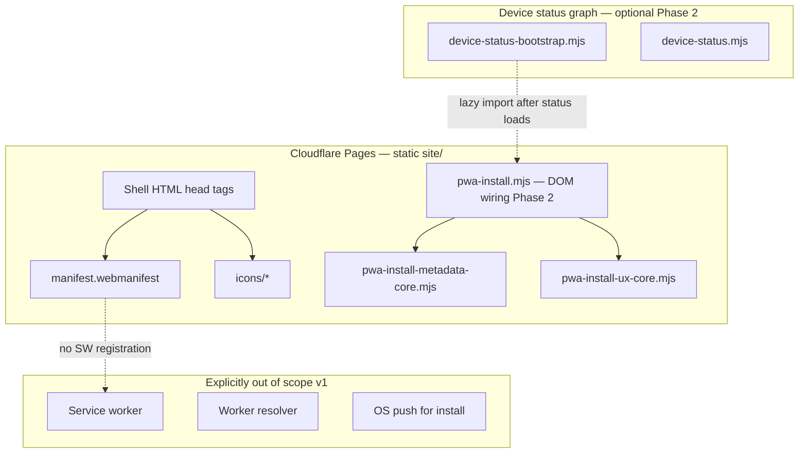

# PWA install (device shell)

**Status:** Spec + contract modules shipped · Phases 1–4.1 shipped · **Phase 5 closure** (rollout decisions locked + CI gate)  
**Audience:** Product, frontend, ops  
**Related:** [`DEVICE_OS.md`](DEVICE_OS.md) · [`PWA_INSTALL_IMPLEMENTATION.md`](PWA_INSTALL_IMPLEMENTATION.md) · [`VISUAL_DEVICE_SHELL.md`](VISUAL_DEVICE_SHELL.md) · [`SITE_BUILD_VERSIONING.md`](SITE_BUILD_VERSIONING.md) · [`CROSS_TAB_KEYS_NOTIFICATION_SYSTEM.md`](CROSS_TAB_KEYS_NOTIFICATION_SYSTEM.md) · [`DEVICE_INBOX.md`](DEVICE_INBOX.md) · [`IPHONE_HUB_DOT_UNCLICKABLE_INVESTIGATION.md`](IPHONE_HUB_DOT_UNCLICKABLE_INVESTIGATION.md) · [`STATUS_DOT_LOAD_FAILURE_POSTMORTEM.md`](STATUS_DOT_LOAD_FAILURE_POSTMORTEM.md) · [`UI_COLOR_SCHEME_STANDARD.md`](UI_COLOR_SCHEME_STANDARD.md) · [`features/QR Public Profile v1.0.md`](features/QR%20Public%20Profile%20v1.0.md)

---

## Executive summary

Returning **stewards** (users with saved cards on this device) may install the **device shell** as a home-screen / standalone app on supported browsers. **Strangers scanning a QR must never be prompted to install** — the product promise is browser-native public objects with no app required ([`features/QR Public Profile v1.0.md`](features/QR%20Public%20Profile%20v1.0.md) QR-US-07).

PWA install is **device-layer chrome only**: faster return to saved cards, hub, and inbox — not a new custody or network channel. Keys remain in `sessionStorage` / `localStorage` per browser profile; install does **not** sync keys to the server or across devices.

**Product sentence:** *Install puts the device hub on your home screen — the same browser-held keys and inbox you already have, without a separate account or app store.*

---

## Placement rule (canonical)

Before adding UI, map the feature using [`DEVICE_OS.md`](DEVICE_OS.md):

| Question | PWA install |
|----------|-------------|
| Save, hub, inbox, install prompt | **Device (browser shell)** |
| Manifesto, revoke, scan truth | **Network** — unchanged |
| Marketing / protocol essays | **Reference** — optional footer link only |

| Surface | Install metadata | Install UX prompt |
|---------|------------------|-------------------|
| `/` (landing, shell) | Yes | Yes (gated) |
| `/wallet/` | Yes | Yes (gated) |
| `/created/` | Yes | Yes (gated) |
| `/create/` flow (`body.page-flow`) | **No** | **No** |
| Scan `/c/…` (Worker HTML) | **No** | **No** |
| Reference / shop / features pages | **No** (v1) | **No** |

Rationale: flow and scan pages optimize for **one-shot tasks** or **stranger trust**; install belongs where users already manage custody.

---

## Architecture

### Layer diagram



### File map (target)

| Path | Role | Phase |
|------|------|-------|
| `site/manifest.webmanifest` | Web app manifest (JSON) | 1 |
| `site/icons/pwa-192.png` | Install icon 192×192 | 1 |
| `site/icons/pwa-512.png` | Install icon 512×512 | 1 |
| `site/icons/pwa-512-maskable.png` | Android maskable 512×512 | 4.1 |
| `site/icons/pwa-apple-touch.png` | iOS home screen 180×180 | 1 |
| `site/js/pwa-install-metadata-core.mjs` | Path rules, manifest validation | **Contract shipped** |
| `site/js/pwa-install-ux-core.mjs` | Show/hide gating, dismiss snooze | **Contract shipped** |
| `site/js/pwa-install.mjs` | `beforeinstallprompt`, DOM card, iOS copy | 2 |
| `site/js/pwa-install-html.mjs` | Emphasis card markup helper | 2 |
| Shell HTML (`index`, `wallet`, `created`) | `<link rel="manifest">`, apple-touch-icon | 1 |
| `worker/tests/pwa-install-metadata.test.ts` | Metadata contract tests | **Contract shipped** |
| `worker/tests/pwa-install-ux.test.ts` | UX gating tests | **Contract shipped** |

### Status graph integration (Phase 2)

**Default:** `pwa-install.mjs` is **not** on the critical status-dot import graph. Load it **lazily** after `device-status-bootstrap.mjs` succeeds so a PWA bug cannot red-ring the status dot ([`STATUS_DOT_LOAD_FAILURE_POSTMORTEM.md`](STATUS_DOT_LOAD_FAILURE_POSTMORTEM.md)).

If install UX must read inbox kinds, import **`device-inbox-core.mjs` helpers only** — do not pull the full inbox sheet graph from `pwa-install.mjs`.

Only add `pwa-install.mjs` to `DEVICE_STATUS_SHELL_JS_FILES` if it becomes a **static** import of `device-status.mjs` (discouraged). Prefer:

```javascript
// After status module loads (device-status-bootstrap.mjs or device-chrome-refresh.mjs)
import("./pwa-install.mjs?v=" + DEVICE_SHELL_ASSET_VERSION).catch(() => {});
```

---

## Manifest contract (Phase 1)

### Required fields

Validated by `validatePwaManifestShape()` in [`pwa-install-metadata-core.mjs`](../site/js/pwa-install-metadata-core.mjs):

| Field | Value (v1) | Notes |
|-------|------------|-------|
| `name` | `humanity.llc` | Full name in install sheet |
| `short_name` | `humanity` | Home screen label |
| `start_url` | `/` | Always landing; optional `?source=pwa` for **local** attribution only |
| `scope` | `/` | Entire site; scan pages still excluded from **UX** not routing |
| `display` | `standalone` | Hides browser URL bar when installed |
| `background_color` | `#ffffff` | Splash / task switcher |
| `theme_color` | `#ffffff` | Must match shell `meta name="theme-color"` on light; dark uses inline boot script today |
| `icons` | 192 + 512 PNG | `manifestHasRequiredIconSizes()` |

**Icon art (Phase 4.1):** Static **device shell brand dot** (`#db1b43` on `#ffffff`) — same mark as status-dot chrome, not the QR code. Home screen icons cannot animate; avoid steward-green or urgent pulse styling. Regenerate: `npm run site:generate-pwa-icons`.

### HTML head tags (shell pages only)

Each of `site/index.html`, `site/wallet/index.html`, `site/created/index.html`:

```html
<link rel="manifest" href="/manifest.webmanifest" />
<link rel="apple-touch-icon" href="/icons/pwa-apple-touch.png" />
```

Keep existing `<meta name="theme-color">` and favicon. Do **not** duplicate manifest on `/create/` or scan templates.

### Deploy

Manifest and icons deploy with **Pages** (`npm run site:build-meta && npm run pages:deploy`). No Worker change for metadata-only Phase 1.

After deploy, verify:

```bash
curl -sI https://humanity.llc/manifest.webmanifest | head -1
curl -s https://humanity.llc/manifest.webmanifest | jq .
```

---

## Install UX contract (Phase 2)

### Surfaces

One **emphasis card** ([`HC_EMPHASIS_CARD_ROLLOUT.md`](HC_EMPHASIS_CARD_ROLLOUT.md)) — not a modal, not OS notification:

| ID | Location | When visible |
|----|----------|--------------|
| `#device-pwa-install-card` | Landing: below hero or in hub glance area; wallet: top of page content | `shouldShowPwaInstallSurface()` true |

Copy (draft):

| Element | Chromium | iOS Safari |
|---------|----------|------------|
| Eyebrow | `Install on this device` | `Add to Home Screen` |
| Title | `Open your saved cards from the home screen` | Same |
| Detail | `Same keys and inbox — no account.` | `Tap Share → Add to Home Screen.` |
| CTA | `Install` (calls `deferredPrompt.prompt()`) | Dismiss only (no fake install button) |

Use `--surface-popover-*` if the card ever moves to a floating surface ([`UI_COLOR_SCHEME_STANDARD.md`](UI_COLOR_SCHEME_STANDARD.md)).

### Gating rules (`shouldShowPwaInstallSurface`)

All must pass:

1. **Shell page** — `isPwaShellPagePath(pathname)`
2. **Not standalone** — `display-mode: standalone` is false (already installed)
3. **Returning steward** — `savedCardCount >= 1` (`PWA_INSTALL_MIN_SAVED_CARDS`)
4. **Not snoozed** — dismiss younger than 7 days (`hc_pwa_install_dismissed_at`)
5. **No urgent inbox** — kinds in `PWA_INSTALL_BLOCKED_INBOX_KINDS`: `orphan_keys_removed`, `cross_tab_keys`, `other_tabs_unsaved_keys`
6. **Status graph healthy** — no `data-device-status-error` on `#top-chrome`
7. **Platform signal** — `beforeinstallprompt` captured **or** iOS Safari manual path

Never show when:

- Scan or create flow paths
- User has zero saved cards (stranger / first-create path)
- Inbox badge indicates custody work in progress

### Dismiss and snooze

| Action | Behavior |
|--------|----------|
| Dismiss (secondary CTA or ×) | Write `localStorage.hc_pwa_install_dismissed_at = new Date().toISOString()` |
| Successful install | Hide card; listen for `appinstalled` |
| Snooze expiry | After 7 days, may show again if other gates pass |

Use `try/catch` on all `localStorage` writes (Safari private mode).

### Chromium `beforeinstallprompt`

```javascript
let deferredPrompt = null;
window.addEventListener("beforeinstallprompt", (e) => {
  e.preventDefault();
  deferredPrompt = e;
  schedulePwaInstallRender();
});
window.addEventListener("appinstalled", () => {
  deferredPrompt = null;
  hideInstallCard();
});
```

**Errors:** If `prompt()` rejects (user cancel, policy), log `[humanity] PWA install prompt failed` at `info` level — do not throw. Clear `deferredPrompt` on successful install only.

---

## Cross-tab, custody, and inbox interactions

An installed PWA is a **separate browsing context** (same profile storage, separate tab/window in presence system).

| Scenario | Expected behavior |
|----------|-------------------|
| Browser tab + PWA both open with keys | Cross-tab inbox / custody panel applies ([`CROSS_TAB_KEYS_NOTIFICATION_SYSTEM.md`](CROSS_TAB_KEYS_NOTIFICATION_SYSTEM.md)) |
| Keys in PWA, user opens `/` in Safari | Same as two tabs — `cross_tab_keys` inbox kind |
| User installs from `/wallet/` | `start_url` still `/`; opening icon lands on hub-first landing |
| Orphan flash after card delete | Old PWA window may heartbeat until closed — documented in [`CROSS_TAB_KEYS_FLASH_AFTER_CARD_DELETE_INVESTIGATION.md`](CROSS_TAB_KEYS_FLASH_AFTER_CARD_DELETE_INVESTIGATION.md) |

**Install prompt deferral:** When `PWA_INSTALL_BLOCKED_INBOX_KINDS` are active, hide install card — custody clarity beats growth.

---

## Caching, versioning, and bottlenecks

### No service worker (v1)

**Do not register a service worker** in Phases 1–3. A SW that caches shell JS/CSS **amplifies** the failure mode where iPhone PWA serves stale `device-status.mjs` while HTML updated ([`IPHONE_HUB_DOT_UNCLICKABLE_INVESTIGATION.md`](IPHONE_HUB_DOT_UNCLICKABLE_INVESTIGATION.md) § cache behavior).

If a SW is added later, it requires a **separate RFC**: cache key must include `DEVICE_SHELL_ASSET_VERSION`, never cache `device-status-bootstrap.mjs` opaquely, and document in [`SITE_BUILD_VERSIONING.md`](SITE_BUILD_VERSIONING.md).

### Cache bust unchanged

Install does **not** replace `DEVICE_SHELL_ASSET_VERSION` or `?v=` on the status graph. PWA users still depend on shell cache bust discipline ([`AGENTS.md`](../AGENTS.md)).

### Bottlenecks and mitigations

| Risk | Mitigation |
|------|------------|
| Stale shell in standalone PWA | Same as browser: bump `DEVICE_SHELL_ASSET_VERSION`; document hard-close PWA after deploy in ops notes |
| `beforeinstallprompt` never fires | Gate on iOS manual path; do not show broken Install button |
| Install card competes with inbox | Block on urgent inbox kinds |
| Lazy module load race | Render install card only after status bootstrap success event or idle callback |
| Icon asset weight | PNG only at 192/512/180; no oversized source in repo |
| Private mode | `localStorage` dismiss fails silently; card may reappear — acceptable |
| Multiple rapid re-renders | Debounce render 300ms; subscribe to `hc-device-os-refreshed` not every storage tick |

### Request budget

Install module adds **zero** Worker API calls. Do not phone home install events in v1.

---

## Error handling

| Failure | User-visible | Dev signal |
|---------|--------------|------------|
| `manifest.webmanifest` 404 | No install UX | Console warn once |
| Invalid manifest JSON | No install UX | Console warn + Vitest fails in CI |
| `beforeinstallprompt` unsupported | iOS instructions only if other gates pass | — |
| `prompt()` rejected | Card stays dismissible | `console.info` |
| Status graph failed to load | No install card | `#top-chrome[data-device-status-error]` |
| `localStorage` blocked | Dismiss snooze may not persist | try/catch, no throw |
| Icons missing | Chromium may still allow install; CI test fails | Vitest |

Never block hub, dot, or inbox on PWA module load failure.

---

## Security and privacy

| Topic | Policy |
|-------|--------|
| Server-side install tracking | **None** in v1 |
| Manifest `start_url` query | Optional `?source=pwa` — parse client-side only if needed |
| Scope | `/` — does not grant extra API access |
| Permissions | No geolocation, camera, or notifications added for install |
| Hosted tier `device_id` | Unrelated — see [`HOSTED_TIER_ENTITLEMENTS_AND_METERING.md`](HOSTED_TIER_ENTITLEMENTS_AND_METERING.md) |

---

## Dark mode and theme

Shell pages boot dark theme via inline script on `document.documentElement.dataset.theme`. Manifest `theme_color` / `background_color` remain **light defaults** for OS splash (matches current `meta theme-color` on shell HTML).

Phase 2 optional: `theme_color` in manifest documents light-only; standalone status bar on iOS may not match dark hub — acceptable v1 limitation. Document in QA.

---

## Regression tests

```bash
npm run worker:test -- worker/tests/pwa-install-metadata.test.ts worker/tests/pwa-install-ux.test.ts
npm run build
```

After Phase 2 ships:

```bash
npm run e2e -- e2e/device-pwa-install.spec.ts   # add with Phase 2
```

Manual: [`DEVICE_OS_QA.md`](DEVICE_OS_QA.md) **P1-PWA**.

---

## Phased delivery

Implementation checklist: [`PWA_INSTALL_IMPLEMENTATION.md`](PWA_INSTALL_IMPLEMENTATION.md).

| Phase | Deliverable | Status |
|-------|-------------|--------|
| **0** | Spec + core modules + Vitest | ✅ |
| **1** | Manifest, icons, HTML `<link>` tags | ✅ |
| **2** | `pwa-install.mjs` + emphasis card UX | ✅ |
| **3** | E2E + QA + backlog closure | ✅ |
| **4** | Real-device rollout gate + extended CI smoke | ✅ iOS Safari 2026-05-28 · Android Chrome optional |
| **4.1** | Brand-dot home screen icons | ✅ |
| **5** | Rollout decisions locked + manifest scope CI gate | ✅ |

### Phase 4 rollout gate (after Phases 1–3)

Before expanding install metadata beyond shell pages or revisiting service-worker policy:

1. Pass **P1-PWA** on iPhone Safari and Android Chrome (HTTPS origin). **iOS Safari ✅** 2026-05-28. Android Chrome: optional follow-up (Chromium install sheet differs; CI covers automated gates).
2. Pass **P0-3** and **P0-W** from a standalone home-screen launch. **✅** iOS Safari 2026-05-28.
3. Confirm v1 ships **without** a shell-caching service worker ([`SITE_BUILD_VERSIONING.md`](SITE_BUILD_VERSIONING.md)). **✅** CI `e2e:pwa-install` no-SW test.
4. Decide whether marketing/docs pages should link the manifest. **Locked: no** — `PWA_ROLLOUT_MANIFEST_ON_REFERENCE_PAGES = false`; Vitest walks all `site/**/*.html`.
5. Decide whether scan URLs should be installable entry points. **Locked: no** — scan HTML has no manifest; `start_url` remains `/` (`PWA_ROLLOUT_SCAN_INSTALLABLE = false`).

Automated Phase 4 smoke (CI): `npm run e2e:pwa-install` — covers P1-PWA steps 2, 8–11 plus no-SW policy.

Manual Phase 4 (required for sign-off): [`DEVICE_OS_QA.md`](DEVICE_OS_QA.md) **P1-PWA** steps 1, 4, 6–7, 9 on real devices over HTTPS. **Signed off:** iOS Safari 2026-05-28 (Blocks A–D, P0-W, standalone wallet scroll).

### Phase 4.1 — Home screen icon polish

Replace QR artwork with static brand dot (see manifest § Icon art). Regenerate PNGs via `npm run site:generate-pwa-icons`; deploy with Pages. Existing home-screen shortcuts keep the old icon until re-added.

### Phase 5 — Closure

Lock Phase 4 rollout decisions in code (`pwa-install-metadata-core.mjs`) and CI:

- `PWA_MANIFEST_LINK_ALLOWED_HTML_PATHS` — only shell HTML may link manifest
- `mayHtmlFileLinkPwaManifest()` + Vitest site-wide HTML walk
- Backlog **H-006** closed; no shell-caching service worker without separate RFC

```bash
npm run worker:test:pwa-install
npm run e2e:pwa-install
```

---

## Changelog

| Date | Change |
|------|--------|
| 2026-05-28 | Phase 5 closure — rollout decisions locked; site-wide manifest link CI gate; H-006 closed |
| 2026-05-28 | Phase 4.1 — brand-dot icons replace QR; manual iOS Safari P1-PWA sign-off |
| 2026-05-28 | Phase 4 automated CI gate — `test-site.yml` runs `e2e:pwa-install` |
| 2026-05-28 | Phase 4 rollout gate — extended E2E smoke for P1-PWA steps 2, 8–11; manual HTTPS QA remains |
| 2026-05-27 | Initial spec, metadata/UX core modules, Vitest contracts, DEVICE_OS + QA cross-links |
