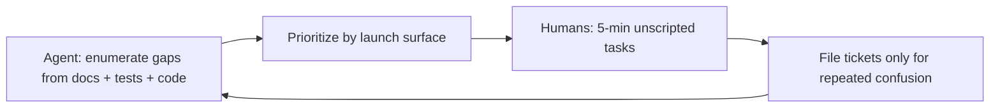

# Sad-path coverage and backlog

**Status:** Active — living inventory of unhappy paths, coverage gaps, and validation split  
**Date:** 2026-05-29  
**Audience:** Product, engineering, QA, agents planning tests or hardening  
**Related:** [`PRODUCTION_SAD_PATH_QA_2026-05-26.md`](PRODUCTION_SAD_PATH_QA_2026-05-26.md) (production pass) · [`LIVE_CONTROL_USABILITY_HARDENING.md`](LIVE_CONTROL_USABILITY_HARDENING.md) (live proof slices) · [`M5_STRANGER_TEST_RUNBOOK.md`](M5_STRANGER_TEST_RUNBOOK.md) (stranger gate) · [`PRODUCT_LANGUAGE_STRATEGY.md`](PRODUCT_LANGUAGE_STRATEGY.md) § Errors and sad paths

---

## Purpose

This doc answers three questions in one place:

1. **What sad paths are already covered** (code + automated tests + stranger QA)?
2. **What user behaviors are still thin or unplanned** (even when “by design”)?
3. **Who should validate what** — agents/code audit vs human strangers?

Use it when prioritizing hardening before launch surfaces (live proof in person, merch checkout, large wallets).

---

## Coverage summary

| Layer | Status | Canonical reference |
|-------|--------|---------------------|
| Production browser pass (P0–P2) | Most items **shipped** 2026-05-26 | [`PRODUCTION_SAD_PATH_QA_2026-05-26.md`](PRODUCTION_SAD_PATH_QA_2026-05-26.md) |
| Automated matrix S1–S9 | **Wired** (e2e + vitest) | Same doc § Recommended test matrix |
| Generic create → scan → revoke (strangers) | **Passed** 2026-05-27 | [`M5_STRANGER_TEST_RUNBOOK.md`](M5_STRANGER_TEST_RUNBOOK.md) |
| Live proof infra errors (1101, poll retry) | **Shipped** H-01–H-03 | [`LIVE_CONTROL_USABILITY_HARDENING.md`](LIVE_CONTROL_USABILITY_HARDENING.md) |
| Live proof in-person handoff | **H-04–H-10 shipped** (scanner recovery H-09/H-10: 2026-05-29); **H-13–H-15 engineering shipped** (2026-05-29); **H-11 passed** (2026-05-29); **H-12 desk gate shipped** — human printed QA pending | [`LIVE_CONTROL_USABILITY_HARDENING.md`](LIVE_CONTROL_USABILITY_HARDENING.md) |
| Merch checkout sad paths | **Matrix + automated M1–M8** (2026-05-29); live payment + physical QA open | [`MERCH_CHECKOUT_SAD_PATH_MATRIX.md`](MERCH_CHECKOUT_SAD_PATH_MATRIX.md) |
| Large wallet / power user | **Guardrails shipped** (comfort + large hints; E2E W1–W3) | [`DEVICE_OS_REQUEST_BUDGET.md`](DEVICE_OS_REQUEST_BUDGET.md) § Open issues |
| Social / trust misunderstanding | **Copy exists**; comprehension not fully re-run | [`V1_PRODUCT_TRUST_MODEL.md`](V1_PRODUCT_TRUST_MODEL.md) |
| Hosted ops (billing return) | **O1–O2 E2E shipped** (2026-05-29) | [`HOSTED_OPS_SAD_PATH_MATRIX.md`](HOSTED_OPS_SAD_PATH_MATRIX.md) |
| Safari stuck inbox backdrop | **P5f shipped** — Check network taps after reconcile | [`UI_UX_SAFE_REBUILD_IMPLEMENTATION.md`](UI_UX_SAFE_REBUILD_IMPLEMENTATION.md) § Step 1 |
| Key-loss setup protect gate (K7) | **Shipped** — recovery ack or backup before Live | [`OWNERSHIP_RESTORE_UX_PLAN.md`](OWNERSHIP_RESTORE_UX_PLAN.md) Phase 2 |
| Key-loss view-only Live tab (Phase 3) | **Shipped** — read-only QR/deploy; restore banner | Same doc Phase 3 |

---

## Validation split: agents vs humans

| Ask an agent / CI when you want… | Ask humans (strangers, stewards) when you want… |
|----------------------------------|------------------------------------------------|
| Coverage audit — map flows to tests and find holes | Comprehension — “What did this prove?” without coaching |
| Test matrix generation (extend S1–S9) | In-person live proof — handoff, camera scan, owner backgrounding |
| Regression hunting across worker + shell + scan bundle | Emotional reactions — lost keys, false “card disabled,” Safari dead taps |
| Copy consistency vs [`PRODUCT_LANGUAGE_STRATEGY.md`](PRODUCT_LANGUAGE_STRATEGY.md) | Misuse — stolen sticker, vouch gaming, integrator over-reliance on VH |

Agents are strong at **systematic enumeration** against docs and code. Humans answer **“Would I trust this?”** and **“What did I think it meant?”**

---

## Sad paths still thin or open

### 1. Live proof in the real world (highest launch risk)

| ID | Gap | User behavior | Risk |
|----|-----|---------------|------|
| H-07 | Push-primary (partial) | Owner expects notification; push fails | Stranger waits unless poll/inbox catches it |
| H-08 | Tab backgrounding (code shipped) | Owner switches to Camera/Messages | Misses 2-minute window without resume poll |
| **H-09** | **Scan refresh mid-wait** | Scanner refreshes during wait | Must re-ask even if challenge pending |
| **H-10** | **Expiry retry affordance** | Challenge window ends | Stranger does not notice they can ask again |
| H-11 | Comprehension runbook | Unscripted strangers | **Passed** 2026-05-29 |
| H-12 | Printed camera QA | ≥3 phones, camera scan | Pre-flight steps 1–3: `live-control:printed-qa:*` scripts |
| H-13 | Full-loop Playwright E2E | **Shipped** — `npm run e2e:live-control-loop` | Poll→proven + refresh resume + expiry retry |

**Human next step (Slice E):** H-12 § A–C on ≥3 phones after pre-flight steps 1–3 — see [`M7_LIVE_CONTROL_PRINTED_QA_RUNBOOK.md`](M7_LIVE_CONTROL_PRINTED_QA_RUNBOOK.md).

### 2. Key custody and continuity (by design, still sad)

| Behavior | System assumption | Mitigation today |
|----------|-------------------|------------------|
| Create → close tab → no recovery key | No operator recovery | Copy + gates on `/created/`; no undo path |
| Wrong passphrase on `.hcbackup` | User must re-export | Import error copy; [`M5_5_OWNER_KEY_PORTABILITY.md`](M5_5_OWNER_KEY_PORTABILITY.md) |
| New phone; old phone still has keys | Tab-local `hc_created` | Cross-tab banners; wallet labels ≠ signing |
| PWA vs Safari tab | Different session semantics | [`PWA_INSTALL.md`](PWA_INSTALL.md) |
| “Saving to wallet = backed up” | Wallet is labels; signing needs keys in tab | Custody emphasis cards |

**Product stance:** These are intentional trust boundaries. Sad-path work is **clearer gates and first-run copy**, not operator key recovery. Canonical matrix: [`KEY_LOSS_SAD_PATH_MATRIX.md`](KEY_LOSS_SAD_PATH_MATRIX.md).

### 3. Multi-tab / multi-device orchestration

| Behavior | Notes |
|----------|-------|
| Create in Tab B, hub in Tab A | Automated: `e2e/device-cross-tab-keys.spec.ts` |
| Vouch from scan without keys in this tab | Explained in UI; high bounce risk |
| Two phones both “active” | Cross-tab presence churn |
| Stuck inbox backdrop blocks taps | **Shipped P5f** — `syncInboxBackdropForOpenHub` + CSS pass-through · `e2e/device-hub-check-network-backdrop.spec.ts` |
| iPhone hub dot dead / scroll lag | [`SAFARI_WEBKIT_SHELL_REGRESSION_INVESTIGATION.md`](SAFARI_WEBKIT_SHELL_REGRESSION_INVESTIGATION.md) |

### 4. Large wallet / power user (~10+ root cards)

Documented out of spec in [`KEYS_CARDS_AND_VERIFICATION.md`](KEYS_CARDS_AND_VERIFICATION.md) § Realistic scale:

- Watch for live proof + hub open for hours + multiple tabs → quota and lag
- Mitigations shipped (Phases 7–9, S6–S12); **soft UX guardrail** (comfort at 6+, large at 10+) — hub custody row + `/wallet/` monitoring hint · `npm run e2e:wallet-scale-guardrail`

### 5. Commerce / merch (pre–live checkout)

Canonical matrix: [`MERCH_CHECKOUT_SAD_PATH_MATRIX.md`](MERCH_CHECKOUT_SAD_PATH_MATRIX.md).

From [`V1_ASSUMPTION_REGISTER.md`](V1_ASSUMPTION_REGISTER.md) and merch docs:

- Checkout without `/shop/customize/` → missing metadata → held for review
- Shopify webhook duplicates / out-of-order events
- Buyer expects calendar expiry vs **revoke** (comprehension)
- Physical QR scan reliability after Printify (A-004 — physical QA)

M5 passed **without** live Tier 1 checkout. Engineering matrix shipped — see [`MERCH_CHECKOUT_SAD_PATH_MATRIX.md`](MERCH_CHECKOUT_SAD_PATH_MATRIX.md). Do not enable `checkout_open` until operator physical QA + `merch-funnel:verify-config -- --require-checkout`.

### 6. Scan / link sharing

| Gap | Status |
|-----|--------|
| Same error page for missing `?q=` vs unknown profile | **Shipped** — `scan-malformed-hint.ts` · `worker/tests/scan-malformed-hint.test.ts` |
| Shared `/c/{profile}` without QR param | Recipient sees differentiated **Add QR from your sticker** copy |
| Photographed / damaged QR | Outside app; physical QA runbooks |

### 7. Social / trust misunderstandings (not code bugs)

Yellow flags from M5 — fix copy before broad announce:

- “It verified they’re human” / “QR proves identity”
- Stolen sticker shown as proof of ownership
- Live control treated as government ID
- Vouch gaming — [`VOUCH_THREAT_MODEL.md`](VOUCH_THREAT_MODEL.md)

No unit test fully catches **acting** on a misunderstanding.

### 8. Adversarial / ops

Canonical matrix: [`HOSTED_OPS_SAD_PATH_MATRIX.md`](HOSTED_OPS_SAD_PATH_MATRIX.md).

- Public create rate limits (A-012F)
- Impersonation handles
- Hosted tier billing return — **Shipped** — `npm run e2e:hosted-tier-billing-return` (O1–O2)
- Operator schema drift (live control FK — gated post-incident)

---

## User mental models vs system truth

| They think… | System assumes… |
|-------------|-------------------|
| “It’s like Instagram / Linktree” | Live status + explicit limits |
| “I saved it — I’m backed up” | Keys are tab-local unless recovery/backup |
| “My wallet has the card” | Wallet = labels; signing needs `hc_created` in **this** tab |
| “I’ll prove control on one phone” | Scanner and owner should be different contexts |
| “Revoke = delete from my phone” | Revoke is network state; sticker still exists |
| “I’ll test with 15 demo cards” | 1–5 roots comfortable; 10+ unsupported |
| “Hard refresh fixes Safari lag” | `localStorage` persists |
| “The @handle is the object name” | Manifesto/status line is hero on live objects |
| “Buying merch makes me verified” | Commerce ≠ vouch |

---

## Prioritized backlog

| Priority | Area | Next action | Owner |
|----------|------|-------------|-------|
| **P0** | Live proof scanner recovery | **H-09 + H-10** — sessionStorage resume + expiry retry UX | **Shipped** 2026-05-29 |
| **P0** | Live proof comprehension | Execute H-11 / H-12 runbooks with ≥5 strangers | Product / QA |
| **P1** | Key-loss paths | **K1/K2/K5 + P0-4 + Phase 3–4 shipped** — P0b-1 step 2 prod WebKit re-verify; manual P1-RESTORE / P1-HE | Product + QA |
| **P1** | Merch checkout | **Matrix shipped** — operator physical QA + live payment before `checkout_open: true` | Engineering + Ops |
| **P2** | Large wallet guardrails | **Shipped** — `e2e/wallet-scale-guardrail.spec.ts` (W1–W3) | Shell |
| **P2** | Scan URL hints | **Shipped** — `scan-malformed-hint.ts` + Vitest | Resolver |
| **P2** | H-13 full-loop E2E | `e2e/live-control-loop.spec.ts` | **Shipped** 2026-05-29 |
| **P2** | Hosted billing return (O1–O2) | **Shipped** — `e2e/hosted-tier-billing-return.spec.ts` | Ops |
| **P2** | Stuck inbox backdrop (P5f) | **Shipped** — `e2e/device-hub-check-network-backdrop.spec.ts` | Shell |

---

## Automated regression index

| ID | Scenario | Tool |
|----|----------|------|
| S1 | Create → close tab without save → reopen | `e2e/production-sad-path-created.spec.ts` |
| S2 | Bogus `/created/?profile_id=` | Same |
| S3 | Two tabs: create in B, hub in A | `e2e/device-cross-tab-keys.spec.ts` |
| S4 | Corrupt `.hcbackup` import | `worker/tests/key-backup-import.test.ts` |
| S5 | Invalid pin URL | `worker/tests/device-pins.test.ts` |
| S6 | Revoke without keys | `e2e/production-sad-path-created.spec.ts` |
| S7 | Live proof without owner keys | Same + `worker/tests/created-live-primary-cta.test.ts` |
| S8 | Hub vs resolver `scan.kind` | `e2e/device-os-wallet.spec.ts` · `worker:test:card-disabled-since-visit` |
| S9 | Valid create → `/created/` with keys | `e2e/create-form-submit.spec.ts` |
| **S10** | **Scan refresh resumes live proof wait (H-09)** | `worker/tests/scan.test.ts` · `e2e/live-control-loop.spec.ts` |
| **S11** | **Challenge expiry shows retry copy (H-10)** | `worker/tests/scan.test.ts` · `e2e/live-control-loop.spec.ts` |
| **S12** | **Full live proof loop ask → proven (H-13)** | `e2e/live-control-loop.spec.ts` |
| **S13** | **Customize without card session (M1)** | `e2e/merch-checkout-sad-path.spec.ts` |
| **S14** | **Checkout closed interest UX (M2)** | Same |
| **S15** | **Proof consent + recovery gate (M3–M4)** | `e2e/merch-funnel-checkout.spec.ts` |
| **S16** | **Webhook held without metadata (M6)** | `worker/tests/shopify-orders-webhook.test.ts` |
| **S17** | **Comfortable wallet hint on /wallet/ (W1)** | `e2e/wallet-scale-guardrail.spec.ts` |
| **S18** | **Large wallet hint on /wallet/ (W2)** | Same |
| **S19** | **Hub custody scale row (W3)** | Same |
| **S20** | **Malformed scan URL copy (P2-1)** | `worker/tests/scan-malformed-hint.test.ts` |
| **S21** | **View-only /created/ without tab keys (K1)** | `e2e/key-loss-sad-path.spec.ts` |
| **S22** | **Wrong backup passphrase (K2)** | Same · `worker/tests/key-backup.test.ts` |
| **S23** | **Wallet label without signing keys (K5)** | `e2e/key-loss-sad-path.spec.ts` |
| **S24** | **Hosted billing return without tab keys (O1)** | `e2e/hosted-tier-billing-return.spec.ts` |
| **S25** | **Hosted billing return links after keys load (O2)** | Same |
| **S26** | **Check network after stuck inbox backdrop (P5f)** | `e2e/device-hub-check-network-backdrop.spec.ts` |
| **S27** | **Setup protect gate before Live (K7)** | `worker/tests/created-setup-seatbelt.test.ts` · `worker/tests/key-loss-copy-guards.test.ts` |
| **S28** | **View-only Live tab read-only signage (Phase 3)** | `worker/tests/created-view-live-core.test.ts` · `e2e/key-loss-sad-path.spec.ts` (K1) |
| **S29** | **Hub import visible in stranger-empty (Phase 4)** | `worker/tests/device-hub-restore-always.test.ts` · `e2e/key-loss-sad-path.spec.ts` (K2) |
| **S30** | **Fresh create hub row no since-visit FP (P0b-1 / R10)** | `e2e/device-os-wallet.spec.ts` · `worker/tests/card-disabled-since-visit-regression.test.ts` |
| **S31** | **Setup wizard test scan no auto-advance in browser (P0b-2 / R12)** | `e2e/device-pwa-scan-handoff.spec.ts` · `worker/tests/pwa-scan-handoff-core.test.ts` |
| **S32** | **Scan sole signing row vouch auto-activate (P0b-3)** | `npm run worker:test:vouch-scan-sole-activate` · `npm run e2e:vouch-scan-sole-signing` |
| **S33** | **Corrupt `hc_wallet` urgent tab hint on `/wallet/` (P1-4 / R7)** | `npm run worker:test:wallet-corrupt` · `e2e/key-loss-sad-path.spec.ts` (R7) |

Full matrix origin: [`PRODUCTION_SAD_PATH_QA_2026-05-26.md`](PRODUCTION_SAD_PATH_QA_2026-05-26.md) § Recommended test matrix.

---

## Manual QA hooks

| Check | Doc |
|-------|-----|
| P1-LC · Live control comprehension | [`DEVICE_OS_QA.md`](DEVICE_OS_QA.md) |
| P1-LC-SD · Same-device guidance (H-05) | Same |
| P1-LC-VR · Owner tab resume (H-08) | Same |
| **P1-LC-REF · Scan refresh resume (H-09)** | Same |
| **P1-LC-EX · Expiry retry (H-10)** | Same |
| P1-LCP · Printed camera QA | Same |
| P1-LC-E2E · Live control loop (H-13) | `npm run e2e:live-control-loop` |
| **P1-LW-SCALE · Wallet scale guardrails (W1–W3)** | `npm run e2e:wallet-scale-guardrail` |
| **P1-KL · Key-loss view-only + backup import (K1–K2)** | `npm run e2e:key-loss-sad-path` |
| **P1-HOSTED-BR · Billing checkout return (O1–O2)** | `npm run e2e:hosted-tier-billing-return` |
| **P5f · Stuck inbox backdrop vs Check network** | `npm run e2e:device-hub-check-network-backdrop` · [`DEVICE_OS_QA.md`](DEVICE_OS_QA.md) § P5f |
| **P1-SETUP-PROTECT · Setup protect gate (K7)** | `npm run worker:test:setup-protect` |
| **P1-RESTORE · View-only Live + restore paths (K1 Phase 3)** | `npm run worker:test:view-only-restore` · `npm run e2e:key-loss-sad-path` |
| **P1-HE · Hub stranger-empty import always visible (Phase 4)** | `npm run worker:test:hub-restore-always` · `npm run e2e:key-loss-sad-path` (K2) |
| **P1-VOUCH-SOLE · Scan sole-row vouch without default (P0b-3)** | `npm run e2e:vouch-scan-sole-signing` |
| **P1-WALLET-CORRUPT · Corrupt wallet tab hint (P1-4 / R7)** | `npm run worker:test:wallet-corrupt` · `npm run e2e:key-loss-sad-path` (R7) |

---

## Changelog

| Date | Notes |
|------|-------|
| 2026-05-29 | P1-4 shipped — corrupt wallet hub + `/wallet/` tab hint (S33) |
| 2026-05-29 | P0b-3 shipped — scan sole-signing-row vouch E2E (S32) |
| 2026-05-29 | P0b-2 E2E — browser setup test scan waits for second Continue (S31) |
| 2026-05-29 | P0b-1 step 1 — fresh create hub R10 E2E + baseline-null Vitest (S30) |
| 2026-05-29 | Safari P0b-2 — setup wizard test scan no auto-advance in browser tab |
| 2026-05-29 | P0-4 first-session backup gate + Phase 4 step 2 hub import copy convergence |
| 2026-05-29 | Ownership restore Phase 4 step 1 — hub import always visible (S29) |
| 2026-05-29 | Ownership restore Phase 3 step 1 — view-only Live tab (S28) |
| 2026-05-29 | K7 setup protect gate + P5f stuck backdrop regression index (S26–S27) |
| 2026-05-29 | Hosted ops sad-path matrix + O1–O2 E2E index (`HOSTED_OPS_SAD_PATH_MATRIX.md`) |
| 2026-05-29 | Key-loss matrix + K1/K2/K5 E2E (`KEY_LOSS_SAD_PATH_MATRIX.md`) |
| 2026-05-29 | P2 wallet scale guardrails E2E (W1–W3); scan URL hints marked shipped |
| 2026-05-29 | Merch sad-path matrix + M1–M2 E2E (`MERCH_CHECKOUT_SAD_PATH_MATRIX.md`) |
| 2026-05-29 | Slice E shipped: H-13 `e2e/live-control-loop.spec.ts` |
| 2026-05-29 | Initial inventory from sad-path review; Slice D (H-09, H-10) shipped |
