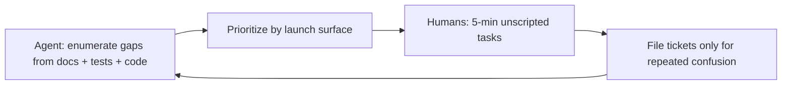

# Sad-path coverage and backlog

**Status:** Active — living inventory of unhappy paths, coverage gaps, and validation split  
**Date:** 2026-05-29  
**Audience:** Product, engineering, QA, agents planning tests or hardening  
**Related:** [`PRODUCTION_SAD_PATH_QA_2026-05-26.md`](PRODUCTION_SAD_PATH_QA_2026-05-26.md) (production pass) · [`LIVE_CONTROL_USABILITY_HARDENING.md`](LIVE_CONTROL_USABILITY_HARDENING.md) (live proof slices) · [`M5_STRANGER_TEST_RUNBOOK.md`](M5_STRANGER_TEST_RUNBOOK.md) (stranger gate) · [`PRODUCT_LANGUAGE_STRATEGY.md`](PRODUCT_LANGUAGE_STRATEGY.md) § Errors and sad paths

---

## Purpose

This doc answers three questions in one place:

1. **What sad paths are already covered** (code + automated tests + stranger QA)?
2. **What user behaviors are still thin or unplanned** (even when “by design”)?
3. **Who should validate what** — agents/code audit vs human strangers?

Use it when prioritizing hardening before launch surfaces (live proof in person, merch checkout, large wallets).

---

## Coverage summary

| Layer | Status | Canonical reference |
|-------|--------|---------------------|
| Production browser pass (P0–P2) | Most items **shipped** 2026-05-26 | [`PRODUCTION_SAD_PATH_QA_2026-05-26.md`](PRODUCTION_SAD_PATH_QA_2026-05-26.md) |
| Automated matrix S1–S9 | **Wired** (e2e + vitest) | Same doc § Recommended test matrix |
| Generic create → scan → revoke (strangers) | **Passed** 2026-05-27 | [`M5_STRANGER_TEST_RUNBOOK.md`](M5_STRANGER_TEST_RUNBOOK.md) |
| Live proof infra errors (1101, poll retry) | **Shipped** H-01–H-03 | [`LIVE_CONTROL_USABILITY_HARDENING.md`](LIVE_CONTROL_USABILITY_HARDENING.md) |
| Live proof in-person handoff | **H-04–H-10 shipped** (scanner recovery H-09/H-10: 2026-05-29); H-11–H-13 human QA + E2E open | [`LIVE_CONTROL_USABILITY_HARDENING.md`](LIVE_CONTROL_USABILITY_HARDENING.md) |
| Merch checkout sad paths | **Mostly untested** with real money | [`V1_ASSUMPTION_REGISTER.md`](V1_ASSUMPTION_REGISTER.md) A-001–A-004 |
| Large wallet / power user | **Mitigated** Phases 7–9; still out of spec at ~10+ roots | [`DEVICE_OS_REQUEST_BUDGET.md`](DEVICE_OS_REQUEST_BUDGET.md) § Open issues |
| Social / trust misunderstanding | **Copy exists**; comprehension not fully re-run | [`V1_PRODUCT_TRUST_MODEL.md`](V1_PRODUCT_TRUST_MODEL.md) |

---

## Validation split: agents vs humans

| Ask an agent / CI when you want… | Ask humans (strangers, stewards) when you want… |
|----------------------------------|------------------------------------------------|
| Coverage audit — map flows to tests and find holes | Comprehension — “What did this prove?” without coaching |
| Test matrix generation (extend S1–S9) | In-person live proof — handoff, camera scan, owner backgrounding |
| Regression hunting across worker + shell + scan bundle | Emotional reactions — lost keys, false “card disabled,” Safari dead taps |
| Copy consistency vs [`PRODUCT_LANGUAGE_STRATEGY.md`](PRODUCT_LANGUAGE_STRATEGY.md) | Misuse — stolen sticker, vouch gaming, integrator over-reliance on VH |

Agents are strong at **systematic enumeration** against docs and code. Humans answer **“Would I trust this?”** and **“What did I think it meant?”**

---

## Sad paths still thin or open

### 1. Live proof in the real world (highest launch risk)

| ID | Gap | User behavior | Risk |
|----|-----|---------------|------|
| H-07 | Push-primary (partial) | Owner expects notification; push fails | Stranger waits unless poll/inbox catches it |
| H-08 | Tab backgrounding (code shipped) | Owner switches to Camera/Messages | Misses 2-minute window without resume poll |
| **H-09** | **Scan refresh mid-wait** | Scanner refreshes during wait | Must re-ask even if challenge pending |
| **H-10** | **Expiry retry affordance** | Challenge window ends | Stranger does not notice they can ask again |
| H-11–H-12 | Comprehension + printed QA | Unscripted strangers | Copy guards pass; meaning unverified |
| H-13 | Full-loop Playwright E2E | CI regression | Poll→proven client path not fully gated |

**Engineering next step (Slice E):** H-11 / H-12 human comprehension runbooks; H-13 full-loop Playwright E2E — see [`LIVE_CONTROL_USABILITY_HARDENING.md`](LIVE_CONTROL_USABILITY_HARDENING.md) § P2.

### 2. Key custody and continuity (by design, still sad)

| Behavior | System assumption | Mitigation today |
|----------|-------------------|------------------|
| Create → close tab → no recovery key | No operator recovery | Copy + gates on `/created/`; no undo path |
| Wrong passphrase on `.hcbackup` | User must re-export | Import error copy; [`M5_5_OWNER_KEY_PORTABILITY.md`](M5_5_OWNER_KEY_PORTABILITY.md) |
| New phone; old phone still has keys | Tab-local `hc_created` | Cross-tab banners; wallet labels ≠ signing |
| PWA vs Safari tab | Different session semantics | [`PWA_INSTALL.md`](PWA_INSTALL.md) |
| “Saving to wallet = backed up” | Wallet is labels; signing needs keys in tab | Custody emphasis cards |

**Product stance:** These are intentional trust boundaries. Sad-path work is **clearer gates and first-run copy**, not operator key recovery.

### 3. Multi-tab / multi-device orchestration

| Behavior | Notes |
|----------|-------|
| Create in Tab B, hub in Tab A | Automated: `e2e/device-cross-tab-keys.spec.ts` |
| Vouch from scan without keys in this tab | Explained in UI; high bounce risk |
| Two phones both “active” | Cross-tab presence churn |
| iPhone hub dot dead / scroll lag | [`SAFARI_WEBKIT_SHELL_REGRESSION_INVESTIGATION.md`](SAFARI_WEBKIT_SHELL_REGRESSION_INVESTIGATION.md) |

### 4. Large wallet / power user (~10+ root cards)

Documented out of spec in [`KEYS_CARDS_AND_VERIFICATION.md`](KEYS_CARDS_AND_VERIFICATION.md) § Realistic scale:

- Watch for live proof + hub open for hours + multiple tabs → quota and lag
- Mitigations shipped (Phases 7–9, S6–S12); **soft UX guardrail** (warn at scale) still open

### 5. Commerce / merch (pre–live checkout)

From [`V1_ASSUMPTION_REGISTER.md`](V1_ASSUMPTION_REGISTER.md) and merch docs:

- Checkout without `/shop/customize/` → missing metadata → held for review
- Shopify webhook duplicates / out-of-order events
- Buyer expects calendar expiry vs **revoke** (comprehension)
- Physical QR scan reliability after Printify (A-004 — physical QA)

M5 passed **without** live Tier 1 checkout. Do not enable `checkout_open` until merch sad-path matrix exists.

### 6. Scan / link sharing

| Gap | Status |
|-----|--------|
| Same error page for missing `?q=` vs unknown profile | Partial — differentiated codes; copy hint still thin ([`PRODUCTION_SAD_PATH_QA_2026-05-26.md`](PRODUCTION_SAD_PATH_QA_2026-05-26.md) P2-1) |
| Shared `/c/{profile}` without QR param | Recipient sees Invalid link |
| Photographed / damaged QR | Outside app; physical QA runbooks |

### 7. Social / trust misunderstandings (not code bugs)

Yellow flags from M5 — fix copy before broad announce:

- “It verified they’re human” / “QR proves identity”
- Stolen sticker shown as proof of ownership
- Live control treated as government ID
- Vouch gaming — [`VOUCH_THREAT_MODEL.md`](VOUCH_THREAT_MODEL.md)

No unit test fully catches **acting** on a misunderstanding.

### 8. Adversarial / ops

- Public create rate limits (A-012F)
- Impersonation handles
- Hosted tier billing return — `e2e/hosted-tier-billing-return.spec.ts`
- Operator schema drift (live control FK — gated post-incident)

---

## User mental models vs system truth

| They think… | System assumes… |
|-------------|-------------------|
| “It’s like Instagram / Linktree” | Live status + explicit limits |
| “I saved it — I’m backed up” | Keys are tab-local unless recovery/backup |
| “My wallet has the card” | Wallet = labels; signing needs `hc_created` in **this** tab |
| “I’ll prove control on one phone” | Scanner and owner should be different contexts |
| “Revoke = delete from my phone” | Revoke is network state; sticker still exists |
| “I’ll test with 15 demo cards” | 1–5 roots comfortable; 10+ unsupported |
| “Hard refresh fixes Safari lag” | `localStorage` persists |
| “The @handle is the object name” | Manifesto/status line is hero on live objects |
| “Buying merch makes me verified” | Commerce ≠ vouch |

---

## Prioritized backlog

| Priority | Area | Next action | Owner |
|----------|------|-------------|-------|
| **P0** | Live proof scanner recovery | **H-09 + H-10** — sessionStorage resume + expiry retry UX | **Shipped** 2026-05-29 |
| **P0** | Live proof comprehension | Execute H-11 / H-12 runbooks with ≥5 strangers | Product / QA |
| **P1** | Key-loss paths | Audit first-run gates; no new recovery without trust-model change | Product copy |
| **P1** | Merch checkout | Sad-path matrix before `checkout_open: true` | Engineering + Ops |
| **P2** | Large wallet guardrails | Soft cap UX when ≥10 saved roots | Shell |
| **P2** | Scan URL hints | “Add `?q=qr_…`” vs “profile not found” | Resolver copy |
| **P2** | H-13 full-loop E2E | `e2e/live-control-loop.spec.ts` in rollout gate | Engineering |

---

## Automated regression index

| ID | Scenario | Tool |
|----|----------|------|
| S1 | Create → close tab without save → reopen | `e2e/production-sad-path-created.spec.ts` |
| S2 | Bogus `/created/?profile_id=` | Same |
| S3 | Two tabs: create in B, hub in A | `e2e/device-cross-tab-keys.spec.ts` |
| S4 | Corrupt `.hcbackup` import | `worker/tests/key-backup-import.test.ts` |
| S5 | Invalid pin URL | `worker/tests/device-pins.test.ts` |
| S6 | Revoke without keys | `e2e/production-sad-path-created.spec.ts` |
| S7 | Live proof without owner keys | Same + `worker/tests/created-live-primary-cta.test.ts` |
| S8 | Hub vs resolver `scan.kind` | `e2e/device-os-wallet.spec.ts` · `worker:test:card-disabled-since-visit` |
| S9 | Valid create → `/created/` with keys | `e2e/create-form-submit.spec.ts` |
| **S10** | **Scan refresh resumes live proof wait (H-09)** | `worker/tests/scan.test.ts` |
| **S11** | **Challenge expiry shows retry copy (H-10)** | `worker/tests/scan.test.ts` |

Full matrix origin: [`PRODUCTION_SAD_PATH_QA_2026-05-26.md`](PRODUCTION_SAD_PATH_QA_2026-05-26.md) § Recommended test matrix.

---

## Manual QA hooks

| Check | Doc |
|-------|-----|
| P1-LC · Live control comprehension | [`DEVICE_OS_QA.md`](DEVICE_OS_QA.md) |
| P1-LC-SD · Same-device guidance (H-05) | Same |
| P1-LC-VR · Owner tab resume (H-08) | Same |
| **P1-LC-REF · Scan refresh resume (H-09)** | Same |
| **P1-LC-EX · Expiry retry (H-10)** | Same |
| P1-LCP · Printed camera QA | Same |

---

## Changelog

| Date | Notes |
|------|-------|
| 2026-05-29 | Initial inventory from sad-path review; Slice D (H-09, H-10) shipped |
