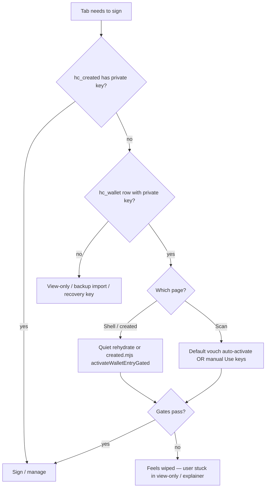

# Investigation: Keys “wiped” on Safari (iOS / WebKit)

**Date:** 2026-05-29 (initial) · **2026-05-29 prod walkthrough pass**  
**Status:** Active — root-cause catalog + fix backlog + **prod-verified gaps** · **P0-1 shipped 2026-05-29**  
**Reporter:** Steward on Safari — keys repeatedly disappear; product feels unusable  
**Related:** [`KEYS_CARDS_AND_VERIFICATION.md`](KEYS_CARDS_AND_VERIFICATION.md) · [`KEY_LOSS_SAD_PATH_MATRIX.md`](KEY_LOSS_SAD_PATH_MATRIX.md) · [`QUIET_TAB_REHYDRATE.md`](QUIET_TAB_REHYDRATE.md) · [`PWA_INSTALL.md`](PWA_INSTALL.md) · [`PWA_STANDALONE_EXTERNAL_NAVIGATION.md`](PWA_STANDALONE_EXTERNAL_NAVIGATION.md) · [`CROSS_TAB_KEYS_NOTIFICATION_SYSTEM.md`](CROSS_TAB_KEYS_NOTIFICATION_SYSTEM.md) · [`SAFARI_PERFORMANCE_AND_REFRESH_INVESTIGATION.md`](SAFARI_PERFORMANCE_AND_REFRESH_INVESTIGATION.md)

---

## Executive summary

**This is not user error and not a “niche edge case.”** Safari is the primary iPhone browser and the default path for Camera QR opens. The current key model **splits signing material across two browser stores with different lifetimes**, and several **Safari-specific eviction and tab-lifecycle behaviors** plus **product gaps** combine to produce exactly what stewards report: *“I had my card, now I can’t sign / manage / vouch — keys are gone.”*

| Verdict | Detail |
|---------|--------|
| **Is data actually deleted?** | Sometimes **yes** (Safari ITP, storage pressure, user site-data clear). Often **no** — keys still sit in `localStorage.hc_wallet` but **this tab’s** `sessionStorage.hc_created` is empty and recovery failed silently. |
| **Is Safari uniquely bad here?** | **Yes, materially.** iOS tab discard, memory-pressure sessionStorage purge, 7-day ITP script-storage deletion, and Camera → new-tab navigation hit this product harder than Chromium desktop. |
| **Is the architecture fixable without server key custody?** | **Yes**, but not with copy tweaks alone. Needs **scan-page rehydrate**, **durable save guarantees**, **visible failure when save fails**, and **passkey-like “always my object on this device”** behavior on every entry surface. |
| **Current mitigation shipped?** | Quiet tab rehydrate (D10) on **shell + scan pages (P0-1)**; vouch auto-activate **opt-in** on scan; auto-save **sync on create (P0-2)** with **quota-safe save errors (P0-3)**. |
| **Will the original P0 stack alone fix it?** | **No.** P0 closes the biggest scan-tab gap and create-save races, but prod walkthrough found **misleading “saved” chrome**, **keyless session pollution**, and **card-disabled false positives** that feel identical to “keys wiped.” See [§ Will P0 fixes actually fix this?](#will-p0-fixes-actually-fix-this). |

---

## Will P0 fixes actually fix this?

**Short answer: P0 is necessary, not sufficient.**

The original P0 stack (scan rehydrate, sync save, save error surfacing, backup gate) addresses **real** gaps. It does **not** fix everything stewards report as “keys wiped,” because several of those reports are **correct signing failure** paired with **incorrect product signals** — the UI says ownership is fine when this tab cannot sign.

| User report | Original P0 helps? | Why / what else |
|-------------|-------------------|-----------------|
| Camera QR → can’t vouch / revoke on scan tab | **Mostly yes** (P0-1 scan rehydrate) | Still fails: multi-card without last-active, PIN lock, no default vouch on stranger scan |
| Created card, closed tab, wallet empty | **Partial** (P0-2 sync save) | True loss if Safari evicted storage — only backup gate (P0-4) |
| “My card says saved but I can’t sign” | **No** | Scan dot uses **wallet saved**, not **tab keys** — [R9](#r9--scan-dot-says-ownership-saved-when-tab-cannot-sign-prod) |
| “View only but hub still shows my card” | **Partial** | `/created/` deep link **does** restore from wallet when intact; scan does not |
| “Card disabled since visit” on fresh card | **No** | Separate trust killer — [R10](#r10--card-disabled-since-visit-false-positive-prod) |
| Safari 7-day / clear website data | **No** | Platform wipe — backup/recovery only |
| PWA created, scan opened in Safari | **Partial** | P1 handoff; session split remains |
| Keys gone from wallet too | **Partial** | ITP / quota — P0-3 surfaces save failure; corrupt parse shows P1-4 coach (not empty hub) |

**Honest ship bar:** Treat P0 **plus** R9/R11/R12 (below) as the minimum credible fix for Safari stewards. P0 alone reduces incidence; it does not restore trust while chrome lies.

---

## Production walkthrough (2026-05-29)

Live session on **https://humanity.llc/** (build `site bce63209 · shell 60`). Method: create sample card → inspect storage → simulate session loss → full wallet wipe → compare scan vs `/created/` recovery.

### Flow A — Create sample card (happy path)

1. `/create/` → **Create a sample card** → landed on `/created/?profile_id=…&fresh=1`.
2. Storage after ~2s:

```json
{
  "sessionHasPriv": true,
  "walletCount": 1,
  "walletHasPriv": true,
  "autoSaveFailed": null,
  "lastActive": "<profile_id>"
}
```

**Finding:** Auto-save **did work** on prod for this path (contrary to “always races”). User pain is not *only* auto-save failure.

3. Hub on `/` showed saved `@demo_d4c` but also **“Card disabled on the network since your last visit”** on a **brand-new active card** — see R10.

4. Status dot briefly read “ownership not saved” then corrected to “ownership saved” — chrome race on first paint (contributes to “flaky keys” perception).

### Flow B — Session cleared, wallet intact (simulates Camera new tab)

1. Cleared `sessionStorage.hc_created` only; reloaded scan URL.
2. Storage: `sessionHasPriv: false`, `walletHasPriv: true`, no default vouch profile.
3. **Scan page device dot:** still **“Ownership saved.”** (`scan-page-dot` uses `loadWalletSummary().count`, not tab signing keys).
4. **Vouch block:** “1 saved card on this device… open My objects, tap Open controls…” — cannot sign until manual activation.
5. **`/created/?profile_id=…`:** `activateWalletEntryGated` from wallet **restored** `owner_private_key_b58` in session — **shell/deep-link recovery works**.

**Conclusion:** Same device, same origin — **scan abandons you, `/created/` saves you.** That asymmetry is the Safari Camera workflow.

### Flow C — Full wipe (simulates ITP / clear site data)

1. Removed `hc_wallet`, `hc_wallet_summary`, and `hc_created`; opened `/created/?profile_id=…`.
2. Correct **view-only** banner visible (`no-session` not hidden).
3. **Bug:** `hydrateSessionFromNetwork()` / gate card merge wrote **`hc_created` without private keys**:

```json
{
  "profile_id": "…",
  "handle": "demo_d4c",
  "manifesto_line": "…",
  "status": "active"
}
```

No `owner_private_key_b58`. Session **looks populated** but signing is impossible — worse than empty session for debugging and for any code that checks `profile_id` without checking private key.

4. View-only copy still says *“Finish create in the tab where you clicked Create…”* — **wrong** when wallet is empty; should point to backup/import.

### Flow D — Setup wizard + test scan (Safari-shaped)

From `pwa-scan-handoff-core.mjs`: in **browser** (non-standalone), steward test scan uses `window.open(url, "_blank")` — **new tab, empty session**. Wizard **auto-advances** past test step (`shouldAutoAdvanceSetupTestScan` returns true in browser). User can reach “done” while scan preview tab has no keys and original tab may be discarded on iOS.

---

## What “keys” means in this codebase

Humanity uses **two local stores** for the same logical thing (signing control):

| Store | Key | Contents | Lifetime | Shared across tabs? |
|-------|-----|----------|----------|-------------------|
| **Session** | `sessionStorage.hc_created` | Full owner (+ recovery) private keys for **this tab** | Until tab/window session ends | **No** — each tab has its own copy |
| **Saved wallet** | `localStorage.hc_wallet` | Array of saved cards **including private keys** | Until removed or browser evicts origin data | **Yes** — all tabs + PWA on same origin |

**Signing only works when `hc_created` in the active tab contains `owner_private_key_b58`.**  
Saved wallet rows are **not** active control until copied into the tab (`activateWalletEntry`, quiet rehydrate, “Open controls”, vouch auto-activate).

```text
Create / import
    → hc_created (this tab)     ← can sign NOW
    → auto-save / manual save
    → hc_wallet (device)        ← survives tab close IF save succeeded

New tab / Camera QR / tab killed
    → hc_created empty          ← feels like "keys wiped"
    → recovery SHOULD copy from hc_wallet
    → often DOES NOT (see gaps below)
```

**Design intent** (privacy): keys never leave the device unencrypted; no server recovery. **Product failure**: stewards experience tab/session mechanics as **random key loss** because recovery is incomplete and errors are quiet.

---

## Symptom taxonomy (what users actually see)

| Symptom | Likely layer | Keys in wallet? | Keys in tab session? |
|---------|--------------|-----------------|----------------------|
| `/created/` shows **View this card** / view-only banner | Session empty | Maybe | No |
| **Ownership not loaded in this tab** on revoke / vouch / save | Session empty | Often yes | No |
| Hub shows saved card but **Open controls** needed every time | Session empty; rehydrate skipped or scan path | Yes | No |
| **My cards empty** / card gone from hub | Wallet evicted or never saved | No | No |
| Card row exists but **no signing** (label only) | Never saved with private material, or import/view-only | Row without `owner_private_key_b58` | No |
| Worked in Safari tab, dead in **home-screen PWA** (or reverse) | Separate `sessionStorage` per top-level context | Shared `localStorage` | Context-specific session |
| After **Remove from device** + confirm on other tabs | Intentional broadcast clear | Removed | Cleared in all tabs |

---

## Root causes (ranked by Safari likelihood)

### R1 — Session keys are tab-scoped; Safari constantly opens **new tabs**

**Mechanism:** `sessionStorage` is per top-level browsing context. iPhone **Camera QR**, share links, and `target="_blank"` open a **fresh tab with empty `hc_created`**, even when `hc_wallet` on the same origin already holds the steward’s keys.

**Evidence in repo:**

- Create flow writes keys to session then navigates: `create-card.mjs` → `sessionStorage.setItem("hc_created", …)` → `location.replace("/created/")`.
- Scan pages load `scan-tab-keys.mjs` — **P0-1 shipped:** `await maybeQuietTabRehydrate()` before presence/chrome (see [Scan page module load order](#scan-page-module-load-order)):

```15:22:site/js/scan-tab-keys.mjs
import { maybeQuietTabRehydrate } from "./device-quiet-tab-rehydrate.mjs";
...
await maybeQuietTabRehydrate();

startTabKeysPresence();
```

- Quiet rehydrate also runs from `device-status.mjs` boot (shell routes: `/`, `/wallet/`, `/create/`, `/created/`):

```649:651:site/js/device-status.mjs
async function bootDeviceStatusShell() {
  await maybeQuietTabRehydrate();
  startTabKeysPresence();
```

**User impact:** Scan → vouch / live proof / manage is the **#1 Safari workflow** and the **#1 place recovery is missing**. User sees “keys not active” and interprets as wipe.

**Mitigation today:** Manual **Sign as…** / **Use keys here**, or opt-in **Default for vouching** + auto-activate (`vouch-issue.mjs` → `tryAutoActivateDefaultVouchKeys`). Both require prior setup and network fetch; PIN-locked cards fail auto-activate.

---

### R2 — Quiet tab rehydrate does not run or fails (wallet has keys, tab does not)

**Mechanism:** D10 copies one wallet row → `hc_created` on shell bootstrap. Skipped when:

| Skip reason | Code / pref |
|-------------|-------------|
| Tab already has control | `hasTabControl` |
| Zero wallet rows with private keys | `signingWalletCount === 0` |
| **Two+ saved cards** and toggle off | `hc_quiet_tab_rehydrate === "0"` |
| **Two+ saved cards**, no last-active | `hc_last_active_profile_id` missing / stale |
| **Sign lock / PIN** not unlocked | `controlActivationRequiresUnlock` |
| Activation error | `activateWalletEntryGated` failure |

**Safari angle:** Stewards with demo + production cards, or multiple objects, hit **multi-card skip** unless last-active + toggle align. Sign-lock PIN blocks silent rehydrate — user must use take-control flow (easy to miss on mobile).

See [`QUIET_TAB_REHYDRATE.md`](QUIET_TAB_REHYDRATE.md).

---

### R3 — Auto-save is async and can fail without blocking navigation

**Mechanism:** After create, `initCreatedDeviceSave` runs auto-save via `queueMicrotask(() => runSave({ quiet: true }))` — not synchronous before any further navigation.

**Failure modes:**

1. User leaves `/created/` before microtask runs (fast tap, setup wizard jump, merch handoff).
2. `saveWallet()` calls `localStorage.setItem` **with no try/catch** — `QuotaExceededError` throws out of `saveSessionToWallet` / `runSave` without guaranteed `markAutoSaveFailed`.
3. Private browsing / storage disabled — writes fail; session keys still lost on tab close.

```270:275:site/js/device-wallet.mjs
export function saveWallet(entries) {
  const serialized = JSON.stringify(entries);
  ...
  localStorage.setItem(WALLET_STORAGE_KEY, serialized);
```

**User impact:** Steward completes create, sees working `/created/`, closes tab — **wallet never got keys**. True loss unless they exported backup.

---

### R4 — Safari / WebKit **evicts script storage** (real wipe)

Documented platform behavior (not Humanity-specific):

| Trigger | Affected stores | Notes |
|---------|-----------------|-------|
| **ITP 7-day rule** | `localStorage`, `sessionStorage`, IndexedDB, SW | Safari deletes **all script-writable storage** for an origin if no **user interaction** on that site for **7 days of browser use**. Affects in-browser Safari. |
| **Home screen PWA** | Separate “days of use” counter | WebKit: installed web app interaction **resets** its timer — PWA can retain data while in-browser Safari tab loses it (or vice versa). See WebKit ITP blog + [`PWA_INSTALL.md`](PWA_INSTALL.md). |
| **iOS storage pressure** | Often **sessionStorage across open tabs** | Reported behavior: OS cache cleanup can clear session storage for open tabs under memory pressure (Stack Overflow / legacy WebKit notes). |
| **Settings → Clear History and Website Data** | Everything | User-initiated full wipe. |
| **Private / ephemeral browsing** | Writes fail or vanish on close | Product uses try/catch in many paths but save can still silently fail. |

**User impact:** `hc_wallet` and `hc_created` both gone — **View this card** + recovery backup is the only path. Product copy mentions backup but **first-run does not force backup before use**.

---

### R5 — PWA vs Safari = two sessions, one wallet

**Mechanism:** Same origin shares `localStorage` (`hc_wallet`) but **not** `sessionStorage` (`hc_created`). Installed PWA and in-browser Safari are **separate top-level contexts**.

Opening scan via `window.open(..., "_blank")` in standalone **exits the PWA into system Safari** ([`PWA_STANDALONE_EXTERNAL_NAVIGATION.md`](PWA_STANDALONE_EXTERNAL_NAVIGATION.md)). Keys stay in PWA session; Safari scan tab has none.

**User impact:** “I saved on my home-screen app, scanned in Safari, keys vanished.” Wallet still has rows; session path wrong.

---

### R6 — Code paths that **actively clear** session keys

| Path | Trigger | Scope |
|------|---------|-------|
| `clearTabSessionKeys()` | User **Stop managing in this tab** on scan (`vouch-issue.mjs`) | This tab only |
| `BroadcastChannel` `clear-profile-keys` | **Remove from device** → optional confirm clears other tabs (`device-tab-presence.mjs`, `device-notice-nav.mjs`) | Matching profile in each tab |
| Tab close / navigation | `sessionStorage` session ends | This tab |
| `broadcastClearProfileKeys` from orphan flow | User confirms orphan key clear | All tabs with that profile |

These are **intentional** but easy to trigger accidentally on mobile confirm dialogs.

---

### R7 — Wallet parse failure presents as empty wallet

**Mechanism:** `loadWallet()` catch returns **`[]`** on JSON parse error — corrupt or partial `hc_wallet` looks like **no saved cards**.

```224:229:site/js/device-wallet.mjs
  } catch {
    walletCacheRaw = null;
    walletCache = [];
    ...
    return [];
  }
```

Could follow aborted `localStorage.setItem` (quota) or manual storage edit. User sees total loss; raw bytes may still exist in Application tab.

---

### R8 — Cross-tab / inbox noise mistaken for loss (secondary)

Cross-tab presence (`hc_tab_keys_presence`) does **not** delete keys, but stale heartbeats, bfcache `pageshow`, and remove-card flows cause **“another tab has your keys”** banners that feel like broken custody ([`CROSS_TAB_KEYS_FLASH_AFTER_CARD_DELETE_INVESTIGATION.md`](CROSS_TAB_KEYS_FLASH_AFTER_CARD_DELETE_INVESTIGATION.md)). Contributes to “this system is untrustable” even when keys exist.

---

### R9 — Scan dot says “Ownership saved” when tab cannot sign (prod)

**Mechanism:** `scan-page-dot.mjs` → `deviceStateFromContext({ savedWalletCount: summary.count, … })` treats **wallet rows** as “device has keys.” `hasCreatedKeys()` is separate and used for cross-tab overlay, **not** for the primary “Ownership saved” explainer when `savedWalletCount > 0`.

**Prod repro (Flow B):** Wallet has private key; session cleared; scan dot **still** says “Ownership saved.” Vouch UI correctly says keys not in tab.

**User impact:** Steward reads dot → tries to vouch → fails → *“keys were wiped.”* They were never loaded in **this tab**; UI lied.

**Fix:** Dot / glance / “Keys on this device” strip must distinguish **`saved on device`** vs **`can sign in this tab`**. Offer one-tap **Restore control here** when wallet has keys and session does not.

---

### R10 — “Card disabled since visit” false positive (prod)

**Prod repro (Flow A):** Minutes after first create, hub row on `/` showed **“Card disabled on the network since your last visit”** while card status was **active**.

**User impact:** Reads as “network killed my card / keys” — same emotional bucket as key loss. Documented historically in [`CARD_DISABLED_SINCE_VISIT_FALSE_POSITIVE_INVESTIGATION.md`](CARD_DISABLED_SINCE_VISIT_FALSE_POSITIVE_INVESTIGATION.md); **still observed on prod** 2026-05-29.

**Fix:** Not a custody store bug — still blocks trust in the keys product. **Shipped (P0b-1):** in-visit network polls no longer seed `hc_wallet_last_seen_network` for profiles without a prior baseline; first baseline is written on exit snapshot (`snapshotNetworkSeenOnExit`) so fresh create cannot false-trigger “since your last visit” in the same session.

---

### R11 — Keyless `hc_created` session pollution (prod)

**Mechanism:** On view-only `/created/` visits, `hydrateSessionFromNetwork()` (`created.mjs` ~684–710) and gate card merge (~747–761) call `saveSession(next)` with resolver metadata **only** — no `owner_private_key_b58`.

**Prod repro (Flow C):** After full storage wipe, `hc_created` existed with profile/handle/status but **no private key**.

**User impact:**

- DevTools show a session → user thinks keys exist.
- Code paths keyed on `session.profile_id` may misfire vs empty session.
- Quiet rehydrate still runs (checks private key) but **tab-notice / unsaved** logic gets muddy.

**Fix:** **Never write `hc_created` without `owner_private_key_b58`.** Metadata-only visits should use a separate key (e.g. `hc_created_view`) or stay DOM-only. On view-only gate, `removeItem('hc_created')` if missing private key.

---

### R12 — Setup wizard test scan opens new tab + auto-advances (Safari)

**Mechanism:** `openStewardScanPreview` → `window.open(..., "_blank")` in browser; `shouldAutoAdvanceSetupTestScan(!standalone)` advances wizard when user hasn’t confirmed save in the scan tab.

**User impact:** iPhone setup flow trains users that scan “just works” in another tab, then Safari discards that context — keys feel like they vanish mid-setup.

**Fix:** **Shipped (P0b-2):** `shouldAutoAdvanceSetupTestScan` returns false in browser; setup wizard stays on test step until steward taps **Continue** again; standalone PWA still auto-advances after same-tab preview.

---

### R13 — View-only copy wrong after real wipe

**Mechanism:** `#no-session-detail` defaults to “Finish create in the tab where you clicked Create…”

**Prod repro (Flow C):** Wallet empty — copy should say **import `.hcbackup` / recovery key**, not “other tab.”

**Fix:** Branch on `loadWallet()` signing rows: wallet empty → backup/recovery CTA; wallet has keys → Open controls / restore here.

---

## Recovery paths today and when they fail



| Recovery | Works when | Fails on Safari when |
|----------|------------|----------------------|
| Quiet tab rehydrate | 1 card, or multi + last-active + toggle, no PIN lock | PIN lock; 2+ cards, toggle off; **scan now wired (P0-1)** for D10 gates |
| `/created/?profile_id=` activate | Deep link with saved wallet | View-only if no wallet row |
| Vouch auto-activate | Default vouch set + network OK + not PIN | Not configured; PIN; network flake |
| Encrypted `.hcbackup` import | User has file + passphrase | User never exported |
| Recovery key | User saved recovery material | User skipped recovery |

---

## Likely reproduction matrix (QA)

| ID | Steps | Expected today | Feels like wipe? |
|----|-------|----------------|------------------|
| **S1** | Create card on iPhone Safari → force-quit Safari within 5s → reopen `/created/` | View-only if auto-save did not complete | **Yes** |
| **S2** | Save card → scan stranger QR from **Camera** (new tab) → try vouch | Explainer unless default vouch configured | **Yes** |
| **S3** | Save in PWA → open scan from setup with old `window.open` path in Safari | Safari tab has no session keys | **Yes** |
| **S4** | Two saved cards → new tab `/` with rehydrate toggle off | No silent rehydrate | **Yes** |
| **S5** | Enable sign-lock PIN → new tab | Rehydrate blocked until PIN | **Yes** |
| **S6** | No site interaction 7+ days → open site | ITP may delete all storage | **Yes (real)** |
| **S7** | Low storage iOS → many tabs | Session storage may clear | **Yes** |
| **S8** | Hub remove card → confirm clear other tabs | Intentional key clear | Yes (expected) |

Automated partial coverage: `e2e/key-loss-sad-path.spec.ts` (K1, K5), `e2e/device-cross-tab-keys.spec.ts` (K4). **No WebKit E2E for S2, S3, S6.**

---

## Diagnostic checklist (DevTools or remote inspect)

Run on the **exact tab** where signing failed (Safari → Develop menu → device).

| Check | Location | Healthy | Wipe signal |
|-------|----------|---------|-------------|
| Tab session | `sessionStorage.hc_created` | JSON with `owner_private_key_b58` | Missing or no private field |
| Saved wallet | `localStorage.hc_wallet` | Array with matching `profile_id` + private key | `[]`, missing profile, or no private field |
| Auto-save | `sessionStorage.hc_auto_save_failed` | Absent or not your profile | Your `profile_id` listed |
| Rehydrate prefs | `localStorage.hc_quiet_tab_rehydrate`, `hc_last_active_profile_id` | Toggle not `"0"`; last-active set | Toggle `"0"` or stale last-active |
| Removed denylist | `localStorage.hc_wallet_removed_profile_ids` | Should not contain your profile | Profile listed after remove |
| Context | `display-mode` / standalone | Note PWA vs browser | Same wallet, different session |
| Raw wallet parse | Console: `JSON.parse(localStorage.getItem('hc_wallet'))` | Array | Throws → R7 |

Enable inbox diagnostics: `localStorage.hc_inbox_diagnostics = "1"` → read `sessionStorage.hc_inbox_diag_log` after repro.

---

## Fix backlog (priority order)

### P0 — Stop the bleeding (product correctness)

| # | Change | Rationale | Prod validated? |
|---|--------|-----------|-----------------|
| **P0-1** | **Wire `maybeQuietTabRehydrate()` on scan pages** before vouch/live-proof UI | R1 Camera QR path | **Shipped** — `scan-tab-keys.mjs?v=8` awaits rehydrate; script loads before `vouch-issue` |
| **P0-2** | **Synchronous save** before leaving create success path | R3 race (less common on prod than assumed) | **Shipped** — `create-card.mjs` sync `saveSessionToWallet` before navigate; `created-device-save.mjs` no microtask |
| **P0-3** | **try/catch on `saveWallet` / `saveSessionToWallet`** — visible error, `hc_auto_save_failed` | R3 quota | **Shipped** — `device-wallet-save-core.mjs`; `saveWallet` returns `{ error }`; save UI surfaces copy |
| **P0-4** | **First-session backup gate** before “done” | R4 true wipe | **Shipped** — `created-first-session-gate-core.mjs`; setup required until seatbelt or `hc_setup_done` |
| **P0-5** | **Scan dot / “Keys on this device” = tab signing state**, not wallet count; **Restore control here** CTA | R9 — **prod** | Flow B — **Shipped** (`scan-page-dot.mjs?v=8`, actor band lead sync) |
| **P0-6** | **Never persist `hc_created` without `owner_private_key_b58`**; strip keyless session on view-only | R11 — **prod** | Flow C — **Shipped** (`device-keys.mjs` `setTabSession`, `created.mjs`) |
| **P0-7** | **View-only copy** branches on wallet: empty → backup/import; saved → restore in this tab | R13 — **prod** | Flow C — **Shipped** |

### P0b — Same release train (trust killers)

| # | Change | Rationale |
|---|--------|-----------|
| **P0b-1** | Re-verify **card disabled since visit** on fresh create (hub row) | R10 — **prod** false positive; no in-visit baseline seed; first baseline on exit snapshot | **Step 1 shipped** — automated R10 guard on `/` hub; step 2: prod re-verify on WebKit after deploy |
| **P0b-2** | Setup wizard: **no auto-advance** on test scan when `window.open` new tab | R12 | **Shipped** — `created-setup.mjs` · `shouldAutoAdvanceSetupTestScan`; browser needs second Continue |
| **P0b-3** | On scan, **auto-activate wallet row for signing** when exactly one signing row (mirror D10), not only default-vouch path | Stranger vouch without prior “Default for vouching” setup | **Shipped** — `vouch-scan-sole-signing-activate-core.mjs` · `e2e:vouch-scan-sole-signing` |

### P1 — Safari-native UX

| # | Change | Rationale |
|---|--------|-----------|
| **P1-1** | Scan: if exactly one wallet signing row, auto-activate like quiet rehydrate (same gates as D10) | Passkey-like scan flow | **Shipped** — P0-1 `scan-tab-keys.mjs` + P0b-3 vouch sole-row path |
| **P1-2** | Prominent **Ownership not in this tab — tap to restore** when wallet has keys but session empty (all surfaces) | **Shipped** — hub · landing dot · `/wallet/` tab hint · view-only `/created/` Live banner · scan actor band |
| **P1-3** | PWA scan handoff: ensure all scan entry points use same-tab in standalone ([`PWA_STANDALONE_EXTERNAL_NAVIGATION.md`](PWA_STANDALONE_EXTERNAL_NAVIGATION.md) P1) | Fixes R5 |
| **P1-4** | On `loadWallet` parse failure, show **corrupt wallet** coach card with export/import links — not empty hub | Fixes R7 · **Shipped** — hub urgent card · `/wallet/` tab hint · import + backup help CTAs |

### P2 — Platform honesty

| # | Change | Rationale |
|---|--------|-----------|
| **P2-1** | Safari / iOS in-product notice: 7-day inactivity eviction + “Add to Home Screen resets timer” | Sets expectations for R4 |
| **P2-2** | Detect standalone vs browser wallet/session mismatch; one-tap **Restore control in this app** | R5 |
| **P2-3** | WebKit E2E: `e2e/safari-keys-persistence.spec.ts` for S2, S3 on WebKit project | Regression |

### P3 — Architectural (longer term)

| # | Change | Rationale |
|---|--------|-----------|
| **P3-1** | Evaluate **Secure Enclave / WebAuthn** wrapping of wallet keys (unlock to sign, not raw keys in session) | Reduce sessionStorage dependence |
| **P3-2** | Optional encrypted persistence outside ITP window (only with user consent) | Controversial — document threat model |
| **P3-3** | Never store raw private keys in hub summary paths; audit accidental strip | Defense in depth |

**Explicit non-fix:** Server-side key custody — contradicts product trust model ([`V1_PRODUCT_TRUST_MODEL.md`](V1_PRODUCT_TRUST_MODEL.md)).

---

## What we should tell stewards (honest, until P0 ships)

1. **If you can still see the card in My cards / hub** — keys are probably still on the device; open the card and tap **Open controls** (or restore from hub custody panel). This tab lost session copy, not necessarily the wallet.
2. **If My cards is empty** — Safari likely evicted storage or save never completed. You need **encrypted backup** or **recovery key** from setup; Humanity cannot recover keys server-side.
3. **iPhone Camera opens a new tab** — with **one saved card**, scan should quietly restore control (P0-1). With **multiple cards**, PIN lock, or rehydrate toggle off, you may still need **Open controls** or default vouch setup.
4. **Install to Home Screen** and use one context consistently — reduces ITP 7-day loss and PWA/Safari session split.
5. **Export backup** before printing QR or revoking in the field.

---

## Files touched by this investigation

| Area | Module |
|------|--------|
| Session keys | `site/js/device-keys.mjs` |
| Wallet persistence | `site/js/device-wallet.mjs` |
| Auto-save | `site/js/device-auto-save.mjs`, `site/js/created-device-save.mjs` |
| Quiet rehydrate | `site/js/device-quiet-tab-rehydrate.mjs`, `device-quiet-tab-rehydrate-core.mjs` |
| Scan bootstrap | `site/js/scan-tab-keys.mjs`, `worker/src/resolver/scan-html.ts` |
| Shell bootstrap | `site/js/device-status.mjs` |
| Cross-tab clear | `site/js/device-tab-presence.mjs`, `device-notice-nav.mjs` |
| Vouch activate | `site/js/vouch-issue.mjs`, `vouch-ready-keys.mjs` |
| Created activate | `site/js/created.mjs` |

---

## Implementation rollout tracker

| Step | Item | Status | Notes |
|------|------|--------|-------|
| 1 | **P0-1** Scan quiet rehydrate + script order | **Shipped** | `scan-tab-keys.mjs` top-level `await maybeQuietTabRehydrate()`; `scan-html.ts` loads scan-tab-keys **before** live-control and vouch-issue |
| 2 | P0-5 Scan dot honesty | **Shipped** | `scanDeviceStateFromContext` (tab keys only); glance + aria `walletKeysNotInTab`; actor band lead; `scan-page-dot.mjs?v=8` |
| 3 | P0-6 Keyless session fix | **Shipped** | `setTabSession` / `getTabSession` guard; `created.mjs` hydrate + gate merge use `applyCreatedSessionState`; view-mode strip |
| 4 | P0-7 View-only copy branches | **Shipped** | `created-view-only-copy-core.mjs`; wallet-empty vs wallet-saved copy on `#no-session-detail` + view restore panel |
| 5 | P0-2 Sync save on create | **Shipped** | `created-device-save-core.mjs`; sync save in `create-card.mjs` before `location.replace`; `/created/` auto-save runs inline |
| 6 | P0-3 saveWallet try/catch | **Shipped** | `device-wallet-save-core.mjs`; quota-safe `saveWallet`; `hc_auto_save_failed` + visible save errors |
| 7 | P0-4 Backup gate | **Shipped** | `created-first-session-gate-core.mjs`; setup required until seatbelt; wallet persists recovery markers; steward `#revoke` bypass gated |
| 8 | P0b-1 Card disabled FP | **Step 1 shipped** | R10 — `mergeLastSeenFromNetworkMap` skips in-visit baseline seed; `card-disabled-fresh-create.test.ts` · E2E `device-os-wallet.spec.ts` |
| 9 | P0b-2 Setup wizard scan tab | **Shipped** | R12 — `created-setup.mjs` · `pwa-scan-handoff-core.mjs` · `e2e/device-pwa-scan-handoff.spec.ts` |
| 10 | P0b-3 Scan single-row auto-activate (stranger vouch) | **Shipped** | `vouch-scan-sole-signing-activate-core.mjs` · `e2e:vouch-scan-sole-signing` |
| 11 | P1-2 Ownership not in this tab — restore CTA (all surfaces) | **Shipped** | Hub custody · landing dot · `/wallet/` tab hint · view-only Live banner · scan actor band · `device-ownership-restore-in-tab.mjs` |
| 12 | P1-3 PWA scan handoff (standalone same-tab) | **Shipped** | `pwa-scan-handoff-core.mjs` · `e2e/device-pwa-scan-handoff.spec.ts` |
| 13 | P1-4 Corrupt wallet coach card | **Shipped** | `device-wallet-corrupt-core.mjs` · hub `#device-hub-wallet-corrupt` · `/wallet/` `#wallet-tab-hint` · `e2e:key-loss-sad-path` R7 |
| 14 | P2-1 Safari ITP storage notice | **Shipped** | `safari-itp-storage-notice-core.mjs` · lazy bootstrap on `/` · `/wallet/` · `/created/` |

**P0-1 spec (reference for reviewers):**

1. Mirror `device-status.mjs` → `bootDeviceStatusShell()`: `await maybeQuietTabRehydrate()` **before** `startTabKeysPresence()` and `refreshDeviceChrome({ immediate: true })`.
2. Use the same D10 gates as shell ([`device-quiet-tab-rehydrate-core.mjs`](../site/js/device-quiet-tab-rehydrate-core.mjs)): single signing row, or multi-card with last-active + toggle, no PIN lock, `activateWalletEntryGated` success.
3. On success, Tier 3 demotion runs (`hc-quiet-tab-rehydrated` event, cross-tab filter) — same as shell.
4. **Script order:** Module scripts execute in document order; top-level `await` in `scan-tab-keys.mjs` **blocks** subsequent scan scripts until rehydrate completes. Therefore `renderScanTabKeysScript` must appear **before** `renderVouchIssuanceScript` and `renderLiveControlScript` in `scan-html.ts`.
5. Bump cache-bust query `scan-tab-keys.mjs?v=8` in worker HTML + e2e fixture + Vitest contracts.
6. **Does not fix R9:** scan dot may still say “Ownership saved” when rehydrate was skipped (multi-card, PIN, toggle off) — P0-5 still required.

---

## Scan page module load order

### Before P0-1 (broken)

```text
<body>
  …
  live-control inline/bootstrap
  vouch-issue.mjs?v=13          ← runs first; may try vouch/activate with empty hc_created
  scan-tab-keys.mjs?v=7         ← presence + chrome only; NO rehydrate
  scan-live-check-arrive …
</body>
```

**Race:** `vouch-issue.mjs` loaded and executed before any rehydrate path existed on scan pages.

### After P0-1 (shipped)

```text
<body>
  …
  scan-tab-keys.mjs?v=8         ← await maybeQuietTabRehydrate(); then presence + chrome
  live-control …                ← blocked until scan-tab-keys module finishes
  vouch-issue.mjs?v=13          ← sees populated hc_created when D10 gates pass
  …
</body>
```

**Entry surfaces with quiet rehydrate:**

| Surface | Bootstrap module | Rehydrate |
|---------|------------------|-----------|
| `/`, `/wallet/`, `/create/`, `/created/` | `device-status.mjs` | Yes (since D10) |
| Scan resolver pages (`/c/…`) | `scan-tab-keys.mjs` | **Yes (P0-1)** |
| Merch `/shop/` | Shell or shop modules | Shell only on device pages |

---

## Complete local storage inventory (custody-relevant)

| Key | Store | Purpose | Cleared when |
|-----|-------|---------|--------------|
| `hc_created` | `sessionStorage` | Tab signing session (private keys) | Tab close; `clearTabSessionKeys()`; broadcast clear; intentional remove |
| `hc_wallet` | `localStorage` | Saved cards array (includes private keys when saved with control) | User remove; ITP 7-day; clear site data; corrupt → parse as `[]` |
| `hc_wallet_summary` | `localStorage` | Denormalized hub summary cache | Wallet mutations |
| `hc_last_active_profile_id` | `localStorage` | D10 multi-card rehydrate target | User activity updates |
| `hc_quiet_tab_rehydrate` | `localStorage` | `"0"` opts out of multi-card silent rehydrate | User hub toggle |
| `hc_auto_save_failed` | `sessionStorage` | Profile IDs where auto-save failed | Session end |
| `hc_wallet_removed_profile_ids` | `localStorage` | Denylist after remove-from-device | User action |
| `hc_tab_keys_presence` | `sessionStorage` | Cross-tab metadata (no private keys) | Tab/session |
| `hc_default_vouch_profile_id` | `localStorage` | Opt-in vouch auto-activate target | User setting |
| `hc_created_task_done` | `sessionStorage` | Setup wizard task flags | Session |
| `hc_created_first_qr_revoke` | `localStorage` | First-revoke gate state | Persistent |
| `hc_inbox_diagnostics` | `localStorage` | Debug pref | User |
| `hc_inbox_diag_log` | `sessionStorage` | Debug log buffer | Session |
| `hc_resolver_sync_tabs` | `localStorage` | Tab sync opt-out | User |

**Critical invariant (P0-6 shipped):** `hc_created` is only persisted when `owner_private_key_b58` or `recovery_private_key_b58` is present (`setTabSession` / `getTabSession` in `device-keys.mjs`). View-only `/created/` strips keyless pollution on entry.

---

## `hc_created` write paths (catalog)

| Writer | Module | Private key in payload? | When |
|--------|--------|-------------------------|------|
| Create flow | `create-card.mjs` | **Yes** | After Ed25519 keygen, before navigate to `/created/` |
| Activate wallet row | `device-keys.mjs` → `activateWalletEntry` | **Yes** | Open controls, quiet rehydrate success, `/created/` deep link |
| Gated activate | `device-control-activation.mjs` | **Yes** | PIN/unlock wrapper around activate |
| Session save helper | `created.mjs` → `saveSession` | **Sometimes no** | Revoke/update flows yes; **hydrateSessionFromNetwork / gate merge — metadata only (R11)** |
| Clear | `device-keys.mjs` → `clearTabSessionKeys` | N/A | Stop managing in tab; removes item |
| Vouch stop | `vouch-issue.mjs` | N/A | Calls `clearTabSessionKeys` |

**Readers that assume session = can sign (unsafe without private-key check):**

- `vouch-issue.mjs` — checks `owner_private_key_b58` before issue (good)
- `scan-page-dot.mjs` — uses **wallet count** for primary “saved” state (R9)
- Various hub paths — mix of `getTabSession()` and wallet

---

## Quiet rehydrate gate truth table (D10)

Evaluated in `shouldQuietTabRehydrate()` (`device-quiet-tab-rehydrate-core.mjs`):

| # | Condition | Rehydrate? | Skip reason string |
|---|-----------|------------|-------------------|
| 1 | Tab already has `owner_private_key_b58` | No | `has_tab_control` |
| 2 | Zero wallet rows with private keys | No | `no_saved` |
| 3 | Exactly one signing row | **Yes** (if unlock OK) | — |
| 4 | Two+ signing rows, `hc_quiet_tab_rehydrate === "0"` | No | `multi_card_opt_out` |
| 5 | Two+ signing rows, no resolvable last-active target | No | `no_last_active` |
| 6 | Sign-lock / PIN required for profile | No | `requires_unlock` |
| 7 | `activateWalletEntryGated` fails (network, etc.) | No | `activation_failed` |

**Safari Camera QR typical case:** one saved card, empty session → gate **3** passes on scan after P0-1.

**Still fails after P0-1:** gates 4–7; steward with demo + prod cards and toggle off; PIN-locked card; activation network error.

---

## Contradictory UI catalog (prod 2026-05-29)

These surfaces can simultaneously show “saved / OK” and block signing — users bucket all as “keys wiped”:

| Surface | Says | Reality (Flow B) | Fix item |
|---------|------|------------------|----------|
| Scan page dot | “Ownership saved” | Wallet has keys; **tab cannot sign** | P0-5 |
| Scan vouch block | “Open controls in My objects” | Correct | — |
| Hub on `/` | “Card disabled since visit” on **new** active card | False positive | P0b-1 |
| `/created/` view-only banner | Visible correctly | — | — |
| `/created/` `#no-session-detail` | “Finish create in other tab…” | Wrong when wallet empty (Flow C) | P0-7 |
| `sessionStorage.hc_created` after Flow C | Populated JSON | **No private key** | P0-6 |
| Status dot first paint | Brief “not saved” → “saved” | Chrome race | Low priority |

---

## Auto-save mechanics (detail)

**Path:** `create-card.mjs` sync `saveSessionToWallet` before `/created/` navigation (P0-2); `created-device-save.mjs` → `initCreatedDeviceSave` → inline `runSave({ quiet: true })` when auto-save is on (no microtask).

**Success criteria (Flow A prod):** Within ~2s, `localStorage.hc_wallet` contains row with `owner_private_key_b58`; `sessionStorage` still has tab copy.

**Failure modes (R3):**

1. Navigation away before microtask — **fixed (P0-2)** via sync save on create + inline auto-save on `/created/`.
2. `saveWallet()` → `localStorage.setItem` throws `QuotaExceededError` — **fixed (P0-3)** via try/catch, `{ error }` return, and visible save UI.
3. Private mode / storage disabled.

**Detection:** `sessionStorage.hc_auto_save_failed` JSON array of profile IDs; hub/inbox may surface.

---

## Test coverage matrix

| Scenario | Automated | Gap |
|----------|-----------|-----|
| K1 session-only loss | `e2e/key-loss-sad-path.spec.ts` | — |
| K4 cross-tab clear | `e2e/device-cross-tab-keys.spec.ts` | — |
| K5 wallet empty | `e2e/key-loss-sad-path.spec.ts` | — |
| Shell quiet rehydrate wiring | `worker/tests/device-quiet-tab-rehydrate.test.ts` | — |
| **Scan quiet rehydrate wiring** | `worker/tests/device-quiet-tab-rehydrate.test.ts` (P0-1) | **No runtime E2E** |
| S2 Camera new tab → scan vouch | — | **WebKit E2E missing** (P2-3) |
| S3 PWA → Safari scan | — | **WebKit E2E missing** |
| S6 ITP 7-day | — | Manual / platform |
| Scan dot honesty (R9) | Partial `scan-page-dot-contract` | Behavior E2E after P0-5 |
| R11 keyless session | `worker/tests/device-tab-session.test.ts` | K1 asserts no keyless `hc_created` |

---

## Platform reference (Safari / WebKit)

| Behavior | Storage affected | Product impact |
|----------|------------------|----------------|
| **ITP 7-day** (no user interaction on origin) | All script storage for origin | True wipe — R4 |
| **PWA vs in-browser** | Separate session counters; shared `localStorage` | R5 session split |
| **iOS memory pressure** | Reported `sessionStorage` loss across tabs | R1 + R4 feel |
| **Camera app QR** | Always new top-level tab | R1 primary path |
| **`window.open(..., "_blank")`** | New tab, empty session | R12 setup wizard |
| **Private browsing** | Writes may fail silently | R3 |

Sources: WebKit ITP blog; [`PWA_INSTALL.md`](PWA_INSTALL.md); [`SAFARI_PERFORMANCE_AND_REFRESH_INVESTIGATION.md`](SAFARI_PERFORMANCE_AND_REFRESH_INVESTIGATION.md).

---

## Changelog

| Date | Notes |
|------|-------|
| 2026-05-29 | Initial investigation — Safari wipe report; root-cause catalog P0–P3 |
| 2026-05-29 | **Prod walkthrough** on humanity.llc — Flows A–D; R9–R13; P0 honesty table; expanded P0/P0b |
| 2026-05-29 | **Appendix:** storage inventory, write paths, scan script order, gate table, UI catalog, test matrix, rollout tracker |
| 2026-05-29 | **P0-1 shipped:** scan-tab-keys awaits `maybeQuietTabRehydrate()`; scan-html script order fixed |
| 2026-05-29 | **P0-5 shipped:** scan dot uses tab signing state; wallet-only keys → hollow `none` + Restore control here |
| 2026-05-29 | **P0-6 shipped:** `setTabSession` rejects keyless writes; `/created/` hydrate/gate no longer pollute `hc_created` |
| 2026-05-29 | **P0-7 shipped:** view-only copy branches on wallet signing rows; `#no-session-detail` + restore panel leads |
| 2026-05-29 | **P0-2 shipped:** sync wallet save before `/created/` navigation; inline auto-save on `/created/` (no microtask) |
| 2026-05-29 | **P0b-3 shipped:** sole signing row scan vouch auto-activate |
| 2026-05-29 | **P1-2 shipped:** hub · landing dot · `/wallet/` tab hint · view-only Live banner · scan actor band restore CTA |
| 2026-05-29 | **P1-2 step 1 shipped:** shell tab-honest dot + hub `wallet_not_in_tab` restore row |
