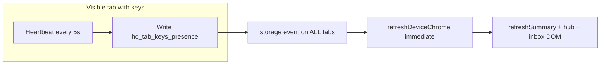

# Investigation: Safari slowness, refresh behavior, and long-session viability

**Date:** 2026-05-26  
**Status:** Read-only analysis (fix backlog below)  
**Reporter question:** Safari feels extremely slow to refresh; is something accumulating? Do users need hard refresh every time? Can someone use the app for a week without it becoming laggy?  
**Related:** [`SAFARI_WEBKIT_SHELL_REGRESSION_INVESTIGATION.md`](SAFARI_WEBKIT_SHELL_REGRESSION_INVESTIGATION.md) · [`LAGGY_SCROLL_CROSS_TAB_PRESENCE_INVESTIGATION.md`](LAGGY_SCROLL_CROSS_TAB_PRESENCE_INVESTIGATION.md) · [`DEVICE_OS_REQUEST_BUDGET.md`](DEVICE_OS_REQUEST_BUDGET.md) · [`STATUS_DOT_LOAD_FAILURE_POSTMORTEM.md`](STATUS_DOT_LOAD_FAILURE_POSTMORTEM.md) · [`UI_UX_REVERT_PLAN.md`](UI_UX_REVERT_PLAN.md)

---

## Executive summary

Safari feeling "extremely slow to refresh" is **real and expected under certain usage**, but it is **not primarily a classic memory leak** where listeners or timers stack up forever on a single page load. The dominant patterns are:

| Cause class | What it feels like | Accumulates over days? |
|-------------|-------------------|----------------------|
| **Heavy work on every navigation** | Slow first paint after reload on `/`, `/wallet/`, `/created/` | No (restarts each full navigation) |
| **Cross-tab presence + chrome refresh** | Scroll/tap jank, sluggish UI with multiple Humanity tabs open | **Persists** while tabs stay open (not unbounded growth) |
| **Wallet / hub network I/O** | Long "refresh" when many saved cards; Worker quota / rate limits | Data in `localStorage` grows with saved cards |
| **Live-control polling** (hub expanded / inbox + watch on) | Background CPU + network when steward opted in | Timer restarts per page; **SW** can poll when tab hidden + alerts on |
| **Stale or mixed JS cache** | Broken or flaky shell until hard refresh | Until cache bust aligns (`?v=` on shell graph) |
| **Safari / iOS privacy** | Extra throttling, ITP, storage partitioning | Environment-specific |

**Can a user run a week straight without extreme lag?**

- **Yes, realistically** if they use **one tab**, **few saved cards**, **collapsed hub on landing**, turn **off "Watch for live proof"** when not needed, and avoid leaving **`/wallet/`** open in the background for days.
- **No, not today** if they match the power-user pattern the product encourages: **many saved cards**, **several Humanity tabs with signing keys**, **wallet page open**, **browser background alerts on** - that pattern produces **continuous** main-thread and network load, not a one-time spike.

**Do users need hard refresh every refresh?**

- **No** for normal product use after a good deploy.
- **Hard refresh is a valid workaround** when the status dot is dead, chrome is wrong, or JS versions are mixed - see § Hard vs soft refresh.
- Hard refresh **does not reset** `localStorage` (wallet, presence, preferences), so it **will not** fix slowness driven by many tabs or large wallet data.

---

## What "slow to refresh" usually means

Users often conflate several operations:

| User phrase | Technical event | Typical cost today |
|-------------|-----------------|-------------------|
| "Refresh the page" | `location.reload()` or Safari reload | Full HTML + large ES module graph + shell bootstrap |
| "Open / switch route" | Navigate to `/wallet/`, `/created/`, etc. | Same module graph reload (multi-page static site, not SPA) |
| "Come back to the tab" | `visibilitychange` → visible | Health `fetch` + chrome refresh + poll resume |
| "Safari feels slower than day 1" | Long-lived tabs + more wallet rows + more open tabs | Cross-tab + polling + larger DOM, not leaked timers |

This codebase is **multi-page** (separate HTML per route). Each visit to a shell page loads `device-status-bootstrap.mjs` → dynamic import of **`device-status.mjs`**, which statically pulls **~20+ modules** (hub, inbox, chrome refresh, presence, notifications). Safari WebKit pays a higher cost than Chromium to parse and instantiate that graph.

---

## Is something "accumulating"?

### Does **not** unboundedly accumulate (per full page load)

- `addEventListener` / `setInterval` in shell modules use **guard flags** (`listenersBound`, `coordinatorStarted`, `heartbeatTimer != null`) so a **single** navigation does not register duplicate listeners.
- Inbox gather uses a **50ms coalesce cache** and a per-tick lock during chrome refresh (`device-inbox.mjs`).
- Presence map is **capped** at 20 rows (`MAX_PRESENCE_ENTRIES`).
- Activity log is **capped** at 40 entries (`device-activity.mjs`).
- Dot/inbox diagnostic logs cap at 20 entries.

### **Does** persist across soft refresh and sessions

| Store | Key(s) | Growth | Effect on performance |
|-------|--------|--------|------------------------|
| `localStorage` | `hc_wallet` | One object per saved card (can include key material metadata) | Larger JSON parse on every `loadWallet()`; more hub rows; more poll slots |
| `localStorage` | `hc_tab_keys_presence` | Up to 20 tabs | **Cross-tab `storage` events** |
| `localStorage` | `hc_device_activity`, pins, theme, notif prefs | Bounded or small | Minor |
| `sessionStorage` | `hc_wallet_network_cache` | Per card status blob, 5 min TTL | Grows with card count during session |
| `sessionStorage` | `hc_created` | Per-tab signing session | Normal |
| Service Worker | `SW_STATE_CACHE` (Cache API) | Wallet entry list + poll slots when OS alerts on | Background polls when no visible client |

### **Does** accumulate while tabs stay open (multi-tab)

This is the closest thing to "gets worse the longer I use it without closing tabs":



**Mechanism (shipped code):**

1. `device-tab-presence.mjs` - `setInterval(..., PRESENCE_HEARTBEAT_MS)` where **`PRESENCE_HEARTBEAT_MS = 5000`** (`device-tab-presence-core.mjs`).
2. Each tick updates `updatedAt` → `writePresenceIfChanged` almost always changes JSON → `localStorage.setItem`.
3. **Every tab** listens to `storage` on that key and fires `hc-tab-presence-changed`.
4. `device-chrome-refresh.mjs` treats `hc_tab_keys_presence` storage as **`onImmediateChromeEvent()`** - **bypasses** the debounced presence path and runs a **full chrome refresh immediately**.

So with **N open Humanity tabs**, one visible tab with keys can trigger **N tabs × (full chrome pipeline)** roughly every **5 seconds**. That matches [`LAGGY_SCROLL_CROSS_TAB_PRESENCE_INVESTIGATION.md`](LAGGY_SCROLL_CROSS_TAB_PRESENCE_INVESTIGATION.md) and explains lag **without** a memory leak.

Each chrome refresh (`runChromeRefresh`) calls:

- `refreshSummary()` → `applyDot()` (may use `document.startViewTransition` on WebKit)
- `renderCrossTabKeysBanner()`
- `refreshHubGlance()`
- `refreshHubInboxAlertsFromChrome()`
- `getInboxItems()` / `gatherInboxInput()` (card-disabled gather + cross-tab reads)
- Optional inbox sheet re-render
- Wallet context banners on `/wallet/`

**Note:** `shouldSkipCrossTabOverlayViewTransition` is shipped for overlay-only flaps, but **storage-driven refreshes still run the full pipeline**.

### Wallet hub: network fan-out on render

`renderSavedRows()` in `device-hub-ui.mjs` ends with **`void fetchAndApplyNetworkChips()`**. That can issue **up to one status GET per saved card** (parallel `Promise.all`), with session cache TTL **5 minutes** (`WALLET_NETWORK_CACHE_TTL_MS`).

Any `refreshDeviceHub()` (storage on `hc_wallet`, hub changes, etc.) re-triggers this path. A user with **15 cards** who triggers frequent hub refreshes will feel "every refresh is slow" because the UI kicks off **15 network calls** and DOM updates.

---

## Network polling and Cloudflare quota (feels like "Safari is slow")

[`DEVICE_OS_REQUEST_BUDGET.md`](DEVICE_OS_REQUEST_BUDGET.md) documents that **unscoped polling already blew the Workers free daily cap**. Mitigations shipped (Phases 1-5):

| Source | When it runs | Safari impact |
|--------|----------------|---------------|
| Live-control inbox | Hub expanded or inbox open only (not collapsed landing); **60s** idle / **5s** if pending; round-robin **1 GET/tick**; requires **Watch** on (`hc_watch_live_proof === "1"`) | Steady work only when user opted in + scope active |
| Watch for live proof | Default **off** (only `hc_watch_live_proof === "1"` enables auto poll) | User opts in when waiting for strangers |
| Resolver health | Every tab show + bootstrap | 1 GET per visibility |
| Service worker | Tab hidden + browser alerts enabled; **15 min** periodic | Extra work Safari schedules |
| Coordinator | **`initDeviceOsCoordinator()` NOT auto-started** (reverted `277d08e`) | Good - avoids worst storm |

If the account hits **Cloudflare 1027 / rate limit**, health goes **degraded**, live proof backs off, and the UI feels "stuck" or slow - that is **server-side**, not Safari leaking memory.

---

## Hard refresh vs normal refresh

| | Normal reload | Hard refresh (empty cache) |
|---|---------------|---------------------------|
| **JavaScript/CSS** | May reuse disk cache; **risk of mixed `?v=` peers** if deploy partial | Forces re-fetch; fixes stale module graph |
| **In-memory state** | Cleared on full navigation | Cleared |
| **`localStorage`** | **Retained** | **Retained** (unless user clears website data) |
| **`sessionStorage`** | Retained until tab closed | Often cleared with cache (tab-dependent) |
| **Service worker** | May keep controlling; update async | Re-register / update SW |
| **bfcache** | Safari may restore frozen page (`pageshow` persisted) | Usually full reload |

**When hard refresh helps**

- Dead status dot / red error ring ([`STATUS_DOT_LOAD_FAILURE_POSTMORTEM.md`](STATUS_DOT_LOAD_FAILURE_POSTMORTEM.md))
- Mixed `DEVICE_SHELL_ASSET_VERSION` vs peer imports
- Suspected stale CSS after deploy

**When hard refresh does *not* help**

- Multi-tab presence storms (keys still in other tabs)
- Large wallet + wallet page left open (polling resumes)
- Worker rate limit (needs quota reset or fewer requests)

**Users should not need hard refresh every navigation** after a correct deploy. If they do, treat it as a **release/cache-bust bug**, not normal operation.

---

## Safari-specific factors

Documented in [`SAFARI_WEBKIT_SHELL_REGRESSION_INVESTIGATION.md`](SAFARI_WEBKIT_SHELL_REGRESSION_INVESTIGATION.md):

1. **WebKit module load flakiness** - intermittent failed `device-status.mjs` import → dead dot until reload.
2. **View Transitions API** on the status dot - extra compositor work; partially mitigated for cross-tab overlay-only updates.
3. **Advanced Tracking / Fingerprinting Protection** - iOS banner; can interfere with storage, workers, heavy fixed layers.
4. **Scroll-edge chrome removed** - landing scroll jank from `shell-is-scrolling` was removed; remaining lag is largely **cross-tab refresh** and **network**, not document scroll listener (confirmed `device-shell-chrome.mjs` has no `scroll` listener).

Tor / clean profiles feeling "fine" while daily Safari feels bad strongly suggests **profile state** (many tabs, wallet size, SW registration, extensions) not raw HTML weight.

---

## Long-session viability (1 week)

### Scenario A - likely acceptable

- 1 Humanity tab
- 1-3 saved cards
- Mostly landing + occasional `/created/`
- Hub collapsed on `/`; not living on `/wallet/`
- "Watch for live proof" off when not proving
- Browser background alerts off or permission denied

**Expectation:** Performance should stay **similar day to day**; occasional full reload after deploy is enough.

### Scenario B - likely degrades (matches power steward)

- 5+ Humanity tabs, several with `hc_created` keys
- 10+ saved cards on device
- `/wallet/` left open for long sessions
- Background alerts + service worker enabled
- Frequent hub/network refreshes

**Expectation:** **Continuous** 5s cross-tab churn + wallet polling + periodic N-card status fetches. Feels "Safari got slower" within hours; **closing extra tabs** helps more than hard refresh.

### Scenario C - `/created/` live proof panel

- `created.mjs` runs **`setInterval(..., 3000)`** while the live-proof panel is active for an open card.

Bounded to that page and panel state, but adds steady Worker traffic while proving.

---

## Refresh timeline (single tab, `/` landing, keys in session)

Approximate work on **one cold load** (order may overlap):

1. Parse HTML + CSS (`styles.css`, `device-shell.css`, `theme-dark.css`)
2. `device-status-bootstrap.mjs` → import `device-status.mjs` (+ entire graph)
3. `startTabKeysPresence()` → immediate `syncTabKeysPresence` + 5s interval
4. `startDeviceChromeRefresh()` + `refreshDeviceChrome({ immediate: true })`
5. `refreshNetwork()` → `GET /.well-known/hc/v1/health` (5s abort timeout)
6. `landing-device-hub.mjs` → `initDeviceHub({ showLiveControlInbox: true })`
7. If hub expanded: live-control poll timer + hub `fetchAndApplyNetworkChips` for all cards

**Soft navigation to `/wallet/`** repeats steps 2-7 on a **new** document (wallet inline hub, `page-wallet` → live-control scope **always active** while on that route).

---

## Diagnostics (support / dev)

Run on a slow Safari tab (Web Inspector console):

```js
// Open Humanity tabs count (approximate)
Object.keys(JSON.parse(localStorage.getItem("hc_tab_keys_presence") || "{}")).length

// Saved cards
JSON.parse(localStorage.getItem("hc_wallet") || "[]").length

// Watch live proof default-on unless "0"
localStorage.getItem("hc_watch_live_proof")

// Service worker
navigator.serviceWorker?.getRegistration?.().then(r => r?.active?.scriptURL)

// Shell load failure
document.getElementById("top-chrome")?.dataset?.deviceStatusError
```

**Repro cross-tab hypothesis:** open 5 tabs with keys, focus landing, scroll 10s - Performance tab should show recurring timer + `storage` handler work. Close 4 tabs - scroll should lighten.

**Repro network hypothesis:** `/wallet/` with 10+ cards, watch Network for parallel `.../status?q=` on hub refresh.

---

## Recommended fix backlog (prioritized)

| P | Issue | Direction | Status |
|---|--------|-----------|--------|
| **P0** | Presence `storage` → **immediate** chrome refresh on all tabs | Presence storage no longer triggers immediate chrome refresh; `hc-tab-presence-changed` uses debounced path only | **Shipped 2026-05-26** - `device-chrome-refresh-core.mjs`, `device-chrome-refresh.mjs`; Vitest `device-chrome-refresh-storage.test.ts` |
| **P0** | Heartbeat writes every ~4.5s when metadata unchanged | `shouldTouchPresenceRow` keep-alive only near `PRESENCE_SHOW_MS` | **Shipped 2026-05-26** - `device-tab-presence-core.mjs`; Vitest `device-tab-presence-heartbeat.test.ts` |
| **P1** | `renderSavedRows` → full network refresh | Debounced `scheduleWalletNetworkFetch`; cache-only DOM on re-render; fetch only when hub expanded or `/wallet/` | **Shipped 2026-05-26** - `device-hub-ui.mjs`, `device-hub-network-tools-core.mjs` |
| **P1** | Wallet page always in live-control poll scope | Auto poll on `/wallet/` only when **Watch for live proof** is on; manual **Check for live proof** when off | **Shipped 2026-05-26** - `device-live-control-poll-scheduler.mjs`, `device-live-control-inbox.mjs` |
| **P2** | Heavy module graph and wallet hydration on every shell page | Lazy-load inbox sheet / notifications; status/count, compact hub/inbox, cross-tab saved-profile, card-disabled inbox, collapsed hub preview, large expanded hub summary, and incremental summary-window paths read `hc_wallet_summary`; full row data hydrates on action; S12 viewport window for expanded summary rows | **Partial 2026-05-28** — inbox + browser notification loaders shipped; S12 viewport summary-row window shipped; full DOM virtualization remains |
| **P2** | Safari cache / version drift | Enforce `DEVICE_SHELL_ASSET_VERSION` on all peer imports in CI | **Partial 2026-05-27** — Vitest shell HTML bootstrap + manifest peer imports |
| **P3** | Week-long `/created/` session | Stop 3s live-proof poll when tab hidden or on `pagehide`; resume on visible + keys | **Shipped 2026-05-26** - `created.mjs`, `created-live-proof-poll-core.mjs` |

**Shell cache bust:** `DEVICE_SHELL_ASSET_VERSION` **57** (S12 viewport summary-row window).

**Product guidance (ops, until P2 ships):**

- Close Humanity tabs you are not using (especially tabs with signing keys).
- Prefer **one** steward tab for daily use.
- On `/wallet/`, use hub **Check network** manually if auto-refresh feels heavy; enable **Watch for live proof** only when actively waiting for strangers.
- After deploy, one **hard refresh** per device if dot/chrome looks wrong - not every visit.

---

## Answers to reporter questions (plain language)

**Is something going on?**  
Yes. The device shell is doing **continuous cross-tab synchronization** and, on wallet/hub surfaces, **scheduled network polling**. That is by design for "live proof" and multi-tab key safety, but it is expensive on Safari, especially with multiple tabs.

**Is too much stuff accumulating?**  
**Not unbounded leaks** on one page load. **`localStorage` wallet and presence data persist**, and **each open tab adds heartbeat traffic**. More cards and more tabs = more work forever until tabs are closed.

**Hard refresh every refresh?**  
**No** - only when caches are stale or the shell module failed to load. Hard refresh does **not** clear wallet/presence data.

**Week straight without extreme lag?**  
**Possible** for light use (one tab, few cards, minimal polling). **Unlikely** for heavy steward use without closing tabs and tightening poll/network settings.

---

## Files and modules referenced

| Area | Primary files |
|------|----------------|
| Cross-tab presence | `site/js/device-tab-presence.mjs`, `device-tab-presence-core.mjs` |
| Chrome refresh storm | `site/js/device-chrome-refresh.mjs`, `device-chrome-refresh-core.mjs` |
| Status dot / bootstrap | `site/js/device-status.mjs`, `device-status-bootstrap.mjs` |
| Live-control poll | `site/js/device-live-control-inbox.mjs`, `device-live-control-poll-scheduler.mjs` |
| Wallet network | `site/js/device-hub-ui.mjs`, `device-wallet-network.mjs` |
| Coordinator (disabled auto-start) | `site/js/device-os-coordinator.mjs` |
| SW background | `site/sw-live-proof.mjs`, `site/js/device-browser-notifications-sw.mjs` |
| Shell chrome (no scroll listener) | `site/js/device-shell-chrome.mjs` |

---

## Changelog

| Date | Note |
|------|------|
| 2026-05-26 | Initial investigation - Safari refresh slowness, accumulation, long-session expectations |
| 2026-05-26 | **P0 shipped:** presence storage debounce + heartbeat keep-alive spacing; shell `?v=38` |
| 2026-05-26 | **P1 shipped:** hub wallet network fetch debounced + hub-expand/wallet scope only |
| 2026-05-27 | **P2 partial:** lazy `device-browser-notifications-loader.mjs`; shell HTML bootstrap version in Vitest; shell v56 |
| 2026-05-28 | **Large-wallet partial:** extended `hc_wallet_summary` to compact hub glance, cross-tab saved-profile, card-disabled inbox, collapsed hub preview, large expanded hub summary, incremental summary-window hot paths, and viewport scroll-sync for expanded hub summary rows |
