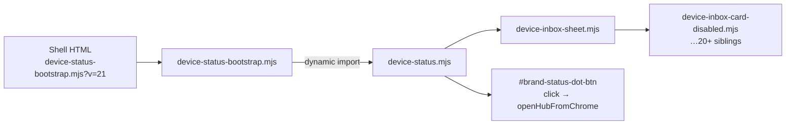

# Status dot: red ring + dead on all pages (postmortem)

**Date:** 2026-05-25 (missing file) · 2026-05-26 (stale `?v=` after new exports) · 2026-05-29 (load-error dot explainer)  
**Status:** Root causes identified; load-error click explainer shipped; prevention plan below (code fix: bump `DEVICE_SHELL_ASSET_VERSION` per § 2026-05-26)  
**Related:** [`STATUS_INDICATOR_STEWARD_GREEN.md`](STATUS_INDICATOR_STEWARD_GREEN.md) · [`DEVICE_INBOX.md`](DEVICE_INBOX.md) · [`AGENTS.md`](../AGENTS.md)

---

## Executive summary

The **red ring** around the status dot is **not** the product’s “unsaved keys” pulsing-red state. It is an **intentional load-failure affordance** added on 2026-05-25: when `device-status.mjs` fails to import, `device-status-bootstrap.mjs` sets `data-device-status-error` on `#top-chrome`, and CSS draws a red **outline** on `#brand-status-dot-btn`. The hub, inbox badge, and normal dot state machine do **not** run — but the dot is **not** a silent dead control: bootstrap wires a minimal click handler that opens a Layer 2 explainer popover (`site/js/device-status-load-error.mjs`) with refresh guidance.

The regression on `main` was caused by **shipping an ES module import without the target file** in the status dot’s dependency graph-not by removing hub behavior or rearchitecting the dot. A follow-up commit added the missing file and extended E2E to guard the import graph.

**Should we rearchitect?** No wholesale rearchitecture is required. The current design (thin bootstrap + fat `device-status.mjs` + Vitest/E2E contracts) is appropriate for the product’s most important control. The failure was **process and graph fragility**, not the hub/inbox UX model. Optional future work: lazy-load non-critical inbox/notification subgraphs so a missing inbox helper cannot brick the dot (see § Prevention plan).

---

## Symptom → mechanism

| User report | Mechanism |
|-------------|-----------|
| Red **ring** (outline) on dot | `#top-chrome[data-device-status-error] .shell-status-dot-btn { outline: 2px solid … }` in `site/css/device-shell.css` |
| Dead on **every** shell page (`/`, `/create/`, `/created/`, `/wallet/`) | Same bootstrap script on all shell HTML; one shared import graph |
| No hub toggle / no `dot_click` in diagnostics | `device-status.mjs` never evaluated; hub opener in `device-status.mjs` never runs |
| Dot tap shows load-error explainer (2026-05-29+) | Bootstrap `wireStatusLoadErrorDot()` — popover `#device-status-load-error-popover` with Now / Why / Next + **Refresh page** |
| Console | `[humanity] Device status module failed to load:` from `device-status-bootstrap.mjs` (technical message; not shown in UI) |
| Network tab | Typically **404** on a static `/js/*.mjs` in the graph (e.g. missing `device-inbox-card-disabled.mjs`) |

**Do not confuse with:**

- **Pulsing/solid red fill** inside the dot - normal custody/network semantics (`pass-dot-status-device-*`).
- **Hub toggle trap** - module loaded; body has `device-hub-sheet-open` while hub is collapsed; first tap closes nothing visible (addressed in `51193b7`, `f177e8d`; no red outline).
- **Wallet** - dot scrolls to saved cards; does not open a hub sheet (by design).

---

## Timeline (2026-05-25, `main`)

Commits are listed **newest first** where noted; causal order for the outage is in the third column.

| Commit | Time (author date) | What changed | Effect on status dot |
|--------|-------------------|--------------|----------------------|
| `5042c4f` | 23:41 | Inbox overlay priority + `device-hub-sheet-core.mjs` reconcile helpers | No load break; continues inbox/dot alignment work |
| `b3be0c7` | 23:36 | Dot overlay `card_disabled_since_visit` | Depends on working inbox graph |
| `6bf98d5` | - | Live-proof **service worker** | Unrelated to dot import; may cache bad assets after a partial deploy (see § Stale deploy/cache) |
| `51193b7` | 23:28 | `hubSheetOpen()` false when hub collapsed | Fixes “dead tap” when module **did** load |
| `1a9809d` | 23:08 | `device-inbox.mjs` imports `device-inbox-card-disabled.mjs` | Safe **after** `3c303c3` (file exists) |
| **`3c303c3`** | **23:05** | **Adds `site/js/device-inbox-card-disabled.mjs`** + E2E graph assert | **Restores** dot after missing-file window |
| `0ae74a6`, `c8fd2e5` | - | Landing scroll / PIN | In broken window; dot still dead |
| **`8ec6a33`** | **22:59** | **`device-inbox-sheet.mjs` imports `./device-inbox-card-disabled.mjs`** (file not in repo) | **Starts outage** - static import 404 |
| `f177e8d` | 22:45 | **`device-status-bootstrap.mjs`**, red error outline, shell pages load bootstrap `?v=21` | Makes failure **visible** (red ring); does not cause load failure |
| `2b5d105` | 22:28 | `device-status.mjs` imports `device-inbox-sheet.mjs` | Any inbox-sheet dependency failure kills **all** dot behavior |
| `77816d1` | (earlier) | `pointer-events` fix for float chrome | Clickability when module **loads** |

### Broken window (causal)

```text
8ec6a33  ──imports──►  device-inbox-card-disabled.mjs  (missing)
     ▲
     │  static import chain
2b5d105  device-status.mjs  ──►  device-inbox-sheet.mjs
f177e8d  bootstrap catches failure  ──►  red ring + dead dot

3c303c3  adds device-inbox-card-disabled.mjs  ──►  graph complete again
```

Approximate duration on `main`: **~6 minutes** between introducing the bad import (`8ec6a33`) and shipping the file (`3c303c3`). Commits `0ae74a6` and `c8fd2e5` landed in that window.

---

## Timeline (2026-05-26, stale module cache)

| Commit | What changed | Effect on status dot |
|--------|--------------|----------------------|
| `7f1282c` | Phase 5: `beginDeviceChromeRefreshTick` / `endDeviceChromeRefreshTick` on `device-inbox.mjs`; `device-chrome-refresh.mjs` imports them at `?v=37` | Browsers with a **cached** pre-`7f1282c` `device-inbox.mjs?v=37` throw missing-export; `device-status.mjs` never finishes; dot dead on all shell pages |
| `11be0b5` | `device-status.mjs` imports `device-dot-state-core.mjs?v=38` while `DEVICE_SHELL_ASSET_VERSION` remains `37` | Incomplete cache generation; worsens mixed-peer caches. Fix is a **full** bump, not a lone `?v=38` on one file |

**Symptom users report:** dot stays fixed at the top while scrolling (CSS `position: fixed` only) but tap does nothing - same mechanism as 2026-05-25 load failure, different trigger (stale peer under unchanged `?v=`).

**Console (typical):** `The requested module './device-inbox.mjs?v=37' does not provide an export named 'beginDeviceChromeRefreshTick'` (or `endDeviceChromeRefreshTick`).

**Fix:** Increment `DEVICE_SHELL_ASSET_VERSION`, align all shell HTML bootstrap tags and every `./device-*.mjs?v=N` import in the status graph, deploy Pages, hard-refresh. Full checklist: [`STATUS_INDICATOR_STEWARD_GREEN.md`](STATUS_INDICATOR_STEWARD_GREEN.md) Fix directions §1b.

---

## Why each change was made (intent, not accident)

1. **Unified device inbox (`2b5d105`, `7590e79`)** - Badge, hub alerts, glance, and dot overlay should share one model (`device-inbox-core.mjs`). `device-status.mjs` imports the inbox sheet so dot explainer actions can call `openInboxFromChrome()`.
2. **Bootstrap + red outline (`f177e8d`)** - Prior failure mode: dot HTML visible, zero behavior, silent console. Bootstrap isolates load errors and surfaces them to QA/users per [`STATUS_INDICATOR_STEWARD_GREEN.md`](STATUS_INDICATOR_STEWARD_GREEN.md) troubleshooting § “module load failure”.
3. **Card-disabled inbox (`8ec6a33`, `1a9809d`, `b3be0c7`)** - Surface resolver-confirmed “disabled since last visit” in sheet, badge, glance, and dot overlay; product doc [`DEVICE_INBOX.md`](DEVICE_INBOX.md).
4. **Missing file (`8ec6a33` without `3c303c3`)** - Implementation mistake: import added in `device-inbox-sheet.mjs` before `device-inbox-card-disabled.mjs` was committed. Not an intentional behavior change.

---

## Architecture today (for context)



**Contract:** One failed **static** import anywhere in the graph prevents the dot from working. That is deliberate tradeoff for a single deploy unit and consistent inbox/dot semantics-not a reason to delete the inbox integration.

---

## If it still fails on `main` after `3c303c3`

Check these in order (module may be fixed in git but not in the environment you are viewing):

1. **Pages deploy lag** - Worker deploy (`npm run worker:deploy`) does **not** ship `site/js/*`. A worker-only deploy leaves Pages on an older commit missing new `.mjs` files.
2. **Stale cache** - Bootstrap cached at `?v=21` while a **new** dependency 404s, or CDN/browser cache of a 404 response. Hard refresh or bump bootstrap query when adding imports (documented in status indicator fix directions).
3. **Service worker (`6bf98d5`)** - After a partial deploy, a SW may serve cached responses; verify Network tab for 404 on any `/js/device-*.mjs`.
4. **Confirm failure mode** - `#top-chrome[data-device-status-error]` present ⇒ load failure (this postmortem). Absent ⇒ use hub/CSS troubleshooting in [`STATUS_INDICATOR_STEWARD_GREEN.md`](STATUS_INDICATOR_STEWARD_GREEN.md).

---

## Prevention plan (do not regress the status dot)

### P0 - Required on every change touching the graph

| Guard | Owner | Action |
|-------|--------|--------|
| **Import graph E2E** | CI | Keep `e2e/device-status-dot.spec.ts` → `shell status modules are reachable` and `status bootstrap loads and records dot_click in diagnostics`. Workflow: `.github/workflows/test-site.yml` on `site/**` / `e2e/**`. |
| **Module list hygiene** | Author | When adding `import "./device-*.mjs"` on the status graph, **add the filename** to `DEVICE_STATUS_SHELL_JS_FILES` in `site/js/device-status-shell-modules.mjs` in the same PR. |
| **File + import same PR** | Author | Never merge an import of a new `./foo.mjs` without `site/js/foo.mjs` in the same commit. |
| **Cache bust** | Author | Bump `DEVICE_SHELL_ASSET_VERSION` in `device-status-shell-modules.mjs`, all shell HTML bootstrap `?v=N`, and **every** `./peer.mjs?v=N` import in the status graph when adding a file, a new static import, or a **new named export** on an existing peer (not only new files). |
| **Deploy pairing** | Release | Ship **Pages (static `site/`)** and verify `/js/device-inbox-card-disabled.mjs` (and siblings) return **200** before announcing inbox/dot changes. Worker-only deploy is insufficient. |

### P1 - Process / review

| Guard | Action |
|-------|--------|
| **PR checklist** | Block merge if PR touches `device-status*.mjs`, `device-inbox*.mjs`, or `device-hub-sheet*.mjs` without `npm run worker:test` and device E2E (see [`AGENTS.md`](../AGENTS.md) status-dot guardrails). |
| **CODEOWNERS** (recommended) | Require review for `site/js/device-status*.mjs`, `device-status-bootstrap.mjs`, `device-dot-state-core.mjs`, `device-inbox*.mjs`, `site/css/device-shell.css` (pointer-events section). |
| **Agent memory** | [`AGENTS.md`](../AGENTS.md) already states bootstrap graph + E2E; link this postmortem for “red ring” reports. |

### P2 - Optional hardening (future engineering, not required to “rearchitect”)

| Idea | Benefit |
|------|---------|
| **Vitest import-graph smoke** | ✅ Shipped: `site/js/device-status-shell-modules.mjs` + `worker/tests/device-status-shell-modules.test.ts`; Playwright uses the same manifest via `deviceStatusShellModulePaths()`. |
| **Lazy inbox sheet import** | ✅ Shipped: `device-inbox-sheet-loader.mjs`; `device-status.mjs` and `device-chrome-refresh.mjs` use dynamic import for the sheet. |
| **Lazy inbox module import (Step 1)** | ✅ Shipped: `device-inbox-loader.mjs`; `device-status.mjs` no longer static-imports `device-inbox.mjs`; badge/overlay use safe fallbacks until preload completes. `device-chrome-refresh.mjs` awaits `loadInboxModule()` for gather ticks. |
| **Split `device-status-core.mjs` (Step 2)** | ✅ Shipped: `device-status-core.mjs` wires dot tap + hub open with lazy `device-hub-sheet.mjs`; `device-status-bootstrap-inner.mjs` loads core before `device-status.mjs` so hub works if the full status graph fails. |
| **Partial load affordance (Step 3)** | ✅ Shipped: when core loads but `device-status.mjs` fails, `#top-chrome[data-device-status-partial]` (amber ring), hub still opens, no load-error coach hijack; total failure still uses `data-device-status-error` + coach card. |

### P3 - Monitoring

| Signal | Meaning |
|--------|---------|
| `data-device-status-error` in Real User Monitoring (if added) | Load failure rate |
| `hc_dot_diag_log` missing `dot_click` after tap (with `hc_dot_diagnostics=1`) | Expected in load-error mode — hub handler not registered; use explainer popover instead |
| CI `test-site.yml` red on `device-status-dot.spec.ts` | Block merge |

---

## What not to do

- **Do not remove the red error outline** without another way to detect total load failure; it replaced silent dead dots.
- **Do not wire glance-first on dot tap** (regression of `77816d1`; hub opener is the contract).
- **Do not “fix” by disabling inbox imports** without restoring badge/dot overlay parity documented in [`DEVICE_INBOX.md`](DEVICE_INBOX.md).
- **Do not treat as steward/red custody semantics** when the outline is present-fix the module graph or deploy first.

---

## Load-error dot explainer (shipped 2026-05-29)

When `import("./device-status.mjs")` fails, inner bootstrap calls `wireStatusLoadErrorDot()` in `site/js/device-status-load-error.mjs`. When **inner bootstrap** fails to load, the thin entry `device-status-bootstrap.mjs` calls the same helper.

| Surface | Behavior |
|---------|----------|
| Entry | `device-status-bootstrap.mjs` — sole static import is `device-status-load-error.mjs` |
| Inner | `device-status-bootstrap-inner.mjs` — build stamp, dynamic `device-status.mjs`, PWA lazy loads |
| Red outline | Unchanged — `#top-chrome[data-device-status-error]` |
| `#brand-status-dot-btn` `aria-label` | “Device controls failed to load. See details below the status dot.” |
| Coach card | `#device-status-load-error-popover` (`.device-status-load-error-coachmark`) **auto-opens** ~500ms after failure; anchored like hub intro coachmark |
| Dot tap | Toggles coach card visibility when dismissed |
| Copy (Layer 2) | **Now:** controls didn’t finish loading · **Why:** download/cache/network · **Next:** refresh / hard refresh |
| Actions | **Refresh page** — `location.reload()` · **Got it** — dismiss card (outline remains) |
| Hub / inbox | Not opened on **total** failure; on **partial** failure (core OK, `device-status.mjs` failed) hub opens, inbox badge/network checks unavailable until refresh |
| Partial failure | `#top-chrome[data-device-status-partial]` — amber outline; dot tap opens hub; no auto coach card |
| Hub intro coachmark | Suppressed when `data-device-status-error` is set (existing guard) |

**Product language:** Outcome copy only in the popover; technical import errors stay in `console.error` for engineers.

**Tests:** `worker/tests/device-status-load-error.test.ts` · `e2e/device-status-dot.spec.ts` — `status load error shows coach card`.

**Gap (shipped 2026-05-29):** `device-status-bootstrap.mjs` is a thin entry that only static-imports `device-status-load-error.mjs` and dynamically imports `device-status-bootstrap-inner.mjs`. Failures in the inner bootstrap graph (e.g. `build-meta-browser.mjs`) now hit the same red ring + explainer path as `device-status.mjs` load failures. See [`HUB_DOT_DEAD_INVESTIGATION_2026-05-27.md`](HUB_DOT_DEAD_INVESTIGATION_2026-05-27.md).

---

## Verification checklist (manual, any environment)

### Healthy graph

1. Load `/` → DevTools → Network: all `/js/device-*.mjs` in graph return **200**.
2. `#top-chrome` must **not** have `data-device-status-error`.
3. `localStorage.setItem('hc_dot_diagnostics','1')`, reload, tap dot → `sessionStorage hc_dot_diag_log` contains `{ "type": "dot_click" }`.
4. On `/`, body gains `device-hub-sheet-open` on first tap (not wallet).

### Simulated load failure

1. Block or 404 `device-status.mjs` only → `#top-chrome[data-device-status-partial]`; amber outline; dot tap **opens hub**; load-error coach card does **not** auto-show.
2. Block or 404 `device-status-core.mjs` or `device-status-bootstrap-inner.mjs` → `#top-chrome[data-device-status-error]`; red outline; coach card auto-shows.
3. Without tapping the dot on total failure, `#device-status-load-error-popover` becomes visible with Now / Why / Next copy.
4. **Refresh page** reloads the tab; **Got it** dismisses the card; hub does not open on dot tap in **total** error state.

---

## References

- Red outline CSS: `site/css/device-shell.css` (`#top-chrome[data-device-status-error]`)
- Bootstrap entry: `site/js/device-status-bootstrap.mjs`
- Bootstrap inner: `site/js/device-status-bootstrap-inner.mjs`
- Load-error explainer: `site/js/device-status-load-error.mjs`
- Module manifest: `site/js/device-status-shell-modules.mjs` (E2E + Vitest)
- Fix commit for missing file: `3c303c3` - *Ship missing inbox card-disabled module to restore status dot*
- Introduced bad import: `8ec6a33` - *Add inbox diagnostics for device inbox phase 7*
