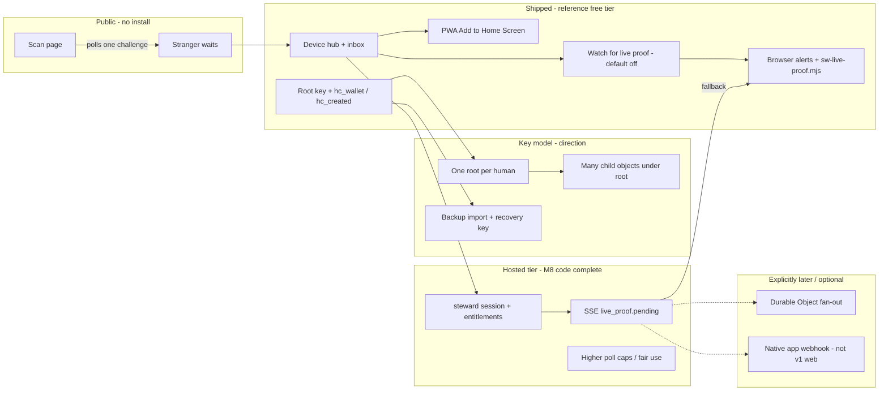

# Steward device roadmap (index)

**Status:** Living index — links canonical specs; does not define new product policy  
**Audience:** Product, engineering, support, onboarding  
**Opened:** 2026-05-28

Use this page when you need **one map** of steward-facing device work. Detailed rules stay in the linked docs; update those first, then adjust status rows here if the summary drifts.

---

## Current engineering steps (ordered)

| # | Step | Owner | Doc / command |
|---|------|-------|----------------|
| **1** | **Steward session link (client)** — sign `steward_account_link_v1`, `POST …/steward/session`, store `hc_steward_session`; checkout return `?hc_account_id=acc_…` | **Shipped** in repo | `site/js/device-steward-session*.mjs` · [`HOSTED_TIER_TECHNICAL_STANDARDS_DELTA.md`](HOSTED_TIER_TECHNICAL_STANDARDS_DELTA.md) |
| **2** | **Production rollout** — D1 migrations → deploy flag off → secrets → flag on → regression | Ops / eng with Cloudflare auth | [`HOSTED_TIER_IMPLEMENTATION_EPICS.md`](HOSTED_TIER_IMPLEMENTATION_EPICS.md) § Production rollout · [`HOSTED_TIER_G0_READINESS.md`](HOSTED_TIER_G0_READINESS.md) |
| **3** | **Verify hosted path** — entitlements probe, steward session link core, SSE push (watch + Browser alerts on), poll cap 4000 | QA | `npm run verify:hosted-g0` (incl. `device-steward-session-core.test.ts`) · `npm run e2e:steward-hosted` |
| **4** | **Billing checkout → `hc_account_id` URL** (Stripe return) | Product + E5 | [`HOSTED_TIER_IMPLEMENTATION_EPICS.md`](HOSTED_TIER_IMPLEMENTATION_EPICS.md) § E5.6 (minimal v1) |
| **5** | **Child object UI** under one root (beyond `print_artifact` bridge) | Product | [`ROOT_CARD_AND_CHILD_OBJECTS.md`](ROOT_CARD_AND_CHILD_OBJECTS.md) |
| **6** | **M5.5 key import** on new device | Product | [`M5_5_OWNER_KEY_PORTABILITY.md`](M5_5_OWNER_KEY_PORTABILITY.md) |

**Free tier unchanged:** no session, no SSE, 400 auto-poll/day — steps 2–3 must not regress H1–H6 ([`DEVICE_OS_REQUEST_BUDGET.md`](DEVICE_OS_REQUEST_BUDGET.md) § Phase 10).

---

## Product sentence

> **Strangers stay in the browser with no install.** **Stewards** use a **browser device shell** (hub + inbox + optional home-screen icon) with **keys on device**, **intent-based polling**, and **opt-in OS alerts for live proof only** — upgraded on the hosted tier by **server push**, not by replacing the web shell with an app store app.

---

## Three layers (do not conflate)

| Layer | User question | Canonical doc |
|-------|---------------|---------------|
| **Custody & keys** | Where are my signing keys? One root vs many objects? Multi-device? | [`KEYS_CARDS_AND_VERIFICATION.md`](KEYS_CARDS_AND_VERIFICATION.md) · [`ROOT_CARD_AND_CHILD_OBJECTS.md`](ROOT_CARD_AND_CHILD_OBJECTS.md) · [`M5_5_OWNER_KEY_PORTABILITY.md`](M5_5_OWNER_KEY_PORTABILITY.md) |
| **In-app chrome** | What should I do on this device right now? | [`DEVICE_INBOX.md`](DEVICE_INBOX.md) · [`KEYS_CUSTODY_AND_NOTIFICATION_IMPROVEMENT_PLAN.md`](KEYS_CUSTODY_AND_NOTIFICATION_IMPROVEMENT_PLAN.md) · [`STATUS_INDICATOR_STEWARD_GREEN.md`](STATUS_INDICATOR_STEWARD_GREEN.md) |
| **Network work & cost** | When does this device hit the resolver? Who pays? | [`DEVICE_OS_REQUEST_BUDGET.md`](DEVICE_OS_REQUEST_BUDGET.md) · [`DEVICE_OS.md`](DEVICE_OS.md) |

**North star (polling):** *The stranger’s browser pays for urgency. The steward’s browser pays for intent.* — full table in [`DEVICE_OS_REQUEST_BUDGET.md`](DEVICE_OS_REQUEST_BUDGET.md) § North star.

---

## Notification & delivery stack (steward)

Three **channels** answer different questions — do not merge them ([`DEVICE_INBOX.md`](DEVICE_INBOX.md) § North star).

| Channel | When | Live proof? | OS push? |
|---------|------|-------------|----------|
| **Status dot** | Always (shell) | Overlay when pending | No |
| **Inbox badge / hub rows / sheet** | Tab visible | Yes | No |
| **Browser alerts** (`hc_browser_notif`) | Tab **hidden** + permission | **Only** `live_proof` | Yes (opt-in) |

**In-app only (never OS):** cross-tab keys, unsaved tab keys, card-disabled-since-visit — [`DEVICE_INBOX.md`](DEVICE_INBOX.md) § v2 Phase C policy matrix · [`KEYS_CUSTODY_AND_NOTIFICATION_IMPROVEMENT_PLAN.md`](KEYS_CUSTODY_AND_NOTIFICATION_IMPROVEMENT_PLAN.md).

**Homepage toggle copy:** “On · live proof in background” = Browser alerts enabled for that narrow case (`site/js/device-browser-notifications.mjs`).

---

## Timeline (custody + delivery)

---

## What is **not** on this roadmap

| Misread | Actual policy |
|---------|----------------|
| “We’re building an App Store app to replace the site” | **No.** Stewards may use **PWA** (same keys/inbox). Native clients are **hosted-tier future**, out of v1 web scope. |
| “Browser alerts will be removed when push ships” | **No.** Push **reduces wallet round-robin**; tab + **SW stay fallback** ([`HOSTED_TIER_PUSH_ARCHITECTURE_RFC.md`](HOSTED_TIER_PUSH_ARCHITECTURE_RFC.md)). |
| “Saving many cards turns on monitoring” | **No.** Watch and Browser alerts are **opt-in** ([`DEVICE_OS_REQUEST_BUDGET.md`](DEVICE_OS_REQUEST_BUDGET.md) § Operating modes). |
| “PWA install registers a shell service worker” | **No** for Phases 1–3 ([`PWA_INSTALL.md`](PWA_INSTALL.md)). **`/sw-live-proof.mjs`** is a **separate**, narrow SW for live proof only. |
| “Cross-tab keys should OS-notify me” | **Never** — inbox/chrome only ([`CROSS_TAB_KEYS_NOTIFICATION_SYSTEM.md`](CROSS_TAB_KEYS_NOTIFICATION_SYSTEM.md)). |

---

## Shipped vs planned (summary)

| Area | Shipped (reference / free) | Next / hosted | Canonical detail |
|------|----------------------------|---------------|------------------|
| **Key model** | Root + `print_artifact` child bridge; wallet scale guardrails | One root → many child objects (product direction) | [`ROOT_CARD_AND_CHILD_OBJECTS.md`](ROOT_CARD_AND_CHILD_OBJECTS.md) |
| **Portability** | Owner revoke path; backup/recovery docs | M5.5 import on new device | [`M5_5_OWNER_KEY_PORTABILITY.md`](M5_5_OWNER_KEY_PORTABILITY.md) |
| **Inbox + custody panel** | Phases 1–14 inbox; custody plan 1–7 | Per-card watch flags (catalog L9+) | [`DEVICE_INBOX.md`](DEVICE_INBOX.md) · [`KEYS_CUSTODY_AND_NOTIFICATION_IMPROVEMENT_PLAN.md`](KEYS_CUSTODY_AND_NOTIFICATION_IMPROVEMENT_PLAN.md) |
| **Browser alerts** | v2 A–D + `sw-live-proof.mjs` | Same UX; less polling when SSE healthy | [`DEVICE_INBOX.md`](DEVICE_INBOX.md) § Background alerts roadmap |
| **Poll budget** | Phases 1–9 + 8c; 400 auto GET/day; leader tab | Entitlement-driven cap; push miss → poll | [`DEVICE_OS_REQUEST_BUDGET.md`](DEVICE_OS_REQUEST_BUDGET.md) § Optimization catalog **L12–L15**, **B1–B3** |
| **PWA install** | Contract + Phases 1–3 per backlog | No shell-caching SW without RFC | [`PWA_INSTALL.md`](PWA_INSTALL.md) · backlog **H-006** |
| **Hosted steward tier** | M8 code + **client session link** (checkout `?hc_account_id=`) | Production rollout + Stripe return URL | [`HOSTED_TIER_IMPLEMENTATION_EPICS.md`](HOSTED_TIER_IMPLEMENTATION_EPICS.md) |
| **Server push** | — | SSE P1; DO P2; SW fallback | [`HOSTED_TIER_PUSH_ARCHITECTURE_RFC.md`](HOSTED_TIER_PUSH_ARCHITECTURE_RFC.md) |
| **Native mobile app** | — | Planning only (webhook path C) | [`PAID_TIER_AND_HOSTED_OPERATOR_PLAN.md`](PAID_TIER_AND_HOSTED_OPERATOR_PLAN.md) § Server push options |

---

## Hosted steward tier milestones (M1–M8)

Product boundaries and build order — **do not re-spec here**.

| Step | Deliverable | Doc |
|------|-------------|-----|
| M1 | Product + boundaries (free vs paid) | [`PAID_TIER_AND_HOSTED_OPERATOR_PLAN.md`](PAID_TIER_AND_HOSTED_OPERATOR_PLAN.md) |
| M2 | Entitlements & metering | [`HOSTED_TIER_ENTITLEMENTS_AND_METERING.md`](HOSTED_TIER_ENTITLEMENTS_AND_METERING.md) |
| M3 | Push architecture | [`HOSTED_TIER_PUSH_ARCHITECTURE_RFC.md`](HOSTED_TIER_PUSH_ARCHITECTURE_RFC.md) |
| M4 | Pricing & SLA | [`HOSTED_TIER_PRICING_AND_SLA.md`](HOSTED_TIER_PRICING_AND_SLA.md) |
| M5 | Public copy / skeptic FAQ | [`SKEPTIC_FAQ.md`](SKEPTIC_FAQ.md) · [`LAUNCH_LANGUAGE_KIT.md`](LAUNCH_LANGUAGE_KIT.md) |
| M6 | Standards delta | [`HOSTED_TIER_TECHNICAL_STANDARDS_DELTA.md`](HOSTED_TIER_TECHNICAL_STANDARDS_DELTA.md) |
| M7 | Budget test plan (Phase 10 rows) | [`DEVICE_OS_REQUEST_BUDGET.md`](DEVICE_OS_REQUEST_BUDGET.md) § Phase 10 |
| M8 | Implementation epics E1–E6 | [`HOSTED_TIER_IMPLEMENTATION_EPICS.md`](HOSTED_TIER_IMPLEMENTATION_EPICS.md) |

**Ops after deploy:** [`HOSTED_STEWARD_OPS_RUNBOOK.md`](HOSTED_STEWARD_OPS_RUNBOOK.md) · [`HOSTED_STEWARD_CF_DASHBOARD.md`](HOSTED_STEWARD_CF_DASHBOARD.md).

---

## Background alerts evolution (live proof only)

| Phase | What | Status | Detail |
|-------|------|--------|--------|
| v1 | Tab hidden → page `Notification` | Shipped | [`DEVICE_INBOX.md`](DEVICE_INBOX.md) § v1 |
| v2 A | Contextual opt-in strip | Shipped | Hub / wallet / inbox footer |
| v2 B | Card label + sign deep link | Shipped | `/created/` not `/wallet/` |
| v2 C | Policy matrix (`live_proof` only) | Shipped | `device-browser-notifications-core.mjs` |
| v2 D | `sw-live-proof.mjs` + 15 min periodic | Shipped | [`DEVICE_OS_REQUEST_BUDGET.md`](DEVICE_OS_REQUEST_BUDGET.md) Phase 4 |
| **E4 / M3** | SSE `live_proof.pending` → inbox + optional OS | M8 code complete; production gated | [`HOSTED_TIER_PUSH_ARCHITECTURE_RFC.md`](HOSTED_TIER_PUSH_ARCHITECTURE_RFC.md) |
| Future | Web Push / native relay | Reserved | RFC § `web_push_subscription`; paid plan option C |

---

## Doc map (by question)

| I need to… | Read |
|------------|------|
| Place a new steward UI feature | [`DEVICE_OS.md`](DEVICE_OS.md) § Placement rule |
| Understand Browser alerts vs inbox vs dot | [`DEVICE_INBOX.md`](DEVICE_INBOX.md) · this doc § Notification stack |
| Tune polling / Worker cost | [`DEVICE_OS_REQUEST_BUDGET.md`](DEVICE_OS_REQUEST_BUDGET.md) |
| Explain keys vs cards vs verification | [`KEYS_CARDS_AND_VERIFICATION.md`](KEYS_CARDS_AND_VERIFICATION.md) |
| Explain root vs child objects | [`ROOT_CARD_AND_CHILD_OBJECTS.md`](ROOT_CARD_AND_CHILD_OBJECTS.md) |
| Ship or review PWA install | [`PWA_INSTALL.md`](PWA_INSTALL.md) |
| Implement hosted push | [`HOSTED_TIER_PUSH_ARCHITECTURE_RFC.md`](HOSTED_TIER_PUSH_ARCHITECTURE_RFC.md) · [`HOSTED_TIER_IMPLEMENTATION_EPICS.md`](HOSTED_TIER_IMPLEMENTATION_EPICS.md) § E4 |
| Link billing account to device session | `device-steward-session.mjs` · `?hc_account_id=acc_…` after checkout |
| QA steward flows | [`DEVICE_OS_QA.md`](DEVICE_OS_QA.md) — P2 live proof, P3 background alerts, PWA |

---

## Maintenance

When you change steward delivery or key policy:

1. Edit the **canonical** doc (inbox, budget, hosted RFC, keys doc).
2. If the **shipped vs planned** table or timeline changes, update this index in the same PR.
3. Do not duplicate long policy prose here — link only.
