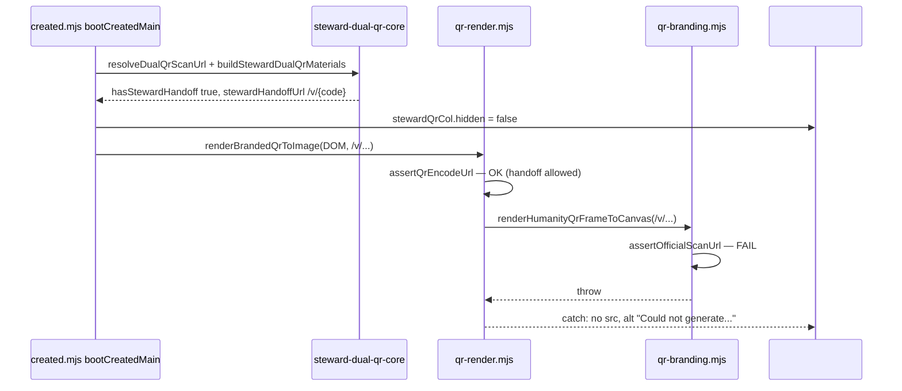

# Investigation: Steward handoff QR not displaying on `/created/`

**Date:** 2026-05-30  
**Status:** **Closed** — RC-1 fixed · P1 cache bump · P2 RC-2 discovery · P2 E2E · **`npm run steward-scan-handoff:verify`**  
**Reporter:** Steward on iPhone PWA after S7 dual-QR + follow-up commit `8c2bde89`  
**Related:** [`STEWARD_SCAN_HANDOFF_AND_PWA_VOUCH.md`](STEWARD_SCAN_HANDOFF_AND_PWA_VOUCH.md) § S7 · [`PWA_CREATED_RESOLVER_UNREACHABLE_INVESTIGATION.md`](PWA_CREATED_RESOLVER_UNREACHABLE_INVESTIGATION.md) · [`CARD_WORKSPACE_UX.md`](CARD_WORKSPACE_UX.md)

---

## Executive summary

**Resolution (2026-05-30):** Steward handoff QR now renders on `/created/` when dual-QR materials are available. Root cause **RC-1** was a split encode guard between `qr-render.mjs` and `qr-branding.mjs`; fixed via shared `qr-encode-url-core.mjs`. **RC-2** discovery copy cross-links Print & share → Full-size QR. Engineering gate: `npm run steward-scan-handoff:verify`.

**Original failure (RC-1):** The steward handoff QR **did not render** in the browser when S7 dual-QR logic ran correctly, due to a **split guard** in the QR encoder:

| Layer | File | `/v/{code}` handoff URL |
|-------|------|-------------------------|
| Entry guard | `qr-render.mjs` → `assertQrEncodeUrl()` | **Allowed** via `isAllowedStewardHandoffEncodeUrl()` |
| Canvas render | `qr-branding.mjs` → `renderHumanityQrFrameToCanvas()` | **Rejected** — unconditional `assertOfficialScanUrl(text)` *(fixed — shared `qr-encode-url-core.mjs`)* |

Public scan URLs (`/c/{profile_id}?q=…`) pass both layers and render. Handoff URLs pass the first guard then **throw inside the frame renderer**, so `#qr-img-steward` stays empty (or shows alt text *“Could not generate steward handoff QR”* after `8c2bde89`).

This is **not** explained by resolver reachability, PWA wallet split, or the hub “Can't reach resolver” line — QR generation is **local canvas** work.

Commit `8c2bde89` (scan URL normalization + setup preview markup) **does not fix RC-1**; it only helps when `hasStewardHandoff` was false due to non-canonical `scan_url` strings.

---

## Expected product surfaces (S7)

| Surface | Steward handoff QR? | Notes |
|---------|---------------------|--------|
| Live tab → **Full-size QR** (`#created-deploy-full-qr`) | **Yes** — `#created-steward-qr-col`, `#qr-img-steward` | Collapsed `<details>` by default; subtitle says “Public + steward QRs…” |
| Live tab → **Print & share QR** | **No** | Public download only; no steward column in markup |
| Live tab → **Download QR image** | **No** (public only) | “View full-size QR” scrolls to Full-size QR |
| Setup wizard → **Get your QR** | **Yes** (after `8c2bde89`) | `#created-setup-steward-qr-preview` — E2E: `e2e:steward-dual-qr` · `#setup-qr` |
| Live object card hero QR (`#created-live-qr-img`) | **No** | Public scan only by design |

Returning stewards (**Open workspace** / **Open controls**) land in **control** mode on the **Live** tab ([`CARD_WORKSPACE_UX.md`](CARD_WORKSPACE_UX.md) P0-4) — not setup step 2. They must expand **Full-size QR** to see steward materials; **Print & share QR** will never show steward handoff.

---

## Root-cause catalog

### RC-1 — Split QR encode guard (primary) — **Confirmed**

| Field | Detail |
|-------|--------|
| **Layer** | `site/js/qr-render.mjs` + `site/js/qr-branding.mjs` |
| **Mechanism** | S7 added `isAllowedStewardHandoffEncodeUrl` to `assertQrEncodeUrl` in `qr-render.mjs`, but `renderHumanityQrFrameToCanvas` still calls `assertOfficialScanUrl(text)` unconditionally (`qr-branding.mjs` ~633–635) |
| **Repro (Node)** | `qrToDataUrl(handoffUrl)` throws: `Official scan URL required: Scan URL path must be /c/{profile_id} with ?q={qr_id}` |
| **Browser effect** | `syncStewardDualQrMaterials` may set `#created-steward-qr-col hidden=false`, then `renderBrandedQrToImage` fails; catch sets empty `src` + alt *“Could not generate steward handoff QR”* |
| **Why tests missed** | `worker/tests/qr-render-contract.test.ts` greps source for `isAllowedStewardHandoffEncodeUrl` only; `worker/tests/steward-dual-qr-core.test.ts` tests URL builders, not canvas render |

**Fix shipped:** Shared `assertQrEncodeUrl` in `qr-encode-url-core.mjs`; Vitest + E2E in `qr-encode-url-core.test.ts` and `e2e/steward-dual-qr-created.spec.ts`.

---

### RC-2 — UX / discovery (contributing) — **Confirmed**

| Field | Detail |
|-------|--------|
| **Layer** | Product layout |
| **Mechanism** | Steward QR only under collapsed **Full-size QR**; **Print & share QR** is the more visible “print” affordance but has no steward column |
| **User report pattern** | “Print page” / “created card page” without opening **Full-size QR** |
| **Regression link** | `b80322e7` — returning stewards skip setup Print step; Live card shows public QR only ([`PWA_CREATED_RESOLVER_UNREACHABLE_INVESTIGATION.md`](PWA_CREATED_RESOLVER_UNREACHABLE_INVESTIGATION.md) RC-2) |

**Recommended fix (product):** Cross-link Print & share → Full-size QR; or surface steward preview on Live card / Print disclosure once RC-1 is fixed.

---

### RC-3 — `hasStewardHandoff` false (secondary, partially addressed) — **Mitigated in `8c2bde89`**

| Field | Detail |
|-------|--------|
| **Layer** | `steward-handoff-code-core.mjs` + session `scan_url` |
| **Mechanism** | `parseStewardHandoffScanParts` requires `validateOfficialScanUrl` — extra query params (`&hc_ref=`, `&hc_steward=1`) or missing `?q=` → `hasStewardHandoff: false` → `#created-steward-qr-col` stays `hidden` |
| **Fix shipped** | `resolveDualQrScanUrl()` rebuilds from `profile_id` + `qr_id` when stored URL is non-canonical |
| **Still fails when** | RC-1 — even with `hasStewardHandoff: true`, image does not render |

---

### RC-4 — PWA / deploy cache (possible, secondary)

| Field | Detail |
|-------|--------|
| **Layer** | Pages asset cache |
| **Mechanism** | `site/created/index.html` loads `created.mjs?v=68`; S7 (`2bdac7de`) and fix (`8c2bde89`) did **not** bump `?v=` on `created.mjs` |
| **Effect** | Installed PWA may run pre-S7 JS (no dual-QR at all) until hard refresh / stale-shell nudge |
| **Verify** | Hub debug (`hc_debug=1`) → site build stamp; or check `#created-steward-qr-col` exists in DOM |

---

### RC-5 — View mode / signing-only chrome — **Ruled out for Full-size QR**

`#created-deploy-full-qr` does **not** carry `data-created-signing-only`. View-only `/created/` can expand Full-size QR; steward column visibility still depends on RC-1 / RC-3.

---

## Code path (control mode boot)



Public QR path stops failing at `assertOfficialScanUrl` inside `renderHumanityQrFrameToCanvas`.

---

## What the steward should see today (when RC-1 hits)

1. Open **Full-size QR** on Live tab.
2. **Public scan** column: QR image renders.
3. **Steward handoff** column: label + hint visible; **image box empty** or broken; optional mono handoff URL line visible (`8c2bde89+`).
4. **Copy steward handoff link** / **Download steward QR** may appear enabled but download will fail the same encode guard.

Console (Safari Web Inspector → PWA): error matching RC-1 throw from `qr-branding.mjs`.

---

## Verification checklist (human / agent)

Run on the **same PWA** where the report occurred.

| Step | Pass criterion |
|------|----------------|
| 1 | DOM contains `#created-steward-qr-col` and `#qr-img-steward` (proves S7 HTML deployed) |
| 2 | Expand **Full-size QR** (not only **Print & share QR**) |
| 3 | `#created-steward-qr-col` has `hidden` attribute **absent** when `activeScanUrl` is valid |
| 4 | `#qr-img-steward` has **no** `src` or alt contains “Could not generate” → **RC-1** |
| 5 | `#qr-img` (public) **has** `src` → rules out total QR pipeline failure |
| 6 | Optional: paste `#steward-handoff-url` text in mobile Safari — `/v/{code}` interstitial should load (S6 Worker route) |
| 7 | Web Inspector console on steward render — expect `Official scan URL required` in message |

**Desk repro (Node 20):**

```bash
node --input-type=module -e "
import { qrToDataUrl } from './site/js/qr-render.mjs';
import { buildOfficialScanUrl } from './site/js/qr-scan-url-lock.mjs';
import { buildStewardDualQrMaterials } from './site/js/steward-dual-qr-core.mjs';
const scan = buildOfficialScanUrl('7Xk9mP2nQ4rT6vW8yZ1aB3cD5', 'qr_7Xk9mP2nQ4rT6vW8');
const h = buildStewardDualQrMaterials(scan).stewardHandoffUrl;
await qrToDataUrl(h);
"
```

Expected today: **throws** (RC-1). After fix: exits 0 with data URL length logged.

---

## Test gaps

| Test | Current | Needed |
|------|---------|--------|
| `steward-dual-qr-core.test.ts` | URL material builders | Keep |
| `qr-render-contract.test.ts` | Source grep for handoff guard | **Shipped** — integration in `qr-encode-url-core.test.ts` |
| E2E | **`e2e/steward-dual-qr-created.spec.ts`** | Control Full-size QR + setup `#setup-qr` steward `img[src]` |

---

## Fix backlog (engineering)

| Priority | Item | Status |
|----------|------|--------|
| **P0** | Unify encode guard in `renderHumanityQrFrameToCanvas` (RC-1) | **Shipped** — `qr-encode-url-core.mjs` |
| **P0** | Vitest render handoff URL end-to-end | **Shipped** — `worker/tests/qr-encode-url-core.test.ts` (guard + credential code) |
| **P1** | Bump `created.mjs?v=` (and shell stamp if policy requires) on fix deploy | **Shipped** — `v=70` |
| **P2** | Print & share → Full-size QR discovery copy (RC-2) | **Shipped** — `#created-print-steward-discovery` + CTA |
| **P2** | E2E steward `img[src]` on Full-size QR | **Shipped** — `npm run e2e:steward-dual-qr` |
| **Close-out** | Engineering verify gate | **Shipped** — `npm run steward-scan-handoff:verify` |

---

## Agent handoff log

| Date | Event |
|------|--------|
| 2026-05-30 | S7 shipped (`2bdac7de`) — dual-QR UI + `qr-render` entry guard |
| 2026-05-30 | Follow-up (`8c2bde89`) — `resolveDualQrScanUrl`, setup steward preview; **RC-1 still open** |
| 2026-05-30 | **RC-1 fixed** — shared `qr-encode-url-core.mjs`; `renderHumanityQrFrameToCanvas` uses same guard as `qr-render.mjs` |
| 2026-05-30 | **Post-close E2E** — setup wizard `#setup-qr` steward preview in `e2e/steward-dual-qr-created.spec.ts` |
| 2026-05-30 | **Investigation closed** — `steward-scan-handoff:verify` exit gate |
| 2026-05-30 | **P2 E2E shipped** — `e2e/steward-dual-qr-created.spec.ts` steward `img[src]` + Print & share CTA |
| 2026-05-30 | **P2 RC-2 shipped** — Print & share cross-link to Full-size QR steward materials |
| 2026-05-30 | **P1 shipped** — `created.mjs?v=70` cache bust after RC-1 deploy |
| 2026-05-30 | Investigation opened — RC-1 confirmed via Node repro; doc authored |

---

## References

- S7 spec: [`STEWARD_SCAN_HANDOFF_AND_PWA_VOUCH.md`](STEWARD_SCAN_HANDOFF_AND_PWA_VOUCH.md) § S7  
- Encode guard: `site/js/qr-render.mjs` (`assertQrEncodeUrl`)  
- Frame render: `site/js/qr-branding.mjs` (`renderHumanityQrFrameToCanvas`)  
- Dual-QR wiring: `site/js/created.mjs` (`syncStewardDualQrMaterials`)  
- Live QR / arrive pipeline: [`PWA_CREATED_RESOLVER_UNREACHABLE_INVESTIGATION.md`](PWA_CREATED_RESOLVER_UNREACHABLE_INVESTIGATION.md)
