# Steward scan handoff — camera, Safari, PWA, and vouch

**Status:** Active — **S1 shipped** · **S2 shipped** · **S3 shipped** · **S4 shipped** · **S5 shipped** · **S6 shipped** (short handoff URL)  
**Date:** 2026-05-30  
**Audience:** Product, design, engineering, QA  
**Related:** [`PWA_STANDALONE_EXTERNAL_NAVIGATION.md`](PWA_STANDALONE_EXTERNAL_NAVIGATION.md) · [`PWA_INSTALL.md`](PWA_INSTALL.md) · [`V1_DECISION_LOCK.md`](V1_DECISION_LOCK.md) (HTTPS print QR) · [`KEYS_CARDS_AND_VERIFICATION.md`](KEYS_CARDS_AND_VERIFICATION.md) · [`OWNERSHIP_RESTORE_UX_PLAN.md`](OWNERSHIP_RESTORE_UX_PLAN.md) · [`KEY_LOSS_SAD_PATH_MATRIX.md`](KEY_LOSS_SAD_PATH_MATRIX.md)

---

## Problem

Stewards who keep their card in the **Home Screen PWA** cannot vouch when they scan a printed QR with the **iPhone Camera app**, because:

1. **Printed QRs must encode HTTPS** (`https://humanity.llc/c/{profile_id}?q={qr_id}`) so any stranger’s camera works without installing anything ([`V1_DECISION_LOCK.md`](V1_DECISION_LOCK.md)).
2. **iOS Camera opens Safari** for `https://` links — not the Home Screen PWA.
3. **On iPhone, Safari and the PWA are separate storage buckets** — wallet rows and tab keys in the PWA are invisible in Safari ([`PWA_INSTALL.md`](PWA_INSTALL.md) § iOS storage).
4. **Vouch requires signing keys in the same browsing context** as the scan page ([`site/js/vouch-issue.mjs`](../site/js/vouch-issue.mjs)).

**User-visible failure:** Camera → Safari scan page → “Attest as…” → no keys → cannot vouch, card appears “lost.”

This is distinct from **P1 shipped** steward scan preview (PWA → scan same-tab via [`pwa-scan-handoff-core.mjs`](../site/js/pwa-scan-handoff-core.mjs)). That fixes stewards **leaving** the PWA; it does not fix **Camera entering Safari**.

---

## Platform constraints (hard limits)

| Idea | Web-only PWA on iOS |
|------|---------------------|
| Camera QR opens Home Screen app automatically | ❌ Not possible |
| Universal Links to PWA without native app | ❌ Requires native app + Associated Domains |
| Safari ↔ PWA shared `localStorage` / `sessionStorage` | ❌ Separate buckets on iPhone |
| Server-side key handoff for vouch | ❌ Off-limits — keys stay on device |

**Not impossible:** Reliable vouch-from-print for PWA stewards via **in-app scanning** and **explicit handoff** flows.

---

## Solution roadmap (priority order)

| Phase | Name | Status | Steward outcome |
|-------|------|--------|-----------------|
| **S1** | Clipboard handoff | **Shipped** | Camera → Safari → copy link → PWA hub **Open scan link** → vouch |
| **S2** | Hub recovery import | **Shipped** | Move card Safari ↔ PWA with recovery code + scan link (no file) |
| **S3** | In-app QR scanner | **Shipped** | Open PWA → **Scan QR to vouch** → same-tab scan + keys |
| **S4** | Product guidance | **Shipped** | Hub Restore & scan label + iPhone vouch guidance; PWA install + setup copy |
| **S5** | Scan-page steward param | **Shipped** | `?hc_steward=1` → handoff UI first on Safari |
| **S6** | Short handoff URL | **Shipped** | `humanity.llc/v/{code}` interstitial for camera landings |
| **S7** | Dual-QR print materials | Planned | Public QR + steward handoff QR on internal collateral |
| **S8** | Native app / Universal Links | Future | Camera opens app when installed |

### S1 — Clipboard handoff (shipped)

**Safari scan page** (iOS, empty wallet): vouch explainer + **Copy scan link** ([`scan-pwa-camera-handoff-core.mjs`](../site/js/scan-pwa-camera-handoff-core.mjs), [`vouch-issue.mjs`](../site/js/vouch-issue.mjs)).

**PWA hub** (always visible restore group): **Open scan link** — paste or clipboard → same-tab navigate ([`device-hub-open-scan.mjs`](../site/js/device-hub-open-scan.mjs)).

**Flow:** Copy link in Safari → switch to Home Screen app → status dot → Backup → Open scan link → paste → Open in this app → attest.

### S2 — Hub recovery import (shipped)

**Hub:** Import recovery code + scan link / profile ID ([`device-hub-import-recovery.mjs`](../site/js/device-hub-import-recovery.mjs)).

Primary cross-context path when steward saved recovery code but not encrypted backup file.

### S3 — In-app QR scanner (shipped)

**Hub:** **Scan QR to vouch** — `getUserMedia` + `BarcodeDetector` → validate official scan URL → `location.assign` in PWA.

Steward never leaves PWA; printed QR scanned from inside app. Modules: `device-hub-qr-scanner-core.mjs`, `device-hub-qr-scanner.mjs`.

**Fallback when camera API unavailable:** link to **Open scan link** (S1).

### S4 — Product guidance (shipped)

| Audience | Guidance |
|----------|----------|
| PWA-only stewards who vouch from prints | Use **Scan QR to vouch** (S3) or S1 handoff — not Camera app alone |
| Camera-first stewards | Keep card in **Safari** or import into Safari before vouching |
| After Add to Home Screen on iPhone | Manage cards **only** from that icon ([`device-ownership-copy-core.mjs`](../site/js/device-ownership-copy-core.mjs)) |

**UI surfaces:** Hub subgroup **Restore & scan** with iPhone emphasis card ([`device-hub-steward-vouch-guidance.mjs`](../site/js/device-hub-steward-vouch-guidance.mjs)); PWA install iOS detail (`PWA_INSTALL_IOS_DETAIL`); setup Done iPhone tip (`SETUP_DONE_IOS_HOME_SCREEN_DETAIL`).

Manual QA: **P1-PWA-V** in [`DEVICE_OS_QA.md`](DEVICE_OS_QA.md).

### S5 — Steward query param (shipped)

Scan URL may include `hc_steward=1` (or `true`) so Safari landings show handoff-first UI before the L3 actor band and stranger trust chrome. Does not auto-open PWA; orients stewards immediately.

**Behavior:**

- iOS Safari + `hc_steward=1` + no tab keys → PWA handoff explainer even when `hc_wallet` has rows (PWA-only custody).
- **Copy scan link** always appends `hc_steward=1` when missing.
- Steward workspace links opened in a **browser tab** (non-standalone) get `hc_steward=1` via `buildStewardScanPreviewHref`.
- Actor band reveal is skipped while handoff applies; vouch section scrolls into view.

Modules: [`scan-pwa-camera-handoff-core.mjs`](../site/js/scan-pwa-camera-handoff-core.mjs), [`vouch-issue.mjs`](../site/js/vouch-issue.mjs), [`scan-actor-band.mjs`](../site/js/scan-actor-band.mjs).

### S6 — Short handoff URL (shipped)

`GET /v/{code}` decodes a compact scan reference and shows a branded interstitial before the full scan page. Camera landings on steward collateral can use shorter URLs than full `/c/…?q=…` links.

**Behavior:**

- `{code}` is base64url-encoded `{profile_id}:{qr_id}` ([`steward-handoff-code-core.mjs`](../site/js/steward-handoff-code-core.mjs)).
- Interstitial copy + **Copy scan link** (full URL with `hc_steward=1`) + **Continue to scan page**.
- Optional `?go=1` redirects immediately to the steward scan URL.
- Build short links with `buildStewardHandoffShortUrl(scanUrl, origin)`.

Modules: [`steward-handoff.ts`](../worker/src/resolver/steward-handoff.ts), [`steward-handoff-html.ts`](../worker/src/resolver/steward-handoff-html.ts).

### S7 — Dual-QR materials (planned)

| QR | Audience | Payload |
|----|----------|---------|
| Public | Strangers | `https://humanity.llc/c/…?q=…` (unchanged) |
| Steward (optional on internal print) | Stewards at events | Handoff or in-app deep link |

Public print contract unchanged ([`MERCH_QR_LIFECYCLE_POLICY.md`](MERCH_QR_LIFECYCLE_POLICY.md)).

### S8 — Native shell (future)

Capacitor / Swift wrapper + Associated Domains so `humanity.llc/c/…` opens native app when installed. Only path to **camera → app with keys** without handoff.

---

## Architecture (target steady state)

```mermaid
flowchart TB
  subgraph strangers [Strangers — unchanged]
    Cam1[Camera] --> Safari1[Safari /c/ scan]
  end

  subgraph stewards [Stewards — primary path S3]
    PWA[Home Screen PWA]
    PWA --> ScanBtn[Scan QR to vouch]
    ScanBtn --> InApp[In-app camera decode]
    InApp --> ScanSame[Same-tab /c/ + wallet keys]
    ScanSame --> Vouch[Vouch / attest]
  end

  subgraph fallback [Fallback S1]
    Cam2[Camera] --> Safari2[Safari]
    Safari2 --> Copy[Copy scan link]
    Copy --> OpenScan[Hub Open scan link]
    OpenScan --> Vouch2[Vouch]
  end
```



---

## Engineering index

| Module | Role |
|--------|------|
| `scan-pwa-camera-handoff-core.mjs` | iOS Safari handoff detection + `hc_steward` param (S5) |
| `device-hub-open-scan-core.mjs` | Parse pasted scan URLs |
| `device-hub-open-scan.mjs` | Hub open scan link form |
| `device-hub-import-recovery.mjs` | Hub recovery code import |
| `device-hub-qr-scanner-core.mjs` | Decode + validate scanned QR text |
| `device-hub-qr-scanner.mjs` | In-app camera scanner UI |
| `device-hub-steward-vouch-guidance.mjs` | S4 hub iPhone vouch guidance card |
| `device-hub-steward-vouch-guidance-core.mjs` | S4 guidance gating |
| `vouch-issue.mjs` | Vouch flow + S1 Safari explainer |
| `steward-handoff-code-core.mjs` | Encode/decode `/v/{code}` + short URL builder (S6) |
| `steward-handoff.ts` | Worker `/v/{code}` interstitial handler (S6) |
| `pwa-scan-handoff-core.mjs` | PWA → scan (outbound, P1 shipped) |

### Tests

```bash
npm run worker:test:steward-scan-handoff   # S1–S3 core + hub HTML guards
npm run e2e:key-loss-sad-path              # hub restore visible (K2)
```

### CI gate (S3 close-out)

Add to [`ownership-restore:verify`](package.json) or new `steward-scan-handoff:verify` when E2E for in-app scanner lands.

---

## Explicit non-goals

- Changing public QR payload away from HTTPS for camera compatibility
- Uploading signing keys for cross-context vouch
- Service worker intercept of external Camera opens
- Promising seamless Camera → PWA without user action on iOS web-only

---

## Changelog

| Date | Change |
|------|--------|
| 2026-05-30 | **S6 shipped** — `/v/{code}` steward handoff interstitial + code encoder |
| 2026-05-30 | **S5 shipped** — `?hc_steward=1` Safari handoff-first landing |
| 2026-05-30 | **S4 shipped** — hub Restore & scan label, iPhone vouch guidance card, PWA install + setup copy |
| 2026-05-30 | **S3 shipped** — in-app hub QR scanner (`device-hub-qr-scanner.mjs`) |
| 2026-05-30 | Initial roadmap; S1–S2 shipped |
