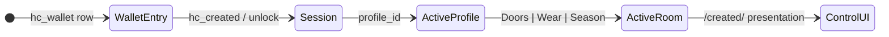

# Steward UX presentation target

**Status:** Active — **target spec** (presentation layer; protocol unchanged)  
**Audience:** Product, WS-QUALITY, frontend, agents  
**Parent:** [`PRODUCT_POSITIONING_AND_LOOP_STRATEGY.md`](PRODUCT_POSITIONING_AND_LOOP_STRATEGY.md) § Step 20 · [`ROOT_CARD_AND_CHILD_OBJECTS.md`](ROOT_CARD_AND_CHILD_OBJECTS.md) § Product UX presentation  
**Architecture:** [`LIVE_OBJECT_ARCHITECTURE.md`](LIVE_OBJECT_ARCHITECTURE.md) · [`V1_PRODUCT_TRUST_MODEL.md`](V1_PRODUCT_TRUST_MODEL.md)  
**Last updated:** 2026-06-04 (Q1 decided · implementation tightenings)

---

## Purpose

Steps 11–15 shipped **front-door routing** (doors, deploy wizard, hub copy, season entry, wear BYOP). The **custody bridge** (steps 1–16 in [`ROOT_CARD_AND_CHILD_OBJECTS.md`](ROOT_CARD_AND_CHILD_OBJECTS.md)) is protocol-complete.

This doc is the **canonical UX target** for what stewards should experience next — **without changing** resolver shape, `profile_id`, child-object APIs, or scan composition entry (`buildScanViewModel`). It consolidates:

- Three **job rooms** (deploy · wear · season) + field-kit exception  
- **Identity default (Q1):** one root per human, **dual UI skins** + optional season-only account  
- **Room switcher** on control (declare room at entry — not silent inference alone)  
- **Control** vs **device** surfaces  
- **Five entry states** (no mid-form wallet branching)  
- **Layer map** (L1–L5) per screen — agent checklist only; stewards never see L1–L5 labels  
- **Presentation policy** (what default **add** UI shows per **active room**; lists still show existing children)  
- **Client steward state** model (wallet × session × room × `profile_id`) — testable  
- **Architecture alignment**, risks, and open decisions (Q2–Q4)

**Current UI gap:** Step 20 **slices 1–4** shipped (presentation policy, room switcher, add-vs-list, season create fork + honest beat). Still missing: five entry states, wear track chooser, season progressive checklist. Create deploy room isolation shipped; create flows may still branch on wallet mid-form. Implementation tracks remaining slices as **Step 20** (WS-QUALITY Q3+).

---

## One mental model (steward-facing)

> **You have a signing identity. You attach live scan points to the world. The ink stays; the truth changes.**

Stewards should **not** think: general card, child object, `profile_id`, template tabs.

They **should** think:

| Concept | User words | Protocol |
|---------|------------|----------|
| Identity | My line · @handle | Root manifesto + `profile_id` |
| Physical endpoints | My scan points | Child objects + QR credentials + `print_artifact` |
| Authority | My keys on this phone | `hc_wallet` + `hc_created` session |

---

## Identity and rooms (Q1 — decided)

**Decision (2026-06-04):** **Default one root per human, dual UI skins.** Optional **season-only account** at season entry for org-shaped work. Protocol unchanged — one root may still hold plates, relays, and game nodes; presentation chooses what to emphasize.

| Approach | When | Steward experience |
|----------|------|-------------------|
| **One root, dual skin (default)** | Solo steward, café + small season, wear BYOP on same identity | One `@handle`, one backup tree. **Doors** and **Season** are skins on the same account — not separate products. |
| **Season-only second root (offered fork)** | City/org season, operator ≠ owner day-to-day, hosted entitlements / city branding | Second `@handle` (e.g. `@cedar-game-26`), season manifesto from day one, stable season UI without deploy inference. |

**Season create fork (target):** On **Run a season**, two clear choices — not a maze:

1. **Use my existing account** (recommended for most people) — continue on saved general root or create one root.  
2. **Create a season-only account** (recommended for org / city / handoff to operators) — new root, season manifesto, no deploy room default.

**When season is added to an existing deploy root** (organizer key registered later): **one honest beat** — never silent UI flip:

> This account now has a season operator key. Live defaults to **Season** for new scan points. Your door plates are still here → switch to **Doors**.

**Encourage second root when:** multi-person operator crew, city-scale season, or deploy root already has many children and season is organizationally separate — not for every volunteer.

**Wear (default):** Same root as deploy for BYOP; fulfilled `print_artifact` stays commerce-scoped without a new identity story until merch demands it.

Aligns with [`ROOT_CARD_AND_CHILD_OBJECTS.md`](ROOT_CARD_AND_CHILD_OBJECTS.md) — one human → one root → many scan points — without forbidding a second root when the job is org-shaped.

---

## Three job rooms (+ field kit)

Architecture already defines three public jobs ([`PRODUCT_POSITIONING_AND_LOOP_STRATEGY.md`](PRODUCT_POSITIONING_AND_LOOP_STRATEGY.md) § Three user jobs). UX should feel like **three products that share a wallet**, not one form with modes.

### Room 1 — Something in the world (deploy)

**Question:** “What should a stranger see when they scan this sticker?”

| Step | Steward input | Maps to |
|------|---------------|---------|
| 1 | What is it on? | Child `public_label` |
| 2 | What’s true right now? | Child `public_state` (+ optional L3 streams) |
| 3 | Handle (if new) | Root identity |

**Success screen:** Printable scan link + live preview — not an empty “your object is live.” Success **is** the QR and “tape this on the door.”

**Ongoing control:** Scan-point-first list (places, not a tree diagram). Lost-item relay = same room, preset (“return message” instead of open/closed).

**Stranger verbs (L2):** `read` · `request` (live proof) · `offer` (finder message on relays). See § Capability-driven scan.

### Room 2 — On your body (wear)

**Question:** “What should your hoodie / wear say today?”

**Two tracks — one control metaphor, different lifecycle** ([`MERCH_QR_LIFECYCLE_POLICY.md`](MERCH_QR_LIFECYCLE_POLICY.md)):

| Track | Scope | Expiry | Steward copy |
|-------|-------|--------|--------------|
| **Fulfilled garment** | `print_artifact` | **No calendar expiry** | “This QR on this garment” — revoke *item* |
| **Print your own (BYOP)** | `scope: card` QR (typical) | May expire (7–365d) | Honest rotate / extend / replace |

Commerce path: customize → artifact intent → checkout → webhook mint. BYOP: [`/create/?intent=wear`](PRODUCT_POSITIONING_AND_LOOP_STRATEGY.md) → print handoff.

**Do not** show deploy object types (plates, relays) in the wear room.

**Wear track chooser (target — before any fields):** First screen names **consequence**, not scope jargon:

| Choice | Plain copy (target) |
|--------|---------------------|
| **Fulfilled garment** | “This QR is tied to the hoodie we print. It does not expire on a calendar. Revoking ends this garment’s link.” |
| **Print your own (BYOP)** | “You print the QR on your own garment. It may expire (e.g. 90 days). You can extend, rotate, or replace.” |

Shop customize → fulfilled track. `/create/?intent=wear` → BYOP track. Never merge lifecycle copy across tracks ([`MERCH_QR_LIFECYCLE_POLICY.md`](MERCH_QR_LIFECYCLE_POLICY.md)).

**Pre-checkout beat:** Preview branded QR, keys in this tab, artifact intent — see [`MERCH_FUNNEL_MVP.md`](MERCH_FUNNEL_MVP.md).

### Room 3 — A place with many scan points (season)

**Players** enter through **the city** (`/play/…`) — scan, read, contribute. No create, no keys, no graph vocabulary.

**Organizers** enter through **Run a season** — not “create card.”

#### Season cockpit (target layout)

```text
Season
  When     — L4 window, phases, dormancy (season id fixed here or on first node)
  Where    — L1 game_node list + install/print state
  Rules    — L5 honesty (what scans prove / do not prove)
  Run      — game-operator console (separate entry; session operator key)
```

**Season id** is metadata for `game_meta` / season config — asked in **When** or when adding the first **Where** node, **not** on a generic create signup form.

**Setup vs Run (authority split):**

| Mode | Key | Surfaces |
|------|-----|----------|
| **Setup** | Owner / root key | Register nodes, print pack, rules, dates, districts |
| **Run** | Game-operator key (`issuer_public_key`) | [`/game-operator/`](../site/game-operator/) — flips, scarcity, unlock |

Same human may use both; product must not blur signing roles.

**Do not** offer status plates or lost-item relays in the **Season** skin’s default add UI. Protocol still allows other child types on the same root; **existing** plates/relays must remain visible in lists (see § Presentation policy · add vs list).

**Season progressive checklist (target):** Replace fragile focus-param-only handoff (`?focus=game-season-setup`) with three visible steps on Live when season skin is active:

1. **Identity** — season operator key registered (or honest “register key” step).  
2. **First scan point** — register first `game_node` (season id in **When** or on this form — not `/create/`).  
3. **Print** — install/print pack for nodes.

Focus params may deep-link into a step; they must not be the only progress signal.

**Non-goals until delegation (step 17):** Do not promise business-owned node updates without operator flips or root key — [`DELEGATED_CHILD_CAPABILITIES_GATE.md`](DELEGATED_CHILD_CAPABILITIES_GATE.md).

### Field kit exception (fourth narrow path)

**Not a main door.** Strangers create via **deploy wizard** (`?intent=deploy`) — Account → endpoint → scan link. Legacy flat create (`?template=status_plate|lost_item`) is **regression only** for LO-1/LO-2 Path B and pre-convergence QRs ([`STATUS_PLATE_PILOT.md`](STATUS_PLATE_PILOT.md), [`LOST_ITEM_RELAY_PILOT.md`](LOST_ITEM_RELAY_PILOT.md)).

- On legacy path only: plate/relay **is** the account root; scans and updates still work.  
- Comprehension scorecard + pilot summary export.  
- Must not look like a broken deploy room or pollute main create chooser.

---

## Control vs device (two surfaces)

| Surface | Job | Architecture home |
|---------|-----|-------------------|
| **Device** | Keys, cross-tab, inbox, live-proof waiting, “open control for X” | Status dot, hub, inbox ([`DEVICE_OS.md`](DEVICE_OS.md), [`NOTIFICATION_SYSTEM_V2.md`](NOTIFICATION_SYSTEM_V2.md)) |
| **Control** | Edit live state, add scan points, print, revoke | Per-room control (evolves from `/created/` — [`CARD_WORKSPACE_UX.md`](CARD_WORKSPACE_UX.md)) |

**Invariant:** A steward’s phone does **not** continuously guarantee fresh network state for every saved root ([`V1_PRODUCT_TRUST_MODEL.md`](V1_PRODUCT_TRUST_MODEL.md) · [`DEVICE_OS_REQUEST_BUDGET.md`](DEVICE_OS_REQUEST_BUDGET.md)). Live proof while someone waits is **scanner session + signing tab**, surfaced via **inbox/dot**, not only the Live tab.

### Control layout (target)

1. **What’s live right now** — sentence strangers read (large)  
2. **Your scan points** — cards: name, last changed, quick actions  
3. **Account** — @handle, backup status, recovery (collapsed)

Actions map to verbs/lifecycle; **Details** holds `profile_id`, scope, streams, QR rotation.

---

## Five steward entry states

**Rule:** Branch only at **room entry**, never mid-form (no disabled/hidden fields that look broken).

| # | State | First screen |
|---|--------|--------------|
| 1 | New human, new device | Full onboarding: handle → backup nudge → first scan point |
| 2 | Returning, keys in session | Room home or “add scan point” |
| 3 | Returning, keys in wallet only | “Unlock on this device” then room home |
| 4 | Wrong device / context (PWA ≠ Safari on iPhone) | Honest two-wallet copy — no fake create form |
| 5 | Stranger / pilot | Deploy wizard (`?intent=deploy`); legacy `?template=` for field-kit regression only |

Multi-root wallets remain valid ([`ROOT_CARD_AND_CHILD_OBJECTS.md`](ROOT_CARD_AND_CHILD_OBJECTS.md)); entry shows **which identity** (@handle), not `profile_id`.

---

## Room switcher (declare at entry)

**Rule:** Stewards must always know **which room** they are managing. Inference (`issuer_public_key`, manifesto prefix) may set the **initial** skin; the steward **toggles** it.

**Target control chrome** on `/created/` (evolves from [`CARD_WORKSPACE_UX.md`](CARD_WORKSPACE_UX.md)):

```text
Managing: @handle          [ Doors · Wear · Season ]
```

| Skin | User label | Opens from | Presentation policy |
|------|------------|------------|---------------------|
| Deploy | **Doors** | `?intent=deploy`, landing door 1 | Plates + relays in add UI |
| Wear | **Wear** | `?intent=wear`, shop BYOP link | Garment / BYOP QR only |
| Season | **Season** | `?intent=game`, season fork | Game nodes in add UI |

- Persist last skin per `profile_id` (e.g. `sessionStorage` / device prefs).  
- Deep links set initial skin; switcher overrides without changing protocol.  
- **Wear** may stay a create-first room until `/created/` wear skin ships; switcher still applies when control converges.

**Not in this room (target):** When add UI hides a type, show explicit copy — not empty space:

> Lost-item tags are managed under **Doors**, not Season. [Switch to Doors]

Power users: optional **Advanced** disclosure for cross-room add (honest “unusual on this account”) — deferred until comprehension sessions justify it.

---

## Client steward state (testable)

Room confusion and “wrong card in this tab” are **state machine** bugs. Step 20 implementations must model:



| Dimension | Storage / signal | UX must |
|-----------|------------------|---------|
| **Wallet** | `hc_wallet[]` — keys, `@handle`, `profile_id` | Chooser when multiple roots; never sign with wrong entry |
| **Session** | `hc_created`, unlock, custody mode | Tab that holds private key matches control tab |
| **Profile** | Active `profile_id` on `/created/` | Header shows `@handle` for *this* profile |
| **Room** | `active_room` per profile (UI) | Switcher visible; deep link sets initial only |

**Test requirement:** Vitest on pure cores for room + policy; Playwright or shell e2e for profile × room desync regressions. No new feature slice without updating this matrix.

---

## Layer map (design checklist)

For every steward or stranger screen, fill:

| Layer | Question |
|-------|----------|
| **L1** | Root, child, or `print_artifact`? Which QR scope? |
| **L2** | Which verbs? (`read` · `request` · `offer` · `contribute` · `archive`) |
| **L3** | Hero only or streams? Care vs game precedence? |
| **L4** | Does time change scan? Season window? `visible_until`? |
| **L5** | Season overlay active? Operator state? |

Resolver composition order unchanged: lifecycle → time → streams → game ([`LIVE_OBJECT_ARCHITECTURE.md`](LIVE_OBJECT_ARCHITECTURE.md)).

---

## Capability-driven scan (stranger)

Scan is not read-only. Templates derive from `ScanViewModel.capabilities` ([`LIVE_OBJECT_ARCHITECTURE.md`](LIVE_OBJECT_ARCHITECTURE.md) § Layer 2).

| Inferred context | Hero | Verbs (typical) | Trust |
|------------------|------|-----------------|-------|
| Status plate | Object name + status line | read, request | Bearer + @handle |
| Lost-item relay | Item + return path | read, offer | Bearer; not phone on tag |
| Game node | Role template + place | read, contribute (gated) | Witness seal ≠ Steward vouch (**R-01**) |
| `print_artifact` / wear | Line on object | read, request | Bearer; commerce ≠ vouch |
| Root card QR | Manifesto | read, request | Human trust block on root |

**Order on scan:** object first → plain limit → controlled by @handle → optional verb UI.

---

## Trust (parallel dimension)

From [`V1_PRODUCT_TRUST_MODEL.md`](V1_PRODUCT_TRUST_MODEL.md) — not a fourth room, woven into scan + account corner:

- Level 0 bearer warning (always on physical QRs)  
- Human vouch on **root** only — never bought, never printed on object  
- Live proof = scanner-initiated request, not background monitoring  
- Game witness / `game_meta.vouch_*` ≠ Humanity Steward vouch (**R-01**)

---

## Presentation policy table

**Protocol allows more; default UI enforces comprehension.** Policy is driven by **active room** (switcher). Signals (`issuer_public_key`, season manifesto prefix) set **initial** skin only — see § Room switcher.

### Add UI vs list UI (invariant)

| Surface | Rule |
|---------|------|
| **Add scan points** | Filtered by active room — hide irrelevant types |
| **Existing scan points list** | Show **all** children on this root; group or badge by room (“Door plate · managed under Doors”) |
| **Revoke / edit** | Always reachable from list regardless of active room |

Slice 1 shipped add-hub filter only; **list policy** is slice 2+.

### By active room

| Active room | Default add scan points | Hidden from add UI | Default stranger verbs |
|-------------|-------------------------|--------------------|------------------------|
| **Doors** (deploy) | Status plate, lost-item relay | `game_node` | read, request, offer |
| **Season** | `game_node` only | status_plate, lost_item_relay | read, contribute |
| **Wear** | Garment / BYOP QR | plates, relays, game nodes | read, request |

**Hub copy (target):** Room-specific summary — e.g. Season: “Game season scan points”; Doors: “Live objects under this root” + “status plates · lost items”.

**Shipped (slice 1):** Inference-based deploy vs season add filter when room switcher not yet present (`steward-presentation-policy-core.mjs`). Temporary until explicit switcher is source of truth.

---

## Architecture alignment

| Area | Target fit | Notes |
|------|------------|-------|
| L1 object graph | **Strong** | Scan-point metaphor matches root → child → QR |
| Three public jobs | **Strong** | Rooms map to doors |
| Object-first scan | **Strong** | + capability + trust ordering |
| Season vs deploy split | **Strong** | Presentation policy required |
| Wear carrier split | **Good** | Must keep two-track lifecycle copy |
| Legacy flat scan compat | **Required exception** | Field-kit Path B regression only; deploy wizard is current create |
| Verbs on scan | **Must design** | Per room verb catalog |
| Streams + precedence | **Must design** | Optional deploy streams; care on game nodes |
| Time policy / season phases | **Must design** | “When” panel in season cockpit |
| Game-operator vs owner | **Must separate** | Setup vs Run |
| Device shell / inbox | **Must integrate** | Not collapsed into Live tab |
| Merch fulfillment funnel | **Partial** | Pre-checkout in wear room |
| `print_artifact` vs `card` scope | **Must not merge** | BYOP vs fulfilled garment |
| Delegation | **Honest deferral** | No café self-serve until G1–G5 |
| Multi-root wallet | **Chooser at entry** | @handle labels |
| Hosted entitlements / caps | **Honest limits** | Season cockpit strip |

---

## Open product decisions

| # | Status | Decision | Resolution / remaining |
|---|--------|----------|------------------------|
| **Q1** | **Decided** | One `@handle` for deploy + season? | **Default one root, dual skins** + **season-only fork** at season entry. See § Identity and rooms. |
| **Q2** | Open | BYOP wear mints | `scope: card` (expiry) vs `print_artifact` (no expiry) — wear track chooser copy must match choice |
| **Q3** | Open | Season id canonical home | Season config JSON vs manifesto prefix vs per-node only — **When** panel or first node; remove from `/create/` |
| **Q4** | Partial | Room / season detection | **`active_room` (switcher) is source of truth**; `issuer_public_key` + manifesto prefix set initial skin only; optional `account_kind` metadata later |

---

## Implementation sequencing (Step 20 slices)

| Slice | Scope | Status |
|-------|--------|--------|
| **1** | Inference-based deploy vs season **add** hub filter | **Shipped** — `steward-presentation-policy-core.mjs` |
| **2** | **Room switcher** on `/created/` + persist per `profile_id`; policy reads `active_room` | **Shipped** — `steward-active-room-core.mjs`, `created-room-switcher.mjs` |
| **3** | **Add vs list** policy — lists show all children; “managed under Doors” badges | **Shipped** — `steward-child-object-list-policy-core.mjs`, `created-child-object-section-ui.mjs` |
| **4** | **Season create fork** + honest beat when organizer key added to deploy root | **Shipped** — `create-season-fork-core.mjs`, `steward-season-key-honest-beat-core.mjs` |
| **5** | **Five entry states** — remove mid-form wallet branch on create; unlock-first screens | **Shipped** — `create-entry-state-core.mjs`, entry gate on `/create/` |
| **6** | **Season progressive checklist**; wear track chooser; season id off create | Planned |
| **7** | Capability-driven scan templates per room | Planned |

Defer full URL split (`/created/deploy/` etc.) until switcher + checklist prove comprehension on single `/created/`.

---

## Risks and failure modes (design review)

| Risk | Why it breaks humans | Mitigation in this spec |
|------|------------------------|-------------------------|
| Silent inference flip | Plates “vanish” when organizer key added | Room switcher + honest beat (§ Identity) |
| Presentation ≠ network | API returns children add UI hides | Add vs list invariant (§ Presentation policy) |
| Multi-root without chooser | Wrong `@handle` signs / edits | Client state matrix + @handle at entry |
| Focus-param handoff chain | Empty Live after season create | Season progressive checklist |
| Wear two-track merge | “I thought my QR wouldn’t expire” | Track chooser before fields |
| Control stale vs inbox | Stranger waits; steward stares at Live | Control vs device invariant (unchanged) |
| Setup vs Run key mix | Operator signs with owner key | Separate Run entry; hard gates on `/game-operator/` |

---

## Implementation status vs target (honest)

| Target | Shipped (partial) | Gap |
|--------|-------------------|-----|
| Three launch doors | Steps 10–11 | — |
| Deploy object-first create | Step 12 | Wallet-branch submit strategies |
| Hub “My objects” | Step 13 | Room switcher not on control |
| Season create entry | Step 14 | Season id on create; fork not shipped |
| Wear BYOP link | Step 15 | Wear room not isolated; no track chooser |
| **Q1 identity** | Slice 4 | Season-only second-root path at create |
| Presentation policy (add) | Slices 1–3 | — |
| Room switcher | Slice 2 | — |
| “Not in this room” copy | Slices 2–3 (crosshint + list badges) | — |
| Season checklist | Focus param only | Slice 6 |
| Five entry states | Slice 5 shipped | Mid-form wallet branching removed for deploy/wear/season redirect paths |
| Capability-driven scan | L2 partial in resolver | Templates not fully room-aware |

**WS-QUALITY exit:** 5 steward comprehension sessions without “I thought it worked but…” on keys / room confusion — [`CORE_PRODUCT_LOOP.md`](CORE_PRODUCT_LOOP.md) Q3.

---

## Default vocabulary (must not surface)

| Architecture | Default UI |
|--------------|------------|
| `profile_id` | Details only |
| `object_type` | Presets: door plate, return tag, game checkpoint |
| Root vs child | Account vs scan points |
| L5 network graph | Live game · season |
| Organizer / issuer key | Season operator key (once at setup) |

Full table: [`PRODUCT_LANGUAGE_STRATEGY.md`](PRODUCT_LANGUAGE_STRATEGY.md) § Object model vocabulary.

---

## Related

| Doc | Role |
|-----|------|
| [`PRODUCT_POSITIONING_AND_LOOP_STRATEGY.md`](PRODUCT_POSITIONING_AND_LOOP_STRATEGY.md) | Steps 10–20 · front doors |
| [`ROOT_CARD_AND_CHILD_OBJECTS.md`](ROOT_CARD_AND_CHILD_OBJECTS.md) | Protocol · bridge · step 19/20 |
| [`CARD_WORKSPACE_UX.md`](CARD_WORKSPACE_UX.md) | Current `/created/` modes (setup · control · view) |
| [`CITY_GAME_V1_IMPLEMENTATION.md`](CITY_GAME_V1_IMPLEMENTATION.md) | Phase E · season cockpit |
| [`MERCH_FUNNEL_MVP.md`](MERCH_FUNNEL_MVP.md) | Wear commerce + BYOP |
| [`CORE_PRODUCT_LOOP.md`](CORE_PRODUCT_LOOP.md) | WS-QUALITY Q3 gates |
| [`SYSTEM_INVARIANTS.md`](SYSTEM_INVARIANTS.md) | Shipped invariants vs this target |
