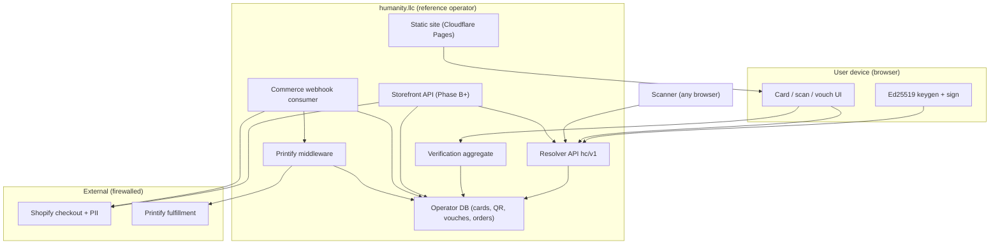

# V1.0 Architecture Roadmap

**Status:** Canonical implementation roadmap  
**Purpose:** Single end-to-end picture of Humanity Commons v1.0 - architecture, phases, boundaries, and a **numbered build sequence** to follow step by step.  
**Audience:** Founder, implementers, and agents building the reference operator on `humanity.llc`.

**How to use this doc:** Work milestones in order. Do not skip exit criteria. When a step says “spec,” use the linked document for field-level detail; this roadmap defines **order and system shape**, not every JSON field.

---

## Table of contents

1. [How this doc relates to others](#1-how-this-doc-relates-to-others)
2. [What v1.0 is and is not](#2-what-v10-is-and-is-not)
3. [Architecture principles](#3-architecture-principles)
4. [System context](#4-system-context)
5. [Runtime topology](#5-runtime-topology)
6. [Components and ownership](#6-components-and-ownership)
7. [Trust model on scan (UI blocks)](#7-trust-model-on-scan-ui-blocks)
8. [Data architecture and firewalls](#8-data-architecture-and-firewalls)
9. [Protocol surfaces](#9-protocol-surfaces)
10. [Phases at a glance](#10-phases-at-a-glance)
11. [Phase 0: decisions before code](#11-phase-0-decisions-before-code)
12. [Phase A: MVP (digital trust)](#12-phase-a-mvp-digital-trust)
13. [Phase B: curiosity drop (commerce-lite)](#13-phase-b-curiosity-drop-commerce-lite)
14. [Phase C: belonging and personalized artifacts](#14-phase-c-belonging-and-personalized-artifacts)
15. [Phase D: Commons Pass](#15-phase-d-commons-pass)
16. [Phase E: federation milestone](#16-phase-e-federation-milestone)
17. [Master build sequence](#17-master-build-sequence)
18. [Testing and launch gates](#18-testing-and-launch-gates)
19. [Repository layout (target)](#19-repository-layout-target)
20. [Open risks and spikes](#20-open-risks-and-spikes)

---

## 1. How this doc relates to others

| Document | Role |
|---|---|
| **This doc** | **Order of work**, system diagram, milestones, repo layout |
| `docs/DEMOCRATIC_INFRASTRUCTURE.md` | **Direction:** infrastructure vs empire; why scan/revoke matter beyond a profile |
| `docs/PROTOCOL_FEDERATION_AND_LAUNCH_STRATEGY.md` | Why: federation, public launch, anti-honeypot, no blockchain core |
| `docs/Technical Standards v1.0.md` | Wire formats, crypto, resolver API contract |
| `docs/V1_IMPLEMENTATION_CONTRACTS.md` | Endpoint and record shapes for builders |
| `docs/V1_PRODUCT_TRUST_MODEL.md` | What scans prove and do not prove |
| `docs/REVOKE_AND_LIFECYCLE_V1.md` | **Revoke QR vs Disable card**, scan privacy modes, lifecycle roadmap |
| `docs/V1_FLOW_AUDIT.md` | Per-flow privacy and failure states |
| `docs/V1_DECISION_LOCK.md` | Locked vs deferred product decisions |
| `docs/V1_IMPLEMENTATION_BACKLOG.md` | Task IDs (R-001, SF-002, …) mapped to milestones below |
| `docs/MERCH_LED_V1.md` | GTM framing: curiosity + belonging |
| `docs/MERCH_QR_LIFECYCLE_POLICY.md` | Printed artifact QR: no calendar expiry, revoke/reprint, experiments |
| `docs/REFERENCE_OPERATOR_DATA_POLICY.md` | What the reference operator stores |
| `docs/features/*.md` | Feature-level requirements |

**Conflict rule:** If launch gates or architecture conflict, **`PROTOCOL_FEDERATION_AND_LAUNCH_STRATEGY.md`** wins on launch posture and data minimization. **This roadmap** wins on **build order** (MVP before full commerce vertical slice).

---

## 2. What v1.0 is and is not

### v1.0 is

- A **reference resolver** on `humanity.llc` implementing `hc/v1` (Humanity Card + QR + status).
- **Browser-held keys**; public signed card documents; optional vouches under published rules.
- **HTTPS QR** that returns **current** status (active, revoked, suspended, expired, unknown).
- **Honest scan UI** separating card status, human trust, artifact/QR status, and limitations.
- **Public card creation** when Phase A is stable (no invite gate).
- **Open standards** so other operators can run the same API later.
- Optional path: **one merch SKU** (Phase B) and **personalized artifacts** (Phase C) after the scan loop is proven.

### v1.0 is not

- Government ID, KYC, or global “verified human” oracle.
- A surveillance product (no scan analytics by default).
- Blockchain, NFT, or ledger-based identity (out of scope; see `DEMOCRATIC_INFRASTRUCTURE.md` §3).
- A single-company identity honeypot forever (federation is the long-term shape).
- Commons Pass at launch (Phase D).
- Native checkout, device proof, public directory, or marketplace (deferred per `V1_DECISION_LOCK.md`).

---

## 3. Architecture principles

1. **Dependency is live status**  -  Merch is distribution; the product is “scan → current signed truth.”
2. **Minimize operator data**  -  Pseudonymous `profile_id` + public key + public fields; no legal ID in core loop.
3. **Keys stay on device**  -  Private keys never sent to resolver, Shopify, or Printify.
4. **Commerce firewalled**  -  Payment/shipping PII never upgrades trust status; QR payloads contain no order data.
5. **Mechanism-revealing UI**  -  `Vouched Human`, not “verified forever.”
6. **Revocation is visible**  -  Revoked QR resolves to revoked state, not 404 silence.
7. **Build MVP before empire**  -  Phase A strangers test; Phase D org tooling later.

---

## 4. System context

### 4.1 Logical architecture



### 4.2 Full v1.0 vertical slice (end state)

Not the first ship. This is the **complete** v1.0 architecture including commerce:

```text
Signed card → HTTPS QR → trust-state scan UI → revoke
  → artifact intent → unique item QR → Shopify paid webhook
  → Printify order → item QR revocation still resolves
```

Phases A–C exist so you do not build the right-hand side before strangers understand the left.

### 4.3 Federation (strategic, not day one)

```text
Technical Standards v1.0  →  multiple operators implement hc/v1
humanity.llc               →  reference operator + best client
co-op / union host         →  second operator (Phase E milestone)
```

See `docs/PROTOCOL_FEDERATION_AND_LAUNCH_STRATEGY.md` §3.

---

## 5. Runtime topology

### 5.1 Recommended hosting (reference operator)

| Surface | Technology | Notes |
|---|---|---|
| Marketing + create-card UI shell | **Cloudflare Pages** (`site/`) | Already deployed; links into app routes |
| Resolver + APIs | **Cloudflare Workers** (new `worker/` or `api/`) | Same zone `humanity.llc`; routes `/c/*`, `/.well-known/hc/v1/*` |
| Operator database | **D1** (SQLite) or Durable Objects + KV | Cards, QR credentials, vouches, commerce links |
| Secrets | Wrangler secrets | Printify token, Shopify webhook HMAC, bootstrap signer keys |
| Commerce | **Shopify** (headless handoff) | Checkout, tax, refunds, customer email |
| Fulfillment | **Printify** via server middleware | Never exposed to browser |

Alternative: single Node service on Fly/Railway. Workers keep latency and cost low next to Pages.

### 5.2 Route map on one domain

| Route | Owner | Phase |
|---|---|---|
| `/` | Pages static | Done (landing) |
| `/data-policy.html` | Pages static | Done |
| `/create` | Worker or Pages+JS | A |
| `/card/{handle}` or owner dashboard | Worker | A |
| `/c/{profile_id}?q={qr_id}` | Worker (HTML scan page) | A |
| `/.well-known/hc/v1/*` | Worker (JSON API) | A |
| `/store/*` | Worker + storefront module | B |
| `/webhooks/shopify` | Worker | C |

### 5.3 Caching

- Active card HTML/JSON: short TTL per `Technical Standards v1.0.md` §9.3.
- Revoked/suspended: shorter TTL; must not serve stale “active” from CDN after revoke.
- No scan analytics; optional minimal access logs only if governance-approved.

---

## 6. Components and ownership

| Component | Responsibility | Persists | Phase |
|---|---|---|---|
| **Card client** | Keygen, sign card, sign revoke/vouch, export | Private key local | A |
| **Resolver** | Validate signatures; store public card; resolve QR; render scan | Cards, QR, status | A |
| **Verification service** | Aggregate vouches; compute summary; badges | Vouches, summaries | A (display) / A+ (issue) |
| **Scan renderer** | HTML/JSON trust-state UI + limitations |  -  | A |
| **Live control module** | Challenge/response | Short-lived challenges | A.1 optional |
| **Storefront** | Story rows, product pages, artifact intents | Intents, catalog seed | B–C |
| **Commerce consumer** | Shopify webhooks idempotent | Commerce order links | C |
| **Printify middleware** | Artwork upload, order create, webhooks | Print orders | C |
| **Static site** | Narrative, policy, preview card |  -  | Done |

---

## 7. Trust model on scan (UI blocks)

Every scan page (and JSON status) must show **separate blocks** per `docs/V1_PRODUCT_TRUST_MODEL.md`:

| Block | Examples | Must not imply |
|---|---|---|
| **Card status** | active, revoked, suspended, expired, unknown | Legal ID |
| **Human trust** | Registered, Vouched Human, Steward | Bot-proof, forever verified |
| **Artifact / QR status** | QR active, item revoked | Holder = owner |
| **Live control** (if enabled) | “Control proven moments ago” | Legal ID, uniqueness |
| **Limitations** | Bearer warning, no scan analytics | Platform surveillance |

Required bearer copy (printed-item scans):

> This QR resolves to a Humanity Card. It does not prove the person holding this item is the card owner.

---

## 8. Data architecture and firewalls

### 8.1 Reference operator MAY store

- `profile_id`, public key, handle, manifesto, public badges
- Signed card document, QR credentials, status flags
- Signed vouches and public verification summary
- Revocation and suspension records (with public notice when required)
- Short-lived live-control challenge records (minutes TTL)
- Commerce: artifact intents, internal order links (no payment PAN)

### 8.2 MUST NOT store (core loop)

- Private keys, recovery secrets in plaintext
- Government ID, phone required for card create
- Scan analytics (per-scan profiles, location trails)
- Shopify/Printify shipping identity in resolver trust tables

### 8.3 Boundary table (summary)

Full table: `docs/V1_FLOW_AUDIT.md` § Cross-System Boundaries.

| From → To | Allowed | Forbidden |
|---|---|---|
| Browser → Resolver | Public signed payloads | Private keys |
| Resolver → Scanner | Public status only | Order PII, secrets |
| Shopify → Humanity | Order webhooks, line metadata | Verification secrets |
| Humanity → Printify | Artwork, fulfillment fields | Keys, vouch graph |

Published policy: `docs/REFERENCE_OPERATOR_DATA_POLICY.md` and `site/data-policy.html`.

---

## 9. Protocol surfaces

Canonical detail: `docs/Technical Standards v1.0.md` §9, `docs/V1_IMPLEMENTATION_CONTRACTS.md`.

### 9.1 Resolver API (required for compatibility)

| Endpoint | Method | Phase |
|---|---|---|
| `GET /.well-known/hc/v1/health` | GET | A.1 |
| `POST /.well-known/hc/v1/cards` | POST | A.3 |
| `GET /.well-known/hc/v1/cards/{profile_id}` | GET | A.5 |
| `GET /.well-known/hc/v1/cards/{profile_id}/status` | GET | A.5 |
| `GET /.well-known/hc/v1/qr/{qr_id}` | GET | A.5 |
| `POST /.well-known/hc/v1/cards/{profile_id}/revoke` | POST | A.7 |
| `POST /.well-known/hc/v1/cards/{profile_id}/qr` | POST | A.6 |
| Live control challenges/responses | POST | A.9 optional |

Responses include `X-Resolver-Operator: humanity.llc` per standards §9.6.

### 9.2 Public shortcuts

| Route | Purpose |
|---|---|
| `GET /c/{profile_id}?q={qr_id}` | Phone-camera QR fallback |

Print payloads use HTTPS URL, not only `hc://` (standards §QR).

### 9.3 Identifiers

| ID | Public? | Notes |
|---|---|---|
| `profile_id` | Yes | Opaque, portable |
| `qr_id` | Yes | Per card or per printed item |
| `artifact_intent_id` | No | Commerce |
| `commerce_order_id` | No | Links to Shopify |

---

## 10. Phases at a glance

| Phase | Name | Ship to public? | Exit signal |
|---|---|---|---|
| **0** | Decisions |  -  | Copy, stack, bootstrap keys locked |
| **A** | **MVP digital trust** | **Yes (open create)** | Stranger scan → create without you |
| **A.1** | Vouches | Yes | Distinct users vouch; labels understood |
| **A.2** | Live control (optional) | Alpha / v1.1 | Not confused with legal ID |
| **B** | Curiosity drop | Yes | Stranger order + scan→create |
| **C** | Personalized artifacts | Yes | Item QR revoke story works |
| **D** | Commons Pass | Later | Org pilot on same grammar |
| **E** | Second operator | Milestone | Another host runs `hc/v1` |

**MVP = Phase A complete** (steps 1–32 in master sequence). Phases B–C are v1.0 commerce completion, not required for first public trust launch.

---

## 11. Phase 0: decisions before code

Complete before milestone A.1. Map to backlog D-001–D-006.

| ID | Decision | Recommendation |
|---|---|---|
| P0-1 | App runtime | Cloudflare Workers + D1 on same account as Pages |
| P0-2 | First physical SKU | One sticker after Phase A; card second |
| P0-3 | Shopify style | Custom storefront + checkout handoff |
| P0-4 | Public labels | `Registered`, `Vouched Human`; avoid `Verified Human` on UI |
| P0-5 | Live control scope | Defer public UI until A.5 stable; optional A.9 |
| P0-6 | Bootstrap signers | 3-of-5 named keys; public fingerprints |
| P0-7 | Beachhead narrative | Events/meetups + co-ops (not “identity for all”) |
| P0-8 | Data policy URL | `/data-policy.html` + GitHub `REFERENCE_OPERATOR_DATA_POLICY.md` |

**Exit:** Written answers in `docs/V1_DECISION_LOCK.md` or a short `docs/V1_0_DECISIONS.md` appendix; no open P0 blockers.

---

## 12. Phase A: MVP (digital trust)

**Goal:** A stranger can create a card, scan a QR, read honest status, and revoke - without email, without you in the room.

### A.1 Infrastructure

- Worker project wired to `humanity.llc` routes.
- D1 schema: cards, qr_credentials, verification_summaries (minimal), revocations.
- Health endpoint live.
- CI: typecheck, deploy preview.

### A.2 Cryptography library

- RFC 8785 canonical JSON + Ed25519 verify/sign in client and Worker.
- Shared types package or copied constants for `version`, payload `type`, nonces.

### A.3 Create card

- `/create` UI: handle, manifesto, generate keys, sign, POST card.
- Rate limits on create (no invite gate).
- Initial state: `registered` / unverified.
- Issue default card-scoped `qr_id`.

### A.4 Owner view

- Minimal “my card” view: show QR, copy link, revoke (session key)  -  **done** (`site/created/`).
- Warn on key loss (session-only revoke today).
- **Follow-up M5.5:** encrypted key export/import + optional recovery key so revoke works from any device (`docs/M5_5_OWNER_KEY_PORTABILITY.md`).

### A.5 Scan + resolve

- Implement `/c/{profile_id}?q={qr_id}` HTML with all trust blocks (human trust may show Registered only).
- JSON status endpoint for machines.
- Unknown / malformed QR pages.
- Cache headers per standards.

### A.6 QR rotation (card-level)

- Owner-signed new QR epoch; old QR → `replaced` or revoked per policy.

### A.7 Revocation

- Owner-signed revoke for card and for `print_artifact` scoped `qr_id` (schema ready even before print).
- Scan shows revoked; sibling item QRs unaffected when only one item revoked.
- **Product spec:** `docs/REVOKE_AND_LIFECYCLE_V1.md`  -  Revoke QR vs Disable card, minimal scan pages, URL/profile-id honesty, planned `display_mode`.

### A.7.1 Lifecycle UX follow-up (M4.5  -  proposed)

- Rename owner whole-card action UI to **Disable card**.
- QR-revoked scan default: **This QR is no longer valid** (minimal; hide handle/manifesto).
- Card-disabled scan default: **This card has been disabled** (minimal).
- **Show link** for scan URL on mobile.
- Optional `display_mode` on signed revocation (future protocol field).

### A.8 Landing integration

- Replace “GitHub only” path with **Create card** CTA to `/create`.
- Keep policy links.

### A.9 Optional: live control

- Challenge/response; separate UI block; short TTL.
- Defer if it delays A.5–A.8.

### A.10 Optional: vouches (A.1 product milestone)

- Signed vouch POST; threshold 3; quotas per `V1_DECISION_LOCK.md`.
- Scan shows `Vouched Human` when met.

### Phase A exit criteria (MVP shipped)

- [ ] 3 people outside your network create cards without assistance.
- [ ] Each can explain what scan proves and does not prove in one sentence.
- [ ] Revoke one QR; scan shows revoked within cache TTL.
- [ ] No scan analytics code paths in production.
- [ ] Data policy linked from scan page.

---

## 13. Phase B: curiosity drop (commerce-lite)

**Goal:** Walking QR drives strangers to create cards; merch does not grant vouch.

- Story-row store (small catalog; 1 launch SKU).
- Batch or card-level QR on sticker (unique per-item optional later).
- Product copy: merch ≠ vouched; bearer warning.
- No personalized artifact intent required for Tier 0.
- Measure: scans, scan→create, orders outside friend network.

**Exit:** One organic stranger order + one unprompted scan→create.

---

## 14. Phase C: belonging and personalized artifacts

**Goal:** Card holders personalize physical items; commerce vertical slice complete.

**Note:** Open to all card holders with active card - not a private cohort gate (`PROTOCOL_FEDERATION_AND_LAUNCH_STRATEGY.md`).

- Artifact intent with planned per-item `qr_id`s.
- Shopify cart metadata spike proven (`V1_ASSUMPTION_REGISTER.md` A-001).
- Paid webhook → idempotent commerce link → Printify order.
- Printify sample QA for scan reliability.
- Manual production approval default.
- Operator lookup for support.

**Exit:** One paid personalized order fulfilled; one item QR revoked and scan proves it.

---

## 15. Phase D: Commons Pass

**Goal:** Organizations issue membership on same resolver grammar.

- Community, invites, pass issuance, check-in, stamps.
- Specs under `docs/commons/`.

**Gate:** Phase A–C show repeat scans and real use case.

---

## 16. Phase E: federation milestone

**Goal:** Prove protocol is not single-tenant capture.

- Document operator onboarding checklist (standards §9.6).
- Second host runs read-compatible `hc/v1` OR read-only mirror pilot.
- Public announcement of operator policy.

Not required for MVP.

---

## 17. Master build sequence

Follow these steps in order. Each step lists **exit criteria** and **spec refs**. Backlog task IDs in parentheses where they exist.

### Milestone M0  -  Decisions (Phase 0)

| Step | Action | Exit | Refs |
|---|---|---|---|
| 0.1 | Lock runtime: Workers + D1 + Pages on `humanity.llc` | Written in repo README or `V1_0_DECISIONS` | §5 |
| 0.2 | Lock public copy labels + forbidden claims list | Copy doc approved | `V1_PRODUCT_TRUST_MODEL`, `LAUNCH_LANGUAGE_KIT` |
| 0.3 | Lock bootstrap signer model (or defer suspension to manual) | Key fingerprints documented | `V1_DECISION_LOCK` |
| 0.4 | Confirm data policy published | Live URL works | `REFERENCE_OPERATOR_DATA_POLICY` |

### Milestone M1  -  Foundation

| Step | Action | Exit | Refs |
|---|---|---|---|
| 1.1 | Create `worker/` (or `api/`) Wrangler project; bind routes | `wrangler dev` serves health | §19  -  **done** (`worker/`, `npm run worker:dev`) |
| 1.2 | D1 migrations: cards, qr_credentials, revocations, verification_summaries | Tables exist | `V1_IMPLEMENTATION_CONTRACTS`  -  **done** (`worker/migrations/`) |
| 1.3 | Implement `GET /.well-known/hc/v1/health` | JSON version + operator id | Standards §9 |
| 1.4 | Deploy Worker to staging + production | Route reachable on domain |  -  |
| 1.5 | Implement signature verify utility + tests (C-003) | Fixture vectors pass | Backlog C-003  -  **done** (`worker/src/crypto/`, `npm run worker:test`) |

### Milestone M2  -  Create card (MVP core)

| Step | Action | Exit | Refs |
|---|---|---|---|
| 2.1 | Client keygen + card document builder | Key in memory only | `features/Humanity Card v1.0.md`  -  **done** (`site/js/`) |
| 2.2 | `POST /.well-known/hc/v1/cards` with signature verify | 201 + profile_id | R-001  -  **done** |
| 2.3 | Handle uniqueness + validation | 409 on duplicate | Standards §4  -  **done** |
| 2.4 | Rate limit create by IP (no PII log if possible) | 429 when abused | PROTOCOL §5  -  **done** (`0002_rate_limits`) |
| 2.5 | `/create` page on domain | User creates card E2E | A.3  -  **done** (`site/create/`) |
| 2.6 | Issue initial QR credential on create | QR payload scans | R-002  -  **done** (POST bundles QR) |
| 2.7 | Minimal owner dashboard: QR PNG/link | Owner can share | A.4  -  **done** (`site/created/`) |

### Milestone M3  -  Scan (the product moment)

| Step | Action | Exit | Refs |
|---|---|---|---|
| 3.1 | `GET /c/{profile_id}?q={qr_id}` HTML template | Mobile-readable in 5s | R-002, trust model  -  **done** |
| 3.2 | Trust blocks: card, human, artifact, limitations | Clear separation | §7  -  **done** (`docs/M3_SCAN_PAGE_UI.md`, `worker/src/resolver/scan-html.ts`) |
| 3.3 | Bearer warning on item-scoped QR | Visible above fold on mobile | Flow audit §2 |
| 3.4 | `GET .../status` JSON | Matches HTML state | Standards §9 |
| 3.5 | Unknown profile/QR pages | No blank 404 | R-002 |
| 3.6 | Cache-Control per status | Revoke visible <1 min CDN | Standards §9.3 |
| 3.7 | Link create CTA + data policy on scan | Stranger path clear | A.8 |

### Milestone M4  -  Revoke

| Step | Action | Exit | Refs |
|---|---|---|---|
| 4.1 | Owner-signed revoke API | Status updates | R-003 |
| 4.2 | Revoked HTML + JSON | Clear copy | R-003 |
| 4.3 | Item-scoped revoke (schema + API) | Sibling QRs active | Standards §QR |
| 4.4 | Block new intents on revoked QR (stub OK pre-commerce) | 403 on intent | Flow 5 |

### Milestone M5  -  Landing + public launch

| Step | Action | Exit | Refs |
|---|---|---|---|
| 5.1 | Landing CTA → `/create` | No mailto gate | PROTOCOL §4 |
| 5.2 | Run 3 stranger tests | Pass Phase A exit | §12 |
| 5.3 | Announce public create (site + README) |  -  |  -  |

### Milestone M5.5  -  Owner key portability (follow-up; not Phase A gate)

**Goal:** Revoke (and later rotate/vouch) from any device after create  -  not only the original browser tab.

| Step | Action | Exit | Refs |
|---|---|---|---|
| 5.5.1 | Encrypted key export (opt-in) | Backup file; passphrase | Standards §12.1 |
| 5.5.2 | Import backup on owner UI | Revoke from second device | `M5_5_OWNER_KEY_PORTABILITY.md` |
| 5.5.3 | Optional recovery key at create | User saves code once | Standards §10.1 |
| 5.5.4 | Revoke API accepts recovery sig | Tests + fixtures | `revoke.ts` |
| 5.5.5 | Copy + policy + threat model | No false “we hold your key” | data policy |

**Does not block M5.2 stranger tests.** Phase A MVP remains: create → scan → revoke **in create session**.

### Milestone M6  -  Vouches (A.1)

| Step | Action | Exit | Refs |
|---|---|---|---|
| 6.1 | Vouch sign + POST API | Vouch stored | V-002 |
| 6.2 | Eligibility: quota, wait period | Enforced | `V1_DECISION_LOCK` |
| 6.3 | Verification summary aggregate | Scan shows Vouched Human | V-001 |
| 6.4 | Vouch revoke | Count updates | V-002 |

### Milestone M7  -  Live control (optional)

**Alpha plan:** `docs/M7_LIVE_CONTROL_ALPHA.md`

| Step | Action | Exit | Refs |
|---|---|---|---|
| 7.1 | Challenge create + sign response | Scanner sees success window | R-004 |
| 7.2 | Separate UI block; no badge issuance | Copy test pass | H-002 |

### Milestone M8  -  Curiosity drop (Phase B)

| Step | Action | Exit | Refs |
|---|---|---|---|
| 8.1 | Storefront skeleton + one SKU | Buyable | SF-001 |
| 8.2 | Sticker art + batch QR to landing/create | Scans work | MERCH_LED B |
| 8.3 | Shopify handoff + webhook skeleton | Test order | O-001 |
| 8.4 | Track scan→create | Metric exists | MERCH_LED metrics |

### Milestone M9  -  Personalized commerce (Phase C)

| Step | Action | Exit | Refs |
|---|---|---|---|
| 9.1 | Shopify metadata spike (A-001) | Intent survives checkout | Assumption register |
| 9.2 | Artifact intent + per-item QR | Preview OK | SF-002 |
| 9.3 | Printify adapter + sample order | QR scans after print | O-002 |
| 9.4 | Idempotent paid webhook | No double fulfill | O-001 |
| 9.5 | Order timeline (user-safe) | Support can trace | O-003 |
| 9.6 | End-to-end revoke printed item | Scan shows revoked | Flow 5 |

### Milestone M10  -  Federation prep (Phase E)

| Step | Action | Exit | Refs |
|---|---|---|---|
| 10.1 | Operator onboarding doc from standards §9.6 | Published | PROTOCOL |
| 10.2 | Export bundle endpoint | User can leave | Standards §export |
| 10.3 | Second operator commitment or pilot | Public | Phase E |

---

## 18. Testing and launch gates

### 18.1 Automated minimum

- Signature round-trip tests (card, revoke, vouch).
- Resolver integration tests: create → resolve → revoke → resolve.
- Webhook idempotency fixtures (Phase C).

### 18.2 Manual gates (before calling v1.0 “launched”)

From `V1_IMPLEMENTATION_BACKLOG.md` Phase 7:

- H-001 security checklist (no keys server-side, no scan analytics).
- H-002 copy comprehension (5+ testers).
- H-002A two-minute trust loop demo.
- H-003 stranger create (Phase A exit).

### 18.3 Anti-metrics (stop and fix)

- Merch buyers who never create a card.
- Scan analytics added for “growth.”
- “Verified human” on printed objects.
- Invite-only card creation as product gate.

---

## 19. Repository layout (target)

Current repo is docs + `site/`. Target layout as implementation proceeds:

```text
humanity.llc/
├── site/                    # Cloudflare Pages (static)  -  DONE
├── worker/                  # Cloudflare Worker  -  resolver + APIs (CREATE)
│   ├── src/
│   │   ├── index.ts         # route dispatcher
│   │   ├── resolver/        # hc/v1 handlers
│   │   ├── scan/            # HTML scan templates
│   │   ├── crypto/          # verify + canonicalize
│   │   ├── db/              # D1 queries
│   │   └── commerce/        # Phase C: webhooks, printify
│   ├── migrations/
│   └── wrangler.toml
├── packages/                # OPTIONAL shared types
│   └── hc-types/
├── docs/                    # specs (existing)
├── wrangler.toml            # Pages (existing)
└── package.json             # workspace scripts: deploy:site, deploy:worker
```

Keep **specs in `docs/`**; keep **implementations** in `worker/` and `site/`. Link Worker from Pages via same-origin paths (no CORS for create flow).

---

## 20. Open risks and spikes

| Risk | Phase | Mitigation |
|---|---|---|
| Shopify cart metadata lost | C | Spike before SF-002 (A-001) |
| Printify per-item QR artwork | C | Sample order |
| Physical QR scan failure | B | Print QA on 3 phones |
| Vouch gaming | A.1 | Quota + steward review hooks |
| CDN stale after revoke | A | Short TTL on revoked |
| Mobile scan UX | A | Mobile-first templates (done on landing; repeat on scan) |

---

## Following this roadmap step by step

**Suggested command to an implementer:**

> Start at **Step 1.1** (Worker project). Complete each step’s exit criteria before the next. Stop after **Step 5.3** for **MVP**. Continue M6+ only when Phase A exit criteria pass.

**Suggested command for commerce:**

> Do not start M8 until M5.3 passes. Do not start M9 until Shopify spike 9.1 passes.  
> **M5.5** (key export/recovery) is recommended **after M5.3** and before scaling stranger onboarding; it does not change Phase A exit criteria.

This document should be updated when milestones ship: mark steps done in commit messages or a living `docs/V1_0_PROGRESS.md` if you add one later.

---

## Document history

| Date | Change |
|---|---|
| 2026-05-21 | Initial canonical v1.0 architecture roadmap |
