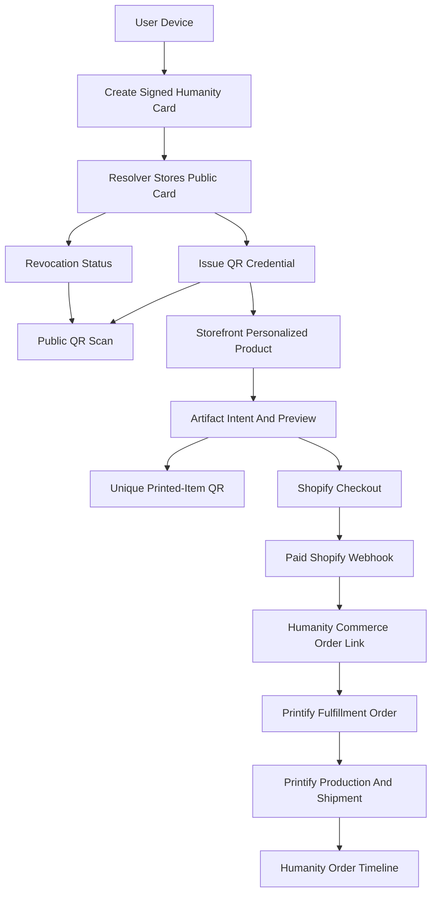

# V1 Flow and Boundary Audit

**Status:** Pre-rebuild hardening artifact  
**Scope:** Humanity Card, QR Public Profile, Human Verification, Storefront, Printify Fulfillment Middleware

---

## Canonical V1 Flow

---

## Flow 1: Card Creation

| Step | Owner | Persisted Record | Failure State | Privacy Boundary |
|---|---|---|---|---|
| Generate Ed25519 keypair | Browser/client | Private key local; public key in card payload | Key generation unavailable | Private key never leaves device. |
| Enter handle and manifesto | Browser/client | Draft card payload | Invalid handle, reserved handle, invalid manifesto | No phone/email/government ID required. |
| Sign card document | Browser/client | Signed public card document | Signature failure, canonicalization mismatch | Only public fields signed for resolver storage. |
| Submit to resolver | Resolver API | Humanity Card record | Duplicate handle, malformed signature, rate limited | Resolver receives public card data only. |
| Assign registered/unverified state | Verification service | Verification summary | Abuse-control failure | Registration metadata separate from public card. |
| Issue QR credential | Resolver/Card service | QR credential record | QR signing/validation failure | QR payload has opaque IDs only. |

Hardening finding: card creation is rebuild-ready if the first slice uses only public fields, local signing, resolver validation, and registered/unverified state. Do not include private/semi-public profile layers in the first slice.

---

## Flow 2: Public QR Scan

| Step | Owner | Persisted Record | Failure State | Privacy Boundary |
|---|---|---|---|---|
| Scan HTTPS fallback QR | Scanner browser | None required | Malformed URL, unknown profile, unknown QR | No scan analytics by default. |
| Validate profile and QR IDs | Resolver API | Access log with anonymized IP only | Invalid ID, QR not linked to card | QR payload must not contain order/PII data. |
| Resolve status | Resolver API | Card status, QR status | Revoked, suspended, expired, unknown | Public data only. |
| Render HTML/JSON | Resolver/API frontend | None required beyond cache | Stale cached card | UI must show stale/offline state and bearer warning for printed-item QR. |

Hardening finding: QR resolution must be implemented before print artifacts. The printed object is only safe if old QR codes keep resolving to current status.

---

## Flow 3: Human Verification

| Step | Owner | Persisted Record | Failure State | Privacy Boundary |
|---|---|---|---|---|
| Request vouch | Card owner | Optional request event | Voucher not eligible | Request should not reveal private notes. |
| Open target card | Voucher | None required | Card revoked/suspended | Voucher sees public card data. |
| Sign vouch | Voucher client | Vouch credential | Quota exceeded, waiting period not met | Private note encrypted or omitted. |
| Aggregate verification | Verification service | Verification summary | Threshold not met, invalid signature | Public summary shows safe method/evidence only. |
| Display badge/status | Humanity Card/Resolver | Public card view | Stale cached status | Revoked/suspended overrides verified display. |

Hardening finding: the first rebuild can support registered/unverified state first, then signed vouches. Ceremony and device proof can remain modeled but not implemented in the first slice.

---

## Flow 4: Personalized Artifact Purchase

| Step | Owner | Persisted Record | Failure State | Privacy Boundary |
|---|---|---|---|---|
| Open product page | Storefront | None required | Product disabled, unsupported template | No Printify browsing. |
| Check card/QR status | Storefront API / Resolver | None or short-lived validation event | Revoked, suspended, expired | Storefront gets public card/QR status only. |
| Generate preview | Printify Fulfillment Middleware renderer | Print artifact draft | QR scan QA failed, template invalid | Printify not called until artifact passes local validation/upload point. |
| Create artifact intent | Storefront API | `artifact_intent` with planned item QR IDs | Intent expired, duplicate, invalid personalization state | Intent contains no private keys or verification secrets. |
| Issue item QR credentials | QR service | Item-scoped QR credential per physical item | QR signing/validation failure | Each printed item is independently revocable; no scan analytics. |
| Attach to Shopify checkout | Storefront/Shopify | Shopify cart line metadata | Metadata dropped, checkout abandoned | Metadata must contain only intent IDs and product refs. |
| Payment succeeds | Shopify | Shopify order | Payment failed, canceled, refunded | Payment PII stays in Shopify/protected commerce records. |
| Paid webhook consumed | Humanity webhook consumer | `commerce_order_link` | Webhook spoofed, duplicate, out of order | Webhook authenticated and idempotent. |
| Submit Printify order | Printify Fulfillment Middleware | `print_order` and provider refs | Rate limited, invalid address, provider outage | Printify receives fulfillment-required fields only. |
| Production/shipment updates | Printify + middleware | Webhook events, order timeline | Missed webhook, on hold, has issues | User sees safe status; operators see provider details. |

Hardening finding: the riskiest handoff is artifact intent metadata surviving Shopify checkout and paid webhooks. This needs an integration spike before broad implementation.

---

## Flow 5: Revocation After Printing

| Step | Owner | Persisted Record | Failure State | Privacy Boundary |
|---|---|---|---|---|
| Owner signs revocation | Client | Revocation statement | Key unavailable, recovery unavailable | Private key stays local. |
| Resolver verifies revocation | Resolver API | Card/QR status update | Invalid signature, replay nonce | No reason required. |
| QR scans after revocation | Resolver/API frontend | None required | Cache stale | Status page must clearly show revoked. |
| Sibling item QR remains active | Resolver/API frontend | None required | Wrong QR scope revoked | Item revocation must not revoke sibling stickers/cards. |
| New orders blocked | Storefront/Middleware | Blocked order attempt if logged | Attempt to reorder revoked QR | No physical recall promise. |

Hardening finding: revocation must not be described as recalling physical artifacts. It invalidates resolution and future ordering, not the existence of the printed object.

---

## Cross-System Boundaries

| Boundary | Allowed To Cross | Must Not Cross |
|---|---|---|
| Browser -> Humanity | Public card payloads, signatures, artifact intents, checkout handoff requests | Private keys in plaintext, recovery codes, private profile layers |
| Humanity -> Shopify | Product/variant IDs, cart metadata, artifact intent IDs, payment/order references | Verification secrets, private keys, vouch-private notes, scanner analytics |
| Shopify -> Humanity | Paid/canceled/refunded order webhooks, order/line references, shipping/payment status needed for fulfillment | Raw payment processor secrets beyond Shopify's normal order abstractions |
| Humanity -> Printify | Artwork, approved product/variant refs, shipping/contact fields required for fulfillment | Private keys, verification secrets, vouch graph, private profile data, scan analytics |
| Printify -> Humanity | Order status, production state, tracking, provider issue details | Identity authority, verification status, badge issuance |
| Resolver -> Scanner | Public card, public verification summary, latest accepted vouch recency, QR status, bearer warning | Private profile layers, order IDs, shipping/payment data, identity proof from possession |

---

## Required Failure States

| Domain | Failure State | Required User/System Behavior |
|---|---|---|
| Card creation | Invalid handle | Show validation error before signing. |
| Card creation | Signature invalid | Reject and do not store. |
| QR scan | Unknown card | Show unknown/invalid status, not generic crash. |
| QR scan | Revoked card | Show revoked status page. |
| QR scan | Suspended card | Show suspension status with public process reference. |
| QR scan | Cached stale card | Show stale/offline banner. |
| QR scan | Printed item held by someone else | Warn that the QR resolves to a card but does not prove the holder is the card owner. |
| Verification | Vouch quota exceeded | Block vouch and explain quota. |
| Verification | Voucher too new | Block vouch and explain waiting period. |
| Verification | Revoked voucher | Remove from active count. |
| Storefront | Revoked QR | Block personalization/purchase. |
| Storefront | Artifact intent expired | Force preview regeneration before checkout. |
| Shopify webhook | Duplicate webhook | Idempotently no-op or reconcile. |
| Shopify webhook | Metadata missing | Hold order for operator review; do not submit Printify order. |
| Storefront | Limited drop sold out | Do not accept checkout for unavailable products. |
| Printify | 429/rate limit | Back off; do not duplicate order. |
| Printify | Invalid address | User-correctable fulfillment error. |
| Printify | Source check failed | Operator/user actionable state. |
| Printify | Production started | Cancellation no longer promised. |

---

## Flow Audit Verdict

The docs are implementation-ready only if the rebuild starts with the narrow vertical slice:

1. Signed public Humanity Card.
2. HTTPS QR resolution and revoked status page.
3. One personalized sticker/card artifact intent with unique printed-item QR.
4. Shopify checkout handoff with artifact-intent metadata.
5. Paid-order webhook to commerce order link.
6. Printify Fulfillment Middleware order submission with idempotency and manual production approval.

Everything else should be modeled but not allowed to expand the first implementation slice.
